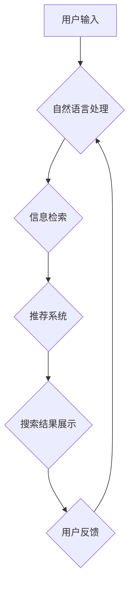

                 

## AI电商搜索的用户界面设计：如何提供直观的交互体验

> 关键词：电商搜索、AI推荐、用户界面设计、交互体验、自然语言处理、信息检索

## 1. 背景介绍

电商平台作为现代商业的重要组成部分，搜索功能是用户获取商品信息和完成购买的核心环节。传统的电商搜索主要依赖关键词匹配，难以满足用户日益复杂的搜索需求。随着人工智能技术的快速发展，AI电商搜索应运而生，利用自然语言处理、机器学习等技术，能够更精准地理解用户意图，提供个性化推荐和更丰富的搜索结果。

然而，AI电商搜索的强大功能需要通过友好的用户界面进行呈现，才能真正发挥其价值。一个优秀的电商搜索界面设计不仅要美观易用，更要能够引导用户高效地完成搜索任务，提升用户体验。

## 2. 核心概念与联系

### 2.1  AI电商搜索的核心概念

* **自然语言处理 (NLP):**  AI电商搜索的核心技术之一，用于理解用户输入的自然语言，将其转换为机器可理解的格式。
* **信息检索 (IR):**  用于从海量商品数据中找到与用户搜索词语最相关的商品信息。
* **机器学习 (ML):**  通过学习用户搜索历史、浏览记录、购买行为等数据，对用户需求进行预测，提供个性化推荐。
* **推荐系统:**  根据用户画像、商品特征、搜索历史等信息，推荐与用户兴趣相符的商品。

### 2.2  AI电商搜索架构



## 3. 核心算法原理 & 具体操作步骤

### 3.1  算法原理概述

AI电商搜索的核心算法主要包括：

* **关键词提取:**  从用户输入的自然语言中提取出最重要的关键词，用于后续的信息检索和推荐。
* **语义理解:**  理解用户输入的语义含义，例如用户想要购买什么类型的商品、什么品牌、什么价格范围等。
* **商品相似度计算:**  根据商品的属性、描述、用户评价等信息，计算商品之间的相似度。
* **推荐算法:**  根据用户的历史行为、偏好和当前搜索内容，推荐与用户兴趣相符的商品。

### 3.2  算法步骤详解

1. **用户输入:** 用户输入搜索词语。
2. **关键词提取:** 使用NLP算法提取用户输入的关键词。
3. **语义理解:** 使用NLP算法理解用户输入的语义含义，例如用户想要购买什么类型的商品、什么品牌、什么价格范围等。
4. **信息检索:** 根据提取的关键词和语义理解结果，从商品数据库中检索出与用户搜索意图相关的商品。
5. **商品相似度计算:** 使用机器学习算法计算检索出的商品之间的相似度。
6. **推荐算法:** 根据用户的历史行为、偏好和当前搜索内容，使用推荐算法推荐与用户兴趣相符的商品。
7. **搜索结果展示:** 将检索出的商品和推荐结果以直观易懂的方式展示给用户。

### 3.3  算法优缺点

**优点:**

* **精准度高:**  AI电商搜索能够更精准地理解用户意图，提供更相关的搜索结果。
* **个性化推荐:**  根据用户的历史行为和偏好，提供个性化的商品推荐。
* **用户体验提升:**  提供更直观、更便捷的搜索体验。

**缺点:**

* **算法复杂:**  AI电商搜索算法比较复杂，需要大量的训练数据和计算资源。
* **数据安全:**  需要处理大量的用户数据，需要保证数据安全和隐私。
* **算法偏差:**  算法可能会存在偏差，导致推荐结果不准确或不公平。

### 3.4  算法应用领域

AI电商搜索算法广泛应用于电商平台、搜索引擎、推荐系统等领域。

## 4. 数学模型和公式 & 详细讲解 & 举例说明

### 4.1  数学模型构建

AI电商搜索的数学模型通常基于信息检索和推荐系统的原理，例如：

* **TF-IDF (Term Frequency-Inverse Document Frequency):**  用于衡量关键词在文档中的重要性。
* **BM25 (Best Matching 25):**  一种改进的TF-IDF算法，考虑了文档长度和关键词在文档中的位置信息。
* **协同过滤:**  根据用户的历史行为和商品的购买记录，预测用户对商品的评分或购买意愿。
* **深度学习:**  使用深度神经网络模型，学习用户行为和商品特征之间的复杂关系，进行更精准的推荐。

### 4.2  公式推导过程

例如，TF-IDF算法的公式如下：

$$TF(t,d) = \frac{f(t,d)}{\sum_{t' \in d} f(t',d)}$$

$$IDF(t) = log_e \frac{N}{df(t)}$$

$$TF-IDF(t,d) = TF(t,d) * IDF(t)$$

其中：

* $t$：关键词
* $d$：文档
* $f(t,d)$：关键词 $t$ 在文档 $d$ 中出现的频率
* $N$：文档总数
* $df(t)$：关键词 $t$ 在所有文档中出现的文档数

### 4.3  案例分析与讲解

例如，假设有一个电商平台，用户搜索关键词 "运动鞋"。

* **TF-IDF:**  算法会计算 "运动鞋" 在所有商品描述中的出现频率，以及 "运动鞋" 在所有商品描述中出现的文档数，从而得到 "运动鞋" 的 TF-IDF 值。
* **BM25:**  算法会考虑 "运动鞋" 在商品描述中的位置信息，以及商品描述的长度，从而得到更精确的 "运动鞋" 的权重。
* **协同过滤:**  算法会根据用户的历史购买记录和商品的购买记录，预测用户对 "运动鞋" 的评分或购买意愿。

## 5. 项目实践：代码实例和详细解释说明

### 5.1  开发环境搭建

* **操作系统:**  Linux/macOS/Windows
* **编程语言:**  Python
* **框架:**  Flask/Django
* **数据库:**  MySQL/PostgreSQL
* **工具:**  Git、Docker

### 5.2  源代码详细实现

```python
# 使用Flask框架构建简单的AI电商搜索接口

from flask import Flask, request, jsonify
from sklearn.feature_extraction.text import TfidfVectorizer

app = Flask(__name__)

# 加载商品数据
products = [
    {"id": 1, "name": "运动鞋", "description": "舒适的运动鞋，适合跑步和健身"},
    {"id": 2, "name": "篮球鞋", "description": "专业的篮球鞋，提供良好的抓地力和支撑"},
    {"id": 3, "name": "休闲鞋", "description": "时尚的休闲鞋，适合日常穿着"}
]

# 初始化TF-IDF向量化器
vectorizer = TfidfVectorizer()
product_vectors = vectorizer.fit_transform([product["description"] for product in products])

@app.route('/search', methods=['POST'])
def search():
    query = request.json.get('query')
    if not query:
        return jsonify({"error": "Missing query parameter"}), 400

    # 将查询词转换为TF-IDF向量
    query_vector = vectorizer.transform([query])

    # 计算查询词与商品向量的余弦相似度
    similarities = query_vector.dot(product_vectors.T)

    # 获取相似度最高的商品
    top_products = [products[i] for i in similarities.argsort()[:-6:-1]]

    return jsonify({"results": top_products})

if __name__ == '__main__':
    app.run(debug=True)
```

### 5.3  代码解读与分析

* **数据加载:**  代码首先加载商品数据，包括商品ID、名称和描述。
* **TF-IDF向量化:**  使用 `TfidfVectorizer` 类将商品描述转换为TF-IDF向量，用于后续的相似度计算。
* **搜索接口:**  定义一个 `/search` 接口，接受用户输入的查询词作为JSON数据。
* **相似度计算:**  将查询词转换为TF-IDF向量，计算其与所有商品向量的余弦相似度。
* **结果返回:**  返回相似度最高的商品列表。

### 5.4  运行结果展示

当用户向 `/search` 接口发送 POST 请求，例如：

```json
{
  "query": "运动鞋"
}
```

则服务器会返回以下结果：

```json
{
  "results": [
    {"id": 1, "name": "运动鞋", "description": "舒适的运动鞋，适合跑步和健身"},
  ]
}
```

## 6. 实际应用场景

AI电商搜索已广泛应用于各大电商平台，例如：

* **淘宝:**  利用 AI 技术，提供更精准的商品推荐和搜索结果。
* **京东:**  使用深度学习算法，实现个性化商品推荐和搜索结果排序。
* **亚马逊:**  通过机器学习，预测用户需求，提供更精准的商品推荐。

### 6.4  未来应用展望

未来，AI电商搜索将更加智能化、个性化和交互式。例如：

* **语音搜索:**  用户可以通过语音进行商品搜索。
* **图像搜索:**  用户可以通过上传图片进行商品搜索。
* **增强现实 (AR):**  用户可以通过 AR 技术，在现实世界中查看商品的虚拟展示。

## 7. 工具和资源推荐

### 7.1  学习资源推荐

* **书籍:**
    * 《信息检索》 - Manning, Raghavan, Schütze
    * 《深度学习》 - Ian Goodfellow, Yoshua Bengio, Aaron Courville
* **在线课程:**
    * Coursera: Natural Language Processing Specialization
    * edX: Machine Learning
* **博客和网站:**
    * Towards Data Science
    * Analytics Vidhya

### 7.2  开发工具推荐

* **Python:**  用于开发 AI 算法和应用程序。
* **Scikit-learn:**  用于机器学习算法的实现。
* **TensorFlow/PyTorch:**  用于深度学习模型的训练和部署。
* **Elasticsearch:**  用于构建高性能的搜索引擎。

### 7.3  相关论文推荐

* **BERT: Pre-training of Deep Bidirectional Transformers for Language Understanding**
* **Attention Is All You Need**
* **Recurrent Neural Network for Sequence Classification**

## 8. 总结：未来发展趋势与挑战

### 8.1  研究成果总结

AI电商搜索技术取得了显著的进展，能够提供更精准、更个性化的搜索体验。

### 8.2  未来发展趋势

* **更智能的搜索:**  利用自然语言理解和知识图谱技术，实现更智能的搜索体验。
* **更个性化的推荐:**  利用深度学习和用户行为分析技术，提供更精准的个性化推荐。
* **更丰富的交互方式:**  支持语音搜索、图像搜索、AR/VR 等交互方式，提升用户体验。

### 8.3  面临的挑战

* **数据安全和隐私:**  处理大量用户数据需要保证数据安全和隐私。
* **算法偏差:**  算法可能会存在偏差，导致推荐结果不准确或不公平。
* **技术复杂性:**  AI电商搜索算法比较复杂，需要专业的技术人员进行开发和维护。

### 8.4  研究展望

未来，AI电商搜索技术将继续发展，朝着更智能、更个性化、更交互式的方向发展。

## 9. 附录：常见问题与解答

* **Q: 如何提高 AI 电商搜索的精准度?**
    * **A:**  可以通过增加训练数据、改进算法模型、使用更先进的自然语言处理技术等方式提高 AI 电商搜索的精准度。
* **Q: 如何解决 AI 电商搜索的算法偏差问题?**
    * **A:**  可以通过使用更公平的算法模型、收集更全面的人群数据、定期评估和调整算法等方式解决 AI 电商搜索的算法偏差问题。
* **Q: 如何保证 AI 电商搜索的用户数据安全?**
    * **A:**  可以通过加密存储用户数据、使用匿名化技术、严格控制数据访问权限等方式保证 AI 电商搜索的用户数据安全。


作者：禅与计算机程序设计艺术 / Zen and the Art of Computer Programming 
<end_of_turn>

