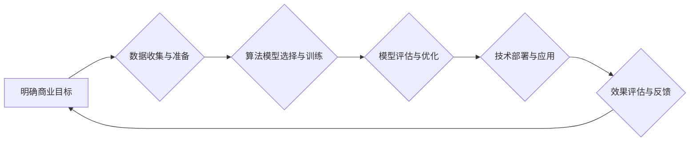

                 

## AI行业的未来：回到商业价值，如何让AI创造长期影响

> 关键词：人工智能、商业价值、长期影响、可解释性、伦理、数据隐私、可持续发展、AI伦理

### 1. 背景介绍

人工智能（AI）技术近年来发展迅速，从语音识别、图像识别到自然语言处理，AI已经渗透到我们生活的方方面面。然而，随着AI技术的快速发展，也引发了人们对AI未来发展方向的思考。

目前，许多AI项目缺乏明确的商业价值，过度依赖于技术本身的炫酷，而忽略了实际应用场景和用户需求。这导致许多AI项目在投入大量资源后，最终难以实现商业化，甚至面临夭折的风险。

因此，AI行业未来的发展方向应回归商业价值，将AI技术应用于解决实际问题，创造长期价值。

### 2. 核心概念与联系

**2.1 AI商业价值的本质**

AI商业价值的核心在于通过AI技术提升企业效率、降低成本、创造新的商业模式和产品，最终实现盈利和可持续发展。

**2.2 AI商业价值的实现路径**

实现AI商业价值需要以下几个关键环节：

* **明确商业目标:**  企业需要明确AI技术的应用场景和目标，例如提高生产效率、优化客户服务、开发新产品等。
* **数据驱动:** AI技术依赖于海量数据进行训练和学习，企业需要收集、清洗和管理高质量的数据。
* **算法创新:**  企业需要不断探索和开发新的AI算法，以解决特定问题，提升AI模型的性能。
* **技术落地:**  将AI技术应用于实际业务场景，需要进行系统设计、开发和部署，并进行持续优化和维护。
* **人才培养:**  企业需要培养具备AI技术和业务知识的专业人才，才能有效地利用AI技术。

**2.3 AI商业价值的评估指标**

评估AI项目的商业价值需要考虑以下指标：

* **ROI (投资回报率):**  AI项目的投资回报率，衡量AI技术带来的经济效益。
* **成本效益:**  AI技术带来的成本降低，例如自动化流程、减少人工成本等。
* **市场份额:**  AI技术带来的市场份额增长，例如新产品开发、市场拓展等。
* **品牌价值:**  AI技术带来的品牌形象提升，例如创新能力、技术实力等。

**2.4  AI商业价值的实现流程**



### 3. 核心算法原理 & 具体操作步骤

**3.1 算法原理概述**

深度学习是目前AI领域最热门的算法之一，它能够从海量数据中自动学习特征，并进行预测或分类。深度学习算法的核心是多层神经网络，每一层神经元都对输入数据进行处理，并传递到下一层。通过不断训练，神经网络能够学习到数据的复杂模式，从而实现对数据的理解和预测。

**3.2 算法步骤详解**

1. **数据预处理:**  收集和清洗数据，将其转换为深度学习算法可以理解的格式。
2. **网络结构设计:**  根据具体任务选择合适的网络结构，例如卷积神经网络（CNN）用于图像识别，循环神经网络（RNN）用于自然语言处理。
3. **模型训练:**  使用训练数据训练深度学习模型，调整模型参数，使其能够准确地预测或分类数据。
4. **模型评估:**  使用测试数据评估模型的性能，例如准确率、召回率、F1-score等。
5. **模型优化:**  根据评估结果，调整模型参数或网络结构，进一步提高模型性能。
6. **模型部署:**  将训练好的模型部署到实际应用场景中，例如云平台、边缘设备等。

**3.3 算法优缺点**

**优点:**

* **高准确率:** 深度学习算法能够学习到数据的复杂模式，从而实现高准确率的预测或分类。
* **自动化特征提取:**  深度学习算法能够自动学习特征，无需人工特征工程。
* **可扩展性强:**  深度学习算法可以处理海量数据，并可以并行训练，提高训练效率。

**缺点:**

* **数据依赖性强:**  深度学习算法需要海量数据进行训练，否则模型性能会下降。
* **训练成本高:**  深度学习模型的训练需要大量的计算资源和时间。
* **可解释性差:**  深度学习模型的决策过程难以理解，缺乏可解释性。

**3.4 算法应用领域**

深度学习算法广泛应用于以下领域：

* **图像识别:**  人脸识别、物体检测、图像分类等。
* **自然语言处理:**  机器翻译、文本摘要、情感分析等。
* **语音识别:**  语音转文本、语音助手等。
* **推荐系统:**  商品推荐、内容推荐等。
* **医疗诊断:**  疾病诊断、影像分析等。

### 4. 数学模型和公式 & 详细讲解 & 举例说明

**4.1 数学模型构建**

深度学习模型的核心是多层神经网络，每个神经元接收多个输入信号，并通过激活函数进行处理，输出一个信号。神经网络的结构可以表示为一个 directed acyclic graph (DAG)，其中每个节点代表一个神经元，每个边代表一个连接。

**4.2 公式推导过程**

深度学习模型的训练过程是通过反向传播算法来进行的。反向传播算法的核心是计算模型输出与真实值的误差，并根据误差反向传播，调整模型参数。

假设模型的输出为 $y$，真实值 $t$，损失函数为 $L(y,t)$，则模型的梯度为：

$$\frac{\partial L(y,t)}{\partial w} = \frac{\partial L(y,t)}{\partial y} \cdot \frac{\partial y}{\partial w}$$

其中 $w$ 为模型参数。

**4.3 案例分析与讲解**

例如，在图像分类任务中，深度学习模型的输出是一个概率分布，表示图像属于不同类别的概率。真实值是一个one-hot编码向量，表示图像属于哪一类。损失函数可以是交叉熵损失函数，用于衡量模型输出与真实值的差异。

通过反向传播算法，可以计算模型参数的梯度，并使用梯度下降算法更新模型参数，从而降低模型的损失函数值，提高模型的预测准确率。

### 5. 项目实践：代码实例和详细解释说明

**5.1 开发环境搭建**

使用Python语言开发深度学习项目，需要安装以下软件包：

* TensorFlow 或 PyTorch：深度学习框架
* NumPy：数值计算库
* Pandas：数据处理库
* Matplotlib 或 Seaborn：数据可视化库

**5.2 源代码详细实现**

以下是一个简单的图像分类示例代码，使用TensorFlow框架实现：

```python
import tensorflow as tf

# 定义模型结构
model = tf.keras.models.Sequential([
    tf.keras.layers.Conv2D(32, (3, 3), activation='relu', input_shape=(28, 28, 1)),
    tf.keras.layers.MaxPooling2D((2, 2)),
    tf.keras.layers.Conv2D(64, (3, 3), activation='relu'),
    tf.keras.layers.MaxPooling2D((2, 2)),
    tf.keras.layers.Flatten(),
    tf.keras.layers.Dense(10, activation='softmax')
])

# 编译模型
model.compile(optimizer='adam',
              loss='sparse_categorical_crossentropy',
              metrics=['accuracy'])

# 训练模型
model.fit(x_train, y_train, epochs=5)

# 评估模型
loss, accuracy = model.evaluate(x_test, y_test)
print('Test loss:', loss)
print('Test accuracy:', accuracy)
```

**5.3 代码解读与分析**

这段代码定义了一个简单的卷积神经网络模型，用于图像分类任务。模型包含两层卷积层、两层最大池化层、一层全连接层和一层输出层。

模型使用Adam优化器、交叉熵损失函数和准确率作为评估指标。

**5.4 运行结果展示**

训练完成后，模型可以用来预测新的图像类别。

### 6. 实际应用场景

**6.1 医疗诊断**

深度学习算法可以用于分析医学影像，辅助医生诊断疾病。例如，可以用于检测肺癌、乳腺癌、脑肿瘤等。

**6.2 金融风险控制**

深度学习算法可以用于分析金融数据，识别欺诈交易、预测市场风险等。

**6.3 自动驾驶**

深度学习算法可以用于训练自动驾驶汽车，识别道路场景、预测车辆运动等。

**6.4 个性化推荐**

深度学习算法可以用于分析用户行为数据，提供个性化的商品、内容推荐等。

**6.5 语言翻译**

深度学习算法可以用于机器翻译，将一种语言翻译成另一种语言。

**6.6 未来应用展望**

随着AI技术的不断发展，深度学习算法将在更多领域得到应用，例如：

* **药物研发:**  加速药物研发过程，发现新的药物。
* **材料科学:**  设计新型材料，提高材料性能。
* **教育:**  个性化教育，提高学习效率。
* **农业:**  提高农业生产效率，减少农业浪费。

### 7. 工具和资源推荐

**7.1 学习资源推荐**

* **在线课程:**  Coursera、edX、Udacity 等平台提供深度学习相关的在线课程。
* **书籍:**  《深度学习》、《动手学深度学习》等书籍。
* **博客:**  深度学习相关的博客网站，例如：https://blog.tensorflow.org/

**7.2 开发工具推荐**

* **TensorFlow:**  Google开发的开源深度学习框架。
* **PyTorch:**  Facebook开发的开源深度学习框架。
* **Keras:**  基于TensorFlow或Theano的深度学习框架。

**7.3 相关论文推荐**

* **ImageNet Classification with Deep Convolutional Neural Networks**
* **Deep Residual Learning for Image Recognition**
* **Attention Is All You Need**

### 8. 总结：未来发展趋势与挑战

**8.1 研究成果总结**

近年来，深度学习算法取得了显著的成果，在图像识别、自然语言处理、语音识别等领域取得了突破性进展。

**8.2 未来发展趋势**

* **模型规模和复杂度提升:**  未来深度学习模型将更加大规模、更加复杂，能够处理更加复杂的任务。
* **算法效率提升:**  研究人员将继续探索新的算法和训练方法，提高深度学习模型的训练效率和推理速度。
* **可解释性增强:**  研究人员将致力于提高深度学习模型的可解释性，使其决策过程更加透明。
* **边缘计算:**  深度学习模型将部署到边缘设备，实现更加实时、更加高效的应用。

**8.3 面临的挑战**

* **数据隐私和安全:**  深度学习算法依赖于海量数据，如何保护数据隐私和安全是一个重要的挑战。
* **算法偏见:**  深度学习算法可能存在偏见，导致不公平的结果，需要研究如何解决算法偏见问题。
* **伦理问题:**  深度学习技术的应用可能引发伦理问题，例如自动驾驶汽车的决策伦理、人工智能的责任归属等，需要进行深入探讨和规范。

**8.4 研究展望**

未来，深度学习技术将继续发展，并应用于更多领域，为人类社会带来更多福祉。

### 9. 附录：常见问题与解答

**9.1 如何选择合适的深度学习框架？**

选择深度学习框架需要考虑以下因素：

* **项目需求:**  不同的项目对模型复杂度、训练效率、部署环境等有不同的要求。
* **个人经验:**  选择自己熟悉的框架可以提高开发效率。
* **社区支持:**  选择拥有活跃社区支持的框架可以获得更多帮助和资源。

**9.2 如何解决深度学习模型的过拟合问题？**

过拟合是指模型在训练数据上表现很好，但在测试数据上表现较差。

解决过拟合问题的方法包括：

* **增加训练数据量:**  更多的训练数据可以帮助模型学习到更通用的特征。
* **使用正则化技术:**  例如L1正则化、L2正则化等，可以惩罚模型参数的复杂度，防止模型过拟合。
* **使用Dropout技术:**  随机丢弃一部分神经元，可以防止模型过于依赖某些神经元，提高模型泛化能力。
* **使用交叉验证:**  将数据分成多个子集，进行多次训练和测试，可以评估模型的泛化能力。

**9.3 如何评估深度学习模型的性能？**

评估深度学习模型的性能需要使用合适的指标，例如：

* **分类任务:**  准确率、召回率、F1-score、AUC等。
* **回归任务:**  均方误差、平均绝对误差等。

需要根据具体任务选择合适的指标。


作者：禅与计算机程序设计艺术 / Zen and the Art of Computer Programming 
<end_of_turn>

