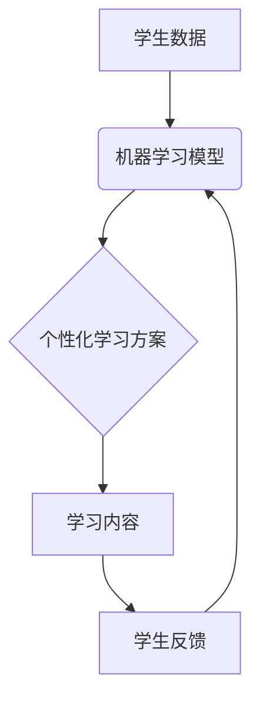

                 

## AI驱动的个性化学习：适应每个学生的需求

> 关键词：人工智能、个性化学习、机器学习、深度学习、自然语言处理、知识图谱、教育科技

### 1. 背景介绍

教育一直是人类文明进步的基石，而传统的教育模式往往面临着“一刀切”的局限性，难以满足每个学生个性化的学习需求。随着人工智能技术的飞速发展，AI驱动的个性化学习逐渐成为教育领域的热点话题。

个性化学习是指根据每个学生的学习风格、能力水平、兴趣爱好等特点，定制专属的学习路径和内容，以最大限度地激发学生的学习兴趣和潜能。传统的教育模式难以做到这一点，因为教师需要面对庞大的学生群体，很难为每个学生提供个性化的指导。而AI技术可以帮助教师实现这一目标，通过数据分析和智能算法，为每个学生提供个性化的学习方案。

### 2. 核心概念与联系

**2.1 核心概念**

* **人工智能 (AI):** 人工智能是指模拟人类智能行为的计算机系统，包括学习、推理、决策、感知等能力。
* **个性化学习 (Personalized Learning):** 根据学生的个体差异，定制学习内容、节奏和方式，以满足每个学生的独特需求。
* **机器学习 (Machine Learning):** 机器学习是人工智能的一个分支，通过算法从数据中学习，不断改进预测或决策能力。
* **深度学习 (Deep Learning):** 深度学习是机器学习的一种更高级形式，利用多层神经网络模拟人类大脑的学习过程，能够处理更复杂的数据和任务。
* **自然语言处理 (NLP):** 自然语言处理是指让计算机能够理解和处理人类语言的技术。

**2.2 架构关系**



**2.3 联系解释**

AI驱动的个性化学习系统通常由以下几个部分组成：

1. **学生数据采集:** 收集学生的学习记录、考试成绩、兴趣爱好等数据。
2. **机器学习模型训练:** 利用机器学习算法，从学生数据中学习学生的学习模式和特点。
3. **个性化学习方案生成:** 根据机器学习模型的预测结果，为每个学生生成个性化的学习方案，包括学习内容、学习节奏、学习方式等。
4. **学习内容呈现:** 将个性化学习方案呈现给学生，并提供相应的学习资源和工具。
5. **学生反馈收集:** 收集学生的学习反馈，并将其反馈到机器学习模型中，不断优化学习方案。

### 3. 核心算法原理 & 具体操作步骤

**3.1 算法原理概述**

AI驱动的个性化学习系统通常采用以下几种核心算法：

* **推荐系统:** 基于用户的历史行为和偏好，推荐个性化的学习内容。
* **知识图谱:** 建立学生知识结构的图谱，根据学生的知识水平和学习目标，推荐相关的学习内容。
* **自然语言处理:** 分析学生的学习语言，识别学生的学习需求和困惑，提供个性化的指导。

**3.2 算法步骤详解**

以推荐系统为例，其具体操作步骤如下：

1. **数据收集:** 收集学生的学习记录、考试成绩、兴趣爱好等数据。
2. **数据预处理:** 对收集到的数据进行清洗、转换和特征提取。
3. **模型训练:** 利用机器学习算法，训练推荐模型。常用的推荐算法包括协同过滤、内容过滤和混合推荐。
4. **个性化推荐:** 根据学生的学习特征和历史行为，模型预测学生可能感兴趣的学习内容，并进行排序推荐。
5. **反馈收集:** 收集学生的反馈信息，例如是否点击、阅读、收藏推荐内容，并将其反馈到模型中，不断优化推荐效果。

**3.3 算法优缺点**

* **优点:**

    * 可以根据学生的个性化需求，推荐更合适的学习内容。
    * 可以提高学生的学习效率和兴趣。
    * 可以帮助教师更好地了解学生的学习情况，提供更精准的指导。

* **缺点:**

    * 需要大量的学生数据进行训练，才能保证推荐效果。
    * 模型的训练和更新需要一定的技术成本。
    * 算法可能会存在偏差，导致推荐结果不准确。

**3.4 算法应用领域**

* **在线教育平台:** 为学生提供个性化的学习路径和内容推荐。
* **学习管理系统:** 根据学生的学习进度和成绩，提供个性化的学习建议和反馈。
* **智能辅导系统:** 利用自然语言处理技术，为学生提供一对一式的学习辅导。

### 4. 数学模型和公式 & 详细讲解 & 举例说明

**4.1 数学模型构建**

推荐系统的核心是预测用户对某一物品的评分或偏好。常用的数学模型包括协同过滤和内容过滤。

* **协同过滤:** 基于用户的历史行为和相似用户对物品的评分，预测用户对物品的评分。

* **内容过滤:** 基于物品的特征和用户的兴趣偏好，预测用户对物品的评分。

**4.2 公式推导过程**

协同过滤模型的评分预测公式可以表示为：

$$
\hat{r}_{u,i} = \bar{r}_u + \frac{\sum_{v \in N(u)} (r_{v,i} - \bar{r}_v) \cdot sim(u,v)}{\sum_{v \in N(u)} sim(u,v)}
$$

其中：

* $\hat{r}_{u,i}$: 用户 $u$ 对物品 $i$ 的预测评分。
* $\bar{r}_u$: 用户 $u$ 的平均评分。
* $r_{v,i}$: 用户 $v$ 对物品 $i$ 的真实评分。
* $N(u)$: 与用户 $u$ 相似的用户集合。
* $sim(u,v)$: 用户 $u$ 和 $v$ 之间的相似度。

**4.3 案例分析与讲解**

假设有一个电影推荐系统，用户 $A$ 喜欢动作片，用户 $B$ 也喜欢动作片，并且用户 $A$ 对一部动作片 $X$ 给出了 5 分的评分，用户 $B$ 对这部电影 $X$ 给出了 4 分的评分。如果我们想要预测用户 $C$ 对电影 $X$ 的评分，我们可以利用协同过滤模型，根据用户 $A$ 和 $B$ 的评分和相似度，预测用户 $C$ 的评分。

### 5. 项目实践：代码实例和详细解释说明

**5.1 开发环境搭建**

* Python 3.x
* TensorFlow 或 PyTorch
* Jupyter Notebook

**5.2 源代码详细实现**

```python
# 导入必要的库
import pandas as pd
from sklearn.model_selection import train_test_split
from sklearn.metrics import mean_squared_error

# 加载数据
data = pd.read_csv('ratings.csv')

# 数据预处理
# ...

# 将数据分为训练集和测试集
train_data, test_data = train_test_split(data, test_size=0.2)

# 训练模型
# ...

# 对测试数据进行预测
predictions = model.predict(test_data)

# 计算模型精度
rmse = mean_squared_error(test_data['rating'], predictions, squared=False)
print(f'RMSE: {rmse}')
```

**5.3 代码解读与分析**

* 代码首先导入必要的库，包括 pandas 用于数据处理、sklearn 用于模型训练和评估。
* 然后加载数据，并进行数据预处理，例如缺失值处理、特征工程等。
* 将数据分为训练集和测试集，用于训练和评估模型。
* 训练模型，可以选择协同过滤、内容过滤等算法。
* 对测试数据进行预测，并计算模型精度，例如 RMSE。

**5.4 运行结果展示**

运行结果会显示模型的 RMSE 值，表示模型预测评分与真实评分之间的平均误差。RMSE 值越低，模型的预测精度越高。

### 6. 实际应用场景

**6.1 在线教育平台**

* 为学生提供个性化的学习路径和内容推荐，例如 Khan Academy、Coursera 等平台。
* 根据学生的学习进度和成绩，提供个性化的学习建议和反馈。

**6.2 学习管理系统**

* 为教师提供学生学习情况的分析和报告，帮助教师更好地了解学生的学习特点和需求。
* 为学生提供学习计划和进度跟踪，帮助学生更好地管理自己的学习时间和任务。

**6.3 智能辅导系统**

* 利用自然语言处理技术，为学生提供一对一式的学习辅导，例如 Wolfram Alpha、Duolingo 等平台。
* 帮助学生解决学习上的困惑，提高学习效率。

**6.4 未来应用展望**

* **更精准的个性化推荐:** 利用更先进的机器学习算法和数据分析技术，为学生提供更精准的个性化学习推荐。
* **沉浸式学习体验:** 利用虚拟现实和增强现实技术，为学生提供更沉浸式的学习体验。
* **跨学科学习:** 利用知识图谱技术，帮助学生建立跨学科的知识网络，促进更深入的理解。

### 7. 工具和资源推荐

**7.1 学习资源推荐**

* **书籍:**
    * 《深度学习》
    * 《机器学习实战》
    * 《自然语言处理入门》
* **在线课程:**
    * Coursera
    * edX
    * Udacity

**7.2 开发工具推荐**

* **Python:**
    * TensorFlow
    * PyTorch
    * scikit-learn
* **数据可视化工具:**
    * Matplotlib
    * Seaborn

**7.3 相关论文推荐**

* **个性化学习:**
    * "Personalized Learning: A Review of the Literature"
    * "A Survey of Personalized Learning Systems"
* **推荐系统:**
    * "Collaborative Filtering for Implicit Feedback Datasets"
    * "Content-Based Recommendation Systems: A Survey"

### 8. 总结：未来发展趋势与挑战

**8.1 研究成果总结**

AI驱动的个性化学习已经取得了显著的成果，能够为学生提供更个性化的学习体验，提高学习效率和兴趣。

**8.2 未来发展趋势**

* **更精准的个性化推荐:** 利用更先进的机器学习算法和数据分析技术，为学生提供更精准的个性化学习推荐。
* **沉浸式学习体验:** 利用虚拟现实和增强现实技术，为学生提供更沉浸式的学习体验。
* **跨学科学习:** 利用知识图谱技术，帮助学生建立跨学科的知识网络，促进更深入的理解。

**8.3 面临的挑战**

* **数据隐私和安全:** 个性化学习系统需要收集大量的学生数据，如何保护学生数据隐私和安全是一个重要的挑战。
* **算法公平性:** 算法可能会存在偏差，导致推荐结果不公平，需要确保算法的公平性和公正性。
* **教师的角色转变:** AI驱动的个性化学习会改变教师的角色，教师需要从传统的“知识传授者”转变为“学习指导者”和“学习伙伴”。

**8.4 研究展望**

未来，AI驱动的个性化学习将继续发展，并与其他新兴技术融合，例如虚拟现实、增强现实、区块链等，为学生提供更智能、更个性化的学习体验。


### 9. 附录：常见问题与解答

**9.1 如何保证算法的公平性？**

* 使用公平性评估指标，例如偏差、歧视等，评估算法的公平性。
* 使用公平性约束，例如限制算法对敏感属性的依赖。
* 采用多视角的数据集，减少算法对特定群体的偏见。

**9.2 如何保护学生数据隐私？**

* 使用加密技术保护学生数据的传输和存储。
* 采用匿名化技术，去除学生身份信息。
* 明确告知学生数据的使用目的和范围，并获得学生的同意。

**9.3 教师如何适应AI驱动的个性化学习？**

* 学习AI驱动的个性化学习的原理和应用。
* 掌握使用AI工具和平台的能力。
* 转变角色，从传统的“知识传授者”转变为“学习指导者”和“学习伙伴”。


作者：禅与计算机程序设计艺术 / Zen and the Art of Computer Programming 
<end_of_turn>

