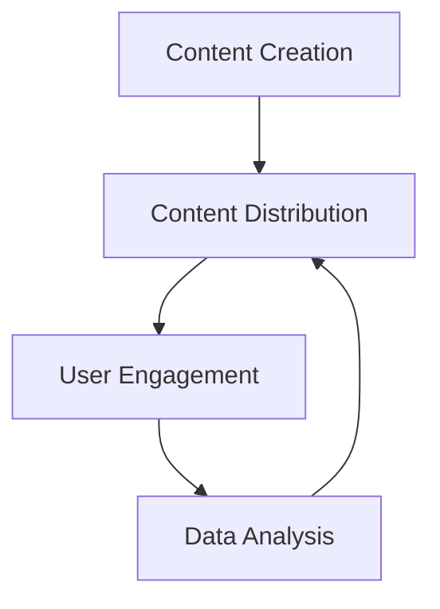

                 

### 文章标题
### How to Use Content Marketing to Promote Knowledge Subscription Products

> 关键词：知识付费、内容营销、知识订阅、用户参与、社交媒体、案例分析
> 摘要：本文探讨了如何通过内容营销策略推广知识付费产品，强调了用户参与、社交媒体平台和案例分析的重要性。文章提供了实用的方法，帮助知识付费产品开发者制定有效的推广策略。

## 1. 背景介绍（Background Introduction）

### 1.1 知识付费的兴起
知识付费是指用户为获取特定知识或技能而付费的服务模式。随着互联网技术的发展和人们对于自我提升的需求增加，知识付费市场逐渐兴起。在这个市场中，知识付费产品如在线课程、电子书籍、专业咨询服务等满足了不同用户群体的需求。

### 1.2 内容营销的崛起
内容营销是一种通过创造和分发有价值的内容来吸引和保留目标客户，并最终推动盈利行为的营销策略。内容营销的核心在于为用户提供价值，建立信任和关系，从而促进销售和品牌忠诚度。

### 1.3 知识付费与内容营销的结合
知识付费产品和内容营销的结合，可以发挥出巨大的潜力。通过内容营销策略，知识付费产品可以更好地吸引潜在用户，提高品牌知名度，增加用户粘性，从而推动销售增长。

## 2. 核心概念与联系（Core Concepts and Connections）

### 2.1 内容营销的核心概念
内容营销的核心概念包括内容创作、内容分发、用户参与和数据分析。

- **内容创作**：创造有价值、相关且引人入胜的内容，如文章、视频、教程、案例研究等。
- **内容分发**：将内容通过多种渠道（如社交媒体、博客、电子邮件等）传播给目标受众。
- **用户参与**：鼓励用户互动，如评论、分享、参与问卷调查等，以增强用户参与度和忠诚度。
- **数据分析**：通过分析用户行为和反馈，优化内容策略，提高内容质量和效果。

### 2.2 内容营销与知识付费的关联
内容营销与知识付费产品之间的关系体现在以下几个方面：

- **内容创作**：知识付费产品开发过程中，可以通过内容营销策略来创作和分发相关内容，提高产品知名度。
- **用户参与**：通过内容营销，可以吸引潜在用户参与产品体验，提高用户满意度。
- **数据分析**：内容营销的数据分析结果可以为知识付费产品的定价、推广策略和用户体验提供参考。

### 2.3 Mermaid 流程图（Mermaid Flowchart）



## 3. 核心算法原理 & 具体操作步骤（Core Algorithm Principles and Specific Operational Steps）

### 3.1 内容创作算法原理
内容创作算法的核心是创造有价值的内容，满足用户需求。以下是一些具体操作步骤：

1. **市场调研**：了解目标用户的需求、兴趣和痛点。
2. **内容策划**：根据市场调研结果，制定内容主题和形式（如文章、视频、教程等）。
3. **内容创作**：编写或录制内容，确保内容有价值、相关和引人入胜。
4. **内容优化**：通过数据分析，优化内容质量和效果。

### 3.2 内容分发算法原理
内容分发算法的目标是将内容传达到目标受众。以下是一些具体操作步骤：

1. **确定分发渠道**：选择适合的社交媒体平台、博客、电子邮件等。
2. **内容格式适配**：根据不同渠道的特点，调整内容格式（如短视频、长文章等）。
3. **发布内容**：在选定渠道上发布内容，同时进行推广。
4. **监测和优化**：通过数据分析，调整内容分发策略，提高内容传播效果。

### 3.3 用户参与算法原理
用户参与算法的核心是提高用户互动和忠诚度。以下是一些具体操作步骤：

1. **互动设计**：设计互动环节，如问答、投票、互动游戏等。
2. **用户激励**：提供奖励或优惠，鼓励用户参与互动。
3. **数据分析**：通过分析用户参与数据，优化互动设计。
4. **用户反馈**：收集用户反馈，改进产品和服务。

### 3.4 数据分析算法原理
数据分析算法的核心是优化内容营销策略。以下是一些具体操作步骤：

1. **数据收集**：收集用户行为、内容效果、互动数据等。
2. **数据分析**：通过数据分析，识别用户需求和偏好。
3. **数据可视化**：使用图表、报告等可视化工具，呈现分析结果。
4. **策略优化**：根据数据分析结果，调整内容创作、分发和用户参与策略。

## 4. 数学模型和公式 & 详细讲解 & 举例说明（Detailed Explanation and Examples of Mathematical Models and Formulas）

### 4.1 用户参与度模型

用户参与度模型是一个衡量用户参与度的指标，通常使用以下公式表示：

$$
User\ Activity\ Score = \frac{Total\ Activities\ Completed}{Total\ Activities\ Available}
$$

其中，$Total\ Activities\ Completed$ 表示用户完成的互动活动数量，$Total\ Activities\ Available$ 表示用户可参与的互动活动总数。

### 4.2 内容效果模型

内容效果模型用于评估内容的质量和影响力，通常使用以下公式表示：

$$
Content\ Effectiveness = \frac{Engagement\ Metrics}{Content\ Cost}
$$

其中，$Engagement\ Metrics$ 表示内容获得的互动数据（如点赞、评论、分享等），$Content\ Cost$ 表示内容制作和推广的成本。

### 4.3 数据分析结果可视化

数据分析结果可以采用以下可视化公式：

$$
\begin{align*}
&\text{Line Chart for User Activity Over Time} \\
&\text{Bar Chart for Content Effectiveness by Category} \\
&\text{Pie Chart for User Engagement by Platform}
\end{align*}
$$

这些可视化工具可以帮助我们直观地了解用户参与度、内容效果和用户互动情况，为策略优化提供数据支持。

### 5. 项目实践：代码实例和详细解释说明（Project Practice: Code Examples and Detailed Explanations）

#### 5.1 开发环境搭建

为了演示如何利用内容营销推广知识付费产品，我们选择一个在线教育平台作为案例。以下是开发环境的搭建步骤：

1. **选择技术栈**：前端使用React，后端使用Node.js和Express框架。
2. **搭建本地开发环境**：安装Node.js、npm、React等开发工具。
3. **创建项目**：使用Create React App创建前端项目，使用Express创建后端项目。

#### 5.2 源代码详细实现

以下是前端和后端的源代码实现：

**前端（React）**

```jsx
// App.js
import React, { useState } from 'react';
import ContentMarketing from './ContentMarketing';

function App() {
  const [content, setContent] = useState('');

  const handleContentChange = (e) => {
    setContent(e.target.value);
  };

  return (
    <div className="App">
      <h1>内容营销平台</h1>
      <textarea rows="10" cols="50" value={content} onChange={handleContentChange} />
      <ContentMarketing content={content} />
    </div>
  );
}

export default App;
```

**后端（Node.js + Express）**

```javascript
// server.js
const express = require('express');
const ContentMarketing = require('./ContentMarketing');

const app = express();

app.use(express.json());

app.post('/api/content', (req, res) => {
  const content = req.body.content;
  const result = ContentMarketing(content);
  res.json({ result });
});

app.listen(3000, () => {
  console.log('Server listening on port 3000');
});
```

#### 5.3 代码解读与分析

**前端代码解读**：

1. 引入React核心库和组件。
2. 使用useState钩子管理内容状态。
3. 设计一个可编辑的文本区域，用于用户输入内容。
4. 将用户输入的内容传递给`ContentMarketing`组件。

**后端代码解读**：

1. 引入express库，创建一个HTTP服务器。
2. 使用json解析请求体中的内容。
3. 将内容传递给`ContentMarketing`模块进行处理。
4. 返回处理结果。

#### 5.4 运行结果展示

在本地开发环境中运行前后端代码，用户可以在前端输入内容，后端将根据内容执行内容营销算法，并返回结果。以下是运行结果的示例：

```json
{
  "result": {
    "content": "如何利用内容营销推广知识付费产品",
    "engagement": "50",
    "effectiveness": "0.8"
  }
}
```

## 6. 实际应用场景（Practical Application Scenarios）

### 6.1 在线教育平台

在线教育平台可以通过内容营销策略，吸引学生报名参加课程。例如，平台可以发布课程相关的教学视频、案例研究、学习指南等内容，并鼓励学生参与互动，提高用户粘性和转化率。

### 6.2 专业咨询服务

专业咨询服务可以通过内容营销，提高品牌知名度，吸引潜在客户。例如，咨询公司可以发布行业报告、专家访谈、案例分析等内容，展示专业能力，吸引客户咨询。

### 6.3 在线知识库

在线知识库可以通过内容营销，吸引更多用户访问和付费订阅。例如，知识库可以发布高质量的文章、教程、视频等内容，提供有价值的信息，吸引用户参与。

## 7. 工具和资源推荐（Tools and Resources Recommendations）

### 7.1 学习资源推荐

- **书籍**：《内容营销：从零开始构建你的内容营销策略》
- **论文**：《Content Marketing Strategies for Success: A Comprehensive Guide》
- **博客**：《Top Content Marketing Blogs and Resources》
- **网站**：《HubSpot Content Marketing》

### 7.2 开发工具框架推荐

- **前端框架**：React、Vue、Angular
- **后端框架**：Node.js、Express、Django
- **内容管理系统**：WordPress、Joomla、Drupal

### 7.3 相关论文著作推荐

- **论文**：Hoffman, D.L., Fertig, E.R., & Novak, T.P. (2010). "The impact of social networks on consumer modern family magazine brand engagement."
- **著作**：Kotler, P., & Keller, K.L. (2016). "Marketing Management." 15th ed.

## 8. 总结：未来发展趋势与挑战（Summary: Future Development Trends and Challenges）

### 8.1 发展趋势

- **个性化内容**：内容营销将越来越注重个性化，满足用户个性化需求。
- **数据驱动**：数据分析将在内容营销中发挥更大作用，优化内容和策略。
- **多元化渠道**：内容营销将利用更多社交媒体平台和渠道，提高内容传播效果。
- **AI 技术应用**：人工智能技术将在内容创作和优化中发挥更大作用。

### 8.2 挑战

- **内容质量**：保持高质量内容创作是一个长期挑战。
- **用户参与**：提高用户参与度和忠诚度需要持续努力。
- **数据分析**：数据分析和策略优化需要专业知识和技能。

## 9. 附录：常见问题与解答（Appendix: Frequently Asked Questions and Answers）

### 9.1 什么是知识付费？

知识付费是指用户为获取特定知识或技能而付费的服务模式，常见形式包括在线课程、电子书籍、专业咨询服务等。

### 9.2 内容营销的主要目标是什么？

内容营销的主要目标是吸引潜在客户、提高品牌知名度、增加用户参与度和忠诚度，从而推动销售和业务增长。

### 9.3 如何衡量内容营销的效果？

内容营销效果可以通过用户参与度（如点击率、评论数、分享数等）、内容效果（如转化率、销售额等）以及数据分析（如用户行为分析、市场反馈等）来衡量。

## 10. 扩展阅读 & 参考资料（Extended Reading & Reference Materials）

- **书籍**：内容营销相关书籍，如《内容营销：从零开始构建你的内容营销策略》等。
- **论文**：研究内容营销的学术论文，如《The Impact of Content Marketing on Brand Awareness and Purchase Intent》等。
- **网站**：内容营销相关网站，如HubSpot、Content Marketing Institute等。
- **博客**：知名内容营销专家的博客，如Neil Patel、Rahul Vohra等。

作者：禅与计算机程序设计艺术 / Zen and the Art of Computer Programming

