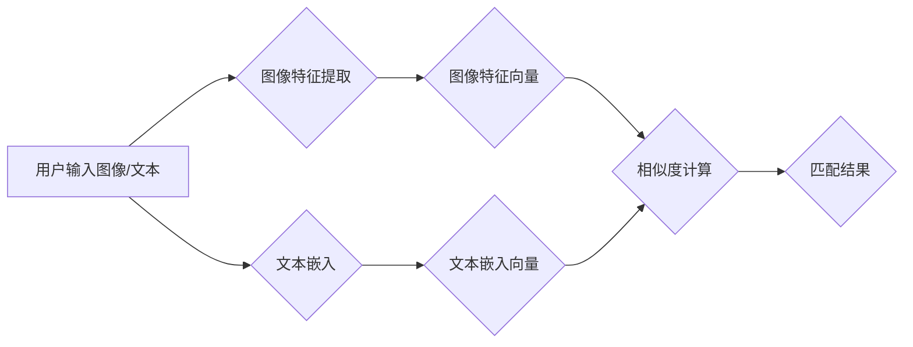

                 

## AI驱动的商品图文匹配系统

> 关键词：商品图文匹配、计算机视觉、自然语言处理、深度学习、卷积神经网络、Transformer、图像特征提取、文本嵌入、相似度计算、推荐系统

## 1. 背景介绍

在当今数字经济时代，商品图文匹配技术已成为电商、搜索引擎、零售等领域的重要应用场景。它能够帮助用户通过图片或文字快速找到心仪的商品，提升用户体验，并为商家提供精准的商品推荐和营销服务。传统的商品图文匹配方法主要依赖于人工规则和特征工程，效率低下且难以应对复杂场景。随着人工智能技术的快速发展，基于深度学习的商品图文匹配系统逐渐成为主流，其强大的学习能力和泛化能力能够有效解决传统方法的局限性。

## 2. 核心概念与联系

商品图文匹配系统旨在通过分析商品的图像和文本信息，识别其潜在的关联性，并计算出两者之间的相似度。系统核心概念包括：

* **图像特征提取:** 从商品图像中提取关键特征，例如颜色、纹理、形状等，用于描述图像的语义内容。
* **文本嵌入:** 将商品的文本描述转换为向量表示，捕捉文本的语义信息。
* **相似度计算:** 计算图像特征和文本嵌入之间的相似度，判断两者之间的关联程度。

**核心架构流程图:**



## 3. 核心算法原理 & 具体操作步骤

### 3.1  算法原理概述

深度学习算法在商品图文匹配领域发挥着重要作用，主要包括卷积神经网络（CNN）和Transformer模型。

* **CNN:** 用于图像特征提取，通过卷积操作学习图像的局部特征，并将其堆叠成全局特征表示。
* **Transformer:** 用于文本嵌入，通过自注意力机制捕捉文本中的长距离依赖关系，生成更精准的文本语义表示。

### 3.2  算法步骤详解

1. **图像预处理:** 对输入图像进行尺寸调整、归一化等预处理操作，使其符合模型输入要求。
2. **图像特征提取:** 使用预训练的CNN模型（例如ResNet、VGG等）提取图像特征，获得图像特征向量。
3. **文本预处理:** 对输入文本进行分词、去停用词、词干提取等预处理操作，使其更适合模型训练。
4. **文本嵌入:** 使用预训练的Transformer模型（例如BERT、RoBERTa等）生成文本嵌入向量。
5. **相似度计算:** 使用余弦相似度、欧氏距离等度量方法计算图像特征向量和文本嵌入向量之间的相似度。
6. **匹配结果排序:** 根据相似度得分对匹配结果进行排序，返回与输入图像/文本最相关的商品信息。

### 3.3  算法优缺点

**优点:**

* **高准确率:** 深度学习算法能够学习到更复杂的特征表示，提高匹配准确率。
* **自动化程度高:** 算法自动化程度高，无需人工特征工程，降低了开发成本。
* **泛化能力强:** 预训练模型能够在不同场景下进行迁移学习，提高算法的泛化能力。

**缺点:**

* **计算资源需求高:** 深度学习模型训练和推理需要大量的计算资源。
* **数据依赖性强:** 算法性能受训练数据质量和数量的影响。
* **可解释性差:** 深度学习模型的决策过程较为复杂，难以解释其匹配结果。

### 3.4  算法应用领域

商品图文匹配算法广泛应用于以下领域:

* **电商平台:** 商品搜索、商品推荐、视觉购物等。
* **搜索引擎:** 图像搜索、商品信息检索等。
* **零售行业:** 库存管理、商品识别、智能导购等。
* **内容创作:** 图文内容匹配、自动生成商品描述等。

## 4. 数学模型和公式 & 详细讲解 & 举例说明

### 4.1  数学模型构建

商品图文匹配系统通常采用以下数学模型进行相似度计算:

* **余弦相似度:** 用于衡量两个向量的方向相似度，计算公式如下:

$$
\text{cosine similarity}(u, v) = \frac{u \cdot v}{||u|| ||v||}
$$

其中，u和v分别为图像特征向量和文本嵌入向量，u·v表示向量点积，||u||和||v||分别表示向量的模长。

* **欧氏距离:** 用于衡量两个向量的距离，计算公式如下:

$$
\text{euclidean distance}(u, v) = \sqrt{(u_1 - v_1)^2 + (u_2 - v_2)^2 + ... + (u_n - v_n)^2}
$$

其中，u和v分别为图像特征向量和文本嵌入向量，u_i和v_i分别表示向量的第i个元素。

### 4.2  公式推导过程

余弦相似度的推导过程如下:

1. 两个向量u和v的点积表示它们在同一方向上的投影长度。
2. 向量的模长表示其长度。
3. 将点积除以两个向量的模长乘积，得到两个向量方向的相似度。

### 4.3  案例分析与讲解

假设有两个商品，其图像特征向量和文本嵌入向量分别为:

* 商品A: 图像特征向量u = [1, 2, 3], 文本嵌入向量v = [4, 5, 6]
* 商品B: 图像特征向量u' = [2, 4, 6], 文本嵌入向量v' = [8, 10, 12]

计算商品A和商品B之间的余弦相似度:

$$
\text{cosine similarity}(u, v') = \frac{u \cdot v'}{||u|| ||v'||} = \frac{(1 \times 8) + (2 \times 10) + (3 \times 12)}{\sqrt{1^2 + 2^2 + 3^2} \times \sqrt{8^2 + 10^2 + 12^2}} = \frac{8 + 20 + 36}{\sqrt{14} \times \sqrt{308}} = \frac{64}{\sqrt{4312}}
$$

## 5. 项目实践：代码实例和详细解释说明

### 5.1  开发环境搭建

* **操作系统:** Ubuntu 20.04
* **编程语言:** Python 3.8
* **深度学习框架:** TensorFlow 2.x
* **其他依赖:** OpenCV、Numpy、PyTorch等

### 5.2  源代码详细实现

```python
# 图像特征提取
import tensorflow as tf
from tensorflow.keras.applications import ResNet50

# 加载预训练的ResNet50模型
model = ResNet50(weights='imagenet', include_top=False)

# 图像预处理
def preprocess_image(image):
    image = tf.image.resize(image, (224, 224))
    image = tf.keras.applications.resnet50.preprocess_input(image)
    return image

# 图像特征提取
def extract_image_features(image):
    features = model.predict(preprocess_image(image))
    return features

# 文本嵌入
from transformers import AutoTokenizer, AutoModel

# 加载预训练的BERT模型
tokenizer = AutoTokenizer.from_pretrained('bert-base-uncased')
model = AutoModel.from_pretrained('bert-base-uncased')

# 文本预处理
def preprocess_text(text):
    inputs = tokenizer(text, return_tensors='pt')
    outputs = model(**inputs)
    return outputs.last_hidden_state[:, 0, :]

# 文本嵌入
def embed_text(text):
    return preprocess_text(text)

# 相似度计算
def calculate_similarity(image_features, text_embedding):
    cosine_similarity = tf.keras.metrics.CosineSimilarity()(image_features, text_embedding)
    return cosine_similarity

# 匹配结果排序
def rank_matches(matches):
    sorted_matches = sorted(matches, key=lambda x: x[1], reverse=True)
    return sorted_matches

```

### 5.3  代码解读与分析

* **图像特征提取:** 使用预训练的ResNet50模型提取图像特征，并进行预处理操作。
* **文本嵌入:** 使用预训练的BERT模型生成文本嵌入向量。
* **相似度计算:** 使用余弦相似度计算图像特征向量和文本嵌入向量之间的相似度。
* **匹配结果排序:** 根据相似度得分对匹配结果进行排序。

### 5.4  运行结果展示

运行代码后，可以得到与输入图像/文本最相关的商品信息，并根据相似度得分进行排序。

## 6. 实际应用场景

### 6.1  电商平台

* **商品搜索:** 用户可以通过上传图片或输入文字搜索心仪的商品。
* **商品推荐:** 系统根据用户的浏览历史和购买记录，推荐与用户画像相符的商品。
* **视觉购物:** 用户可以通过拍摄商品图片，系统自动识别商品信息并跳转到购买页面。

### 6.2  搜索引擎

* **图像搜索:** 用户可以通过上传图片搜索与图片内容相关的商品信息。
* **商品信息检索:** 用户可以通过输入商品名称或描述，搜索相关商品信息。

### 6.3  零售行业

* **库存管理:** 通过图像识别技术，自动识别商品种类和数量，提高库存管理效率。
* **商品识别:** 使用商品图片或条形码进行识别，快速查找商品信息。
* **智能导购:** 通过语音或图像识别，引导用户找到所需商品。

### 6.4  未来应用展望

随着人工智能技术的不断发展，商品图文匹配系统将朝着以下方向发展:

* **更精准的匹配:** 利用更先进的深度学习算法和更大的训练数据集，提高匹配准确率。
* **更丰富的应用场景:** 将商品图文匹配技术应用于更多领域，例如虚拟试衣、个性化推荐等。
* **更智能的交互:** 通过语音、图像、视频等多模态交互，提供更智能的商品搜索和推荐体验。

## 7. 工具和资源推荐

### 7.1  学习资源推荐

* **书籍:**
    * Deep Learning by Ian Goodfellow, Yoshua Bengio, and Aaron Courville
    * Computer Vision: Algorithms and Applications by Richard Szeliski
* **在线课程:**
    * Coursera: Deep Learning Specialization
    * Udacity: Deep Learning Nanodegree
* **博客和网站:**
    * Towards Data Science
    * Machine Learning Mastery

### 7.2  开发工具推荐

* **深度学习框架:** TensorFlow, PyTorch, Keras
* **图像处理库:** OpenCV
* **自然语言处理库:** NLTK, SpaCy
* **云计算平台:** AWS, Google Cloud, Azure

### 7.3  相关论文推荐

* **ImageNet Classification with Deep Convolutional Neural Networks** by Alex Krizhevsky, Ilya Sutskever, and Geoffrey E. Hinton
* **BERT: Pre-training of Deep Bidirectional Transformers for Language Understanding** by Jacob Devlin, Ming-Wei Chang, Kenton Lee, and Kristina Toutanova
* **Attention Is All You Need** by Ashish Vaswani, Noam Shazeer, Niki Parmar, Jakob Uszkoreit, Llion Jones, Aidan N Gomez, Łukasz Kaiser, and Illia Polosukhin

## 8. 总结：未来发展趋势与挑战

### 8.1  研究成果总结

商品图文匹配系统已取得了显著的成果，深度学习算法在提高匹配准确率方面发挥了重要作用。预训练模型的应用进一步简化了开发流程，降低了开发成本。

### 8.2  未来发展趋势

* **多模态融合:** 将图像、文本、语音、视频等多模态信息融合，实现更精准的商品匹配。
* **个性化推荐:** 基于用户的兴趣偏好、购买历史等信息，提供更个性化的商品推荐。
* **跨语言匹配:** 实现不同语言之间的商品图文匹配，拓展应用场景。

### 8.3  面临的挑战

* **数据标注:** 高质量的标注数据是深度学习模型训练的关键，数据标注成本高昂。
* **模型解释性:** 深度学习模型的决策过程较为复杂，难以解释其匹配结果，缺乏可信度。
* **计算资源:** 深度学习模型训练和推理需要大量的计算资源，成本较高。

### 8.4  研究展望

未来，商品图文匹配系统将朝着更智能、更精准、更个性化的方向发展，并应用于更多领域，为用户提供更便捷、更丰富的购物体验。


## 9. 附录：常见问题与解答

* **Q1: 如何选择合适的深度学习模型？**

A1: 选择合适的深度学习模型取决于具体的应用场景和数据特点。对于图像特征提取，ResNet、VGG等模型效果较好。对于文本嵌入，BERT、RoBERTa等模型效果较好。

* **Q2: 如何解决数据标注问题？**

A2: 可以利用人工标注、自动标注、半自动标注等方法进行数据标注。

* **Q3: 如何提高模型的解释性？**

A3: 可以使用可解释性分析方法，例如LIME、SHAP等，解释模型的决策过程。


作者：禅与计算机程序设计艺术 / Zen and the Art of Computer Programming 
<end_of_turn>

