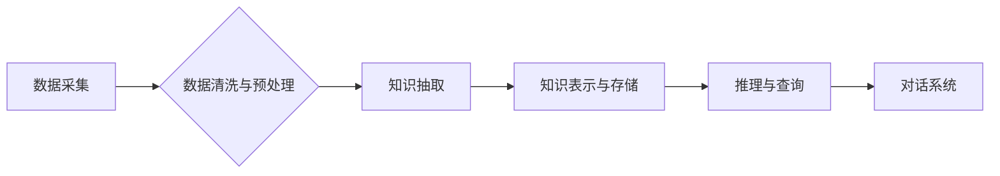

                 

## AI驱动的电商智能客户服务知识图谱构建系统

> 关键词：知识图谱、电商、智能客服、自然语言处理、机器学习、推荐系统、用户体验

## 1. 背景介绍

随着电商行业的蓬勃发展，客户服务需求日益增长。传统人工客服模式面临着效率低下、成本高昂、服务体验不佳等问题。而人工智能技术的快速发展为电商智能客服提供了新的解决方案。知识图谱作为一种新型的知识表示形式，能够有效地组织和存储电商领域的海量信息，为智能客服提供知识支持，提升服务效率和用户体验。

本文将探讨基于AI驱动的电商智能客户服务知识图谱构建系统，介绍其核心概念、算法原理、系统架构、项目实践以及未来发展趋势。

## 2. 核心概念与联系

### 2.1 知识图谱

知识图谱是一种基于实体和关系的知识表示形式，它将知识表示为一系列相互连接的实体和关系。每个实体代表一个概念或对象，而关系则描述实体之间的联系。知识图谱能够有效地捕捉和组织复杂知识，为机器理解和推理提供基础。

### 2.2 电商智能客服

电商智能客服是指利用人工智能技术，例如自然语言处理（NLP）、机器学习（ML）等，为客户提供自动化的服务系统。智能客服能够理解用户的自然语言输入，并根据知识库和规则进行智能回复，解决用户的常见问题，提高服务效率和用户满意度。

### 2.3 系统架构

电商智能客服知识图谱构建系统通常包含以下几个主要模块：

* **数据采集模块:** 从电商平台、用户评论、产品信息等多种数据源采集相关数据。
* **数据清洗与预处理模块:** 对采集到的数据进行清洗、格式化、标准化等预处理，以便后续的知识抽取和构建。
* **知识抽取模块:** 利用自然语言处理技术，从文本数据中抽取实体、关系和属性信息，构建知识图谱。
* **知识表示与存储模块:** 将抽取到的知识信息表示为知识图谱的形式，并存储在知识图谱数据库中。
* **推理与查询模块:** 利用知识图谱推理引擎，根据用户查询进行知识推理，并返回相关结果。
* **对话系统模块:** 基于知识图谱和对话管理技术，与用户进行自然语言交互，提供智能客服服务。

**Mermaid 流程图**



## 3. 核心算法原理 & 具体操作步骤

### 3.1 算法原理概述

构建电商智能客服知识图谱的核心算法主要包括：

* **命名实体识别 (NER):** 从文本中识别出实体，例如产品名称、品牌、价格、用户等。
* **关系抽取:** 从文本中识别出实体之间的关系，例如“产品A属于品牌B”、“用户C购买了产品A”。
* **知识图谱构建:** 将识别出的实体和关系组织成知识图谱的形式。

这些算法通常基于机器学习技术，利用大量的训练数据进行模型训练。

### 3.2 算法步骤详解

**1. 数据预处理:**

* 清洗数据，去除噪声和重复信息。
* 对文本进行分词、词性标注等预处理，以便后续算法的执行。

**2. 实体识别:**

* 使用NER模型识别文本中的实体，例如产品名称、品牌、价格、用户等。
* 实体识别模型通常采用深度学习技术，例如BERT、CRF等。

**3. 关系抽取:**

* 使用关系抽取模型识别实体之间的关系，例如“产品A属于品牌B”、“用户C购买了产品A”。
* 关系抽取模型通常采用深度学习技术，例如Transformer、Graph Convolutional Networks等。

**4. 知识图谱构建:**

* 将识别出的实体和关系组织成知识图谱的形式。
* 知识图谱可以使用RDF、OWL等标准格式进行存储和查询。

### 3.3 算法优缺点

**优点:**

* 能够有效地组织和存储电商领域的海量信息。
* 能够支持智能客服系统进行知识推理和智能回复。
* 能够提高服务效率和用户体验。

**缺点:**

* 知识图谱构建需要大量的训练数据和计算资源。
* 知识图谱的维护和更新需要持续的投入。
* 知识图谱的推理能力仍然有限，无法解决所有复杂问题。

### 3.4 算法应用领域

* 电商智能客服
* 产品推荐系统
* 用户画像分析
* 营销策略制定
* 知识问答系统

## 4. 数学模型和公式 & 详细讲解 & 举例说明

### 4.1 数学模型构建

知识图谱构建可以看作是一个图论问题，其中实体和关系分别对应图中的节点和边。

* **实体:** 用节点表示，每个节点代表一个实体，例如产品、品牌、用户等。
* **关系:** 用边表示，每个边代表实体之间的关系，例如“属于”、“购买”、“评价”等。

### 4.2 公式推导过程

实体识别和关系抽取通常使用概率模型进行建模。例如，可以使用条件随机场 (CRF) 模型来预测实体的类型和边界，可以使用逻辑回归模型来预测实体之间的关系。

**CRF模型的概率公式:**

$$P(y|x) = \frac{1}{Z(x)} \exp{\left(\sum_{i=1}^{n} \lambda_i f_i(x,y_i) \right)}$$

其中：

* $P(y|x)$ 是给定输入 $x$ 的条件概率分布，$y$ 是实体识别或关系抽取的结果。
* $Z(x)$ 是归一化因子。
* $\lambda_i$ 是模型参数。
* $f_i(x,y_i)$ 是特征函数，描述输入 $x$ 和结果 $y_i$ 之间的关联性。

### 4.3 案例分析与讲解

**举例说明:**

假设我们有一个文本：“苹果公司发布了新款iPhone 15”。

* 实体识别模型可以识别出“苹果公司”和“iPhone 15”为实体。
* 关系抽取模型可以识别出“苹果公司发布了iPhone 15”为关系。

然后，这些实体和关系可以被组织成知识图谱中的节点和边。

## 5. 项目实践：代码实例和详细解释说明

### 5.1 开发环境搭建

* Python 3.x
* TensorFlow 或 PyTorch
* SpaCy 或 NLTK
* Neo4j 或其他知识图谱数据库

### 5.2 源代码详细实现

```python
# 实体识别示例代码 (使用SpaCy)

import spacy

nlp = spacy.load("en_core_web_sm")

text = "苹果公司发布了新款iPhone 15"
doc = nlp(text)

for ent in doc.ents:
    print(ent.text, ent.label_)

# 关系抽取示例代码 (使用BERT)

# ... (代码省略)
```

### 5.3 代码解读与分析

* 实体识别代码使用SpaCy库对文本进行分词和实体识别。
* 关系抽取代码使用BERT模型对文本进行编码，并使用分类模型预测实体之间的关系。

### 5.4 运行结果展示

* 实体识别结果：

```
苹果公司 ORG
iPhone 15 PRODUCT
```

* 关系抽取结果：

```
苹果公司 发布了 iPhone 15
```

## 6. 实际应用场景

### 6.1 智能客服机器人

* 回答用户关于产品、订单、物流等常见问题。
* 提供个性化产品推荐和服务建议。
* 帮助用户解决售后问题，提高用户满意度。

### 6.2 产品推荐系统

* 根据用户的购买历史、浏览记录、兴趣偏好等信息，推荐相关产品。
* 提供个性化产品推荐，提高用户转化率。

### 6.3 用户画像分析

* 分析用户的购买行为、浏览习惯、评价内容等信息，构建用户画像。
* 帮助商家了解用户需求，制定精准的营销策略。

### 6.4 营销策略制定

* 根据知识图谱中的数据，分析市场趋势和用户需求，制定有效的营销策略。
* 提高营销活动的精准度和效果。

### 6.5 未来应用展望

* 结合多模态数据，例如图像、视频、音频等，构建更丰富的知识图谱。
* 利用知识图谱进行更复杂的推理和决策，例如智能决策支持系统、个性化学习系统等。
* 将知识图谱应用于其他领域，例如医疗、教育、金融等。

## 7. 工具和资源推荐

### 7.1 学习资源推荐

* **书籍:**

    * 《知识图谱》 - 王晓东
    * 《深度学习》 - Ian Goodfellow

* **在线课程:**

    * Coursera: Knowledge Graphs
    * edX: Introduction to Knowledge Graphs

### 7.2 开发工具推荐

* **知识图谱数据库:** Neo4j, GraphDB, JanusGraph
* **自然语言处理库:** SpaCy, NLTK, Stanford CoreNLP
* **深度学习框架:** TensorFlow, PyTorch

### 7.3 相关论文推荐

* **构建知识图谱:**

    * "A Survey on Knowledge Graph Construction" - ACM Computing Surveys

* **知识图谱应用:**

    * "Knowledge Graphs for Recommender Systems" - ACM Transactions on Knowledge Discovery from Data

## 8. 总结：未来发展趋势与挑战

### 8.1 研究成果总结

AI驱动的电商智能客服知识图谱构建系统能够有效地组织和存储电商领域的海量信息，为智能客服提供知识支持，提升服务效率和用户体验。

### 8.2 未来发展趋势

* **多模态知识图谱:** 结合图像、视频、音频等多模态数据，构建更丰富的知识图谱。
* **联邦学习:** 利用联邦学习技术，在不泄露用户隐私的情况下，构建更精准的知识图谱。
* **动态知识图谱:** 建立动态更新机制，及时更新知识图谱中的信息，保持其时效性。

### 8.3 面临的挑战

* **数据质量:** 知识图谱的构建依赖于高质量的数据，而电商领域的数据往往存在噪声、不完整等问题。
* **知识表示:** 如何更好地表示复杂知识关系，是知识图谱构建面临的挑战之一。
* **推理能力:** 知识图谱的推理能力仍然有限，无法解决所有复杂问题。

### 8.4 研究展望

未来，我们将继续研究AI驱动的电商智能客服知识图谱构建系统，探索更先进的算法和技术，构建更智能、更精准、更可靠的知识图谱，为电商行业提供更优质的服务。

## 9. 附录：常见问题与解答

* **Q1: 知识图谱构建需要哪些数据？**

* **A1:** 知识图谱构建需要多种数据，例如产品信息、用户评论、订单数据、网站内容等。

* **Q2: 知识图谱的构建过程复杂吗？**

* **A2:** 知识图谱的构建过程确实比较复杂，需要涉及数据清洗、实体识别、关系抽取、知识表示等多个步骤。

* **Q3: 知识图谱的应用场景有哪些？**

* **A3:** 知识图谱的应用场景非常广泛，例如智能客服、产品推荐、用户画像分析、营销策略制定等。

作者：禅与计算机程序设计艺术 / Zen and the Art of Computer Programming


<end_of_turn>

