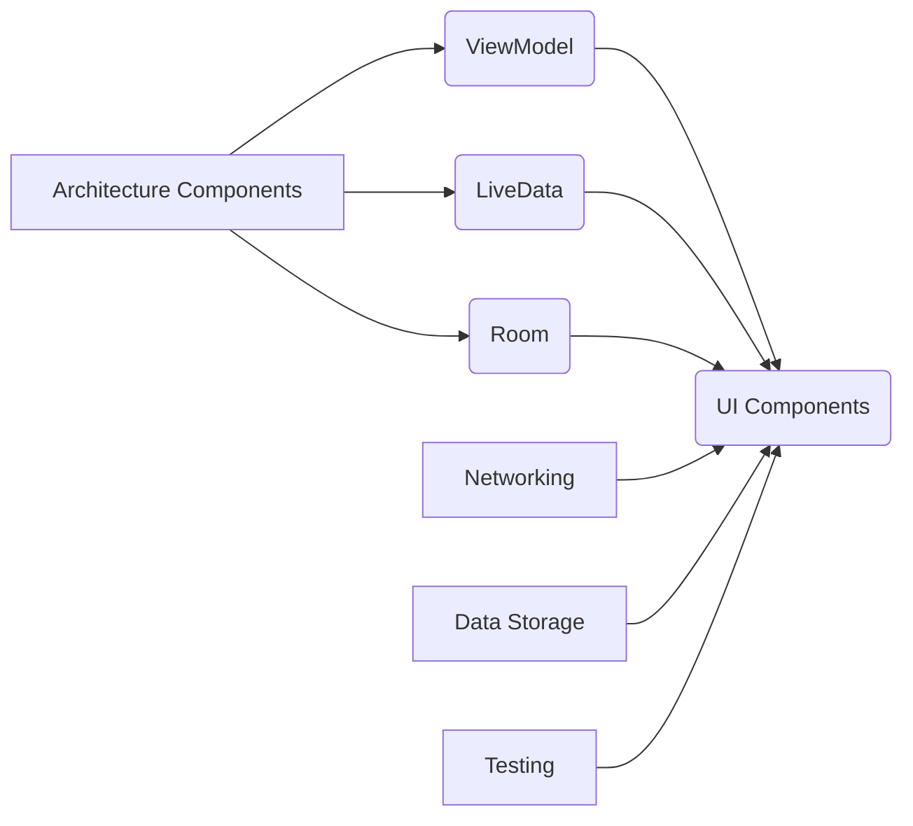

                 

## Android Jetpack：谷歌的 Android 开发套件

> 关键词：Android Jetpack, Android 开发, 组件化开发, 协程, LiveData, ViewModel, Architecture Components, Kotlin

## 1. 背景介绍

随着 Android 平台的不断发展，应用开发的复杂度也随之提高。传统的 Android 开发模式面临着代码冗余、维护成本高、可测试性差等问题。为了解决这些问题，谷歌于 2017 年推出了 Android Jetpack，这是一个旨在简化 Android 开发、提高开发效率和代码质量的软件开发套件。

Android Jetpack 不仅仅是一个简单的库集合，它更像是一个全新的开发理念，倡导组件化开发、代码复用和架构清晰。Jetpack 提供了一系列模块化组件，开发者可以根据项目需求灵活组合使用，构建更加健壮、可维护的 Android 应用。

## 2. 核心概念与联系

Android Jetpack 的核心概念是组件化开发。它将 Android 开发拆分成多个独立的模块，每个模块都专注于特定的功能，例如数据处理、用户界面、网络请求等。这些模块之间通过清晰的接口进行交互，实现松耦合、高可复用的设计。

Jetpack 的主要组件包括：

* **Architecture Components:** 提供了用于构建应用架构的组件，例如 ViewModel、 LiveData 和 Room。
* **UI Components:** 提供了用于构建用户界面的组件，例如 Compose 和 Material Components。
* **Networking:** 提供了用于网络请求的组件，例如 Retrofit 和 OkHttp。
* **Data Storage:** 提供了用于数据存储的组件，例如 Room 和 SharedPreferences。
* **Testing:** 提供了用于测试 Android 应用的工具和框架。

**Jetpack 组件关系流程图:**



## 3. 核心算法原理 & 具体操作步骤

### 3.1  算法原理概述

Jetpack 中的许多组件都基于特定的算法原理，例如 ViewModel 的数据持有和 LiveData 的数据观察机制。

* **ViewModel:** ViewModel 是一个轻量级的组件，用于持有 UI 相关的业务逻辑和数据。它在 Activity 和 Fragment 的生命周期之外存活，可以保证数据在屏幕旋转或配置变化时不会丢失。
* **LiveData:** LiveData 是一个观察者模式的组件，用于观察数据变化并通知相关 UI 组件更新。它可以确保数据在 UI 线程上更新，避免 UI 卡顿。

### 3.2  算法步骤详解

**ViewModel 的数据持有和更新流程:**

1. 在 Activity 或 Fragment 中创建 ViewModel 实例。
2. ViewModel 中持有 UI 相关的业务逻辑和数据。
3. 当数据发生变化时，ViewModel 会更新 LiveData 对象。
4. LiveData 会通知所有观察者，包括 UI 组件。
5. UI 组件接收 LiveData 的更新通知，并更新 UI。

**LiveData 的数据观察和更新流程:**

1. UI 组件通过 `observe()` 方法观察 LiveData 对象。
2. 当 LiveData 的数据发生变化时，观察者会收到通知。
3. UI 组件接收通知后，更新 UI。

### 3.3  算法优缺点

**ViewModel 的优点:**

* 数据持有和更新机制保证了数据在 Activity 和 Fragment 的生命周期之外存活。
* 避免了数据丢失和 UI 闪烁问题。

**ViewModel 的缺点:**

* ViewModel 的生命周期与 Activity 或 Fragment 相关，如果 Activity 或 Fragment 被销毁，ViewModel 也将被销毁。

**LiveData 的优点:**

* 数据观察机制保证了 UI 组件能够及时接收数据更新通知。
* 数据在 UI 线程上更新，避免了 UI 卡顿问题。

**LiveData 的缺点:**

* LiveData 的数据更新机制可能会导致 UI 组件频繁更新，影响性能。

### 3.4  算法应用领域

ViewModel 和 LiveData 广泛应用于 Android 应用开发中，例如：

* 数据绑定：ViewModel 可以持有数据，LiveData 可以观察数据变化，实现数据绑定。
* 网络请求：ViewModel 可以处理网络请求，LiveData 可以观察网络请求结果。
* 数据持久化：ViewModel 可以与 Room 数据库交互，LiveData 可以观察数据库数据变化。

## 4. 数学模型和公式 & 详细讲解 & 举例说明

### 4.1  数学模型构建

Jetpack 中的许多组件都基于数学模型进行设计和实现，例如 LiveData 的数据观察机制可以看作是一个事件驱动模型。

**事件驱动模型:**

* 事件：数据变化
* 事件源：LiveData 对象
* 事件接收者：观察者（UI 组件）

### 4.2  公式推导过程

LiveData 的数据更新机制可以抽象为以下公式：

```latex
LiveData(data) -> 
\begin{cases}
    通知观察者，更新 UI， & \text{if data changed} \\
    保持状态不变， & \text{if data unchanged}
\end{cases}
```

### 4.3  案例分析与讲解

假设有一个 LiveData 对象 `userLiveData`，它持有用户的用户信息。当用户登录成功时，`userLiveData` 的数据会更新，通知所有观察者更新 UI。

```kotlin
val userLiveData = MutableLiveData<User>()

// 用户登录成功后更新 LiveData 数据
userLiveData.value = user

// 在 UI 组件中观察 LiveData 数据变化
userLiveData.observe(this) { user ->
    // 更新 UI 显示用户信息
}
```

## 5. 项目实践：代码实例和详细解释说明

### 5.1  开发环境搭建

Android Jetpack 开发需要 Android Studio IDE 和 Android SDK。

### 5.2  源代码详细实现

以下是一个简单的 Android Jetpack 项目示例，演示了 ViewModel 和 LiveData 的使用：

```kotlin
// ViewModel
class UserViewModel : ViewModel() {
    private val _userLiveData = MutableLiveData<User>()
    val userLiveData: LiveData<User> = _userLiveData

    fun fetchUser() {
        // 从网络或数据库获取用户信息
        val user = User("John Doe", "john.doe@example.com")
        _userLiveData.value = user
    }
}

// UI 组件
class UserActivity : AppCompatActivity() {
    private lateinit var viewModel: UserViewModel

    override fun onCreate(savedInstanceState: Bundle?) {
        super.onCreate(savedInstanceState)
        setContentView(R.layout.activity_user)

        viewModel = ViewModelProvider(this).get(UserViewModel::class.java)

        viewModel.userLiveData.observe(this) { user ->
            // 更新 UI 显示用户信息
            textView.text = "Name: ${user.name}\nEmail: ${user.email}"
        }

        viewModel.fetchUser()
    }
}
```

### 5.3  代码解读与分析

* **ViewModel:** `UserViewModel` 类持有用户数据，并通过 `userLiveData` 提供数据观察接口。
* **UI 组件:** `UserActivity` 类在 `onCreate()` 方法中获取 `UserViewModel` 实例，并通过 `observe()` 方法观察 `userLiveData` 的数据变化。当数据变化时，UI 组件会更新显示用户信息。

### 5.4  运行结果展示

运行该项目后，UI 组件会显示用户的信息。

## 6. 实际应用场景

Android Jetpack 的组件化开发理念和丰富的组件库，使其在各种 Android 应用场景中得到广泛应用，例如：

* **电商应用:** Jetpack 可以帮助构建高效的商品列表、购物车和订单管理功能。
* **社交应用:** Jetpack 可以帮助构建实时消息推送、用户资料展示和好友列表功能。
* **新闻应用:** Jetpack 可以帮助构建新闻列表、文章详情和个性化推荐功能。

### 6.4  未来应用展望

随着 Android 平台的不断发展，Jetpack 将会继续演进，提供更多新的组件和功能，例如：

* **更强大的 UI 组件:** Jetpack Compose 将会成为 Android UI 开发的主流框架，提供更简洁、高效的 UI 开发体验。
* **更智能的数据处理组件:** Jetpack 将会提供更智能的数据处理组件，例如自动数据缓存、数据同步和数据分析。
* **更安全的应用开发工具:** Jetpack 将会提供更安全的应用开发工具，例如数据加密、身份验证和安全漏洞检测。

## 7. 工具和资源推荐

### 7.1  学习资源推荐

* **官方文档:** https://developer.android.com/jetpack
* **Jetpack Compose 官方文档:** https://developer.android.com/jetpack/compose
* **Android 开发博客:** https://android-developers.googleblog.com/

### 7.2  开发工具推荐

* **Android Studio:** https://developer.android.com/studio
* **Kotlin:** https://kotlinlang.org/

### 7.3  相关论文推荐

* **Jetpack Compose: A Declarative UI Toolkit for Android:** https://android-developers.googleblog.com/2020/08/jetpack-compose-declarative-ui-toolkit.html

## 8. 总结：未来发展趋势与挑战

### 8.1  研究成果总结

Android Jetpack 已经成为 Android 开发的标准工具，它简化了开发流程、提高了代码质量和开发效率。Jetpack 的组件化开发理念和丰富的组件库，为 Android 应用开发提供了强大的支持。

### 8.2  未来发展趋势

未来，Android Jetpack 将会继续发展，提供更强大的组件和功能，例如更智能的数据处理组件、更安全的应用开发工具和更强大的 UI 组件。

### 8.3  面临的挑战

Jetpack 的发展也面临着一些挑战，例如：

* **学习成本:** Jetpack 的组件和概念相对复杂，需要开发者投入时间学习和掌握。
* **生态系统:** Jetpack 的生态系统还在不断发展，一些组件和工具可能还不完善。
* **兼容性:** Jetpack 的组件需要与不同的 Android 版本和设备兼容，这可能会带来一些开发挑战。

### 8.4  研究展望

未来，研究者可以继续探索 Jetpack 的应用场景，开发更强大的组件和工具，并解决 Jetpack 的一些挑战，使其成为 Android 开发的更完善的解决方案。

## 9. 附录：常见问题与解答

* **Q: Jetpack 和传统 Android 开发有什么区别？**

A: Jetpack 倡导组件化开发，提供了一系列模块化组件，开发者可以根据项目需求灵活组合使用，构建更加健壮、可维护的 Android 应用。传统 Android 开发模式则更倾向于 monolithic 架构，代码冗余、维护成本高。

* **Q: Jetpack 的学习成本高吗？**

A: Jetpack 的学习成本相对较高，因为它涉及到一些新的概念和组件。但是，谷歌提供了丰富的学习资源，例如官方文档、博客文章和视频教程，可以帮助开发者快速入门。

* **Q: Jetpack 是否适用于所有 Android 应用？**

A: Jetpack 适用于大多数 Android 应用，但对于一些小型应用，使用传统 Android 开发模式可能更简单高效。

作者：禅与计算机程序设计艺术 / Zen and the Art of Computer Programming


<end_of_turn>

