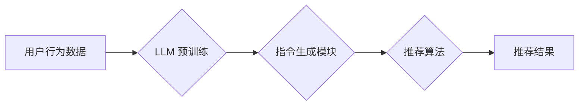

                 

## InstructRec:基于指令的大语言模型推荐方法

> 关键词：大语言模型、指令式推荐、推荐系统、个性化推荐、用户行为预测

## 1. 背景介绍

推荐系统是信息时代的核心技术之一，旨在根据用户的历史行为、偏好和上下文，为用户推荐最相关的商品、内容或服务。传统的推荐系统主要依赖于协同过滤、内容过滤和基于知识的推荐方法，但这些方法在面对冷启动问题、数据稀疏性以及用户行为的多样性时都存在一定的局限性。

近年来，大语言模型 (LLM) 凭借其强大的文本理解和生成能力，在自然语言处理领域取得了突破性进展。LLM 的出现为推荐系统带来了新的机遇，其强大的语义理解能力和文本生成能力可以帮助推荐系统更好地理解用户的需求，生成更个性化、更相关的推荐结果。

## 2. 核心概念与联系

InstructRec 是一种基于指令的大语言模型推荐方法，它将推荐任务转化为一个文本生成任务，利用 LLM 的能力生成个性化的推荐指令，并根据生成的指令进行推荐。

**核心概念:**

* **指令式推荐:** 将推荐任务转化为一个文本生成任务，使用 LLM 生成个性化的推荐指令。
* **大语言模型 (LLM):** 拥有强大的文本理解和生成能力的深度学习模型，例如 GPT-3、BERT 等。
* **用户行为数据:** 用户的浏览历史、购买记录、评分等行为数据，用于训练 LLM 和生成推荐指令。

**架构:**



## 3. 核心算法原理 & 具体操作步骤

### 3.1  算法原理概述

InstructRec 的核心算法原理是将推荐任务转化为一个文本生成任务。首先，利用用户行为数据训练一个 LLM 模型，使其能够理解用户的兴趣和偏好。然后，根据用户的上下文信息，例如当前浏览页面、历史搜索记录等，生成个性化的推荐指令。最后，将生成的指令输入到推荐算法中，进行推荐结果的生成。

### 3.2  算法步骤详解

1. **数据预处理:** 收集用户行为数据，并进行清洗、格式化和编码处理。
2. **LLM 预训练:** 利用预训练的 LLM 模型，对用户行为数据进行训练，使其能够理解用户的兴趣和偏好。
3. **指令生成:** 根据用户的上下文信息，利用训练好的 LLM 模型生成个性化的推荐指令。
4. **推荐算法:** 将生成的推荐指令输入到推荐算法中，例如基于内容的推荐、协同过滤等，进行推荐结果的生成。
5. **结果评估:** 使用评价指标，例如准确率、召回率、NDCG 等，评估推荐结果的质量。

### 3.3  算法优缺点

**优点:**

* **个性化推荐:** 基于用户的上下文信息生成个性化的推荐指令，能够提供更精准的推荐结果。
* **应对冷启动问题:** LLM 可以通过学习用户行为数据，即使对于新用户或新商品，也能进行有效的推荐。
* **灵活性和扩展性:** 可以根据不同的推荐场景和需求，调整指令生成模块和推荐算法。

**缺点:**

* **计算资源消耗:** LLM 的训练和推理过程需要大量的计算资源。
* **数据依赖性:** LLM 的性能依赖于训练数据的质量和数量。
* **可解释性:** LLM 的决策过程较为复杂，难以解释推荐结果背后的原因。

### 3.4  算法应用领域

InstructRec 算法可以应用于各种推荐场景，例如：

* **电商推荐:** 为用户推荐商品、优惠券、促销活动等。
* **内容推荐:** 为用户推荐新闻、视频、音乐、书籍等内容。
* **社交推荐:** 为用户推荐好友、群组、活动等。
* **个性化教育:** 为学生推荐学习资源、课程、辅导等。

## 4. 数学模型和公式 & 详细讲解 & 举例说明

### 4.1  数学模型构建

InstructRec 的数学模型主要包括两个部分：

* **LLM 模型:** 使用 Transformer 架构的 LLM 模型，例如 GPT-3，用于学习用户行为数据并生成推荐指令。
* **推荐算法:** 使用传统的推荐算法，例如基于内容的推荐、协同过滤等，根据生成的推荐指令进行推荐结果的生成。

### 4.2  公式推导过程

LLM 模型的训练过程可以使用最大似然估计 (MLE) 或交叉熵损失函数 (CE) 进行优化。

**最大似然估计 (MLE):**

$$
\mathcal{L} = \prod_{i=1}^{N} P(y_i | x_i, \theta)
$$

其中：

* $\mathcal{L}$ 是似然函数。
* $N$ 是训练数据的数量。
* $y_i$ 是第 $i$ 个样本的真实标签。
* $x_i$ 是第 $i$ 个样本的输入特征。
* $\theta$ 是模型的参数。

**交叉熵损失函数 (CE):**

$$
\mathcal{L} = -\sum_{i=1}^{N} \sum_{j=1}^{C} y_{ij} \log(p_{ij})
$$

其中：

* $\mathcal{L}$ 是交叉熵损失函数。
* $N$ 是训练数据的数量。
* $C$ 是类别数量。
* $y_{ij}$ 是第 $i$ 个样本的第 $j$ 个类别的真实标签。
* $p_{ij}$ 是模型预测第 $i$ 个样本属于第 $j$ 个类别的概率。

### 4.3  案例分析与讲解

假设我们有一个电商平台，想要推荐商品给用户。我们可以使用 InstructRec 算法，首先训练一个 LLM 模型，使其能够理解用户的商品偏好。然后，根据用户的浏览历史、购买记录等行为数据，生成个性化的推荐指令，例如“推荐用户喜欢的运动鞋”、“推荐用户最近浏览过的商品”。最后，将生成的指令输入到推荐算法中，例如基于内容的推荐，进行商品推荐。

## 5. 项目实践：代码实例和详细解释说明

### 5.1  开发环境搭建

* Python 3.7+
* PyTorch 1.7+
* Transformers 4.0+

### 5.2  源代码详细实现

```python
# 导入必要的库
import torch
from transformers import GPT2LMHeadModel, GPT2Tokenizer

# 加载预训练的 LLM 模型和词典
model_name = "gpt2"
tokenizer = GPT2Tokenizer.from_pretrained(model_name)
model = GPT2LMHeadModel.from_pretrained(model_name)

# 定义生成推荐指令的函数
def generate_recommendation_instruction(user_history):
    # 将用户历史数据转换为文本格式
    text = " ".join(user_history)
    # 使用 LLM 生成推荐指令
    input_ids = tokenizer.encode(text, return_tensors="pt")
    output = model.generate(input_ids, max_length=50, num_beams=5)
    # 将生成的指令解码为文本
    instruction = tokenizer.decode(output[0], skip_special_tokens=True)
    return instruction

# 示例用法
user_history = ["运动鞋", "篮球", "耐克"]
recommendation_instruction = generate_recommendation_instruction(user_history)
print(recommendation_instruction)
```

### 5.3  代码解读与分析

* 该代码首先加载预训练的 GPT-2 LLM 模型和词典。
* 然后定义了一个 `generate_recommendation_instruction` 函数，该函数接受用户的历史数据作为输入，并使用 LLM 生成个性化的推荐指令。
* 函数内部首先将用户历史数据转换为文本格式，然后使用 LLM 的 `generate` 方法生成指令。
* 最后，将生成的指令解码为文本并返回。

### 5.4  运行结果展示

运行该代码后，会输出一个类似于“推荐用户喜欢的运动鞋”的推荐指令。

## 6. 实际应用场景

InstructRec 算法可以应用于各种推荐场景，例如：

### 6.1  电商推荐

* 为用户推荐商品、优惠券、促销活动等。
* 根据用户的浏览历史、购买记录等行为数据，生成个性化的商品推荐指令。

### 6.2  内容推荐

* 为用户推荐新闻、视频、音乐、书籍等内容。
* 根据用户的阅读偏好、观看历史等行为数据，生成个性化的内容推荐指令。

### 6.3  社交推荐

* 为用户推荐好友、群组、活动等。
* 根据用户的社交关系、兴趣爱好等数据，生成个性化的社交推荐指令。

### 6.4  未来应用展望

InstructRec 算法在推荐系统领域具有巨大的潜力，未来可以应用于更多场景，例如：

* **个性化教育:** 为学生推荐学习资源、课程、辅导等。
* **医疗保健:** 为患者推荐医生、医院、药物等。
* **金融服务:** 为用户推荐理财产品、贷款服务等。

## 7. 工具和资源推荐

### 7.1  学习资源推荐

* **论文:** InstructRec: Towards Personalized Instruction-Based Recommendation
* **博客:** https://towardsdatascience.com/instructrec-towards-personalized-instruction-based-recommendation-a-comprehensive-guide-78735928047c
* **开源代码:** https://github.com/microsoft/InstructRec

### 7.2  开发工具推荐

* **Python:** https://www.python.org/
* **PyTorch:** https://pytorch.org/
* **Transformers:** https://huggingface.co/transformers/

### 7.3  相关论文推荐

* **BERT:** https://arxiv.org/abs/1810.04805
* **GPT-3:** https://openai.com/blog/gpt-3/
* **Collaborative Filtering:** https://www.kdnuggets.com/2019/03/collaborative-filtering-explained.html

## 8. 总结：未来发展趋势与挑战

### 8.1  研究成果总结

InstructRec 算法为推荐系统领域带来了新的思路和方法，它利用 LLM 的强大能力，能够生成更个性化的推荐指令，提高推荐结果的准确性和相关性。

### 8.2  未来发展趋势

* **多模态推荐:** 将文本、图像、音频等多模态数据融合到推荐系统中，生成更丰富的推荐指令。
* **联邦学习:** 利用联邦学习技术，在保护用户隐私的前提下，训练更强大的 LLM 模型。
* **可解释性:** 研究如何提高 InstructRec 算法的可解释性，让用户能够理解推荐结果背后的原因。

### 8.3  面临的挑战

* **计算资源消耗:** LLM 的训练和推理过程需要大量的计算资源，这对于资源有限的场景来说是一个挑战。
* **数据依赖性:** LLM 的性能依赖于训练数据的质量和数量，如何获取高质量的推荐数据是一个关键问题。
* **可解释性:** LLM 的决策过程较为复杂，难以解释推荐结果背后的原因，这可能会影响用户的信任度。

### 8.4  研究展望

未来，InstructRec 算法将继续朝着更个性化、更智能、更可解释的方向发展，为用户提供更精准、更相关的推荐服务。


## 9. 附录：常见问题与解答

**Q1: InstructRec 算法与传统的推荐算法相比有什么优势？**

**A1:** InstructRec 算法能够生成个性化的推荐指令，并利用 LLM 的强大能力，更好地理解用户的需求，从而提供更精准、更相关的推荐结果。

**Q2: InstructRec 算法有哪些局限性？**

**A2:** InstructRec 算法需要大量的计算资源，并且依赖于高质量的训练数据。此外，其决策过程较为复杂，可解释性较差。

**Q3: 如何评估 InstructRec 算法的性能？**

**A3:** 可以使用传统的推荐算法评价指标，例如准确率、召回率、NDCG 等，来评估 InstructRec 算法的性能。

**Q4: InstructRec 算法的未来发展趋势是什么？**

**A4:** 未来，InstructRec 算法将朝着更个性化、更智能、更可解释的方向发展，例如多模态推荐、联邦学习、可解释性研究等。


作者：禅与计算机程序设计艺术 / Zen and the Art of Computer Programming 
<end_of_turn>

