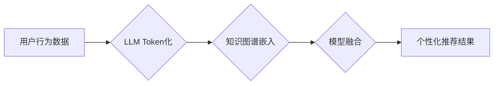

                 

## LLM Tokens+推荐系统的建模范式

> 关键词：LLM, Token, 推荐系统, 自然语言处理, 知识图谱, 模型融合, 个性化推荐

## 1. 背景介绍

推荐系统作为互联网时代的重要组成部分，在电商、社交媒体、内容平台等领域发挥着至关重要的作用。传统的推荐系统主要依赖于用户行为数据和商品特征，例如用户评分、购买历史、浏览记录等，通过协同过滤、内容过滤等算法进行推荐。然而，随着用户行为数据的多样化和复杂化，传统的推荐系统面临着以下挑战：

* **数据稀疏性:** 用户行为数据往往存在稀疏性，难以捕捉用户细粒度的兴趣偏好。
* **冷启动问题:** 新用户和新商品难以获得有效的推荐，因为缺乏历史数据。
* **推荐结果单一:** 传统的推荐系统难以提供多样化的推荐结果，用户体验可能单调乏味。

近年来，大语言模型 (LLM) 的快速发展为推荐系统带来了新的机遇。LLM 拥有强大的文本理解和生成能力，能够从海量文本数据中学习用户兴趣和商品语义，从而提升推荐系统的准确性和个性化程度。

## 2. 核心概念与联系

LLM Tokens+推荐系统是一种将 LLM 的文本表示能力与推荐系统的建模范式相结合的新型推荐方法。其核心概念包括：

* **LLM Token:** LLM 将文本序列分解为一个个独立的单元，称为 Token。每个 Token 携带一定的语义信息，可以被 LLM 理解和处理。
* **知识图谱:** 知识图谱是一种结构化的知识表示形式，将实体和关系以图的形式表示。它可以帮助推荐系统理解商品之间的关联性和用户之间的关系。
* **模型融合:** 将 LLM 的文本表示能力与传统的推荐算法相结合，例如协同过滤、内容过滤等，通过模型融合的方式提升推荐系统的性能。

**Mermaid 流程图:**



## 3. 核心算法原理 & 具体操作步骤

### 3.1  算法原理概述

LLM Tokens+推荐系统主要基于以下算法原理：

* **LLM Token化:** 将用户行为数据和商品信息转换为 LLM 可以理解的 Token。
* **知识图谱嵌入:** 将知识图谱中的实体和关系转换为低维向量表示，以便于与 LLM 的文本表示进行融合。
* **模型融合:** 将 LLM 的文本表示能力与传统的推荐算法相结合，例如使用 LLM 生成用户兴趣描述，作为协同过滤算法的输入，或者使用 LLM 对商品进行语义分析，作为内容过滤算法的特征。

### 3.2  算法步骤详解

1. **数据预处理:** 收集用户行为数据和商品信息，并进行清洗、去重等预处理操作。
2. **LLM Token化:** 使用预训练的 LLM 将用户行为数据和商品信息转换为 Token。
3. **知识图谱构建:** 构建商品和用户之间的知识图谱，例如用户购买的商品、用户喜欢的品牌等。
4. **知识图谱嵌入:** 使用知识图谱嵌入算法将知识图谱中的实体和关系转换为低维向量表示。
5. **模型融合:** 将 LLM 的文本表示能力与传统的推荐算法相结合，例如使用 LLM 生成用户兴趣描述，作为协同过滤算法的输入，或者使用 LLM 对商品进行语义分析，作为内容过滤算法的特征。
6. **模型训练:** 使用训练数据训练融合模型，并进行模型评估和调参。
7. **个性化推荐:** 使用训练好的模型对用户进行个性化推荐。

### 3.3  算法优缺点

**优点:**

* **提升推荐准确性:** LLM 的文本理解能力可以帮助推荐系统更好地捕捉用户兴趣和商品语义，从而提升推荐的准确性。
* **解决冷启动问题:** LLM 可以利用其预训练的知识和语言模型，对新用户和新商品进行初步的推荐，缓解冷启动问题。
* **提供多样化推荐:** LLM 可以生成多种不同的推荐结果，满足用户多样化的需求。

**缺点:**

* **计算资源消耗:** LLM 的训练和推理过程需要大量的计算资源。
* **数据安全问题:** LLM 的训练数据可能包含用户隐私信息，需要采取相应的安全措施保护用户隐私。
* **模型解释性:** LLM 的决策过程较为复杂，难以解释其推荐结果背后的逻辑。

### 3.4  算法应用领域

LLM Tokens+推荐系统可以应用于以下领域:

* **电商推荐:** 为用户推荐个性化的商品，提高转化率。
* **内容推荐:** 为用户推荐个性化的新闻、视频、文章等内容，提升用户粘性。
* **社交媒体推荐:** 为用户推荐个性化的好友、话题、群组等内容，提升用户活跃度。

## 4. 数学模型和公式 & 详细讲解 & 举例说明

### 4.1  数学模型构建

LLM Tokens+推荐系统的数学模型可以基于以下几个方面构建：

* **用户兴趣模型:** 使用 LLM 将用户的行为数据和文本描述转换为用户兴趣向量，例如使用 Transformer 模型对用户的评论和浏览记录进行编码，得到用户的兴趣表示。
* **商品语义模型:** 使用 LLM 将商品信息转换为商品语义向量，例如使用 BERT 模型对商品标题、描述和评论进行编码，得到商品的语义表示。
* **推荐评分模型:** 使用协同过滤、内容过滤等算法，结合用户兴趣向量和商品语义向量，预测用户对商品的评分或点击概率。

### 4.2  公式推导过程

例如，可以使用协同过滤算法的矩阵分解方法进行推荐评分预测。假设用户集合为 U，商品集合为 I，用户-商品交互矩阵为 R，其中 R(u, i) 表示用户 u 对商品 i 的评分。

目标是学习用户向量 u 和商品向量 v，使得预测评分与真实评分尽可能接近。可以使用以下损失函数进行优化：

$$
L = \sum_{u \in U, i \in I} (R(u, i) - \hat{R}(u, i))^2
$$

其中，$\hat{R}(u, i)$ 为预测评分，可以表示为：

$$
\hat{R}(u, i) = u \cdot v_i
$$

其中，u 为用户向量，$v_i$ 为商品 i 的向量。

### 4.3  案例分析与讲解

例如，假设有一个电商平台，用户购买了书籍、电子产品、服装等商品。可以使用 LLM Tokens+推荐系统进行个性化推荐。

1. **LLM Token化:** 将用户的购买历史、浏览记录、评论等文本数据转换为 Token。
2. **知识图谱构建:** 构建商品之间的知识图谱，例如书籍的作者、出版社、分类等信息。
3. **模型融合:** 使用 Transformer 模型对用户的行为数据进行编码，得到用户的兴趣向量。使用 BERT 模型对商品信息进行编码，得到商品的语义向量。将用户兴趣向量和商品语义向量作为输入，使用协同过滤算法进行推荐评分预测。
4. **个性化推荐:** 根据用户的兴趣向量和商品语义向量，预测用户对不同商品的评分，并推荐用户可能感兴趣的商品。

## 5. 项目实践：代码实例和详细解释说明

### 5.1  开发环境搭建

推荐使用 Python 语言和相关的深度学习框架，例如 PyTorch 或 TensorFlow 进行开发。

### 5.2  源代码详细实现

以下是一个简单的代码示例，演示了如何使用 PyTorch 进行 LLM Tokens+推荐系统的实现：

```python
import torch
import torch.nn as nn

class RecommenderModel(nn.Module):
    def __init__(self, user_dim, item_dim, embedding_dim):
        super(RecommenderModel, self).__init__()
        self.user_embedding = nn.Embedding(num_users, embedding_dim)
        self.item_embedding = nn.Embedding(num_items, embedding_dim)
        self.fc = nn.Linear(embedding_dim * 2, 1)

    def forward(self, user_ids, item_ids):
        user_embeddings = self.user_embedding(user_ids)
        item_embeddings = self.item_embedding(item_ids)
        combined_embeddings = torch.cat((user_embeddings, item_embeddings), dim=1)
        scores = self.fc(combined_embeddings)
        return scores

# ... 其他代码 ...
```

### 5.3  代码解读与分析

* `RecommenderModel` 类定义了一个简单的推荐模型。
* `user_embedding` 和 `item_embedding` 是两个嵌入层，用于将用户 ID 和商品 ID 转换为低维向量表示。
* `fc` 是一个全连接层，用于计算用户和商品的交互评分。
* `forward` 方法定义了模型的计算过程。

### 5.4  运行结果展示

可以使用训练数据训练模型，并使用测试数据评估模型的性能。可以使用指标，例如 RMSE 或 NDCG 来评估模型的推荐效果。

## 6. 实际应用场景

LLM Tokens+推荐系统在以下场景中具有广泛的应用前景：

* **个性化电商推荐:** 为用户推荐个性化的商品，提高转化率。
* **内容推荐系统:** 为用户推荐个性化的新闻、视频、文章等内容，提升用户粘性。
* **社交媒体推荐:** 为用户推荐个性化的好友、话题、群组等内容，提升用户活跃度。
* **教育推荐:** 为学生推荐个性化的学习资源，提升学习效率。

### 6.4  未来应用展望

随着 LLM 技术的不断发展，LLM Tokens+推荐系统将能够提供更精准、更个性化的推荐服务。未来，LLM Tokens+推荐系统可能在以下方面取得突破：

* **多模态推荐:** 将文本、图像、音频等多模态数据融合到推荐系统中，提供更丰富的推荐体验。
* **动态推荐:** 基于用户的实时行为和上下文信息，提供动态变化的推荐结果。
* **解释性推荐:** 提升推荐系统的解释性，让用户能够理解推荐结果背后的逻辑。

## 7. 工具和资源推荐

### 7.1  学习资源推荐

* **论文:**
    * "BERT: Pre-training of Deep Bidirectional Transformers for Language Understanding"
    * "Attention Is All You Need"
    * "Recurrent Neural Network Based Language Model"
* **书籍:**
    * "Deep Learning" by Ian Goodfellow, Yoshua Bengio, and Aaron Courville
    * "Natural Language Processing with Python" by Steven Bird, Ewan Klein, and Edward Loper
* **在线课程:**
    * Coursera: Natural Language Processing Specialization
    * Udacity: Deep Learning Nanodegree

### 7.2  开发工具推荐

* **深度学习框架:** PyTorch, TensorFlow
* **自然语言处理库:** NLTK, spaCy, Hugging Face Transformers
* **数据处理工具:** Pandas, NumPy

### 7.3  相关论文推荐

* "LLaMA: Open and Efficient Foundation Language Models"
* "GPT-3: Language Models are Few-Shot Learners"
* "T5: Text-to-Text Transfer Transformer"

## 8. 总结：未来发展趋势与挑战

### 8.1  研究成果总结

LLM Tokens+推荐系统是一种新兴的推荐方法，它将 LLM 的文本理解能力与传统的推荐算法相结合，能够提升推荐系统的准确性和个性化程度。

### 8.2  未来发展趋势

未来，LLM Tokens+推荐系统将朝着以下方向发展：

* **多模态推荐:** 将文本、图像、音频等多模态数据融合到推荐系统中，提供更丰富的推荐体验。
* **动态推荐:** 基于用户的实时行为和上下文信息，提供动态变化的推荐结果。
* **解释性推荐:** 提升推荐系统的解释性，让用户能够理解推荐结果背后的逻辑。

### 8.3  面临的挑战

LLM Tokens+推荐系统也面临着一些挑战：

* **计算资源消耗:** LLM 的训练和推理过程需要大量的计算资源。
* **数据安全问题:** LLM 的训练数据可能包含用户隐私信息，需要采取相应的安全措施保护用户隐私。
* **模型解释性:** LLM 的决策过程较为复杂，难以解释其推荐结果背后的逻辑。

### 8.4  研究展望

未来，我们需要继续研究如何降低 LLM Tokens+推荐系统的计算资源消耗，如何保护用户隐私，如何提升模型的解释性。


## 9. 附录：常见问题与解答

**Q1: LLM Tokens+推荐系统与传统的推荐系统相比有什么优势？**

**A1:** LLM Tokens+推荐系统能够更好地理解用户兴趣和商品语义，从而提升推荐的准确性和个性化程度。它还可以解决传统推荐系统面临的冷启动问题，并提供更丰富的推荐结果。

**Q2: 如何选择合适的 LLM 模型？**

**A2:** 选择合适的 LLM 模型需要根据具体应用场景和数据特点进行选择。例如，对于电商推荐场景，可以使用预训练的商品语义理解模型，例如 BERT。对于内容推荐场景，可以使用预训练的文本生成模型，例如 GPT-3。

**Q3: 如何保护用户隐私？**

**A3:** 在使用 LLM Tokens+推荐系统时，需要采取相应的安全措施保护用户隐私。例如，可以使用差分隐私技术对用户数据进行匿名化处理，或者使用联邦学习技术进行模型训练。

**作者：禅与计算机程序设计艺术 / Zen and the Art of Computer Programming**<end_of_turn>

