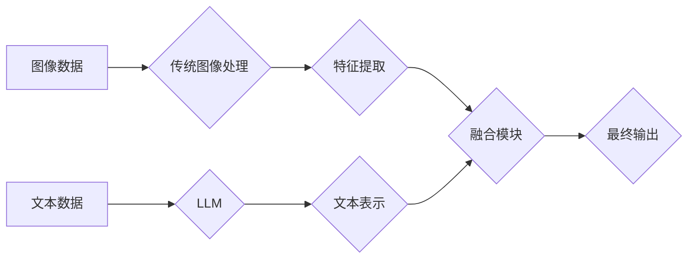

                 

## LLM与传统图像处理技术的融合：视觉智能新时代

> 关键词：LLM、图像处理、视觉智能、多模态学习、深度学习、计算机视觉

## 1. 背景介绍

近年来，深度学习在计算机视觉领域取得了突破性进展，例如图像识别、物体检测、图像分割等任务的性能大幅提升。然而，传统图像处理技术主要依赖于手工设计的特征提取方法，难以捕捉图像中的复杂语义信息。

另一方面，大型语言模型（LLM）在自然语言处理领域展现出强大的能力，能够理解和生成人类语言。LLM的出现为多模态学习提供了新的可能性，即融合文本和图像等不同模态数据进行学习，从而提升视觉智能的水平。

## 2. 核心概念与联系

### 2.1  LLM与传统图像处理技术的差异

* **传统图像处理技术:** 主要依赖于手工设计的特征提取方法，例如SIFT、HOG等，并使用机器学习算法进行分类或识别。

* **LLM:** 基于Transformer架构，通过学习大量的文本数据，能够捕捉语言的复杂语义关系。

### 2.2  融合LLM与传统图像处理技术的优势

* **提升语义理解:** LLM能够理解图像中的文本信息，例如标签、描述等，从而提升图像的语义理解能力。
* **增强特征表达:** LLM可以将图像特征编码为文本表示，并与文本数据进行融合，从而增强图像特征的表达能力。
* **跨模态知识迁移:** LLM可以将文本知识迁移到图像处理任务中，例如利用文本描述进行图像生成或图像检索。

### 2.3  融合架构



## 3. 核心算法原理 & 具体操作步骤

### 3.1  算法原理概述

融合LLM与传统图像处理技术的核心算法主要包括以下步骤：

1. **图像特征提取:** 使用传统图像处理方法提取图像特征，例如颜色、纹理、形状等。
2. **文本表示生成:** 使用LLM将图像特征编码为文本表示，例如使用Vision Transformer (ViT)将图像分割成patches，并将其嵌入到LLM中进行编码。
3. **融合模块:** 将图像特征和文本表示进行融合，例如使用注意力机制或多层感知机 (MLP) 将两者结合起来。
4. **最终输出:** 根据融合后的特征进行图像分类、物体检测、图像分割等任务。

### 3.2  算法步骤详解

1. **图像预处理:** 对图像进行尺寸调整、归一化等预处理操作，使其符合模型输入要求。
2. **图像特征提取:** 使用传统图像处理方法提取图像特征，例如使用卷积神经网络 (CNN) 提取图像的特征图。
3. **文本表示生成:** 将图像特征图输入到LLM中进行编码，生成图像的文本表示。
4. **融合模块:** 使用注意力机制或MLP将图像特征和文本表示进行融合，生成最终的特征表示。
5. **分类/检测/分割:** 根据融合后的特征进行图像分类、物体检测、图像分割等任务。

### 3.3  算法优缺点

**优点:**

* 能够提升图像语义理解能力。
* 增强图像特征表达能力。
* 跨模态知识迁移，提升模型泛化能力。

**缺点:**

* 训练成本高，需要大量的文本和图像数据。
* 模型复杂度高，推理速度相对较慢。

### 3.4  算法应用领域

* **图像识别:** 识别图像中的物体、场景、人物等。
* **物体检测:** 在图像中定位和识别物体。
* **图像分割:** 将图像分割成不同的区域。
* **图像 Captioning:** 生成图像的文本描述。
* **视觉问答:** 根据图像回答问题。

## 4. 数学模型和公式 & 详细讲解 & 举例说明

### 4.1  数学模型构建

假设图像特征为 $I \in R^{H \times W \times C}$，其中 $H$ 为图像高度，$W$ 为图像宽度，$C$ 为通道数。文本表示为 $T \in R^{D}$，其中 $D$ 为文本嵌入维度。

融合模块可以使用注意力机制进行建模，注意力机制可以学习图像特征和文本表示之间的相关性。

### 4.2  公式推导过程

注意力机制的计算公式如下：

$$
\text{Attention}(I, T) = \text{softmax}\left(\frac{I \cdot T^T}{\sqrt{D}}\right) \cdot T
$$

其中，$\cdot$ 表示矩阵乘法，$\text{softmax}$ 函数用于归一化注意力权重。

### 4.3  案例分析与讲解

例如，在图像 Captioning 任务中，可以使用注意力机制学习图像中哪些区域与文本描述相关。

通过计算注意力权重，可以发现模型关注图像中与文本描述相关的区域，例如，如果文本描述是“一只猫在睡觉”，模型会关注图像中猫的区域。

## 5. 项目实践：代码实例和详细解释说明

### 5.1  开发环境搭建

* Python 3.7+
* PyTorch 1.7+
* torchvision 0.10+
* transformers 4.0+

### 5.2  源代码详细实现

```python
import torch
import torch.nn as nn
from transformers import ViTFeatureExtractor, ViTForImageClassification

class FusionModule(nn.Module):
    def __init__(self, image_dim, text_dim):
        super(FusionModule, self).__init__()
        self.attention = nn.MultiheadAttention(image_dim, num_heads=8)
        self.fc = nn.Linear(image_dim + text_dim, image_dim)

    def forward(self, image_features, text_features):
        attention_output, _ = self.attention(image_features, text_features, text_features)
        fused_features = torch.cat([image_features, attention_output], dim=1)
        return self.fc(fused_features)

class ImageTextModel(nn.Module):
    def __init__(self, image_dim, text_dim, num_classes):
        super(ImageTextModel, self).__init__()
        self.image_encoder = ViTFeatureExtractor()
        self.text_encoder = ViTForImageClassification.from_pretrained("google/vit-base-patch16-224")
        self.fusion_module = FusionModule(image_dim, text_dim)
        self.classifier = nn.Linear(image_dim, num_classes)

    def forward(self, image, text):
        image_features = self.image_encoder(images=image)['pixel_values']
        text_features = self.text_encoder(text)['logits']
        fused_features = self.fusion_module(image_features, text_features)
        output = self.classifier(fused_features)
        return output
```

### 5.3  代码解读与分析

* `FusionModule` 类定义了图像特征和文本表示的融合模块，使用注意力机制进行融合。
* `ImageTextModel` 类定义了图像文本融合模型，包括图像编码器、文本编码器、融合模块和分类器。
* 模型训练过程：使用交叉熵损失函数，优化模型参数。

### 5.4  运行结果展示

训练完成后，可以使用模型进行图像分类、物体检测、图像分割等任务，并评估模型性能。

## 6. 实际应用场景

### 6.1  医疗图像分析

* 辅助医生诊断疾病，例如识别肿瘤、骨折等。
* 分析医学影像数据，例如CT、MRI等，提取病灶信息。

### 6.2  自动驾驶

* 识别道路标志、交通信号灯等。
* 检测行人、车辆等物体，避免碰撞事故。

### 6.3  零售行业

* 自动识别商品，进行商品分类和定价。
* 分析顾客行为，提供个性化推荐。

### 6.4  未来应用展望

* 更智能的视觉机器人，能够理解和交互人类语言。
* 更精准的医疗诊断，提高医疗效率。
* 更安全的自动驾驶系统，减少交通事故。

## 7. 工具和资源推荐

### 7.1  学习资源推荐

* **书籍:**
    * Deep Learning with Python
    * Hands-On Machine Learning with Scikit-Learn, Keras & TensorFlow
* **课程:**
    * Stanford CS231n: Convolutional Neural Networks for Visual Recognition
    * Deep Learning Specialization by Andrew Ng

### 7.2  开发工具推荐

* **框架:** PyTorch, TensorFlow
* **库:** torchvision, transformers

### 7.3  相关论文推荐

* **Attention Is All You Need:** https://arxiv.org/abs/1706.03762
* **BERT: Pre-training of Deep Bidirectional Transformers for Language Understanding:** https://arxiv.org/abs/1810.04805
* **Vision Transformer:** https://arxiv.org/abs/2010.11929

## 8. 总结：未来发展趋势与挑战

### 8.1  研究成果总结

LLM与传统图像处理技术的融合为视觉智能带来了新的突破，提升了图像语义理解能力和特征表达能力。

### 8.2  未来发展趋势

* **更强大的LLM:** 训练更强大的LLM，能够更好地理解图像语义。
* **更有效的融合方法:** 研究更有效的图像特征和文本表示的融合方法。
* **跨模态知识迁移:** 探索更有效的跨模态知识迁移方法，提升模型泛化能力。

### 8.3  面临的挑战

* **数据规模:** 训练LLM需要大量的文本和图像数据，数据获取和标注成本高。
* **模型复杂度:** 融合LLM与传统图像处理技术的模型复杂度高，推理速度相对较慢。
* **可解释性:** 融合模型的决策过程难以解释，缺乏透明度。

### 8.4  研究展望

未来，LLM与传统图像处理技术的融合将继续发展，并应用于更多领域，例如医疗、自动驾驶、零售等。

## 9. 附录：常见问题与解答

* **Q1:** 如何选择合适的LLM模型？
* **A1:** 选择合适的LLM模型需要根据具体任务和数据规模进行选择。

* **Q2:** 如何训练LLM与传统图像处理技术的融合模型？
* **A2:** 训练融合模型需要使用交叉熵损失函数，优化模型参数。

* **Q3:** 如何评估融合模型的性能？
* **A3:** 可以使用准确率、召回率、F1-score等指标评估融合模型的性能。


作者：禅与计算机程序设计艺术 / Zen and the Art of Computer Programming 
<end_of_turn>

