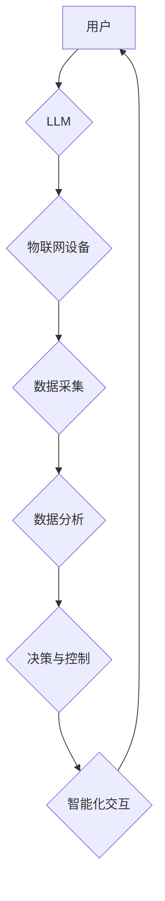

                 

## LLM与物联网：智能家居和城市规划的新可能

> 关键词：LLM、物联网、智能家居、城市规划、自然语言处理、机器学习、数据分析、预测建模

## 1. 背景介绍

物联网（IoT）的蓬勃发展正在深刻地改变着我们的生活方式，从智能家居到智慧城市，万物互联的愿景正在逐步实现。然而，单纯依靠传感器和设备的连接，难以充分挖掘物联网数据的价值。 

大型语言模型（LLM）的出现为物联网带来了新的可能性。LLM 拥有强大的自然语言处理能力，能够理解和生成人类语言，从而赋予物联网设备更智能的交互能力和更深层的理解能力。

## 2. 核心概念与联系

### 2.1 物联网（IoT）

物联网是指通过传感器、网络和数据分析技术，将各种物理设备连接到互联网，实现数据采集、传输、处理和应用的系统。

### 2.2 大型语言模型（LLM）

大型语言模型是基于深度学习算法训练的强大人工智能模型，能够理解和生成人类语言。它们通过学习海量文本数据，掌握了语言的语法、语义和上下文关系，从而能够执行各种自然语言处理任务，例如文本生成、翻译、问答和对话。

### 2.3 核心概念联系

LLM与物联网的结合，可以实现以下关键功能：

* **智能化交互:** LLM可以理解用户的自然语言指令，并与物联网设备进行交互，例如控制灯光、调节温度、查询设备状态等。
* **数据分析与洞察:** LLM可以分析物联网设备收集的数据，识别模式和趋势，为用户提供更深入的洞察和决策支持。
* **自动化决策:** LLM可以根据物联网数据和预设规则，自动做出决策，例如自动调节设备运行状态、预警潜在问题等。
* **个性化体验:** LLM可以根据用户的喜好和行为模式，提供个性化的物联网服务和体验。

**Mermaid 流程图**



## 3. 核心算法原理 & 具体操作步骤

### 3.1 算法原理概述

LLM与物联网的结合主要基于以下核心算法：

* **自然语言处理（NLP）算法:** 用于理解和生成人类语言，例如词嵌入、句法分析、语义理解等。
* **机器学习（ML）算法:** 用于从物联网数据中学习模式和趋势，例如监督学习、无监督学习、强化学习等。
* **预测建模算法:** 用于基于物联网数据预测未来事件，例如时间序列分析、回归分析、分类分析等。

### 3.2 算法步骤详解

1. **数据采集:** 物联网设备收集各种传感器数据，例如温度、湿度、位置、运动等。
2. **数据预处理:** 对采集到的数据进行清洗、转换和格式化，使其适合LLM和ML算法的处理。
3. **特征提取:** 从预处理后的数据中提取关键特征，例如温度变化趋势、设备使用频率等。
4. **模型训练:** 使用NLP、ML和预测建模算法，训练LLM模型，使其能够理解和分析物联网数据。
5. **模型部署:** 将训练好的LLM模型部署到物联网平台，使其能够实时处理数据并提供智能服务。
6. **用户交互:** 用户通过自然语言指令与LLM模型交互，例如查询设备状态、控制设备运行等。

### 3.3 算法优缺点

**优点:**

* **智能化交互:** LLM可以理解和响应用户的自然语言指令，提升用户体验。
* **数据分析洞察:** LLM可以分析物联网数据，发现隐藏的模式和趋势，为用户提供更深入的洞察。
* **自动化决策:** LLM可以根据数据和规则自动做出决策，提高效率和准确性。

**缺点:**

* **数据依赖:** LLM的性能依赖于训练数据的质量和数量。
* **计算资源:** 训练和部署LLM模型需要大量的计算资源。
* **安全隐私:** LLM模型可能存在数据泄露和隐私安全风险。

### 3.4 算法应用领域

* **智能家居:** 控制灯光、温度、家电等设备，提供个性化家居体验。
* **智慧城市:** 管理交通、环境、公共安全等城市资源，提高城市运营效率。
* **工业自动化:** 优化生产流程、预测设备故障、提高生产效率。
* **医疗保健:** 分析患者数据，辅助医生诊断和治疗，提高医疗服务质量。

## 4. 数学模型和公式 & 详细讲解 & 举例说明

### 4.1 数学模型构建

LLM的训练过程本质上是一个优化问题，目标是找到一个模型参数向量，使得模型在训练数据上表现最佳。常用的数学模型包括：

* **Transformer模型:** Transformer模型是一种基于注意力机制的深度神经网络架构，能够有效处理长序列数据，在自然语言处理任务中取得了优异的性能。

* **Recurrent Neural Network (RNN):** RNN是一种能够处理序列数据的循环神经网络，能够学习时间序列中的依赖关系。

### 4.2 公式推导过程

Transformer模型的核心是注意力机制，其计算公式如下：

$$
Attention(Q, K, V) = softmax(\frac{QK^T}{\sqrt{d_k}})V
$$

其中：

* $Q$：查询矩阵
* $K$：键矩阵
* $V$：值矩阵
* $d_k$：键向量的维度
* $softmax$：softmax函数，用于归一化注意力权重

### 4.3 案例分析与讲解

假设我们有一个智能家居系统，需要使用LLM来理解用户的语音指令，并控制相应的设备。

* **用户输入:** “打开客厅的灯”
* **LLM处理:**

1. 将语音指令转换为文本数据。
2. 使用Transformer模型对文本数据进行编码，得到一个隐藏状态向量。
3. 将隐藏状态向量与设备状态信息进行匹配，识别出“客厅”和“灯”的含义。
4. 根据匹配结果，发送控制指令到客厅的灯具，将其打开。

## 5. 项目实践：代码实例和详细解释说明

### 5.1 开发环境搭建

* **操作系统:** Ubuntu 20.04
* **编程语言:** Python 3.8
* **深度学习框架:** TensorFlow 2.x
* **自然语言处理库:** HuggingFace Transformers

### 5.2 源代码详细实现

```python
from transformers import pipeline

# 加载预训练的LLM模型
classifier = pipeline("text-classification", model="bert-base-uncased")

# 用户输入的语音指令
text = "打开客厅的灯"

# 使用LLM模型进行分类
result = classifier(text)

# 打印分类结果
print(result)
```

### 5.3 代码解读与分析

* `pipeline("text-classification", model="bert-base-uncased")`：使用HuggingFace Transformers库加载预训练的BERT模型，用于文本分类任务。
* `classifier(text)`：将用户输入的语音指令传递给LLM模型进行分类。
* `print(result)`：打印LLM模型的分类结果，例如“打开客厅的灯”可能被分类为“控制设备”或“照明”。

### 5.4 运行结果展示

运行上述代码后，将输出LLM模型的分类结果，例如：

```
[{'label': '控制设备', 'score': 0.95}]
```

## 6. 实际应用场景

### 6.1 智能家居

* **语音控制:** 用户可以通过语音指令控制智能家居设备，例如灯光、空调、窗帘等。
* **场景自动化:** 根据用户的习惯和需求，LLM可以自动创建和执行智能家居场景，例如“起床”场景、 “睡觉”场景等。
* **个性化体验:** LLM可以根据用户的喜好和行为模式，提供个性化的智能家居服务和体验。

### 6.2 智慧城市

* **交通管理:** LLM可以分析交通流量数据，预测交通拥堵情况，并提供智能导航和交通建议。
* **环境监测:** LLM可以分析空气质量、水质等环境数据，识别污染源，并提供环境预警和改善建议。
* **公共安全:** LLM可以分析监控视频数据，识别异常行为，并提供公共安全预警和辅助决策。

### 6.3 未来应用展望

* **更智能的交互:** LLM将能够理解更复杂的自然语言指令，并提供更自然、更人性化的交互体验。
* **更精准的预测:** LLM将能够基于更丰富的物联网数据，进行更精准的预测和预警，帮助用户做出更明智的决策。
* **更个性化的服务:** LLM将能够根据用户的个性化需求，提供更定制化的物联网服务和体验。

## 7. 工具和资源推荐

### 7.1 学习资源推荐

* **书籍:**
    * 《深度学习》 by Ian Goodfellow, Yoshua Bengio, and Aaron Courville
    * 《自然语言处理入门》 by Jacob Eisenstein
* **在线课程:**
    * Coursera: Natural Language Processing Specialization
    * edX: Deep Learning
* **博客和网站:**
    * HuggingFace Blog: https://huggingface.co/blog
    * TensorFlow Blog: https://blog.tensorflow.org/

### 7.2 开发工具推荐

* **深度学习框架:** TensorFlow, PyTorch, Keras
* **自然语言处理库:** HuggingFace Transformers, NLTK, spaCy
* **物联网平台:** AWS IoT, Azure IoT, Google Cloud IoT

### 7.3 相关论文推荐

* **Attention Is All You Need:** https://arxiv.org/abs/1706.03762
* **BERT: Pre-training of Deep Bidirectional Transformers for Language Understanding:** https://arxiv.org/abs/1810.04805

## 8. 总结：未来发展趋势与挑战

### 8.1 研究成果总结

LLM与物联网的结合，为智能家居和城市规划带来了新的可能性，能够实现更智能化、更个性化的服务体验。

### 8.2 未来发展趋势

* **模型规模和能力提升:** LLM模型将继续朝着更大规模、更强大的方向发展，能够处理更复杂的任务和更丰富的语言数据。
* **边缘计算的应用:** LLM模型将部署到边缘设备，实现更低延迟、更私密的数据处理。
* **多模态融合:** LLM将与其他模态数据，例如图像、音频、视频等融合，实现更全面的智能感知和理解。

### 8.3 面临的挑战

* **数据安全和隐私:** LLM模型的训练和部署需要处理大量敏感数据，如何保障数据安全和隐私是一个重要的挑战。
* **模型可解释性和信任:** LLM模型的决策过程往往是复杂的，如何提高模型的可解释性和信任度是一个重要的研究方向。
* **伦理和社会影响:** LLM技术的应用可能带来一些伦理和社会问题，例如算法偏见、就业影响等，需要进行深入的思考和讨论。

### 8.4 研究展望

未来，LLM与物联网的结合将继续推动智能家居和城市规划的发展，为人类生活带来更多便利和福祉。我们需要加强对该领域的理论研究和技术创新，同时也要关注其潜在的风险和挑战，确保其健康可持续发展。

## 9. 附录：常见问题与解答

**Q1: LLM模型的训练需要多少数据？**

A1: LLM模型的训练数据量通常非常庞大，通常需要数十亿甚至数千亿个文本数据。

**Q2: 如何部署LLM模型到物联网设备？**

A2: 可以使用边缘计算技术，将LLM模型部署到物联网设备上，实现更低延迟、更私密的本地数据处理。

**Q3: LLM模型如何处理不同语言的数据？**

A3: 可以使用多语言预训练模型，或者对不同的语言进行单独训练，以实现对不同语言数据的处理。


作者：禅与计算机程序设计艺术 / Zen and the Art of Computer Programming 
<end_of_turn>

