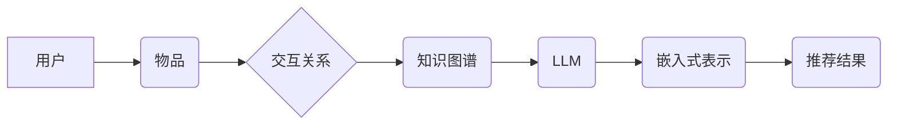

                 

## LLM在推荐系统中的图表示学习应用

> 关键词：LLM, 图表示学习, 推荐系统, 知识图谱, 实体关系, 嵌入式表示, 协同过滤

## 1. 背景介绍

推荐系统是信息时代的重要技术，旨在根据用户的历史行为、偏好和上下文信息，预测用户对特定物品的兴趣，并提供个性化的推荐结果。传统的推荐系统主要依赖于协同过滤和内容过滤等方法，但这些方法在面对稀疏数据、冷启动问题和数据维度爆炸等挑战时表现不足。

近年来，图表示学习 (Graph Representation Learning, GRAL) 作为一种新兴的机器学习技术，在推荐系统领域展现出巨大的潜力。图表示学习通过将用户、物品和他们的交互关系表示为图结构，学习用户和物品的嵌入式表示，从而更好地捕捉用户兴趣和物品特征之间的复杂关系。

大型语言模型 (Large Language Model, LLM) 作为一种强大的自然语言处理模型，具备强大的文本理解和生成能力。将LLM与图表示学习相结合，可以进一步提升推荐系统的性能。LLM可以用于丰富用户和物品的语义信息，例如从用户评论中提取兴趣偏好，从物品描述中提取属性特征，从而为图表示学习提供更丰富的输入数据。

## 2. 核心概念与联系

### 2.1 图表示学习

图表示学习 (Graph Representation Learning, GRAL) 是一种机器学习技术，旨在学习图结构中节点和边的嵌入式表示。嵌入式表示是一种低维向量，能够捕捉节点和边的属性和关系信息。

图表示学习算法通常分为两类：

* **基于结构的算法:** 这些算法基于图结构本身，例如节点的度、邻居节点等信息，学习节点的嵌入式表示。
* **基于内容的算法:** 这些算法利用节点和边的属性信息，例如节点的标签、边的权重等，学习节点的嵌入式表示。

### 2.2  推荐系统

推荐系统旨在根据用户的历史行为、偏好和上下文信息，预测用户对特定物品的兴趣，并提供个性化的推荐结果。推荐系统可以分为以下几种类型：

* **协同过滤:** 基于用户的相似性或物品的相似性进行推荐。
* **内容过滤:** 基于物品的特征和用户的偏好进行推荐。
* **基于知识的推荐:** 基于用户和物品之间的知识关系进行推荐。

### 2.3  LLM

大型语言模型 (Large Language Model, LLM) 是一种基于Transformer架构的深度学习模型，能够处理和生成大量的文本数据。LLM具备强大的文本理解、生成、翻译、问答等能力。

**Mermaid 流程图**



## 3. 核心算法原理 & 具体操作步骤

### 3.1  算法原理概述

将LLM与图表示学习相结合的推荐系统，通常采用以下步骤：

1. **构建知识图谱:** 将用户、物品和他们的交互关系表示为知识图谱，例如用户购买历史、用户评分、物品类别等信息。
2. **利用LLM丰富知识图谱:** 使用LLM对用户评论、物品描述等文本数据进行分析，提取用户兴趣偏好和物品属性特征，并将其融入知识图谱中。
3. **学习嵌入式表示:** 使用图表示学习算法学习用户和物品的嵌入式表示，例如Node2Vec、GraphSAGE等。
4. **生成推荐结果:** 根据用户和物品的嵌入式表示，计算用户对物品的兴趣评分，并排序推荐结果。

### 3.2  算法步骤详解

1. **数据预处理:** 收集用户和物品数据，并进行清洗、格式化等预处理操作。
2. **知识图谱构建:** 将用户、物品和他们的交互关系构建成知识图谱。
3. **LLM文本分析:** 使用LLM对用户评论、物品描述等文本数据进行分析，提取用户兴趣偏好和物品属性特征。
4. **知识图谱增强:** 将LLM提取的文本信息融入知识图谱中，丰富知识图谱的语义信息。
5. **图表示学习:** 使用图表示学习算法学习用户和物品的嵌入式表示。
6. **推荐模型训练:** 使用用户和物品的嵌入式表示训练推荐模型，例如基于距离的推荐模型、基于神经网络的推荐模型等。
7. **推荐结果生成:** 根据训练好的推荐模型，预测用户对物品的兴趣评分，并排序推荐结果。

### 3.3  算法优缺点

**优点:**

* 能够更好地捕捉用户兴趣和物品特征之间的复杂关系。
* 能够利用LLM的强大文本理解能力，丰富知识图谱的语义信息。
* 能够处理稀疏数据和冷启动问题。

**缺点:**

* 计算复杂度较高，需要大量的计算资源。
* 需要大量的训练数据，才能训练出高质量的嵌入式表示。
* 知识图谱的构建和维护需要专业知识和技术支持。

### 3.4  算法应用领域

LLM与图表示学习相结合的推荐系统，可以应用于以下领域:

* **电商推荐:** 推荐商品、优惠券、促销活动等。
* **内容推荐:** 推荐新闻、视频、音乐、书籍等。
* **社交推荐:** 推荐好友、群组、活动等。
* **医疗推荐:** 推荐医生、医院、药物等。

## 4. 数学模型和公式 & 详细讲解 & 举例说明

### 4.1  数学模型构建

图表示学习的目标是学习每个节点的嵌入式表示，这些表示能够捕捉节点的属性和关系信息。常用的数学模型包括：

* **邻接矩阵:** 使用邻接矩阵表示图结构，其中每个元素表示两个节点之间的关系。
* **邻接列表:** 使用邻接列表表示图结构，其中每个节点对应一个列表，列表中的元素表示该节点的邻居节点。
* **图卷积网络 (Graph Convolutional Network, GCN):** 使用卷积操作学习节点的嵌入式表示，能够捕捉节点之间的局部结构信息。

### 4.2  公式推导过程

例如，使用GCN学习节点的嵌入式表示，其公式推导过程如下：

1. **节点特征矩阵:** 假设图中每个节点都有一个特征向量，表示为矩阵 X，其中 X ∈ R^(N×D)，N 为节点数量，D 为节点特征维度。
2. **邻接矩阵:** 假设图的邻接矩阵为 A，其中 A ∈ R^(N×N)，A(i,j) = 1 表示节点 i 和节点 j 相连，否则为 0。
3. **归一化邻接矩阵:** 为了防止梯度爆炸，需要对邻接矩阵进行归一化，得到归一化邻接矩阵 D^(-1/2) * A * D^(-1/2)。
4. **图卷积层:** GCN 的图卷积层可以表示为：

$$
H^{(l+1)} = \sigma(D^{-1/2} * A * D^{-1/2} * H^{(l)} * W^{(l)})
$$

其中，H^(l) 为第 l 层的节点嵌入式表示，W^(l) 为第 l 层的权重矩阵，σ 为激活函数。

### 4.3  案例分析与讲解

例如，在电商推荐系统中，可以使用GCN学习用户和商品的嵌入式表示。用户特征可以包括年龄、性别、购买历史等，商品特征可以包括类别、价格、品牌等。通过学习用户和商品的嵌入式表示，可以更好地捕捉用户对商品的兴趣关系，从而进行更精准的商品推荐。

## 5. 项目实践：代码实例和详细解释说明

### 5.1  开发环境搭建

推荐使用 Python 语言和相关的深度学习框架，例如 PyTorch 或 TensorFlow。

### 5.2  源代码详细实现

以下是一个使用 PyTorch 实现 LLM 与图表示学习相结合的推荐系统的简单代码示例：

```python
import torch
import torch.nn as nn

class GCNLayer(nn.Module):
    def __init__(self, in_features, out_features):
        super(GCNLayer, self).__init__()
        self.linear = nn.Linear(in_features, out_features)

    def forward(self, x, adj):
        return self.linear(torch.sparse.mm(adj, x))

class Recommender(nn.Module):
    def __init__(self, user_features, item_features, hidden_dim):
        super(Recommender, self).__init__()
        self.gcn_layer = GCNLayer(user_features, hidden_dim)
        self.fc = nn.Linear(hidden_dim, 1)

    def forward(self, user_embeddings, item_embeddings):
        user_embeddings = self.gcn_layer(user_embeddings, adj_matrix)
        item_embeddings = self.gcn_layer(item_embeddings, adj_matrix)
        scores = self.fc(torch.cat((user_embeddings, item_embeddings), dim=1))
        return scores

# ... 其他代码 ...
```

### 5.3  代码解读与分析

该代码示例定义了一个简单的推荐模型，包括一个 GCN 层和一个全连接层。GCN 层用于学习用户和商品的嵌入式表示，全连接层用于计算用户对商品的兴趣评分。

### 5.4  运行结果展示

运行该代码示例，可以得到用户对商品的兴趣评分，并进行排序，从而生成推荐结果。

## 6. 实际应用场景

### 6.1  电商推荐

在电商平台，LLM 可以分析用户评论和商品描述，提取用户兴趣偏好和商品属性特征，并将其融入知识图谱中。图表示学习算法可以学习用户和商品的嵌入式表示，从而进行更精准的商品推荐。

### 6.2  内容推荐

在内容平台，LLM 可以分析用户阅读历史和内容标签，提取用户兴趣偏好和内容主题信息，并将其融入知识图谱中。图表示学习算法可以学习用户和内容的嵌入式表示，从而推荐更符合用户兴趣的内容。

### 6.3  社交推荐

在社交平台，LLM 可以分析用户社交关系和兴趣标签，提取用户兴趣偏好和好友关系信息，并将其融入知识图谱中。图表示学习算法可以学习用户和好友的嵌入式表示，从而推荐更符合用户兴趣的好友和群组。

### 6.4  未来应用展望

LLM与图表示学习相结合的推荐系统，未来将应用于更多领域，例如医疗推荐、教育推荐、金融推荐等。随着LLM技术的不断发展，推荐系统的精准度和个性化程度将进一步提升。

## 7. 工具和资源推荐

### 7.1  学习资源推荐

* **书籍:**
    * 《图表示学习》
    * 《深度学习》
* **在线课程:**
    * Coursera: Graph Representation Learning
    * Udacity: Deep Learning Nanodegree

### 7.2  开发工具推荐

* **Python:** 
* **PyTorch:** 
* **TensorFlow:** 
* **NetworkX:** 图数据结构和算法库

### 7.3  相关论文推荐

* 《Graph Convolutional Networks for Web-Scale Recommender Systems》
* 《DeepWalk: Online Learning of Social Representations》
* 《Node2Vec: Scalable Feature Learning for Networks》

## 8. 总结：未来发展趋势与挑战

### 8.1  研究成果总结

LLM与图表示学习相结合的推荐系统，取得了显著的成果，能够更好地捕捉用户兴趣和物品特征之间的复杂关系，提升推荐系统的精准度和个性化程度。

### 8.2  未来发展趋势

* **更强大的LLM:** 随着LLM技术的不断发展，将会有更强大的LLM模型，能够更好地理解和生成文本数据，从而为推荐系统提供更丰富的语义信息。
* **更有效的图表示学习算法:** 将会有更有效的图表示学习算法，能够更好地学习节点的嵌入式表示，并捕捉更复杂的图结构信息。
* **多模态推荐:** 将会有更多多模态数据的应用，例如图像、音频、视频等，从而构建更全面的用户和物品表示，提升推荐系统的效果。

### 8.3  面临的挑战

* **数据稀疏性:** 现实世界中的数据往往是稀疏的，这会影响图表示学习算法的性能。
* **计算复杂度:** LLM与图表示学习相结合的推荐系统计算复杂度较高，需要大量的计算资源。
* **模型 interpretability:** LLM模型的内部机制较为复杂，难以解释模型的决策过程，这会影响模型的信任度。

### 8.4  研究展望

未来研究将集中在以下几个方面:

* **解决数据稀疏性问题:** 研究新的数据增强方法和图表示学习算法，以应对数据稀疏性问题。
* **降低计算复杂度:** 研究更有效的图表示学习算法和模型压缩技术，以降低计算复杂度。
* **提升模型 interpretability:** 研究可解释性更强的LLM模型和图表示学习算法，以提高模型的信任度。


## 9. 附录：常见问题与解答

### 9.1  Q1: LLM与图表示学习相结合的推荐系统有什么优势？

**A1:** LLM与图表示学习相结合的推荐系统能够更好地捕捉用户兴趣和物品特征之间的复杂关系，提升推荐系统的精准度和个性化程度。

### 9.2  Q2: 如何构建知识图谱？

**A2:** 构建知识图谱需要收集用户和物品数据，并进行清洗、格式化等预处理操作。然后，根据数据关系，构建用户、物品和他们的交互关系的图结构。

### 9.3  Q3: 如何选择合适的图表示学习算法？

**A3:** 选择合适的图表示学习算法需要根据具体应用场景和数据特点进行选择。例如，对于稀疏图数据，可以使用 Node2Vec 算法；对于稠密图数据，可以使用 GCN 算法。


作者：禅与计算机程序设计艺术 / Zen and the Art of Computer Programming 
<end_of_turn>

