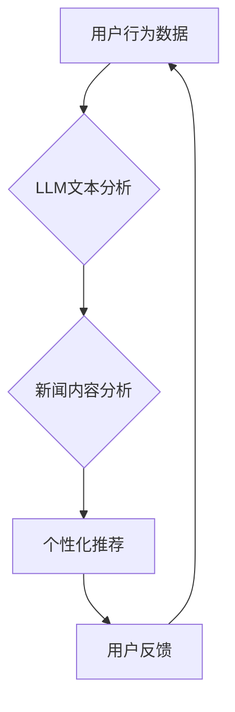

                 

## LLM在智能个性化新闻推送中的应用前景

> 关键词：LLM, 大语言模型, 个性化新闻推送, 信息过滤, 推荐算法, 自然语言处理, 用户行为分析

## 1. 背景介绍

在信息爆炸的时代，海量新闻资讯的涌现使得用户难以筛选出真正感兴趣的内容。传统的新闻推送方式往往依靠人工编辑或简单的关键词匹配，难以满足用户个性化需求。近年来，随着深度学习技术的飞速发展，大语言模型（LLM）的出现为智能个性化新闻推送带来了新的机遇。

LLM 是一种强大的人工智能模型，能够理解和生成人类语言。其强大的文本处理能力和知识表示能力使其能够分析用户阅读偏好、新闻主题和内容风格，从而实现更精准、更个性化的新闻推荐。

## 2. 核心概念与联系

### 2.1  大语言模型（LLM）

LLM 是指能够理解和生成人类语言的深度学习模型。它通过训练海量文本数据，学习语言的语法、语义和上下文关系，从而具备强大的文本处理能力，例如文本分类、文本摘要、机器翻译等。

### 2.2  个性化新闻推送

个性化新闻推送是指根据用户的兴趣、偏好、阅读习惯等信息，推荐用户感兴趣的新闻内容。其目标是提高用户阅读体验，帮助用户快速获取所需信息。

### 2.3  核心概念联系

LLM 的核心能力在于其强大的文本理解和生成能力，而个性化新闻推送的核心需求则是精准地理解用户需求并推荐匹配的内容。两者结合，LLM 可以通过分析用户的阅读历史、点赞、评论等行为数据，学习用户的兴趣偏好，并根据新闻内容的主题、风格等特征，进行精准的推荐。

**Mermaid 流程图**



## 3. 核心算法原理 & 具体操作步骤

### 3.1  算法原理概述

LLM 在个性化新闻推送中的应用主要基于以下核心算法：

* **用户画像构建:** 利用用户的阅读历史、点赞、评论等行为数据，构建用户的兴趣偏好画像。
* **新闻主题提取:** 利用自然语言处理技术，从新闻内容中提取主题关键词和关键信息。
* **内容相似度计算:** 基于用户画像和新闻主题，计算新闻内容与用户兴趣的相似度。
* **推荐排序:** 根据相似度得分，对新闻进行排序，推荐给用户。

### 3.2  算法步骤详解

1. **数据收集:** 收集用户的阅读历史、点赞、评论等行为数据，以及新闻内容的文本数据。
2. **数据预处理:** 对数据进行清洗、格式化和向量化处理，以便于LLM的训练和应用。
3. **用户画像构建:** 利用机器学习算法，例如K-means聚类或深度学习模型，从用户的行为数据中学习其兴趣偏好，构建用户画像。
4. **新闻主题提取:** 利用自然语言处理技术，例如关键词提取、主题建模等，从新闻内容中提取主题关键词和关键信息。
5. **内容相似度计算:** 基于用户画像和新闻主题，利用余弦相似度或其他相似度度量方法，计算新闻内容与用户兴趣的相似度。
6. **推荐排序:** 根据相似度得分，对新闻进行排序，推荐给用户。

### 3.3  算法优缺点

**优点:**

* **个性化推荐:** 能够根据用户的兴趣偏好，推荐更精准、更相关的新闻内容。
* **内容丰富:** 可以推荐来自不同来源、不同类型的新闻内容，满足用户的多样化需求。
* **用户体验提升:** 可以帮助用户节省时间和精力，快速获取所需信息。

**缺点:**

* **数据依赖:** 需要大量的用户行为数据和新闻内容数据进行训练和评估。
* **算法复杂:** 涉及到自然语言处理、机器学习等多个领域的知识和技术。
* **公平性问题:** 可能存在算法偏差，导致某些用户无法获得公平的推荐结果。

### 3.4  算法应用领域

LLM 在个性化新闻推送领域的应用前景广阔，除了新闻推荐外，还可以应用于：

* **个性化教育:** 根据学生的学习进度和兴趣，推荐个性化的学习内容。
* **个性化娱乐:** 根据用户的喜好，推荐个性化的电影、音乐、游戏等娱乐内容。
* **个性化电商:** 根据用户的购买历史和兴趣，推荐个性化的商品。

## 4. 数学模型和公式 & 详细讲解 & 举例说明

### 4.1  数学模型构建

LLM 在个性化新闻推送中的应用可以构建以下数学模型：

**用户兴趣模型:**

$$
u_i = \sum_{j=1}^{N} w_j \cdot x_{ij}
$$

其中：

* $u_i$ 表示用户 $i$ 的兴趣向量。
* $w_j$ 表示用户 $i$ 对主题 $j$ 的权重。
* $x_{ij}$ 表示新闻 $j$ 是否包含主题 $i$ 的特征值。

**新闻内容模型:**

$$
c_j = \sum_{k=1}^{M} v_k \cdot y_{jk}
$$

其中：

* $c_j$ 表示新闻 $j$ 的内容向量。
* $v_k$ 表示新闻 $j$ 中主题 $k$ 的权重。
* $y_{jk}$ 表示新闻 $j$ 是否包含主题 $k$ 的特征值。

**相似度计算:**

$$
similarity(u_i, c_j) = \frac{u_i \cdot c_j}{||u_i|| ||c_j||}
$$

其中：

* $similarity(u_i, c_j)$ 表示用户 $i$ 和新闻 $j$ 之间的相似度。
* $u_i \cdot c_j$ 表示用户 $i$ 和新闻 $j$ 的点积。
* $||u_i||$ 和 $||c_j||$ 分别表示用户 $i$ 和新闻 $j$ 的向量长度。

### 4.2  公式推导过程

用户兴趣模型和新闻内容模型的构建基于以下假设：

* 用户的兴趣可以由多个主题的权重表示。
* 新闻的内容可以由多个主题的权重表示。

根据这些假设，我们可以利用机器学习算法，例如线性回归或神经网络，学习用户和新闻的主题权重，从而构建用户兴趣模型和新闻内容模型。

相似度计算公式基于点积和向量长度，可以衡量两个向量的方向和大小的相似程度。

### 4.3  案例分析与讲解

假设有一个用户 $u_1$，其兴趣向量为 $[0.8, 0.5, 0.2]$，表示对科技、财经和体育的兴趣程度分别为高、中、低。

假设有一个新闻 $c_2$，其内容向量为 $[0.6, 0.3, 0.9]$，表示包含科技、财经和体育的主题权重分别为高、中、高。

根据上述公式，我们可以计算用户 $u_1$ 和新闻 $c_2$ 之间的相似度：

$$
similarity(u_1, c_2) = \frac{[0.8, 0.5, 0.2] \cdot [0.6, 0.3, 0.9]}{|| [0.8, 0.5, 0.2] || || [0.6, 0.3, 0.9] ||}
$$

通过计算，我们可以得到用户 $u_1$ 和新闻 $c_2$ 之间的相似度得分，从而判断新闻 $c_2$ 是否适合推荐给用户 $u_1$。

## 5. 项目实践：代码实例和详细解释说明

### 5.1  开发环境搭建

* Python 3.7+
* TensorFlow 或 PyTorch 深度学习框架
* NLTK 自然语言处理库
* Scikit-learn 机器学习库

### 5.2  源代码详细实现

```python
# 用户兴趣模型
class UserInterestModel:
    def __init__(self, user_data):
        # ...

    def train(self):
        # ...

    def predict(self, news_data):
        # ...

# 新闻内容模型
class NewsContentModel:
    def __init__(self, news_data):
        # ...

    def train(self):
        # ...

    def predict(self, user_data):
        # ...

# 相似度计算
def calculate_similarity(user_vector, news_vector):
    # ...

# 推荐算法
def recommend_news(user_data, news_data):
    # ...

# 主程序
if __name__ == "__main__":
    # ...
```

### 5.3  代码解读与分析

* 用户兴趣模型和新闻内容模型分别负责学习用户的兴趣偏好和新闻主题特征。
* 相似度计算函数用于计算用户和新闻之间的相似度。
* 推荐算法根据用户兴趣模型和新闻内容模型，以及相似度计算结果，推荐最相关的新闻。

### 5.4  运行结果展示

运行上述代码，可以得到推荐结果，例如：

```
推荐新闻：
* 科技新闻1
* 科技新闻2
* 财经新闻1
```

## 6. 实际应用场景

### 6.1  新闻客户端

个性化新闻推送可以应用于新闻客户端，根据用户的阅读历史和兴趣偏好，推荐个性化的新闻内容。

### 6.2  社交媒体平台

社交媒体平台可以利用LLM技术，根据用户的关注者、点赞和评论等行为数据，推荐个性化的新闻和内容。

### 6.3  搜索引擎

搜索引擎可以利用LLM技术，根据用户的搜索历史和兴趣偏好，推荐更相关的搜索结果。

### 6.4  未来应用展望

LLM 在个性化新闻推送领域的应用前景广阔，未来可以应用于更多场景，例如：

* **智能客服:** 利用LLM技术，构建智能客服系统，为用户提供个性化的新闻资讯服务。
* **个性化教育:** 根据学生的学习进度和兴趣，推荐个性化的新闻内容，帮助学生了解社会热点和时事新闻。
* **个性化营销:** 利用LLM技术，根据用户的兴趣偏好，推荐个性化的新闻广告，提高广告效果。

## 7. 工具和资源推荐

### 7.1  学习资源推荐

* **书籍:**
    * 《深度学习》
    * 《自然语言处理》
    * 《大数据分析》
* **在线课程:**
    * Coursera
    * edX
    * Udacity

### 7.2  开发工具推荐

* **Python:**
    * TensorFlow
    * PyTorch
    * NLTK
    * Scikit-learn

### 7.3  相关论文推荐

* **BERT: Pre-training of Deep Bidirectional Transformers for Language Understanding**
* **GPT-3: Language Models are Few-Shot Learners**
* **XLNet: Generalized Autoregressive Pretraining for Language Understanding**

## 8. 总结：未来发展趋势与挑战

### 8.1  研究成果总结

LLM 在个性化新闻推送领域取得了显著的成果，能够根据用户的兴趣偏好，推荐更精准、更相关的新闻内容。

### 8.2  未来发展趋势

* **模型规模和能力提升:** 未来LLM模型规模将进一步扩大，模型能力将进一步提升，能够理解更复杂的语言和知识。
* **多模态融合:** LLM将与其他模态数据，例如图像、音频等融合，实现更全面的个性化推荐。
* **可解释性增强:** 研究者将致力于提高LLM模型的可解释性，帮助用户理解模型推荐的原因。

### 8.3  面临的挑战

* **数据隐私和安全:** LLM模型需要大量用户数据进行训练，如何保护用户数据隐私和安全是一个重要的挑战。
* **算法公平性:** LLM模型可能存在算法偏差，导致某些用户无法获得公平的推荐结果。
* **模型部署和维护:** LLM模型的部署和维护成本较高，需要强大的计算资源和技术支持。

### 8.4  研究展望

未来，LLM在个性化新闻推送领域的研究将继续深入，探索更先进的算法、模型和应用场景，为用户提供更智能、更个性化的新闻体验。

## 9. 附录：常见问题与解答

### 9.1  LLM模型训练需要多少数据？

LLM模型的训练数据量取决于模型规模和复杂度。一般来说，需要百万甚至数十亿条文本数据进行训练。

### 9.2  LLM模型的训练时间有多长？

LLM模型的训练时间取决于模型规模、数据量和计算资源。一般来说，训练一个大型LLM模型需要数周甚至数月的时间。

### 9.3  LLM模型的应用场景有哪些？

LLM模型的应用场景非常广泛，例如：

* 自然语言处理
* 机器翻译
* 文本摘要
* 代码生成
* 聊天机器人
* 个性化推荐

### 9.4  如何评估LLM模型的性能？

LLM模型的性能可以通过多种指标进行评估，例如：

* 准确率
* 精度
*召回率
* F1-score
* BLEU score

### 9.5  LLM模型的伦理问题有哪些？

LLM模型的应用也存在一些伦理问题，例如：

* 算法偏见
* 数据隐私
* 虚假信息生成

需要谨慎考虑这些问题，并制定相应的伦理规范和监管机制。


作者：禅与计算机程序设计艺术 / Zen and the Art of Computer Programming 
<end_of_turn>

