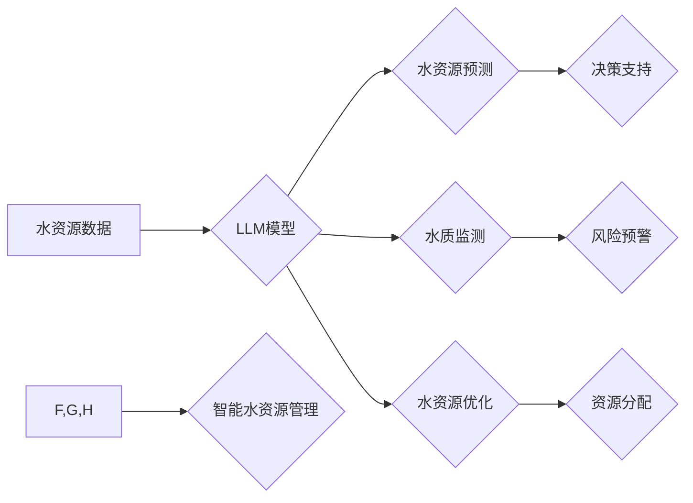

                 

## LLM在智能水资源管理中的潜在贡献

> 关键词：大型语言模型（LLM）、智能水资源管理、水资源预测、水质监测、水资源优化、自然语言处理、机器学习

## 1. 背景介绍

水资源是人类生存和社会发展不可或缺的基石。然而，随着全球人口增长和气候变化的影响，水资源短缺问题日益严峻。传统的水资源管理模式面临着诸多挑战，例如数据孤岛、信息不对称、决策效率低下等。智能水资源管理作为一种新兴的管理模式，旨在通过数据驱动、智能分析和自动化决策来提高水资源利用效率、保障水资源安全和促进可持续发展。

近年来，大型语言模型（LLM）在自然语言处理、机器学习等领域取得了突破性进展。其强大的文本理解、生成和推理能力为智能水资源管理提供了新的机遇。LLM能够从海量水文数据、水质数据、社会经济数据等中提取关键信息，识别模式和趋势，并为水资源管理决策提供智能化支持。

## 2. 核心概念与联系

### 2.1 智能水资源管理

智能水资源管理是指利用信息技术、数据分析、人工智能等手段，对水资源进行全生命周期管理，实现水资源的科学、高效、可持续利用。其核心目标是：

* **提高水资源利用效率:** 通过精准预测水资源需求，优化分配和调度，减少水资源浪费。
* **保障水资源安全:** 监测水质变化，预警水资源风险，及时采取措施保障水资源安全。
* **促进水资源可持续发展:** 建立水资源动态监测和评估体系，制定科学合理的用水政策，实现水资源的可持续利用。

### 2.2 大型语言模型（LLM）

大型语言模型（LLM）是一种基于深度学习的强大人工智能模型，能够理解和生成人类语言。其特点是：

* **规模庞大:** LLM拥有数亿甚至数十亿个参数，能够学习和处理海量文本数据。
* **能力强劲:** LLM能够执行多种自然语言处理任务，例如文本分类、文本摘要、机器翻译、对话生成等。
* **泛化能力强:** LLM能够将学习到的知识应用于不同的领域和任务。

### 2.3 LLM在智能水资源管理中的应用

LLM能够通过以下方式为智能水资源管理提供支持：

* **水资源预测:** 利用LLM分析历史水文数据、气候数据等，预测未来水资源供需情况，为水资源管理决策提供依据。
* **水质监测:** LLM能够从水质监测数据中识别异常情况，预警水质污染风险，帮助及时采取措施保护水资源安全。
* **水资源优化:** LLM能够优化水资源分配和调度方案，提高水资源利用效率，减少水资源浪费。
* **水资源政策制定:** LLM能够分析水资源相关政策法规，为制定科学合理的用水政策提供支持。

**Mermaid 流程图**



## 3. 核心算法原理 & 具体操作步骤

### 3.1 算法原理概述

LLM在智能水资源管理中的应用主要基于以下核心算法：

* **自然语言处理（NLP）:** 用于处理水资源相关文本数据，例如水文报告、水质监测数据、新闻报道等。
* **机器学习（ML）:** 用于从水资源数据中学习模式和趋势，构建预测模型和优化模型。
* **深度学习（DL）:** 用于训练更复杂的LLM模型，提高其预测精度和泛化能力。

### 3.2 算法步骤详解

1. **数据收集和预处理:** 收集水资源相关数据，包括水文数据、水质数据、社会经济数据等。对数据进行清洗、转换和格式化，使其适合LLM模型训练和应用。
2. **模型训练:** 利用机器学习和深度学习算法，训练LLM模型。训练数据可以包括历史水资源数据、气候数据、社会经济数据等。
3. **模型评估和优化:** 对训练好的LLM模型进行评估，并根据评估结果进行模型优化。优化目标包括预测精度、泛化能力、运行效率等。
4. **模型部署和应用:** 将训练好的LLM模型部署到实际应用场景中，例如水资源预测系统、水质监测系统、水资源优化系统等。

### 3.3 算法优缺点

**优点:**

* **强大的文本理解和生成能力:** LLM能够从复杂的水资源文本数据中提取关键信息，并生成清晰易懂的报告和分析结果。
* **精准的预测能力:** LLM能够基于历史数据和气候模式，准确预测未来水资源供需情况。
* **高效的优化能力:** LLM能够优化水资源分配和调度方案，提高水资源利用效率。

**缺点:**

* **数据依赖性强:** LLM模型的性能取决于训练数据的质量和数量。
* **计算资源消耗大:** 训练大型LLM模型需要大量的计算资源和时间。
* **解释性不足:** LLM模型的决策过程相对复杂，难以解释其决策依据。

### 3.4 算法应用领域

LLM在智能水资源管理中的应用领域广泛，包括：

* **水资源预测:** 预测未来水资源供需情况，为水资源管理决策提供依据。
* **水质监测:** 识别水质污染风险，预警水质异常情况。
* **水资源优化:** 优化水资源分配和调度方案，提高水资源利用效率。
* **水资源政策制定:** 分析水资源相关政策法规，为制定科学合理的用水政策提供支持。
* **水资源宣传教育:** 利用LLM生成水资源相关知识和宣传内容，提高公众对水资源的认知和保护意识。

## 4. 数学模型和公式 & 详细讲解 & 举例说明

### 4.1 数学模型构建

LLM在水资源管理中的应用可以构建以下数学模型：

* **水资源供需预测模型:** 利用时间序列分析、回归分析等方法，构建水资源供需预测模型。

$$
Q_t = f(Q_{t-1}, Q_{t-2}, ..., Q_{t-n}, P_t, P_{t-1}, ..., P_{t-m})
$$

其中：

* $Q_t$ 表示时间 $t$ 的水资源需求或供给量。
* $P_t$ 表示时间 $t$ 的相关影响因素，例如降雨量、气温、人口增长等。
* $f$ 表示预测模型函数。

* **水质污染风险评估模型:** 利用统计学、机器学习等方法，构建水质污染风险评估模型。

$$
R = g(W_1, W_2, ..., W_k)
$$

其中：

* $R$ 表示水质污染风险等级。
* $W_i$ 表示水质监测指标 $i$ 的值。
* $g$ 表示风险评估模型函数。

### 4.2 公式推导过程

以上模型的具体推导过程需要根据实际应用场景和数据特点进行调整。例如，水资源供需预测模型的函数 $f$ 可以采用ARIMA模型、神经网络模型等，水质污染风险评估模型的函数 $g$ 可以采用逻辑回归模型、支持向量机模型等。

### 4.3 案例分析与讲解

**案例:** 利用LLM预测某地区的未来水资源供需情况。

1. 收集该地区的历史水资源数据、气候数据、人口数据等。
2. 利用时间序列分析方法，构建水资源供需预测模型。
3. 将模型输入历史数据，预测未来一段时间内的水资源供需情况。
4. 根据预测结果，制定相应的用水计划和水资源管理策略。

## 5. 项目实践：代码实例和详细解释说明

### 5.1 开发环境搭建

* 操作系统: Ubuntu 20.04
* Python 版本: 3.8
* 必要的库: transformers, numpy, pandas, matplotlib

### 5.2 源代码详细实现

```python
from transformers import pipeline

# 加载预训练的LLM模型
classifier = pipeline("text-classification", model="bert-base-uncased")

# 定义水资源相关文本数据
text = "最近降雨量明显减少，预计未来一周水资源供应将紧张。"

# 使用LLM模型对文本进行分类
result = classifier(text)

# 打印分类结果
print(result)
```

### 5.3 代码解读与分析

* 该代码示例使用HuggingFace Transformers库加载预训练的BERT模型，并将其用于对水资源相关文本进行分类。
* `pipeline("text-classification", model="bert-base-uncased")` 函数加载预训练的文本分类模型。
* `classifier(text)` 函数将水资源相关文本输入模型进行分类。
* `print(result)` 函数打印分类结果，例如“水资源短缺”，“水资源充足”等。

### 5.4 运行结果展示

运行该代码后，会输出模型对文本的分类结果。例如，对于输入文本“最近降雨量明显减少，预计未来一周水资源供应将紧张。”，模型可能会输出结果为“水资源短缺”。

## 6. 实际应用场景

### 6.1 水资源预测

LLM可以分析历史水文数据、气候数据等，预测未来水资源供需情况，为水资源管理决策提供依据。例如，可以预测未来一段时间内的降雨量、蒸发量、地表径流等，从而预测水库水位、河流流量等。

### 6.2 水质监测

LLM可以从水质监测数据中识别异常情况，预警水质污染风险，帮助及时采取措施保护水资源安全。例如，可以识别水质指标超标情况、污染物排放异常等，并及时发出预警信息。

### 6.3 水资源优化

LLM可以优化水资源分配和调度方案，提高水资源利用效率，减少水资源浪费。例如，可以优化灌溉用水方案、工业用水方案、生活用水方案等，提高用水效率。

### 6.4 未来应用展望

LLM在智能水资源管理领域的应用前景广阔，未来可以应用于以下领域：

* **智能水务管理平台:** 建立基于LLM的智能水务管理平台，实现水资源全生命周期管理。
* **个性化水资源服务:** 提供个性化水资源服务，例如根据用户用水习惯和需求，制定个性化的用水方案。
* **水资源风险预警和应急响应:** 利用LLM构建水资源风险预警系统，及时识别和应对水资源风险。
* **水资源宣传教育:** 利用LLM生成水资源相关知识和宣传内容，提高公众对水资源的认知和保护意识。

## 7. 工具和资源推荐

### 7.1 学习资源推荐

* **书籍:**
    * 《深度学习》 - Ian Goodfellow, Yoshua Bengio, Aaron Courville
    * 《自然语言处理》 - Jurafsky, Martin
* **在线课程:**
    * Coursera: 深度学习 Specialization
    * edX: 自然语言处理

### 7.2 开发工具推荐

* **HuggingFace Transformers:** 用于加载和使用预训练的LLM模型。
* **TensorFlow:** 用于构建和训练深度学习模型。
* **PyTorch:** 用于构建和训练深度学习模型。

### 7.3 相关论文推荐

* **BERT: Pre-training of Deep Bidirectional Transformers for Language Understanding**
* **GPT-3: Language Models are Few-Shot Learners**
* **XLNet: Generalized Autoregressive Pretraining for Language Understanding**

## 8. 总结：未来发展趋势与挑战

### 8.1 研究成果总结

LLM在智能水资源管理领域取得了显著进展，能够有效地预测水资源供需情况、监测水质变化、优化水资源分配等。

### 8.2 未来发展趋势

* **模型规模和能力提升:** 未来LLM模型规模将进一步扩大，能力将更加强大，能够处理更复杂的水资源管理问题。
* **多模态融合:** LLM将与其他数据类型，例如图像、视频、传感器数据等融合，实现更全面的水资源管理。
* **解释性增强:** 研究者将致力于提高LLM模型的解释性，使模型决策更加透明和可理解。

### 8.3 面临的挑战

* **数据质量和可用性:** LLM模型的性能取决于训练数据的质量和数量，水资源领域的数据获取和处理仍然存在挑战。
* **计算资源消耗:** 训练大型LLM模型需要大量的计算资源，这对于资源有限的机构来说是一个挑战。
* **模型安全性与可靠性:** LLM模型可能存在偏差和错误，需要确保模型的安全性、可靠性和可信度。

### 8.4 研究展望

未来，LLM在智能水资源管理领域的应用将更加广泛和深入，为实现水资源的可持续利用做出更大的贡献。


## 9. 附录：常见问题与解答

**Q1: LLM模型的训练需要多少数据？**

A1: LLM模型的训练数据量取决于模型规模和复杂度。一般来说，训练大型LLM模型需要海量文本数据，例如数十亿甚至数千亿个单词。

**Q2: LLM模型的训练需要多少计算资源？**

A2: 训练大型LLM模型需要大量的计算资源，例如高性能GPU集群。

**Q3: LLM模型的决策过程是否透明？**

A3: 现有的LLM模型的决策过程相对复杂，难以解释其决策依据。研究者正在致力于提高LLM模型的解释性，使模型决策更加透明和可理解。


作者：禅与计算机程序设计艺术 / Zen and the Art of Computer Programming 
<end_of_turn>

