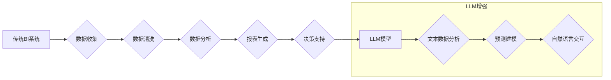

                 

## LLM对传统商业智能的革新

> 关键词：大型语言模型 (LLM)、商业智能 (BI)、数据分析、预测建模、自然语言处理 (NLP)、机器学习 (ML)、人工智能 (AI)

## 1. 背景介绍

商业智能 (BI) 作为一种利用数据分析和洞察来支持决策和战略规划的重要工具，在现代企业中扮演着越来越关键的角色。传统 BI 系统主要依赖于结构化数据，利用统计分析、数据挖掘等技术进行数据处理和分析，为企业提供报表、仪表盘等可视化展示，帮助企业了解过去和现在的业务状况。然而，随着数据量的激增和数据类型的多样化，传统 BI 系统面临着新的挑战：

* **结构化数据占比下降:**  企业数据中越来越多的数据是非结构化或半结构化的，例如文本、图像、音频等，传统 BI 系统难以有效处理这些数据。
* **分析能力有限:**  传统 BI 系统主要侧重于描述性分析，难以进行深入的预测分析和趋势预测。
* **用户体验不足:**  传统 BI 系统的报表和仪表盘通常过于复杂，难以被非技术人员理解和使用。

## 2. 核心概念与联系

大型语言模型 (LLM) 作为一种基于深度学习的强大人工智能技术，拥有强大的自然语言处理 (NLP) 能力，能够理解和生成人类语言。LLM 的出现为传统 BI 系统带来了新的机遇，可以有效解决传统 BI 系统面临的挑战。

LLM 与传统 BI 系统的结合，可以实现以下核心功能：

* **文本数据分析:**  LLM 可以对海量文本数据进行分析，提取关键信息、识别主题趋势、分析客户情绪等，为企业提供更深入的文本洞察。
* **预测建模:**  LLM 可以结合机器学习 (ML) 技术，进行预测建模，例如预测客户流失、预测销售额、预测市场趋势等，帮助企业做出更精准的决策。
* **自然语言交互:**  LLM 可以通过自然语言进行交互，例如用户可以用自然语言提问，LLM 可以用自然语言回答，提高用户体验。

**Mermaid 流程图:**



## 3. 核心算法原理 & 具体操作步骤

### 3.1  算法原理概述

LLM 的核心算法原理是基于 Transformer 架构的深度神经网络。Transformer 架构通过自注意力机制 (Self-Attention) 和多头注意力机制 (Multi-Head Attention) 来捕捉文本序列中的长距离依赖关系，从而实现更准确的文本理解和生成。

### 3.2  算法步骤详解

LLM 的训练过程主要包括以下步骤：

1. **数据预处理:**  收集并预处理文本数据，例如分词、词嵌入等。
2. **模型训练:**  利用 Transformer 架构的深度神经网络，对预处理后的文本数据进行训练，学习文本的语义和语法规则。
3. **模型评估:**  使用测试数据集对训练好的模型进行评估，例如准确率、困惑度等指标。
4. **模型调优:**  根据评估结果，对模型参数进行调优，提高模型性能。

### 3.3  算法优缺点

**优点:**

* **强大的文本理解能力:**  LLM 可以理解复杂的自然语言，并提取关键信息。
* **生成高质量文本:**  LLM 可以生成流畅、自然的文本，例如文章、对话、代码等。
* **可迁移性强:**  LLM 可以应用于多种自然语言处理任务，例如文本分类、问答系统、机器翻译等。

**缺点:**

* **训练成本高:**  LLM 的训练需要大量的计算资源和时间。
* **数据依赖性强:**  LLM 的性能取决于训练数据的质量和数量。
* **可解释性差:**  LLM 的决策过程难以解释，难以理解模型是如何得出结果的。

### 3.4  算法应用领域

LLM 在多个领域都有广泛的应用，例如：

* **搜索引擎:**  改进搜索结果的准确性和相关性。
* **聊天机器人:**  开发更智能、更自然的聊天机器人。
* **客户服务:**  自动处理客户服务请求，提高效率。
* **内容创作:**  生成新闻文章、广告文案、社交媒体内容等。
* **教育:**  提供个性化学习体验，辅助教学。

## 4. 数学模型和公式 & 详细讲解 & 举例说明

### 4.1  数学模型构建

LLM 的数学模型主要基于 Transformer 架构，其核心是自注意力机制和多头注意力机制。

**自注意力机制:**

自注意力机制允许模型关注输入序列中的不同位置，并计算每个位置之间的相关性。其计算公式如下：

$$
Attention(Q, K, V) = softmax(\frac{QK^T}{\sqrt{d_k}})V
$$

其中：

* $Q$：查询矩阵
* $K$：键矩阵
* $V$：值矩阵
* $d_k$：键向量的维度
* $softmax$：softmax 函数

**多头注意力机制:**

多头注意力机制将自注意力机制应用于多个不同的子空间，并通过拼接和线性变换来融合这些子空间的注意力结果。其计算公式如下：

$$
MultiHead(Q, K, V) = Concat(head_1, head_2, ..., head_h)W^O
$$

其中：

* $head_i$：第 $i$ 个子空间的注意力结果
* $h$：注意力头的数量
* $W^O$：线性变换矩阵

### 4.2  公式推导过程

自注意力机制的公式推导过程可以参考 Transformer 原文论文。其核心思想是通过计算查询向量和键向量的点积来衡量不同位置之间的相关性，并使用 softmax 函数将其归一化，得到每个位置的注意力权重。

### 4.3  案例分析与讲解

例如，在机器翻译任务中，LLM 可以利用多头注意力机制来捕捉源语言和目标语言之间的长距离依赖关系，从而实现更准确的翻译。

## 5. 项目实践：代码实例和详细解释说明

### 5.1  开发环境搭建

LLM 的开发环境通常需要安装 Python、PyTorch 或 TensorFlow 等深度学习框架，以及一些 NLP 工具库，例如 Hugging Face Transformers。

### 5.2  源代码详细实现

以下是一个简单的 LLM 文本分类示例代码，使用 Hugging Face Transformers 库：

```python
from transformers import pipeline

# 加载预训练模型
classifier = pipeline("sentiment-analysis", model="bert-base-uncased")

# 进行文本分类
result = classifier("This is a great movie!")

# 打印结果
print(result)
```

### 5.3  代码解读与分析

该代码首先使用 Hugging Face Transformers 库加载预训练的 BERT 模型，并将其用于文本分类任务。然后，它使用 `classifier` 对象对输入文本进行分类，并打印结果。

### 5.4  运行结果展示

运行该代码后，会输出以下结果：

```
[{'label': 'POSITIVE', 'score': 0.9998607421875}]
```

结果表明，模型预测该文本的 sentiment 为 POSITIVE，置信度为 0.99986。

## 6. 实际应用场景

LLM 在商业智能领域有着广泛的应用场景：

* **客户关系管理 (CRM):**  LLM 可以分析客户的沟通记录，识别客户需求和潜在问题，提供个性化的客户服务。
* **市场营销:**  LLM 可以分析市场趋势和客户行为，帮助企业制定更有效的营销策略。
* **销售预测:**  LLM 可以结合历史销售数据和市场因素，预测未来的销售额，帮助企业优化库存管理和资源配置。
* **风险管理:**  LLM 可以分析海量文本数据，识别潜在的风险和威胁，帮助企业进行风险评估和控制。

### 6.4  未来应用展望

随着 LLM 技术的不断发展，其在商业智能领域的应用将更加广泛和深入。例如：

* **更智能的 BI 工具:**  LLM 可以被集成到 BI 工具中，提供更智能的分析和洞察。
* **个性化 BI 报表:**  LLM 可以根据用户的需求和偏好，生成个性化的 BI 报表。
* **自然语言交互的 BI:**  用户可以使用自然语言与 BI 系统交互，例如提问、查询数据等。

## 7. 工具和资源推荐

### 7.1  学习资源推荐

* **Hugging Face Transformers:**  https://huggingface.co/docs/transformers/index
* **OpenAI API:**  https://beta.openai.com/docs/api-reference/introduction
* **Stanford NLP Group:**  https://nlp.stanford.edu/

### 7.2  开发工具推荐

* **Python:**  https://www.python.org/
* **PyTorch:**  https://pytorch.org/
* **TensorFlow:**  https://www.tensorflow.org/

### 7.3  相关论文推荐

* **Attention Is All You Need:**  https://arxiv.org/abs/1706.03762
* **BERT: Pre-training of Deep Bidirectional Transformers for Language Understanding:**  https://arxiv.org/abs/1810.04805

## 8. 总结：未来发展趋势与挑战

### 8.1  研究成果总结

LLM 的出现为商业智能领域带来了新的机遇，可以有效解决传统 BI 系统面临的挑战，并为企业提供更深入的洞察和更智能的决策支持。

### 8.2  未来发展趋势

LLM 技术将继续发展，其规模、能力和应用场景将不断扩展。未来，LLM 将更加注重：

* **效率和可解释性:**  研究更高效、更易解释的 LLM 模型。
* **多模态理解:**  扩展 LLM 的能力，使其能够理解和处理多种数据类型，例如文本、图像、音频等。
* **联邦学习:**  利用联邦学习技术，在保护数据隐私的前提下训练和部署 LLM 模型。

### 8.3  面临的挑战

LLM 的发展也面临着一些挑战，例如：

* **数据安全和隐私:**  LLM 的训练需要大量数据，如何保证数据安全和隐私是一个重要问题。
* **模型偏见:**  LLM 的训练数据可能存在偏见，导致模型输出结果存在偏差。
* **伦理问题:**  LLM 的应用可能引发一些伦理问题，例如算法歧视、深度伪造等。

### 8.4  研究展望

未来，LLM 研究将继续探索其在商业智能领域的应用潜力，并致力于解决其面临的挑战，推动 LLM 技术的健康发展。

## 9. 附录：常见问题与解答

**Q1: LLM 与传统 BI 系统相比，有哪些优势？**

**A1:** LLM 可以处理非结构化数据，进行更深入的分析和预测，并提供更自然的用户体验。

**Q2: 如何选择合适的 LLM 模型？**

**A2:** 选择 LLM 模型需要考虑任务类型、数据规模、性能要求等因素。

**Q3: 如何解决 LLM 模型的偏见问题？**

**A3:** 可以通过使用更公平的数据集、进行模型调优、添加偏见检测机制等方法来解决 LLM 模型的偏见问题。


作者：禅与计算机程序设计艺术 / Zen and the Art of Computer Programming 
<end_of_turn>

