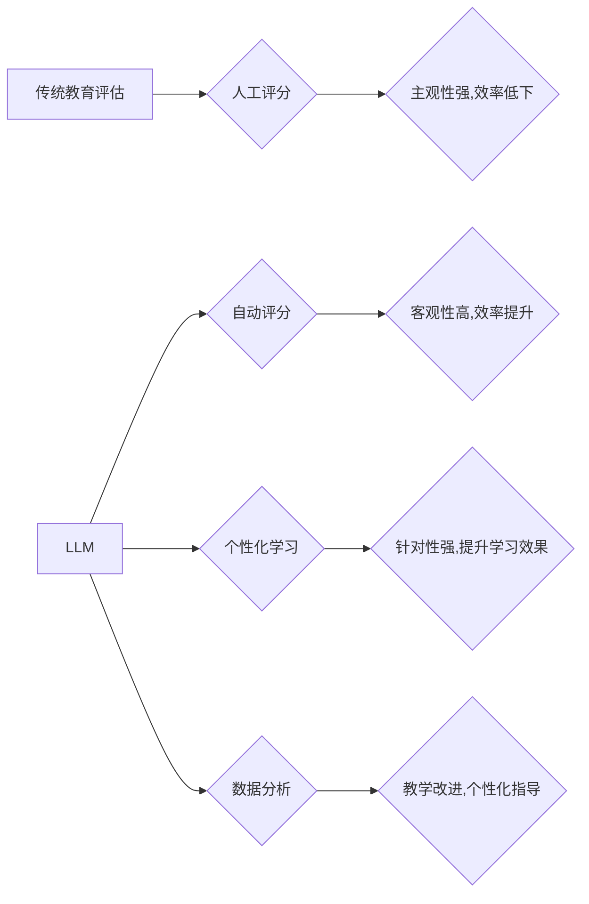

                 

## LLM对传统教育评估方法的革新

> 关键词：大型语言模型 (LLM)、教育评估、人工智能、自动评分、个性化学习、公平性、伦理

## 1. 背景介绍

传统的教育评估方法主要依赖于人工评分，例如笔试、口试和课外作业评判。这些方法虽然经过多年实践验证，但存在一些弊端：

* **主观性强:** 人工评分容易受到老师主观情绪、经验和偏见的影响，导致评分结果不一致和缺乏客观性。
* **效率低下:**  人工评分耗费大量时间和人力资源，难以满足大规模教育评估的需求。
* **缺乏个性化:** 传统评估方法难以针对学生的个性化学习需求提供个性化的反馈和指导。

近年来，随着人工智能技术的快速发展，大型语言模型 (LLM) 应运而生，展现出强大的文本处理能力，为教育评估领域带来了新的机遇。LLM 可以理解和生成人类语言，具备自动评分、个性化学习和数据分析等优势，有潜力革新传统的教育评估方法。

## 2. 核心概念与联系

### 2.1 大型语言模型 (LLM)

LLM 是指训练数据量巨大、参数数量庞大的深度学习模型，能够理解和生成人类语言。通过学习海量文本数据，LLM 掌握了语言的语法、语义和上下文关系，可以执行各种自然语言处理任务，例如文本分类、机器翻译、问答系统和文本生成。

### 2.2 教育评估

教育评估是指对学生学习成果进行系统性、科学性的评价，以了解学生的学习情况、掌握程度和发展趋势，并为教学改进和个性化学习提供依据。传统的教育评估方法主要包括考试、作业、课堂参与和项目评估等。

### 2.3 LLM在教育评估中的应用

LLM 可以应用于教育评估的各个环节，例如：

* **自动评分:** LLM 可以自动评分客观题和部分主观题，提高评分效率和客观性。
* **个性化学习:** LLM 可以根据学生的学习情况和需求，提供个性化的学习建议和反馈。
* **数据分析:** LLM 可以分析学生的学习数据，发现学习规律和问题，为教学改进提供依据。

**Mermaid 流程图**



## 3. 核心算法原理 & 具体操作步骤

### 3.1 算法原理概述

LLM 在教育评估中的应用主要基于自然语言处理 (NLP) 算法，包括：

* **文本分类:** 将学生答案分类到不同的类别，例如正确、错误、部分正确等。
* **文本相似度计算:** 计算学生答案与标准答案的相似度，用于自动评分和个性化学习。
* **文本生成:** 根据学生的学习情况和需求，生成个性化的学习建议和反馈。

这些算法通常基于深度学习模型，例如 Transformer 和 BERT，通过训练海量文本数据，学习语言的语法、语义和上下文关系，从而实现对文本的理解和生成。

### 3.2 算法步骤详解

以自动评分为例，LLM 在教育评估中的具体操作步骤如下：

1. **数据预处理:** 将学生答案和标准答案进行预处理，例如去除停用词、分词、词干提取等。
2. **模型训练:** 使用深度学习模型，例如 Transformer，训练一个文本分类模型，将学生答案分类到不同的类别。
3. **模型评估:** 使用测试数据评估模型的性能，例如准确率、召回率、F1-score等。
4. **模型部署:** 将训练好的模型部署到教育评估平台，用于自动评分。

### 3.3 算法优缺点

**优点:**

* **客观性高:** LLM 的评分结果不受人工主观因素的影响，更加客观和公正。
* **效率提升:** LLM 可以自动评分，大大提高评分效率，节省人力资源。
* **个性化学习:** LLM 可以根据学生的学习情况和需求，提供个性化的学习建议和反馈。

**缺点:**

* **数据依赖:** LLM 的性能依赖于训练数据的质量和数量，如果训练数据不足或质量低，模型性能会受到影响。
* **解释性差:** LLM 的决策过程较为复杂，难以解释模型的评分结果，缺乏透明度。
* **伦理问题:** LLM 在教育评估中的应用可能引发一些伦理问题，例如数据隐私、算法偏见等。

### 3.4 算法应用领域

LLM 在教育评估领域的应用领域广泛，包括：

* **自动批改作业:** 自动批改客观题和部分主观题，提高评分效率和客观性。
* **个性化学习推荐:** 根据学生的学习情况和需求，推荐个性化的学习资源和学习路径。
* **学习进度跟踪:** 分析学生的学习数据，跟踪学生的学习进度和掌握程度，及时发现学习问题。
* **考试模拟:** 生成模拟考试题，帮助学生进行考试准备。

## 4. 数学模型和公式 & 详细讲解 & 举例说明

### 4.1 数学模型构建

LLM 的训练过程本质上是一个优化问题，目标是找到模型参数，使得模型在训练数据上的预测结果与真实标签尽可能接近。常用的数学模型包括：

* **交叉熵损失函数:** 用于分类任务，衡量模型预测结果与真实标签之间的差异。

$$
Loss = - \sum_{i=1}^{N} y_i \log(p_i)
$$

其中：

* $N$ 是样本数量
* $y_i$ 是真实标签
* $p_i$ 是模型预测概率

* **均方误差损失函数:** 用于回归任务，衡量模型预测结果与真实值之间的差异。

$$
Loss = \frac{1}{N} \sum_{i=1}^{N} (y_i - \hat{y}_i)^2
$$

其中：

* $N$ 是样本数量
* $y_i$ 是真实值
* $\hat{y}_i$ 是模型预测值

### 4.2 公式推导过程

LLM 的训练过程通常使用梯度下降算法，通过不断更新模型参数，最小化损失函数的值。梯度下降算法的核心思想是：沿着损失函数的梯度方向更新模型参数，直到找到损失函数的最小值。

梯度下降算法的更新公式如下：

$$
\theta = \theta - \alpha \nabla Loss(\theta)
$$

其中：

* $\theta$ 是模型参数
* $\alpha$ 是学习率
* $\nabla Loss(\theta)$ 是损失函数关于模型参数的梯度

### 4.3 案例分析与讲解

例如，在自动评分任务中，可以使用交叉熵损失函数和梯度下降算法训练一个文本分类模型。训练数据包括学生答案和标准答案，模型的目标是学习将学生答案分类到不同的类别，例如正确、错误、部分正确等。

训练过程中，模型会根据训练数据不断更新参数，使得模型在训练数据上的预测结果与真实标签尽可能接近。最终训练好的模型可以用于自动评分，提高评分效率和客观性。

## 5. 项目实践：代码实例和详细解释说明

### 5.1 开发环境搭建

LLM 的开发环境通常需要安装 Python 和相关的深度学习框架，例如 TensorFlow 或 PyTorch。此外，还需要安装一些自然语言处理库，例如 NLTK 或 spaCy。

### 5.2 源代码详细实现

以下是一个使用 TensorFlow 和 BERT 模型进行文本分类的简单代码示例：

```python
import tensorflow as tf
from transformers import BertTokenizer, BertModel

# 加载预训练模型和词典
tokenizer = BertTokenizer.from_pretrained('bert-base-uncased')
model = BertModel.from_pretrained('bert-base-uncased')

# 定义文本分类模型
class TextClassifier(tf.keras.Model):
    def __init__(self):
        super(TextClassifier, self).__init__()
        self.bert = model
        self.classifier = tf.keras.layers.Dense(2, activation='softmax')

    def call(self, inputs):
        outputs = self.bert(inputs)
        pooled_output = outputs[1][:, 0, :]
        logits = self.classifier(pooled_output)
        return logits

# 实例化模型
model = TextClassifier()

# 定义损失函数和优化器
loss_fn = tf.keras.losses.CategoricalCrossentropy()
optimizer = tf.keras.optimizers.Adam(learning_rate=2e-5)

# 训练模型
# ...

# 评估模型
# ...
```

### 5.3 代码解读与分析

这段代码首先加载预训练的 BERT 模型和词典。然后定义了一个文本分类模型，该模型包含 BERT 模型和一个全连接层。BERT 模型用于提取文本的语义特征，全连接层用于分类。

训练模型时，使用交叉熵损失函数和 Adam 优化器，通过训练数据不断更新模型参数，使得模型在训练数据上的预测结果与真实标签尽可能接近。

### 5.4 运行结果展示

训练完成后，可以使用测试数据评估模型的性能，例如准确率、召回率、F1-score等。

## 6. 实际应用场景

LLM 在教育评估领域的实际应用场景广泛，例如：

* **自动批改作业:** 许多在线学习平台已经开始使用 LLM 自动批改学生的作业，例如编程作业、写作作业等。
* **个性化学习推荐:** 一些教育软件会使用 LLM 分析学生的学习数据，推荐个性化的学习资源和学习路径。
* **考试模拟:** 一些考试模拟软件会使用 LLM 生成模拟考试题，帮助学生进行考试准备。

### 6.4 未来应用展望

未来，LLM 在教育评估领域的应用将更加广泛和深入，例如：

* **更精准的个性化学习:** LLM 可以更加精准地分析学生的学习情况和需求，提供更加个性化的学习建议和反馈。
* **更丰富的学习体验:** LLM 可以生成更加生动有趣的学习内容，例如互动式游戏、虚拟现实体验等，提升学生的学习兴趣和参与度。
* **更公平的教育评估:** LLM 可以帮助消除传统教育评估中的主观性和偏见，实现更加公平的教育评估。

## 7. 工具和资源推荐

### 7.1 学习资源推荐

* **斯坦福大学 NLP课程:** https://web.stanford.edu/class/cs224n/
* **Hugging Face Transformers库文档:** https://huggingface.co/docs/transformers/index
* **OpenAI API文档:** https://beta.openai.com/docs/api-reference

### 7.2 开发工具推荐

* **TensorFlow:** https://www.tensorflow.org/
* **PyTorch:** https://pytorch.org/
* **Jupyter Notebook:** https://jupyter.org/

### 7.3 相关论文推荐

* **BERT: Pre-training of Deep Bidirectional Transformers for Language Understanding:** https://arxiv.org/abs/1810.04805
* **GPT-3: Language Models are Few-Shot Learners:** https://arxiv.org/abs/2005.14165

## 8. 总结：未来发展趋势与挑战

### 8.1 研究成果总结

LLM 在教育评估领域取得了显著的成果，例如提高评分效率、实现个性化学习、提供数据分析等。

### 8.2 未来发展趋势

未来，LLM 在教育评估领域的应用将更加深入和广泛，例如：

* **更精准的个性化学习:** LLM 可以更加精准地分析学生的学习情况和需求，提供更加个性化的学习建议和反馈。
* **更丰富的学习体验:** LLM 可以生成更加生动有趣的学习内容，例如互动式游戏、虚拟现实体验等，提升学生的学习兴趣和参与度。
* **更公平的教育评估:** LLM 可以帮助消除传统教育评估中的主观性和偏见，实现更加公平的教育评估。

### 8.3 面临的挑战

LLM 在教育评估领域的应用也面临一些挑战，例如：

* **数据依赖:** LLM 的性能依赖于训练数据的质量和数量，如果训练数据不足或质量低，模型性能会受到影响。
* **解释性差:** LLM 的决策过程较为复杂，难以解释模型的评分结果，缺乏透明度。
* **伦理问题:** LLM 在教育评估中的应用可能引发一些伦理问题，例如数据隐私、算法偏见等。

### 8.4 研究展望

未来研究需要重点关注以下几个方面：

* **提高训练数据的质量和数量:** 探索新的数据收集和预处理方法，提高训练数据的质量和数量。
* **提升模型的解释性:** 研究新的模型架构和算法，提高模型的解释性，使得模型的评分结果更加透明。
* **解决伦理问题:** 研究 LLM 在教育评估中的伦理问题，制定相应的规范和制度，确保 LLM 的应用安全、公平和可控。

## 9. 附录：常见问题与解答

**Q1: LLM 是否会取代老师？**

A1: LLM 可以帮助老师减轻一些工作负担，例如自动批改作业，但它并不会取代老师。老师仍然是教育的核心，负责指导学生、提供个性化反馈和培养学生的综合素质。

**Q2: LLM 的评分结果是否客观？**

A2: LLM 的评分结果更加客观，但并不完全客观。因为 LLM 的训练数据和模型架构都可能存在偏差，因此评分结果仍然可能受到影响。

**Q3: 如何解决 LLM 算法偏见的问题？**

A3: 

解决 LLM 算法偏见的问题需要从多个方面入手，例如：

* 使用更加多样化的训练数据，减少数据偏差。
* 开发新的算法和模型，降低算法对偏见的影响。
* 定期评估模型的公平性，及时发现和解决偏见问题。


作者：禅与计算机程序设计艺术 / Zen and the Art of Computer Programming<end_of_turn>

