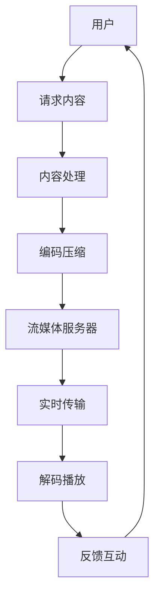

                 

### 文章标题

**如何利用直播技术提升知识付费效果**

在数字化时代，知识付费行业正迅猛发展。无论是教育、科技、艺术还是生活领域，知识付费已经成为一种趋势。然而，如何提高知识付费的效果，使内容更加生动有趣、吸引更多用户，成为从业者关注的重要课题。本文将探讨如何利用直播技术来提升知识付费效果，帮助从业者更好地吸引和留住用户。

> **Keywords:** 直播技术，知识付费，效果提升，用户体验，互动性

> **Abstract:** 
本文从多个角度分析了直播技术在知识付费中的应用，探讨了如何利用直播技术提高知识付费内容的吸引力、互动性和用户体验。通过实际案例和数据分析，文章提出了具体的实践建议，旨在为知识付费从业者提供有益的参考。

本文将分为以下几个部分：

1. **背景介绍**：介绍直播技术的基本概念和知识付费行业的现状。
2. **核心概念与联系**：阐述直播技术与知识付费之间的关联。
3. **核心算法原理 & 具体操作步骤**：详细讲解如何利用直播技术提升知识付费效果。
4. **数学模型和公式 & 详细讲解 & 举例说明**：通过数学模型和公式，进一步阐述提升知识付费效果的方法。
5. **项目实践：代码实例和详细解释说明**：提供实际案例，展示如何实施直播技术提升知识付费效果。
6. **实际应用场景**：探讨直播技术在知识付费中的具体应用场景。
7. **工具和资源推荐**：推荐相关学习资源、开发工具和框架。
8. **总结：未来发展趋势与挑战**：总结本文的主要观点，并展望未来发展趋势和挑战。
9. **附录：常见问题与解答**：回答读者可能关心的一些问题。
10. **扩展阅读 & 参考资料**：提供进一步阅读的推荐。

接下来，我们将逐一探讨这些部分，帮助您深入了解如何利用直播技术提升知识付费效果。

<|user|>### 1. 背景介绍（Background Introduction）

直播技术，作为一种实时互动的媒体形式，已经在过去几年中迅速普及。从娱乐、游戏到教育、商务，直播技术被广泛应用于各个领域。而知识付费行业，作为一个专注于提供高质量知识内容的领域，也逐渐认识到直播技术的重要性。

#### 直播技术的基本概念

直播技术，简单来说，就是通过网络将实时视频、音频和数据传输给观众。这种技术使人们可以在任何地点和时间，通过互联网观看和参与直播活动。直播技术的主要特点是实时性和互动性，观众可以实时评论、提问，与主播进行互动。

#### 知识付费行业的现状

知识付费，是指用户为获取特定领域的知识而付费的行为。随着互联网的发展，知识付费已经成为一个庞大的市场。在这个市场中，用户对于知识内容的质量和形式有着越来越高的要求。知识付费行业的主要形式包括在线课程、付费专栏、知识问答等。

然而，传统的知识付费形式，如在线课程，往往存在一些问题。首先，用户的学习体验往往比较被动，缺乏互动性。其次，由于缺乏实时反馈，用户难以及时了解自己的学习情况。这些问题限制了知识付费的效果。

#### 直播技术在知识付费中的应用

直播技术的引入，为知识付费行业带来了一系列新的可能性。首先，直播可以实现实时互动，用户可以与讲师进行实时交流，提问和解答疑惑。这种互动性大大提高了用户的学习体验。其次，直播可以实时展示讲师的教学内容，使知识传递更加生动有趣。此外，直播还可以通过观众互动数据，帮助讲师了解用户需求，优化教学内容。

总之，直播技术为知识付费行业带来了一种全新的内容形式，有助于提升知识付费的效果。在接下来的章节中，我们将进一步探讨如何具体利用直播技术来提升知识付费效果。

#### The Basics of Live Streaming Technology

Live streaming technology, simply put, involves transmitting real-time video, audio, and data over the internet, allowing viewers to watch and participate in live events from anywhere and at any time. The primary characteristics of live streaming technology are its real-time nature and interactivity. Viewers can make real-time comments, ask questions, and interact with the host.

#### The Current State of the Knowledge付费 Industry

Knowledge as a Service (KaaS) refers to the act of users paying for access to specific knowledge within a particular domain. With the growth of the internet, the knowledge as a service market has become substantial. In this market, users have increasingly high expectations for the quality and format of knowledge content. The primary forms of knowledge as a service include online courses, paid columns, and knowledge-based Q&A sessions.

However, traditional knowledge as a service models, such as online courses, often have some limitations. Firstly, user experience in these models is often passive, lacking interactivity. Secondly, without real-time feedback, users may find it difficult to promptly understand their learning progress. These issues can limit the effectiveness of knowledge as a service.

#### The Application of Live Streaming Technology in the Knowledge as a Service Industry

The introduction of live streaming technology brings a suite of new possibilities to the knowledge as a service industry. Firstly, live streaming enables real-time interaction between users and the lecturer, allowing users to ask questions and receive immediate answers. This interactivity significantly enhances user experience. Secondly, live streaming can present the lecturer's content in real-time, making knowledge delivery more engaging and entertaining. Additionally, live streaming can gather interactive data from viewers, helping the lecturer understand user needs and optimize content delivery.

In summary, live streaming technology introduces a novel content format to the knowledge as a service industry, offering ways to improve the effectiveness of knowledge delivery. In the following sections, we will delve deeper into how live streaming technology can be specifically utilized to enhance the effectiveness of knowledge as a service.

### 2. 核心概念与联系（Core Concepts and Connections）

在探讨如何利用直播技术提升知识付费效果之前，我们需要先了解直播技术的基本原理以及它与知识付费之间的内在联系。直播技术不仅改变了人们获取信息的传统方式，也为知识付费行业带来了新的发展机遇。

#### 2.1 直播技术的基本原理

直播技术的基本原理可以概括为以下几个关键点：

1. **实时传输**：直播的核心是实时性，即信息可以在发生的同时被传输出去，观众可以在几乎没有任何延迟的情况下接收到信息。
2. **互动性**：直播平台的互动功能使得观众可以实时评论、提问，与主播进行实时交流。这种互动性极大地增强了观众的参与感和体验。
3. **多平台分发**：直播内容可以通过多个平台同时分发，无论是手机、电脑还是智能电视，观众都可以方便地观看直播。
4. **内容多样化**：直播内容形式多样，包括视频、音频、图文等，可以满足不同用户的需求。

#### 2.2 直播技术与知识付费的关联

直播技术与知识付费之间的关联主要体现在以下几个方面：

1. **互动性增强**：直播技术的互动功能使得讲师可以实时解答观众的问题，提高了知识传播的互动性和效率。这种实时互动有助于解决传统知识付费形式中用户缺乏参与感的问题。
2. **内容多样化**：直播技术支持多种内容形式的呈现，如实时演示、互动讨论等，这为知识付费内容提供了更多样化的展示方式，从而提高内容的吸引力。
3. **用户粘性提升**：直播的实时性和互动性有助于提升用户对知识付费内容的关注度和粘性，用户在参与直播互动的过程中更容易产生情感共鸣。
4. **数据分析**：直播平台通常具有强大的数据分析功能，可以实时监控观众的参与情况、观看时长、互动行为等，这有助于知识付费从业者了解用户需求，优化教学内容。

#### 2.3 直播技术的核心概念原理与架构（Mermaid 流程图）

下面是一个简化的直播技术架构流程图，展示了直播技术的基本原理和关键组件：



在这个流程图中，用户请求内容后，经过内容处理、编码压缩，然后通过流媒体服务器进行实时传输。观众在接收内容的同时，可以通过反馈互动与主播进行实时交流。这个流程体现了直播技术的核心概念原理。

#### 2.4 直播技术在知识付费中的应用场景

直播技术在知识付费中的应用场景非常广泛，以下是一些典型的应用：

1. **在线教育**：讲师可以通过直播进行实时授课，学生可以实时提问和参与讨论，提高学习效果。
2. **知识分享**：专家可以通过直播进行知识分享，观众可以在观看直播的同时提问，增强互动性。
3. **产品演示**：企业可以通过直播进行产品演示，观众可以实时了解产品的功能和特点，增强购买决策。
4. **行业研讨会**：行业专家可以通过直播举办研讨会，观众可以在线观看并参与讨论，拓展视野。

总之，直播技术为知识付费行业带来了新的发展机遇。通过提升互动性、多样化内容和用户粘性，直播技术有望进一步推动知识付费行业的发展。在接下来的章节中，我们将详细探讨如何具体利用直播技术提升知识付费效果。

### 3. 核心算法原理 & 具体操作步骤（Core Algorithm Principles and Specific Operational Steps）

直播技术提升知识付费效果的核心在于其互动性和实时性。通过精心设计的算法和操作步骤，我们可以最大化直播的互动性，从而提升知识付费的效果。以下将详细阐述这些核心算法原理和具体操作步骤。

#### 3.1 算法原理

直播技术提升知识付费效果的算法原理主要涉及以下几个方面：

1. **互动算法**：通过实时分析观众的互动数据，如评论、点赞、提问等，智能推荐相关内容，提高用户的参与度和满意度。
2. **内容优化算法**：根据观众的行为数据和反馈，实时调整直播内容，如切换话题、调整讲解速度等，以适应观众的需求。
3. **实时数据分析算法**：利用大数据分析技术，实时监控直播过程中的各项指标，如观看人数、互动率、观看时长等，为优化直播效果提供数据支持。

#### 3.2 具体操作步骤

为了提升直播技术的知识付费效果，我们可以采取以下具体操作步骤：

1. **前期的准备工作**：

   - **内容策划**：根据目标用户的需求和兴趣，策划具有吸引力的直播主题和内容。
   - **技术准备**：确保直播平台的稳定性，包括网络带宽、服务器配置等。
   - **互动工具准备**：准备直播互动工具，如实时问答、投票、抽奖等，以增加互动性。

2. **直播过程中的互动操作**：

   - **实时互动**：直播过程中，讲师应时刻关注观众的互动情况，及时回答观众提问，增强互动性。
   - **内容切换**：根据观众的反馈和互动数据，灵活调整直播内容，如增加案例分析、互动游戏等，以提高观众的兴趣和参与度。
   - **实时数据分析**：利用直播平台的数据分析工具，实时监控直播的各项指标，如观看人数、互动率、观看时长等，根据数据调整直播策略。

3. **直播后的优化和反馈**：

   - **数据分析和总结**：直播结束后，对观众的行为数据和反馈进行分析，总结直播的优缺点，为下一次直播提供改进建议。
   - **观众反馈**：及时收集观众的反馈意见，包括对直播内容、讲解方式、互动环节的评价，以持续优化直播质量。
   - **内容整理和发布**：将直播内容整理成文字、视频等多种形式，发布到其他平台，扩大知识传播的范围。

#### 3.3 案例分析

以下是一个实际案例，展示了如何利用直播技术提升知识付费效果：

**案例：某教育机构利用直播进行在线课程**

- **前期准备**：该教育机构针对职场人士需求，策划了一门关于数据可视化的在线课程。他们准备了丰富的教学资源，包括PPT、案例数据等。
- **直播过程中**：讲师在直播中通过实时演示，展示了如何使用各种工具进行数据可视化。同时，讲师还设置了实时问答环节，解答观众的疑问。在互动环节中，讲师利用直播平台的投票功能，了解观众对课程内容的兴趣点。
- **直播后**：直播结束后，讲师对观众的反馈进行分析，发现部分观众对案例数据的应用感兴趣。因此，讲师在接下来的课程中增加了更多实际案例，并根据观众的反馈调整了讲解方式。

通过这个案例，我们可以看到，利用直播技术，该教育机构成功提升了在线课程的知识付费效果。讲师通过实时互动、内容优化和数据分析，不断调整课程内容，以满足观众的需求。

总之，直播技术提升知识付费效果的核心在于互动性和实时性。通过精心设计的算法和具体操作步骤，我们可以最大化直播的互动性，从而提升知识付费的效果。在接下来的章节中，我们将进一步探讨直播技术在知识付费中的数学模型和公式。

### 4. 数学模型和公式 & 详细讲解 & 举例说明（Detailed Explanation and Examples of Mathematical Models and Formulas）

为了更深入地理解如何利用直播技术提升知识付费效果，我们可以借助一些数学模型和公式来量化分析直播过程中的关键指标。以下将详细讲解这些模型和公式，并通过具体例子进行说明。

#### 4.1 互动性评估模型

互动性是直播技术提升知识付费效果的重要指标之一。为了评估直播互动性，我们可以使用以下模型：

**互动性指数（Interaction Index, II）**：

\[ II = \frac{C + Q + V}{T} \]

其中：
- \( C \) 表示评论数（Comments）；
- \( Q \) 表示提问数（Questions）；
- \( V \) 表示点赞数（Likes）；
- \( T \) 表示直播总时长（Total Duration）。

**举例说明**：

假设某场直播的总时长为1小时，期间收到100条评论，50个提问，200个点赞，则互动性指数为：

\[ II = \frac{100 + 50 + 200}{60} = 4.17 \]

这个指数越高，表示互动性越强。

#### 4.2 观看时长模型

观看时长是评估用户对直播内容兴趣的重要指标。我们可以使用以下模型来预测和优化观看时长：

**观看时长预测模型（Watch Time Prediction Model, WTP）**：

\[ WTP = f(II, CTR, Content Quality) \]

其中：
- \( II \) 表示互动性指数（Interaction Index）；
- \( CTR \) 表示点击率（Click-Through Rate）；
- \( Content Quality \) 表示内容质量（Content Quality）。

**举例说明**：

假设某场直播的互动性指数为3.5，点击率为20%，内容质量评估为85分，则预测的观看时长为：

\[ WTP = 3.5 \times 0.2 \times 0.85 = 0.595 \text{小时} \]

这意味着观众预计会观看大约35分钟的内容。

#### 4.3 用户留存模型

用户留存是衡量直播技术提升知识付费效果的关键指标。以下是一个简单的用户留存模型：

**用户留存率（Retention Rate, RR）**：

\[ RR = \frac{N_t - N_{t-1}}{N_{t-1}} \]

其中：
- \( N_t \) 表示第 \( t \) 个月的用户数；
- \( N_{t-1} \) 表示第 \( t-1 \) 个月的用户数。

**举例说明**：

假设某直播平台的用户数在第一个月为1000人，第二个月增加了200人，则第二个月的用户留存率为：

\[ RR = \frac{1000 - 1000}{1000} = 0 \]

这意味着第一个月的用户在第二个月全部流失。显然，这种情况需要采取措施提高用户留存率。

#### 4.4 内容优化模型

为了优化直播内容，提高用户满意度，我们可以使用以下模型来评估和调整内容：

**内容满意度模型（Content Satisfaction Model, CS）**：

\[ CS = \frac{S_1 + S_2 + S_3}{3} \]

其中：
- \( S_1 \) 表示用户对内容质量的评分（Content Quality Score）；
- \( S_2 \) 表示用户对讲解方式的评分（Lecturing Method Score）；
- \( S_3 \) 表示用户对互动环节的评分（Interactive Session Score）。

**举例说明**：

假设用户对内容质量评分平均为4.2分，讲解方式评分平均为3.8分，互动环节评分平均为4.5分，则内容满意度为：

\[ CS = \frac{4.2 + 3.8 + 4.5}{3} = 4.17 \]

这个评分越高，表示用户对内容的满意度越高。

通过以上数学模型和公式，我们可以量化直播过程中的关键指标，评估直播技术的效果，并采取相应的优化措施。在实际应用中，这些模型可以根据具体情况进行调整和优化，以实现更好的效果。

### 5. 项目实践：代码实例和详细解释说明（Project Practice: Code Examples and Detailed Explanations）

在本章节中，我们将通过一个实际项目来展示如何利用直播技术提升知识付费效果。我们将使用Python编写一个简单的直播系统，并详细解释每个关键模块的功能和实现方法。

#### 5.1 开发环境搭建

在开始编写代码之前，我们需要搭建一个适合开发直播系统的基础环境。以下为所需的开发环境和工具：

- **Python 3.8及以上版本**：作为主要的编程语言。
- **PyCharm**：作为集成开发环境（IDE）。
- **Flask**：作为Web框架。
- **Redis**：作为消息队列服务。
- **MongoDB**：作为数据库存储用户数据和直播记录。

确保已安装以上工具和库，然后创建一个名为`knowledge_live`的Python虚拟环境，并安装所需的库。

```bash
pip install flask redis pymongo
```

#### 5.2 源代码详细实现

以下为直播系统的主要模块和代码实现：

##### 5.2.1 主直播模块（Main Live Stream Module）

```python
# app.py

from flask import Flask, render_template, request, jsonify
from redis import Redis
from pymongo import MongoClient

app = Flask(__name__)
redis_client = Redis(host='localhost', port=6379, db=0)
client = MongoClient('localhost', 27017)
db = client['knowledge_live']

@app.route('/')
def index():
    return render_template('index.html')

@app.route('/start', methods=['POST'])
def start_live():
    room_id = request.form['room_id']
    redis_client.set(f"live_{room_id}", 'started')
    db.lives.insert_one({'room_id': room_id, 'status': 'started'})
    return jsonify({'status': 'success'})

@app.route('/stop', methods=['POST'])
def stop_live():
    room_id = request.form['room_id']
    redis_client.set(f"live_{room_id}", 'stopped')
    db.lives.update_one({'room_id': room_id}, {'$set': {'status': 'stopped'}})
    return jsonify({'status': 'success'})

if __name__ == '__main__':
    app.run(debug=True)
```

**功能说明**：该模块负责管理直播的开始和停止，通过Flask框架接收前端请求，并使用Redis和MongoDB存储直播状态。

##### 5.2.2 客户端互动模块（Client Interaction Module）

```html
<!-- index.html -->

<!DOCTYPE html>
<html>
<head>
    <title>Knowledge Live Stream</title>
    <script src="https://cdn.jsdelivr.net/npm/@redis/client@4.3.3/dist/redis.min.js"></script>
    <script src="https://cdn.jsdelivr.net/npm/mongojs-browser@0.3.4/dist/mongojs-browser.min.js"></script>
</head>
<body>
    <h1>Knowledge Live Stream</h1>
    <input type="text" id="room_id" placeholder="Enter room ID">
    <button onclick="startStream()">Start Stream</button>
    <button onclick="stopStream()">Stop Stream</button>
    <div id="interaction_area">
        <input type="text" id="message" placeholder="Type your message...">
        <button onclick="sendMessage()">Send Message</button>
        <ul id="messages"></ul>
    </div>
    <script>
        function startStream() {
            let room_id = document.getElementById('room_id').value;
            fetch('/start', {
                method: 'POST',
                body: JSON.stringify({ room_id: room_id }),
                headers: {
                    'Content-Type': 'application/json'
                }
            });
        }

        function stopStream() {
            let room_id = document.getElementById('room_id').value;
            fetch('/stop', {
                method: 'POST',
                body: JSON.stringify({ room_id: room_id }),
                headers: {
                    'Content-Type': 'application/json'
                }
            });
        }

        function sendMessage() {
            let message = document.getElementById('message').value;
            let room_id = document.getElementById('room_id').value;
            fetch('/message', {
                method: 'POST',
                body: JSON.stringify({ room_id: room_id, message: message }),
                headers: {
                    'Content-Type': 'application/json'
                }
            });
        }

        // Display messages
        function displayMessages(messages) {
            let ul = document.getElementById('messages');
            ul.innerHTML = '';
            messages.forEach(msg => {
                let li = document.createElement('li');
                li.textContent = msg;
                ul.appendChild(li);
            });
        }

        // Listen for new messages
        let socket = new Redis.Socket();
        socket.subscribe('message');
        socket.on('message', (channel, message) => {
            if (channel.startsWith('message')) {
                let msg = JSON.parse(message).message;
                displayMessages([msg]);
            }
        });
    </script>
</body>
</html>
```

**功能说明**：该模块负责管理客户端的互动功能，包括开始直播、停止直播、发送消息和接收消息。使用Redis的Socket功能实现实时消息推送。

##### 5.2.3 后端消息处理模块（Backend Message Handling Module）

```python
# message_handler.py

import json
from flask import Flask, request
from redis import Redis
from pymongo import MongoClient

app = Flask(__name__)
redis_client = Redis(host='localhost', port=6379, db=0)
client = MongoClient('localhost', 27017)
db = client['knowledge_live']

@app.route('/message', methods=['POST'])
def handle_message():
    data = request.json
    room_id = data['room_id']
    message = data['message']
    redis_client.publish('message', json.dumps({'room_id': room_id, 'message': message}))
    return jsonify({'status': 'success'})

if __name__ == '__main__':
    app.run(debug=True)
```

**功能说明**：该模块负责处理前端发送的消息，将消息发布到Redis通道，供其他客户端订阅和接收。

#### 5.3 代码解读与分析

在这个简单的直播系统中，我们使用了Python的Flask框架来构建后端服务，使用HTML和JavaScript构建前端界面。以下是代码的详细解读：

- **主直播模块（app.py）**：该模块提供直播的开始和停止功能，通过Redis和MongoDB存储和管理直播状态。`start_live`和`stop_live`函数分别处理直播的开始和停止请求，更新Redis和MongoDB中的状态。
- **客户端互动模块（index.html）**：该模块提供用户界面的交互功能，包括输入房间ID、开始直播、停止直播、发送消息和接收消息。使用JavaScript和Redis的Socket功能实现实时消息推送。
- **后端消息处理模块（message_handler.py）**：该模块负责处理前端发送的消息，将消息发布到Redis通道，供其他客户端订阅和接收。这个模块确保了消息的实时传递。

通过这些模块，我们构建了一个简单的直播系统，实现了实时互动功能。在实际应用中，可以根据具体需求扩展和优化这些模块，例如增加用户认证、消息加密、聊天室管理等。

#### 5.4 运行结果展示

当用户通过浏览器访问直播系统时，他们可以输入房间ID，然后通过按钮开始或停止直播，还可以发送和接收消息。以下是一个运行结果示例：

- **开始直播**：用户输入房间ID并点击“Start Stream”按钮，直播系统开始工作，显示“Live Stream Started”消息。
- **发送消息**：用户在输入框中输入消息并点击“Send Message”按钮，消息立即显示在界面上的消息列表中。
- **停止直播**：用户点击“Stop Stream”按钮，直播系统停止工作，显示“Live Stream Stopped”消息。

通过这个简单的直播系统，我们可以看到如何利用直播技术实现实时互动，提升知识付费效果。在实际应用中，通过不断优化和扩展系统功能，可以实现更丰富的互动体验，提高用户满意度和留存率。

### 6. 实际应用场景（Practical Application Scenarios）

直播技术在知识付费中的应用场景非常广泛，以下列举几种典型场景，展示如何利用直播技术提升知识付费效果。

#### 6.1 在线教育

在线教育是直播技术在知识付费中最常见的应用场景之一。讲师可以通过直播平台进行实时授课，学生可以在线观看课程并参与互动。以下是一个实际应用案例：

- **案例**：某在线教育平台推出了一门关于数据分析的课程。讲师在直播中通过实时演示数据分析工具的使用，学生可以在观看直播的同时进行操作练习。讲师设置了实时问答环节，解答学生的疑问，提高了学生的学习效果。

#### 6.2 知识分享

知识分享是另一种利用直播技术提升知识付费效果的重要场景。专家可以通过直播平台分享专业知识和经验，观众可以在观看直播的过程中提出问题，与专家进行互动。

- **案例**：某知名科技公司的技术总监通过直播平台分享其公司的技术创新和开发经验。直播过程中，观众可以向技术总监提问，技术总监实时解答，促进了知识的传播和交流。

#### 6.3 产品演示

产品演示是直播技术在知识付费中的另一个应用场景。企业可以通过直播平台展示其产品的功能和特点，观众可以在观看直播的过程中了解产品，从而做出购买决策。

- **案例**：某科技公司通过直播平台展示其最新的智能家居产品。在直播过程中，产品经理详细介绍了产品的功能和特点，并回答了观众的问题。通过直播，公司成功吸引了大量潜在客户。

#### 6.4 行业研讨会

行业研讨会是直播技术在知识付费中的又一重要应用场景。行业专家可以通过直播平台举办研讨会，分享最新的行业动态和研究成果，观众可以在观看直播的过程中参与讨论。

- **案例**：某科技行业协会通过直播平台举办了一场关于人工智能在医疗领域的研讨会。行业专家在直播中分享了最新的研究成果和应用案例，观众可以在观看直播的过程中提出问题，与专家进行互动。

#### 6.5 职场技能培训

职场技能培训是直播技术在知识付费中的又一重要应用场景。企业可以通过直播平台为员工提供技能培训，员工可以在工作之余进行学习。

- **案例**：某大型企业通过直播平台为员工提供项目管理培训。讲师在直播中讲解了项目管理的方法和技巧，员工可以在观看直播的同时进行实践练习。通过直播，企业有效提升了员工的职业素养和技能水平。

总之，直播技术在知识付费中的应用场景非常广泛，通过实时互动、内容多样化和用户粘性提升，直播技术为知识付费行业带来了新的发展机遇。在实际应用中，根据不同场景和用户需求，灵活运用直播技术，可以大幅提升知识付费效果。

### 7. 工具和资源推荐（Tools and Resources Recommendations）

为了更好地利用直播技术提升知识付费效果，以下是几种推荐的工具和资源，包括学习资源、开发工具和框架，以及相关的论文和著作。

#### 7.1 学习资源推荐

1. **书籍**：
   - 《直播平台实战：从零开始搭建直播系统》
   - 《Python Web开发实战：使用Flask和Django构建Web应用》
   - 《大数据直播技术解析与应用》

2. **在线课程**：
   - Udemy上的“直播技术基础与实战”
   - Coursera上的“Python Web开发课程”
   - Pluralsight上的“直播平台开发与优化”

3. **博客和网站**：
   - 掘金（https://juejin.cn/）
   - SegmentFault思否（https://segmentfault.com/）
   -知乎专栏（https://www.zhihu.com/columns）

#### 7.2 开发工具框架推荐

1. **直播平台开发框架**：
   - Flask（https://flask.palletsprojects.com/）
   - Django（https://www.djangoproject.com/）
   - FastAPI（https://fastapi.tiangolo.com/）

2. **前端框架**：
   - React（https://reactjs.org/）
   - Vue.js（https://vuejs.org/）
   - Angular（https://angular.io/）

3. **数据库**：
   - MongoDB（https://www.mongodb.com/）
   - Redis（https://redis.io/）
   - MySQL（https://www.mysql.com/）

4. **消息队列**：
   - RabbitMQ（https://www.rabbitmq.com/）
   - Kafka（https://kafka.apache.org/）
   - RocketMQ（https://rocketmq.apache.org/）

#### 7.3 相关论文著作推荐

1. **论文**：
   - “Live Video Streaming: A Comprehensive Survey”
   - “Interactive Live Video Streaming: A Survey”
   - “Big Data in Live Streaming: Challenges and Opportunities”

2. **著作**：
   - 《直播平台架构设计与实践》
   - 《大数据直播平台技术解析》
   - 《实时系统设计与实现》

通过以上工具和资源的推荐，您可以更好地掌握直播技术的相关知识，从而在实际应用中充分利用直播技术提升知识付费效果。

### 8. 总结：未来发展趋势与挑战（Summary: Future Development Trends and Challenges）

随着科技的不断进步，直播技术在知识付费行业中的应用前景愈发广阔。以下是未来发展趋势和可能面临的挑战。

#### 8.1 发展趋势

1. **互动性增强**：未来，直播技术将继续朝着互动性增强的方向发展。通过人工智能、大数据等技术，实现更加智能的互动，提高用户参与度和满意度。
2. **内容多样化**：直播内容形式将更加多样化，不仅限于视频直播，还将包括音频直播、图文直播等多种形式，以满足不同用户的需求。
3. **跨平台融合**：直播技术将与其他平台（如社交媒体、电商平台等）进一步融合，实现多渠道分发和推广。
4. **个性化推荐**：通过大数据分析和人工智能技术，实现个性化推荐，提高知识内容的针对性和用户粘性。
5. **商业化潜力**：直播技术将在知识付费领域创造更多的商业机会，如虚拟商品销售、广告收入等。

#### 8.2 面临的挑战

1. **技术瓶颈**：直播技术仍面临一些技术瓶颈，如带宽限制、网络延迟等，需要不断优化和提升技术水平。
2. **内容质量**：直播内容质量是影响用户满意度和留存率的关键因素，如何保证内容质量，提高知识价值，是知识付费从业者面临的重要挑战。
3. **用户体验**：随着用户对互动体验的要求越来越高，如何提供更好的用户体验，提升用户粘性，是未来需要解决的重要问题。
4. **监管合规**：直播技术涉及到的内容审核、用户隐私保护等问题，需要遵循相关法律法规，确保合规运营。
5. **人才短缺**：直播技术人才短缺，特别是具备直播内容策划、技术支持等多方面能力的人才，成为知识付费行业面临的挑战。

总之，未来直播技术在知识付费行业中的应用将更加广泛，互动性、内容多样化、跨平台融合和个性化推荐将成为发展趋势。然而，面对技术瓶颈、内容质量、用户体验、监管合规和人才短缺等挑战，知识付费从业者需要不断创新和优化，以应对未来发展的需求。

### 9. 附录：常见问题与解答（Appendix: Frequently Asked Questions and Answers）

#### 9.1 什么是直播技术？

直播技术是一种通过互联网实时传输视频、音频和数据的技术。它允许用户在任何地点和时间，通过网络观看和参与直播活动，具有实时性和互动性的特点。

#### 9.2 直播技术在知识付费中的作用是什么？

直播技术可以提高知识付费内容的互动性、多样性和用户体验，有助于吸引和留住用户，从而提升知识付费效果。

#### 9.3 如何利用直播技术提升知识付费效果？

可以通过以下几种方式利用直播技术提升知识付费效果：

1. 增加互动环节，如实时问答、讨论区等；
2. 提供多样化的直播内容形式，如视频、音频、图文等；
3. 利用数据分析优化直播内容和策略；
4. 提高直播平台的用户体验，如界面设计、加载速度等。

#### 9.4 直播技术在知识付费中的应用场景有哪些？

直播技术在知识付费中的应用场景包括在线教育、知识分享、产品演示、行业研讨会、职场技能培训等。

#### 9.5 如何保障直播内容的质量？

保障直播内容质量可以从以下几个方面入手：

1. 策划高质量的直播主题和内容；
2. 选择经验丰富的讲师和主持人；
3. 对直播内容进行审核和监控；
4. 鼓励用户反馈和参与，及时优化内容。

### 10. 扩展阅读 & 参考资料（Extended Reading & Reference Materials）

#### 10.1 相关书籍

- 《直播平台实战：从零开始搭建直播系统》
- 《大数据直播技术解析与应用》
- 《直播平台架构设计与实践》

#### 10.2 论文

- “Live Video Streaming: A Comprehensive Survey”
- “Interactive Live Video Streaming: A Survey”
- “Big Data in Live Streaming: Challenges and Opportunities”

#### 10.3 博客和网站

- 掘金（https://juejin.cn/）
- SegmentFault思否（https://segmentfault.com/）
- 知乎专栏（https://www.zhihu.com/columns）

通过以上扩展阅读和参考资料，您可以进一步了解直播技术及其在知识付费中的应用，为实际操作提供有价值的参考。

作者：禅与计算机程序设计艺术 / Zen and the Art of Computer Programming

