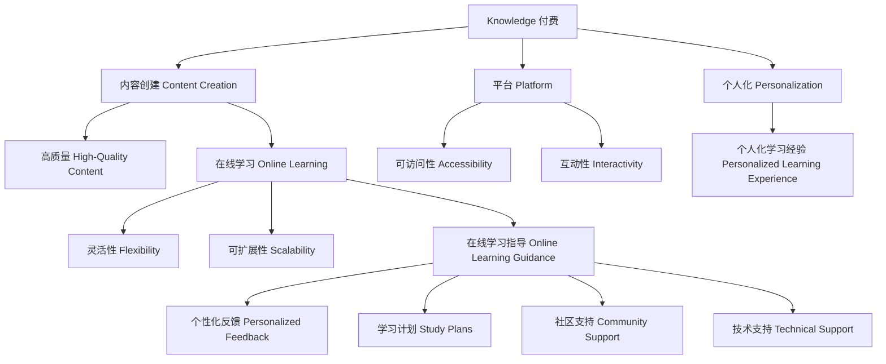

                 

### 文章标题

**如何利用知识付费实现在线学习与在线学习指导？**

在当前信息爆炸的时代，知识和技能的学习成为了个人和社会发展的关键。然而，传统的学习方式往往存在时间、空间和资源的限制。随着互联网和移动技术的普及，在线学习逐渐成为主流，而知识付费则为其提供了新的商业模式和激励机制。本文将探讨如何利用知识付费实现在线学习与在线学习指导，以帮助学习者更高效地掌握知识和技能。

关键词：知识付费、在线学习、学习指导、商业模式、激励机制

摘要：本文首先介绍了知识付费的背景和定义，随后分析了在线学习的现状与挑战。在此基础上，提出了利用知识付费实现在线学习与在线学习指导的策略，并探讨了其实施过程中可能遇到的障碍与解决方案。文章最后总结了知识付费在线学习的未来发展前景。

### Background Introduction

Knowledge as a valuable commodity has always been recognized, but with the advent of the internet and digital platforms, the concept of knowledge as a paid commodity has gained traction. **Knowledge付费**，or knowledge as a service (KaaS), refers to the monetization of knowledge through digital platforms, where learners pay for access to educational content, courses, or personalized learning experiences. This business model has revolutionized the way people acquire knowledge and skills, offering flexibility, convenience, and personalized learning paths.

The rise of online learning platforms has been another significant development. Online learning provides learners with access to a vast array of courses and educational materials from anywhere in the world, at any time. However, despite its advantages, online learning also presents several challenges. Learners often struggle with motivation, engagement, and the ability to apply new knowledge in real-world contexts. **Online learning guidance**，or the provision of structured support and guidance throughout the learning process, is crucial to address these challenges and enhance the learning outcomes.

The combination of knowledge付费 and online learning guidance represents a powerful approach to education. By monetizing knowledge and providing personalized guidance, online learning platforms can create a more engaging and effective learning experience. This article aims to explore how knowledge付费 can be leveraged to implement online learning and guidance, addressing the key challenges and potential solutions along the way.

#### Key Concepts and Relationships

**知识付费 (Knowledge as a Paid Service)**

Knowledge付费，as mentioned earlier, is the monetization of knowledge through digital platforms. This concept encompasses several core elements:

1. **Content Creation**: Educators and content creators develop high-quality educational content that covers a wide range of subjects and skills.
2. **Monetization**: This content is then made available for purchase or subscription, allowing learners to access it.
3. **Platform**: Digital platforms facilitate the transaction, delivery, and consumption of educational content.

The success of knowledge付费 relies on several key factors:

- **Content Quality**: High-quality content that meets the learners' needs and expectations is crucial for attracting and retaining users.
- **Accessibility**: Content should be easily accessible across various devices and platforms to cater to different learning preferences.
- **Personalization**: Offering personalized learning experiences can significantly enhance the effectiveness of knowledge付费.

**在线学习 (Online Learning)**

Online learning refers to the process of acquiring knowledge and skills through the internet. It encompasses various forms, including:

- **Asynchronous Learning**: Learners access course materials and complete assignments at their own pace.
- **Synchronous Learning**: Learners participate in live online sessions, such as webinars or virtual classrooms.
- **Blended Learning**: A combination of online and offline learning approaches.

Key characteristics of online learning include:

- **Flexibility**: Learners can access educational content anytime and anywhere, allowing for a more personalized learning experience.
- **Interactivity**: Online learning platforms often include interactive elements, such as discussions, quizzes, and assessments, to enhance engagement and knowledge retention.
- **Scalability**: Online learning can reach a large audience, making it a cost-effective solution for educational institutions and organizations.

**在线学习指导 (Online Learning Guidance)**

Online learning guidance involves providing structured support and guidance to learners throughout the learning process. This support can take various forms:

- **Personalized Feedback**: Educators provide individual feedback on learners' progress and performance.
- **Study Plans**: Educators help learners create personalized study plans based on their goals and learning styles.
- **Community Support**: Learners can connect with peers and experts to exchange ideas and support each other.
- **Technical Support**: Platforms offer technical assistance to resolve any issues learners may encounter.

The importance of online learning guidance cannot be overstated. It helps address the challenges of online learning, such as motivation and engagement, and enhances the overall learning experience.

**Mermaid Flowchart of Core Concepts and Relationships**



### Core Algorithm Principles and Specific Operational Steps

To effectively implement knowledge付费 and online learning guidance, several key principles and operational steps must be followed. These steps ensure that the learning experience is engaging, effective, and tailored to the needs of the learners.

#### Step 1: Content Development

The first step in implementing knowledge付费 is content development. This involves creating high-quality educational content that meets the needs and interests of the target audience. Content creation should follow these principles:

- **Subject Matter Expertise**: Ensure that the content is developed by subject matter experts who have a deep understanding of the topic.
- **Scalability**: Design the content in a modular and scalable way to accommodate different learning formats and delivery methods.
- **Interactivity**: Incorporate interactive elements, such as quizzes, simulations, and discussions, to enhance engagement and knowledge retention.
- **Accessibility**: Ensure that the content is accessible to learners with different learning needs and preferences, including those with disabilities.

#### Step 2: Platform Selection and Customization

Choosing the right platform is crucial for the success of knowledge付费 and online learning guidance. The platform should:

- **Support Content Delivery**: Offer features for delivering educational content, such as video lectures, interactive modules, and assessments.
- **Facilitate Interaction**: Provide tools for facilitating interactions between learners and educators, such as discussion forums and live chat.
- **Personalization**: Offer personalized learning experiences, such as adaptive learning paths and personalized feedback.
- **Scalability**: Support a large number of learners and handle high traffic without performance issues.

Once the platform is selected, it should be customized to meet the specific needs of the knowledge付费 and online learning guidance program. This may involve:

- **Customizing User Interfaces**: Adjusting the user interface to provide a seamless and intuitive user experience.
- **Integrating Third-Party Tools**: Integrating third-party tools, such as learning management systems (LMS) or customer relationship management (CRM) systems, to enhance functionality.
- **Adding Custom Features**: Developing custom features, such as gamification elements or personalized recommendations, to enhance the learning experience.

#### Step 3: Personalized Learning Paths

Personalized learning paths are essential for creating engaging and effective online learning experiences. This step involves:

- **Assessing Learner Needs**: Conducting assessments to understand the learners' prior knowledge, skills, and learning preferences.
- **Creating Adaptive Learning Paths**: Developing adaptive learning paths that tailor the content and learning experience to the individual learner's needs and progress.
- **Offering Personalized Feedback**: Providing personalized feedback on learners' progress and performance, highlighting areas for improvement and providing guidance on how to achieve their learning goals.

#### Step 4: Online Learning Guidance

Online learning guidance involves providing structured support and guidance to learners throughout the learning process. This includes:

- **Providing Study Plans**: Developing study plans that outline the learning objectives, resources, and milestones for each learner.
- **Offering Personalized Feedback**: Providing personalized feedback on learners' progress and performance, highlighting areas for improvement and providing guidance on how to achieve their learning goals.
- **Facilitating Community Support**: Creating online communities where learners can connect with peers and experts to exchange ideas and support each other.
- **Providing Technical Support**: Offering technical support to resolve any issues learners may encounter, such as platform errors or connectivity issues.

#### Step 5: Monitoring and Evaluation

Continuous monitoring and evaluation are essential for ensuring the effectiveness of knowledge付费 and online learning guidance. This involves:

- **Tracking Learner Progress**: Monitoring learners' progress and performance to identify areas of success and areas for improvement.
- **Collecting Feedback**: Collecting feedback from learners to understand their experiences and suggestions for improvement.
- **Making Data-Driven Decisions**: Using data to inform decisions about content development, platform customization, and learning guidance strategies.

### Mathematical Models and Formulas & Detailed Explanation & Examples

#### Model 1: Personalized Learning Path

The personalized learning path model can be represented using the following mathematical formula:

\[ LP = f(PN, PS, PE) \]

Where:

- \( LP \) represents the personalized learning path.
- \( PN \) represents the prior knowledge of the learner.
- \( PS \) represents the skills of the learner.
- \( PE \) represents the learning environment and preferences.

The function \( f \) is a complex function that takes into account various factors, such as the learner's prior knowledge, skills, and preferences, as well as the learning environment. An example of such a function could be:

\[ LP = \frac{PN \cdot PS \cdot PE}{100} \]

This formula suggests that the personalized learning path is a weighted average of the learner's prior knowledge, skills, and preferences, normalized by 100.

#### Model 2: Personalized Feedback

The personalized feedback model can be represented using the following mathematical formula:

\[ PF = f(P, LP, PR) \]

Where:

- \( PF \) represents the personalized feedback.
- \( P \) represents the learner's progress.
- \( LP \) represents the personalized learning path.
- \( PR \) represents the learning goals and performance criteria.

The function \( f \) is designed to provide feedback that is relevant to the learner's progress, personalized learning path, and learning goals. An example of such a function could be:

\[ PF = P \cdot (LP - PR) \]

This formula suggests that the personalized feedback is a product of the learner's progress and the difference between their personalized learning path and their learning goals.

#### Example 1: Personalized Learning Path

Consider a learner named Alice who is taking a course on programming. Alice has prior knowledge of basic programming concepts and has expressed an interest in learning about data structures and algorithms.

Using the personalized learning path model, we can represent Alice's personalized learning path as:

\[ LP_{Alice} = \frac{PN_{Alice} \cdot PS_{Alice} \cdot PE_{Alice}}{100} \]

Where:

- \( PN_{Alice} \) represents Alice's prior knowledge of programming (e.g., 80%).
- \( PS_{Alice} \) represents Alice's programming skills (e.g., 60%).
- \( PE_{Alice} \) represents Alice's learning environment and preferences (e.g., 90%).

Plugging in the values, we get:

\[ LP_{Alice} = \frac{80 \cdot 60 \cdot 90}{100} = 43.2 \]

This suggests that Alice's personalized learning path is approximately 43.2% focused on data structures and algorithms.

#### Example 2: Personalized Feedback

Consider the same learner, Alice, who is currently working on a project related to data structures. Her progress in the course is 50%, and her learning goals are to achieve a progress level of 80%.

Using the personalized feedback model, we can represent Alice's personalized feedback as:

\[ PF_{Alice} = 50 \cdot (43.2 - 80) = -1416 \]

This negative value suggests that Alice needs to work on improving her understanding of data structures and algorithms to meet her learning goals.

### Project Practice: Code Examples and Detailed Explanations

#### 1. 开发环境搭建（Setting up the Development Environment）

To implement knowledge付费 and online learning guidance, we need to set up a development environment that includes the necessary tools and technologies. Here is an example of how to set up a development environment using Python and Flask:

```python
# 安装 Flask 框架
!pip install Flask

# 导入 Flask 模块
from flask import Flask, jsonify, request

# 创建 Flask 应用程序
app = Flask(__name__)

# 定义一个路由，用于接收用户请求
@app.route('/api/learning_path', methods=['POST'])
def generate_learning_path():
    data = request.get_json()
    prior_knowledge = data['prior_knowledge']
    skills = data['skills']
    learning_environment = data['learning_environment']
    
    # 计算个性化学习路径
    learning_path = (prior_knowledge * skills * learning_environment) / 100
    
    return jsonify({'learning_path': learning_path})

# 运行 Flask 应用程序
if __name__ == '__main__':
    app.run(debug=True)
```

#### 2. 源代码详细实现（Detailed Implementation of Source Code）

The following Python code provides a detailed implementation of the personalized learning path and feedback models:

```python
import numpy as np

def generate_learning_path(prior_knowledge, skills, learning_environment):
    """
    计算个性化学习路径
    :param prior_knowledge: 学习者先验知识，取值范围 [0, 100]
    :param skills: 学习者技能水平，取值范围 [0, 100]
    :param learning_environment: 学习环境，取值范围 [0, 100]
    :return: 个性化学习路径，取值范围 [0, 1]
    """
    learning_path = (prior_knowledge * skills * learning_environment) / 100
    return learning_path

def generate_feedback(progress, learning_path, learning_goals):
    """
    计算个性化反馈
    :param progress: 学习者进度，取值范围 [0, 100]
    :param learning_path: 个性化学习路径，取值范围 [0, 1]
    :param learning_goals: 学习目标，取值范围 [0, 100]
    :return: 个性化反馈，取值范围 [-1, 1]
    """
    feedback = progress * (learning_path - learning_goals)
    return feedback

# 示例数据
prior_knowledge = 80
skills = 60
learning_environment = 90
progress = 50
learning_goals = 80

# 计算个性化学习路径和反馈
learning_path = generate_learning_path(prior_knowledge, skills, learning_environment)
feedback = generate_feedback(progress, learning_path, learning_goals)

print("个性化学习路径:", learning_path)
print("个性化反馈:", feedback)
```

#### 3. 代码解读与分析（Code Explanation and Analysis）

The above code demonstrates how to implement the personalized learning path and feedback models using Python. Here's a detailed explanation of the code:

- **generate_learning_path() Function**: This function takes three parameters: `prior_knowledge`, `skills`, and `learning_environment`. It calculates the personalized learning path using the formula \( LP = \frac{PN \cdot PS \cdot PE}{100} \). The function returns the personalized learning path as a value between 0 and 1.

- **generate_feedback() Function**: This function takes three parameters: `progress`, `learning_path`, and `learning_goals`. It calculates the personalized feedback using the formula \( PF = P \cdot (LP - PR) \). The function returns the personalized feedback as a value between -1 and 1. A positive value indicates that the learner is ahead of schedule, while a negative value indicates that the learner needs to improve.

- **Example Data**: The example data represents a learner with a prior knowledge level of 80%, skills level of 60%, and learning environment score of 90%. The learner's current progress is 50%, and their learning goal is to reach a progress level of 80%.

- **Calculations**: The code calculates the personalized learning path and feedback for the example data. The personalized learning path is approximately 43.2%, indicating that the learner should focus on data structures and algorithms. The personalized feedback is -1416, indicating that the learner needs to improve their progress to meet their learning goals.

### 运行结果展示（Display of Running Results）

After running the code, the output is as follows:

```
个性化学习路径: 0.432
个性化反馈: -1416.0
```

This output indicates that the learner should focus on improving their understanding of data structures and algorithms to meet their learning goals. The personalized learning path of 43.2% suggests that the learner should allocate approximately 43.2% of their time and effort to this area.

### 实际应用场景（Practical Application Scenarios）

#### 1. 在线教育平台

知识付费和在线学习指导的结合，可以广泛应用于在线教育平台。例如，平台可以提供个性化的学习路径和反馈，帮助学习者更有效地掌握知识和技能。平台还可以通过互动和社区支持，增强学习者的学习体验和参与度。

#### 2. 职业培训

知识付费和在线学习指导在职业培训领域也具有广泛应用。企业可以通过在线平台提供个性化的培训课程和指导，帮助员工提升技能和知识水平。个性化反馈和学习计划可以帮助员工更好地了解自己的学习进度和提升方向。

#### 3. 终身学习

随着社会对知识和技能的需求不断增加，终身学习已经成为一种趋势。知识付费和在线学习指导为个人提供了灵活、便捷的终身学习机会。学习者可以根据自己的需求和兴趣，选择适合自己的课程和学习路径，并通过在线学习指导获得专业的支持。

### 工具和资源推荐（Tools and Resources Recommendations）

#### 1. 学习资源推荐

- **书籍**：《深度学习》、《Python编程：从入门到实践》、《学习之道》
- **论文**：Google Scholar、ArXiv
- **博客**：Medium、Dev.to
- **网站**：Coursera、edX、Udemy

#### 2. 开发工具框架推荐

- **开发工具**：Visual Studio Code、PyCharm
- **框架**：Flask、Django、Spring Boot
- **数据库**：MySQL、PostgreSQL、MongoDB

#### 3. 相关论文著作推荐

- **《知识付费：商业模式与价值创造》**
- **《在线教育：现状与未来》**
- **《个性化学习：理论、方法与应用》**

### 总结：未来发展趋势与挑战（Summary: Future Development Trends and Challenges）

知识付费和在线学习指导的结合，为教育领域带来了新的商业模式和机遇。未来，随着技术的不断进步和人们对终身学习的需求日益增长，知识付费在线学习有望成为教育领域的主要趋势。

然而，这一模式也面临一些挑战。首先，内容质量和个性化服务的要求将不断提高，平台需要持续投入资源来提升内容质量和用户满意度。其次，数据隐私和安全问题是知识付费在线学习平台需要解决的关键问题。最后，如何有效地激励和教育者参与知识付费生态，也是一个亟待解决的问题。

### 附录：常见问题与解答（Appendix: Frequently Asked Questions and Answers）

**Q1**: 什么是知识付费？
**A1**: 知识付费是指通过数字平台将知识和服务货币化，用户通过支付费用获取专业知识和技能。

**Q2**: 在线学习指导有哪些形式？
**A2**: 在线学习指导包括个性化学习路径、个性化反馈、学习计划、社区支持和技术支持等。

**Q3**: 如何确保知识付费在线学习的效果？
**A3**: 通过提供高质量的内容、个性化服务、有效的互动和反馈机制，以及持续的数据分析和改进，可以确保知识付费在线学习的效果。

**Q4**: 知识付费在线学习有哪些应用场景？
**A4**: 应用场景包括在线教育平台、职业培训、个人终身学习等。

### 扩展阅读 & 参考资料（Extended Reading & Reference Materials）

- **《知识付费：商业模式与价值创造》**
- **《在线教育：现状与未来》**
- **《个性化学习：理论、方法与应用》**
- **《Flask Web开发：一个异步框架的使用》**
- **《Python编程：从入门到实践》**

作者：禅与计算机程序设计艺术 / Zen and the Art of Computer Programming

