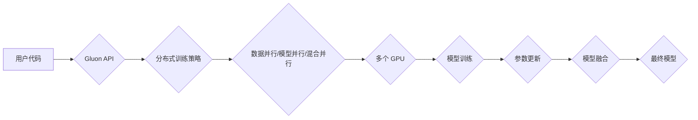

                 

## MXNet 分布式训练：在多 GPU 上训练模型

> 关键词：MXNet, 分布式训练, 多 GPU, 深度学习, 并行计算, 性能优化

## 1. 背景介绍

深度学习模型的规模不断增长，训练这些庞大模型需要大量的计算资源和时间。单机 GPU 的计算能力已经难以满足训练大型模型的需求，因此分布式训练成为深度学习领域的重要研究方向。分布式训练通过将模型参数和数据分布到多个 GPU 或机器上，并行计算，从而显著缩短训练时间，提高训练效率。

MXNet 是一个开源的深度学习框架，支持多种分布式训练策略，例如数据并行、模型并行和混合并行。本文将深入探讨 MXNet 在多 GPU 上进行分布式训练的原理、算法和实践，并提供详细的代码示例和应用场景分析。

## 2. 核心概念与联系

### 2.1 分布式训练策略

分布式训练主要分为以下几种策略：

* **数据并行 (Data Parallelism):** 将训练数据分割到多个 GPU 上，每个 GPU 训练一个模型副本，并最终将模型参数进行平均。
* **模型并行 (Model Parallelism):** 将模型参数分割到多个 GPU 上，每个 GPU 负责训练模型的一部分，并通过通信机制进行参数更新。
* **混合并行 (Hybrid Parallelism):** 将数据并行和模型并行结合起来，以提高训练效率。

### 2.2 MXNet 分布式训练架构

MXNet 的分布式训练架构基于 **Gluon** API，提供了一套简洁易用的接口，方便用户进行分布式训练。



## 3. 核心算法原理 & 具体操作步骤

### 3.1 算法原理概述

MXNet 的分布式训练算法基于 **异步梯度更新** 和 **参数服务器** 的模式。

* **异步梯度更新:** 每个 GPU 独立地计算梯度，并异步地更新模型参数。这种异步更新方式可以减少通信开销，提高训练效率。
* **参数服务器:** 一个专门的节点负责存储模型参数，并接收来自各个 GPU 的梯度更新。

### 3.2 算法步骤详解

1. **数据分割:** 将训练数据分割到多个 GPU 上，每个 GPU 负责训练一部分数据。
2. **模型复制:** 将模型复制到每个 GPU 上，每个 GPU 拥有一个独立的模型副本。
3. **梯度计算:** 每个 GPU 使用其分配的数据进行模型训练，并计算梯度。
4. **梯度更新:** 每个 GPU 将其计算的梯度异步地发送到参数服务器。
5. **参数服务器更新:** 参数服务器接收来自各个 GPU 的梯度更新，并更新模型参数。
6. **模型融合:** 每个 GPU 从参数服务器拉取最新的模型参数，并更新其本地模型副本。
7. **重复步骤 3-6:** 迭代训练，直到模型收敛。

### 3.3 算法优缺点

**优点:**

* **高并行度:** 可以充分利用多个 GPU 的计算资源，显著缩短训练时间。
* **灵活性和扩展性:** 支持多种分布式训练策略，可以根据实际需求进行调整。
* **易于使用:** MXNet 提供了简洁易用的 API，方便用户进行分布式训练。

**缺点:**

* **通信开销:** 异步梯度更新虽然可以减少通信开销，但仍然存在一定的通信开销，可能会影响训练效率。
* **模型并行复杂度:** 模型并行的实现较为复杂，需要考虑模型的划分和参数更新机制。

### 3.4 算法应用领域

MXNet 的分布式训练算法广泛应用于以下领域:

* **图像识别:** 训练大型图像识别模型，例如 ResNet、Inception 等。
* **自然语言处理:** 训练大型语言模型，例如 BERT、GPT 等。
* **语音识别:** 训练大型语音识别模型，例如 Wav2Vec、Tacotron 等。
* **推荐系统:** 训练大型推荐系统模型，例如 Collaborative Filtering、Deep Learning Recommender 等。

## 4. 数学模型和公式 & 详细讲解 & 举例说明

### 4.1 数学模型构建

假设我们有一个深度学习模型 $f(x; \theta)$，其中 $x$ 是输入数据，$\theta$ 是模型参数。我们的目标是找到最优参数 $\theta$，使得模型在训练数据上的损失函数最小化。

损失函数通常定义为模型预测值与真实值之间的差值，例如均方误差 (MSE) 或交叉熵 (Cross-Entropy)。

### 4.2 公式推导过程

使用梯度下降算法来优化模型参数。梯度下降算法的基本思想是沿着梯度方向更新模型参数，直到损失函数最小化。

梯度下降公式:

$$\theta = \theta - \eta \nabla_{\theta} L(f(x; \theta), y)$$

其中:

* $\theta$ 是模型参数
* $\eta$ 是学习率
* $\nabla_{\theta} L(f(x; \theta), y)$ 是损失函数 $L$ 对参数 $\theta$ 的梯度

### 4.3 案例分析与讲解

假设我们有一个简单的线性回归模型，目标是预测房价。模型输入特征包括房屋面积和房间数量，输出是房价。

损失函数为均方误差:

$$L(f(x; \theta), y) = \frac{1}{n} \sum_{i=1}^{n} (f(x_i; \theta) - y_i)^2$$

其中:

* $n$ 是训练样本数量
* $x_i$ 是第 $i$ 个样本的特征
* $y_i$ 是第 $i$ 个样本的真实房价
* $f(x_i; \theta)$ 是模型预测的第 $i$ 个样本的房价

梯度下降公式:

$$\theta = \theta - \eta \frac{1}{n} \sum_{i=1}^{n} (f(x_i; \theta) - y_i) x_i$$

## 5. 项目实践：代码实例和详细解释说明

### 5.1 开发环境搭建

* 安装 Python 3.6 或更高版本
* 安装 MXNet 库: `pip install mxnet`
* 安装 CUDA 和 cuDNN (如果使用 GPU 训练)

### 5.2 源代码详细实现

```python
import mxnet as mx

# 定义模型
def create_model():
    # ... 模型定义代码 ...

# 加载训练数据
train_data = mx.io.ImageRecordIter(
    path_imgrec='train.rec',
    label_width=1,
    batch_size=32,
    data_shape=(3, 224, 224),
    shuffle=True,
)

# 创建训练器
model = create_model()
trainer = mx.Trainer(model.collect_params(), optimizer='sgd',
                    learning_rate=0.01, momentum=0.9)

# 开始训练
for epoch in range(10):
    for batch in train_data:
        # 前向传播
        output = model(batch.data)
        # 计算损失
        loss = mx.metric.MSE()
        loss.update(batch.label, output)
        # 反向传播
        loss.compute()
        # 更新参数
        trainer.step(batch.data.shape[0])
        # 打印损失
        print(f'Epoch: {epoch}, Loss: {loss.get()}')
```

### 5.3 代码解读与分析

* **模型定义:** 使用 MXNet 的 Gluon API 定义深度学习模型。
* **数据加载:** 使用 `mx.io.ImageRecordIter` 加载训练数据。
* **训练器创建:** 使用 `mx.Trainer` 创建训练器，指定优化器、学习率和动量。
* **训练循环:** 迭代训练，计算损失、反向传播和更新参数。

### 5.4 运行结果展示

训练完成后，可以评估模型在测试集上的性能，例如准确率、召回率等。

## 6. 实际应用场景

MXNet 的分布式训练功能广泛应用于各种深度学习场景，例如:

* **图像分类:** 训练大型图像分类模型，例如 ResNet、Inception 等，用于识别物体、场景和人物。
* **自然语言处理:** 训练大型语言模型，例如 BERT、GPT 等，用于文本分类、情感分析、机器翻译等任务。
* **语音识别:** 训练大型语音识别模型，例如 Wav2Vec、Tacotron 等，用于语音转文本和语音合成。

### 6.4 未来应用展望

随着深度学习模型规模的不断增长，分布式训练将变得更加重要。未来，MXNet 将继续发展新的分布式训练策略和技术，以更好地支持大型模型的训练和部署。

## 7. 工具和资源推荐

### 7.1 学习资源推荐

* MXNet 官方文档: https://mxnet.apache.org/
* MXNet 分布式训练教程: https://mxnet.apache.org/tutorials/dist_train.html
* 深度学习书籍: "Deep Learning" by Ian Goodfellow, Yoshua Bengio, and Aaron Courville

### 7.2 开发工具推荐

* Jupyter Notebook: https://jupyter.org/
* VS Code: https://code.visualstudio.com/

### 7.3 相关论文推荐

* "Deep Learning with Distributed Data Parallel" by Dean et al.
* "Parameter Server: A Distributed Machine Learning System" by Li et al.

## 8. 总结：未来发展趋势与挑战

### 8.1 研究成果总结

MXNet 的分布式训练功能已经取得了显著的成果，能够有效地训练大型深度学习模型，并应用于各种实际场景。

### 8.2 未来发展趋势

* **更高效的分布式训练算法:** 研究更有效的分布式训练算法，例如混合并行、模型并行等，以进一步提高训练效率。
* **更灵活的分布式训练框架:** 开发更灵活的分布式训练框架，支持多种硬件平台和分布式部署模式。
* **自动化分布式训练:** 研究自动化分布式训练工具，简化分布式训练的配置和部署过程。

### 8.3 面临的挑战

* **通信开销:** 分布式训练中通信开销仍然是一个挑战，需要进一步优化通信机制。
* **模型并行复杂度:** 模型并行的实现较为复杂，需要考虑模型的划分和参数更新机制。
* **硬件资源限制:** 分布式训练需要大量的硬件资源，成本较高。

### 8.4 研究展望

未来，分布式训练将继续是深度学习领域的重要研究方向，MXNet 将继续致力于开发更强大、更易用的分布式训练工具，推动深度学习技术的进步。

## 9. 附录：常见问题与解答

* **如何选择合适的分布式训练策略?**

选择合适的分布式训练策略取决于模型的规模、数据量和硬件资源等因素。

* **如何优化分布式训练的性能?**

可以通过优化通信机制、模型并行策略和硬件资源配置等方式优化分布式训练的性能。

* **如何调试分布式训练程序?**

可以使用日志记录、监控工具和调试技巧等方法调试分布式训练程序。


作者：禅与计算机程序设计艺术 / Zen and the Art of Computer Programming 
<end_of_turn>

