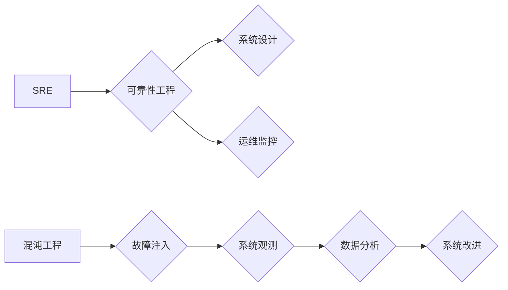

                 

## SRE混沌工程应用实践

> 关键词：SRE, 混沌工程, 可靠性工程, 系统稳定性, 故障演练, 容错设计, 持续交付, 观测与监控

## 1. 背景介绍

在当今数字化时代，软件系统日益复杂，其可靠性和稳定性对业务运营至关重要。传统的软件开发模式难以应对系统规模的不断扩大和业务需求的快速变化，因此，Site Reliability Engineering (SRE) 应运而生。SRE 是一种将软件工程和运维工程相结合的实践，旨在提高软件系统的可靠性、可用性和可扩展性。

混沌工程 (Chaos Engineering) 作为 SRE 的重要组成部分，旨在通过在生产环境中故意引入故障来测试系统的鲁棒性，并提前发现潜在的风险。它强调通过实验和数据驱动的方式，不断提升系统的可靠性。

## 2. 核心概念与联系

### 2.1  SRE 核心概念

SRE 核心概念包括：

* **可靠性 (Reliability):** 系统能够持续稳定地提供服务的能力。
* **可用性 (Availability):** 系统在特定时间段内能够正常运行和响应请求的能力。
* **可扩展性 (Scalability):** 系统能够根据需求动态调整资源，以满足不断变化的负载。
* **可观测性 (Observability):** 系统能够提供足够的日志、指标和跟踪信息，以便于监控和诊断问题。

### 2.2  混沌工程核心概念

混沌工程的核心概念包括：

* **有意引入故障:** 通过模拟各种故障场景，测试系统的容错能力。
* **数据驱动决策:** 基于实验结果，不断优化系统设计和运营策略。
* **持续改进:** 将混沌工程纳入日常开发流程，持续提升系统的可靠性。

### 2.3  SRE 与混沌工程的联系

SRE 和混沌工程相互补充，共同构成了构建可靠软件系统的关键实践。SRE 提供了可靠性工程的框架和工具，而混沌工程则为 SRE 提供了一种更有效的方式来测试和验证系统的可靠性。

**Mermaid 流程图**



## 3. 核心算法原理 & 具体操作步骤

### 3.1  算法原理概述

混沌工程的核心算法原理是基于随机性、概率性和可控性。通过设计和执行一系列的故障注入实验，可以模拟各种潜在的系统故障，并观察系统的响应和恢复能力。

### 3.2  算法步骤详解

1. **定义目标:** 明确混沌工程实验的目标，例如测试系统的容错能力、识别潜在的单点故障等。
2. **选择故障类型:** 根据目标和系统特性，选择合适的故障类型，例如网络延迟、服务不可用、数据丢失等。
3. **设计实验方案:** 确定实验的范围、时间、频率和注入方式，并制定相应的监控和恢复策略。
4. **注入故障:** 在控制的环境下，按照实验方案注入故障，并记录系统的响应和恢复情况。
5. **分析结果:** 分析实验数据，识别系统中的潜在问题和瓶颈，并制定相应的改进方案。
6. **迭代改进:** 根据实验结果，不断优化实验方案和系统设计，提升系统的可靠性。

### 3.3  算法优缺点

**优点:**

* **提高系统可靠性:** 通过模拟故障，提前发现和解决潜在问题，提升系统的抗风险能力。
* **降低故障影响:** 通过容错设计和故障演练，降低故障发生时的影响，保障业务连续性。
* **促进团队协作:** 混沌工程需要跨部门协作，促进开发、运维和安全团队之间的沟通和合作。

**缺点:**

* **需要专业知识:** 设计和执行混沌工程实验需要一定的专业知识和经验。
* **可能带来风险:** 如果实验设计不当，可能会导致系统不可用或数据丢失。
* **需要投入成本:** 混沌工程需要投入一定的资源和时间，例如开发工具、监控系统和人员培训。

### 3.4  算法应用领域

混沌工程适用于各种类型的软件系统，例如：

* **电商平台:** 测试系统在高并发访问和突发流量下的稳定性。
* **金融系统:** 验证系统在安全性和数据完整性方面的可靠性。
* **医疗系统:** 确保系统在关键时刻能够正常运行，保障患者安全。

## 4. 数学模型和公式 & 详细讲解 & 举例说明

### 4.1  数学模型构建

混沌工程中常用的数学模型包括：

* **概率模型:** 用于描述故障发生的概率和频率。
* **统计模型:** 用于分析故障数据，识别趋势和异常情况。
* **网络模型:** 用于模拟系统中的网络拓扑结构和数据流。

### 4.2  公式推导过程

例如，可以使用泊松分布来描述故障发生的概率。泊松分布的概率质量函数为：

$$P(k) = \frac{e^{-\lambda} \lambda^k}{k!}$$

其中：

* $P(k)$ 是在给定时间内发生 $k$ 次故障的概率。
* $\lambda$ 是平均故障率。

### 4.3  案例分析与讲解

假设一个系统平均每小时发生 0.5 次故障，我们可以使用泊松分布计算在 1 小时内发生 1 次故障的概率：

$$P(1) = \frac{e^{-0.5} 0.5^1}{1!} \approx 0.303$$

这意味着在 1 小时内发生 1 次故障的概率约为 30.3%。

## 5. 项目实践：代码实例和详细解释说明

### 5.1  开发环境搭建

混沌工程实验可以使用多种工具和平台进行搭建，例如：

* **Chaos Monkey:** Netflix 开发的开源工具，用于在生产环境中随机注入故障。
* **Gremlin:** 一款商业化的混沌工程平台，提供更丰富的故障注入功能和监控工具。

### 5.2  源代码详细实现

以下是一个使用 Chaos Monkey 注入网络延迟故障的简单代码示例：

```python
from chaos_monkey import ChaosMonkey

# 创建 Chaos Monkey 实例
monkey = ChaosMonkey()

# 设置故障类型为网络延迟
monkey.inject_latency(target="api.example.com", delay=1000)

# 监控系统状态
# ...
```

### 5.3  代码解读与分析

这段代码首先创建了一个 Chaos Monkey 实例，然后使用 `inject_latency()` 方法注入网络延迟故障。

* `target` 参数指定了目标服务，例如 API 地址。
* `delay` 参数指定了延迟时间，单位为毫秒。

### 5.4  运行结果展示

运行这段代码后，Chaos Monkey 会在目标服务上注入网络延迟故障，并记录系统的响应时间和错误率等指标。

## 6. 实际应用场景

### 6.1  电商平台

在电商平台中，混沌工程可以用于测试系统在高并发访问和突发流量下的稳定性。例如，可以模拟大量用户同时访问商品页面，测试系统的性能和容错能力。

### 6.2  金融系统

在金融系统中，混沌工程可以用于验证系统在安全性和数据完整性方面的可靠性。例如，可以模拟网络攻击或数据丢失场景，测试系统的防御能力和数据恢复机制。

### 6.3  医疗系统

在医疗系统中，混沌工程可以确保系统在关键时刻能够正常运行，保障患者安全。例如，可以模拟医院网络故障或设备故障场景，测试系统的容错能力和备份机制。

### 6.4  未来应用展望

随着云计算、微服务和人工智能等技术的不断发展，混沌工程的应用场景将更加广泛。未来，混沌工程将更加智能化、自动化和数据驱动化，能够更好地帮助企业构建可靠、可扩展和可持续发展的软件系统。

## 7. 工具和资源推荐

### 7.1  学习资源推荐

* **书籍:**

    * The Phoenix Project: A Novel About IT, DevOps, and Helping Your Business Win
    * Site Reliability Engineering: How Google Runs Production Systems
    * Chaos Engineering: Building Resilience in the Face of Uncertainty

* **博客:**

    * Google SRE Blog: https://sre.googleblog.com/
    * Netflix Tech Blog: https://netflixtechblog.com/

### 7.2  开发工具推荐

* **Chaos Monkey:** https://github.com/Netflix/chaosmonkey
* **Gremlin:** https://gremlin.com/
* **LitmusChaos:** https://litmuschaos.io/

### 7.3  相关论文推荐

* **Chaos Engineering: Building Resilience in the Face of Uncertainty:** https://arxiv.org/abs/1908.04833
* **The Site Reliability Workbook:** https://sre.googleblog.com/2019/01/the-site-reliability-workbook.html

## 8. 总结：未来发展趋势与挑战

### 8.1  研究成果总结

混沌工程已经成为构建可靠软件系统的关键实践，并取得了显著的成果。通过混沌工程，企业能够提前发现和解决潜在问题，提升系统的抗风险能力，降低故障影响，保障业务连续性。

### 8.2  未来发展趋势

未来，混沌工程将朝着以下方向发展：

* **更加智能化:** 利用人工智能和机器学习技术，自动识别故障模式和优化实验方案。
* **更加自动化:** 通过自动化工具和平台，简化混沌工程实验流程，降低人力成本。
* **更加数据驱动化:** 更加注重数据分析和可视化，帮助企业更好地理解系统的行为和风险。

### 8.3  面临的挑战

混沌工程也面临一些挑战，例如：

* **缺乏标准化:** 目前混沌工程缺乏统一的标准和规范，不同企业和团队的实践存在差异。
* **技能缺口:** 缺乏经验丰富的混沌工程专家，需要加强人才培养和培训。
* **文化阻力:** 一些企业缺乏对混沌工程的理解和支持，需要改变传统的开发和运维文化。

### 8.4  研究展望

未来，需要继续加强混沌工程的研究和实践，推动其标准化、自动化和数据驱动化发展，帮助企业构建更加可靠、可扩展和可持续发展的软件系统。

## 9. 附录：常见问题与解答

### 9.1  混沌工程是否会破坏生产环境？

混沌工程实验的设计和执行需要谨慎，以确保不会对生产环境造成不可逆转的损害。通过合理的实验方案、监控策略和恢复机制，可以有效降低混沌工程带来的风险。

### 9.2  混沌工程的成本是否很高？

混沌工程的成本取决于具体的实验方案和工具选择。一些开源工具和平台可以降低成本，而商业化的混沌工程平台则提供更丰富的功能和支持。

### 9.3  混沌工程适合所有类型的软件系统吗？

混沌工程适用于各种类型的软件系统，但需要根据系统的特性和业务需求进行调整。对于一些关键系统，需要更加谨慎地设计和执行混沌工程实验。


作者：禅与计算机程序设计艺术 / Zen and the Art of Computer Programming 
<end_of_turn>

