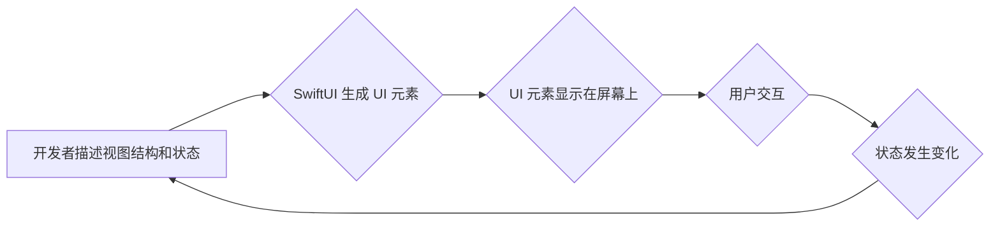

                 

## iOS SwiftUI应用开发

> 关键词：SwiftUI, iOS开发, 跨平台, 声明式UI, 视图编程, Apple生态

## 1. 背景介绍

随着移动互联网的蓬勃发展，iOS平台作为全球领先的移动操作系统之一，吸引着越来越多的开发者加入其生态系统。传统的iOS开发框架，如 UIKit，虽然功能强大，但其复杂性和学习曲线却让许多开发者望而却步。为了简化开发流程，提升开发效率，苹果公司于 2019 年推出了 SwiftUI，一个全新的声明式UI框架。

SwiftUI 彻底改变了 iOS 应用开发的方式，它基于视图编程的概念，允许开发者以简洁、易读的代码描述应用程序的用户界面。与 UIKit 相比，SwiftUI 拥有以下优势：

* **声明式编程:** 开发者不再需要手动管理视图的生命周期和状态，而是通过描述视图的结构和行为，让 SwiftUI 自动处理细节。
* **简洁易用:** SwiftUI 的语法更加简洁，代码更易于理解和维护。
* **跨平台:** SwiftUI 可以用于开发 iOS、macOS、watchOS 和 tvOS 应用，简化了跨平台开发。
* **实时预览:** SwiftUI 提供了实时预览功能，开发者可以在代码编辑器中实时看到 UI 的变化，大大提高了开发效率。

## 2. 核心概念与联系

SwiftUI 的核心概念是 **视图** 和 **状态**。视图是应用程序的用户界面元素，例如按钮、文本框、图像等。状态是视图的属性，例如文本内容、颜色、位置等。

SwiftUI 的工作原理是，开发者通过代码描述视图的结构和状态，然后 SwiftUI 会根据这些描述生成对应的 UI 元素。当状态发生变化时，SwiftUI 会自动更新相应的视图。

**Mermaid 流程图:**



## 3. 核心算法原理 & 具体操作步骤

SwiftUI 的核心算法是 **视图树** 和 **状态管理**。

### 3.1  算法原理概述

视图树是 SwiftUI 应用 UI 的结构化表示，它将所有视图组织成一个树形结构。根视图是应用程序的顶级视图，它包含所有其他视图。

状态管理是 SwiftUI 应用的核心机制，它负责跟踪应用程序的状态变化，并根据状态变化更新相应的视图。SwiftUI 使用 **@State**、**@ObservedObject** 和 **@EnvironmentObject** 等属性来管理状态。

### 3.2  算法步骤详解

1. **创建视图树:** 开发者通过代码描述视图的结构，构建视图树。
2. **绑定状态:** 将状态属性绑定到视图，以便状态变化时自动更新视图。
3. **更新视图树:** 当状态发生变化时，SwiftUI 会根据状态变化更新视图树。
4. **渲染视图:** SwiftUI 会将更新后的视图树渲染到屏幕上。

### 3.3  算法优缺点

**优点:**

* **简洁易用:** SwiftUI 的视图树和状态管理机制非常简洁易用，开发者可以快速理解和使用。
* **高效:** SwiftUI 的视图树和状态管理机制非常高效，可以快速响应状态变化，并更新相应的视图。
* **可维护性:** SwiftUI 的视图树和状态管理机制可以使应用程序的代码更加可维护。

**缺点:**

* **学习曲线:** 虽然 SwiftUI 的语法简洁，但对于初学者来说，理解视图树和状态管理机制可能需要一些时间。
* **第三方库支持:** SwiftUI 的第三方库支持相对较少，一些功能可能需要开发者自己实现。

### 3.4  算法应用领域

SwiftUI 的应用领域非常广泛，包括：

* **移动应用开发:** SwiftUI 可以用于开发 iOS、macOS、watchOS 和 tvOS 应用。
* **桌面应用开发:** SwiftUI 可以用于开发 macOS 桌面应用。
* **Web 应用开发:** SwiftUI 可以用于开发基于 Web 的应用。

## 4. 数学模型和公式 & 详细讲解 & 举例说明

SwiftUI 的核心算法原理可以抽象为数学模型，例如视图树的构建可以看作是树形结构的构建，状态管理可以看作是状态转移图的构建。

**4.1  数学模型构建**

* **视图树:** 可以用树形结构表示，每个节点代表一个视图，每个节点都有其属性和子节点。
* **状态转移图:** 可以用状态机表示，每个状态代表应用程序的状态，每个状态之间有转移关系，转移关系由状态变化触发。

**4.2  公式推导过程**

由于 SwiftUI 的核心算法原理是基于视图树和状态管理，其公式推导过程主要涉及以下几个方面：

* **视图树的构建:** 可以用递归算法描述，根据视图的描述信息构建视图树。
* **状态转移图的构建:** 可以用状态机模型描述，根据状态变化规则构建状态转移图。
* **视图更新算法:** 可以用差分算法描述，根据状态变化，找出需要更新的视图，并更新其属性。

**4.3  案例分析与讲解**

例如，一个简单的应用程序，包含一个文本框和一个按钮。当用户输入文本并点击按钮时，应用程序会显示输入的文本。

* **视图树:** 根视图包含文本框和按钮两个子视图。
* **状态转移图:** 初始状态为文本框为空，用户输入文本后，状态变为文本框不为空。点击按钮后，状态变为显示文本。
* **视图更新算法:** 当状态变为文本框不为空时，文本框的文本内容会被更新。当状态变为显示文本时，应用程序会显示文本框的内容。

## 5. 项目实践：代码实例和详细解释说明

### 5.1  开发环境搭建

* 安装 Xcode 14 或更高版本。
* 创建一个新的 SwiftUI 项目。

### 5.2  源代码详细实现

```swift
import SwiftUI

struct ContentView: View {
    @State private var name = ""

    var body: some View {
        VStack {
            TextField("请输入您的姓名", text: $name)
                .padding()
            Button("显示姓名") {
                print("您的姓名是: \(name)")
            }
            .padding()
        }
    }
}

struct ContentView_Previews: PreviewProvider {
    static var previews: some View {
        ContentView()
    }
}
```

### 5.3  代码解读与分析

* `@State private var name = ""`: 定义一个名为 `name` 的状态变量，用于存储用户输入的姓名。`@State` 属性修饰符表示该变量的状态变化会触发视图更新。
* `TextField("请输入您的姓名", text: $name)`: 创建一个文本框，用于用户输入姓名。`text: $name` 将文本框的内容绑定到 `name` 状态变量。
* `Button("显示姓名") { ... }`: 创建一个按钮，点击按钮时会执行代码块。
* `print("您的姓名是: \(name)")`: 打印用户输入的姓名。

### 5.4  运行结果展示

运行代码后，会显示一个包含文本框和按钮的界面。用户可以在文本框中输入姓名，点击按钮后，应用程序会打印用户输入的姓名。

## 6. 实际应用场景

SwiftUI 的应用场景非常广泛，例如：

* **社交媒体应用:** 可以使用 SwiftUI 开发具有流畅交互体验的社交媒体应用，例如展示动态、消息、用户资料等。
* **电商应用:** 可以使用 SwiftUI 开发具有精美界面和便捷购物流程的电商应用，例如商品展示、购物车、订单管理等。
* **教育应用:** 可以使用 SwiftUI 开发具有互动性和趣味性的教育应用，例如学习游戏、知识问答、在线课程等。

### 6.4  未来应用展望

随着 SwiftUI 的不断发展，其应用场景将会更加广泛。例如：

* **AR/VR 应用:** SwiftUI 可以用于开发 AR/VR 应用，提供更加沉浸式的用户体验。
* **跨平台应用:** SwiftUI 可以用于开发跨平台应用，简化开发流程，提高开发效率。
* **人工智能应用:** SwiftUI 可以与人工智能技术结合，开发具有智能化功能的应用。

## 7. 工具和资源推荐

### 7.1  学习资源推荐

* **Apple 官方文档:** https://developer.apple.com/documentation/swiftui
* **SwiftUI by Tutorials:** https://www.hackingwithswift.com/quick-start/swiftui
* **SwiftUI Lab:** https://www.swift-lab.com/

### 7.2  开发工具推荐

* **Xcode:** https://developer.apple.com/xcode/

### 7.3  相关论文推荐

* **Declarative UI Programming with SwiftUI:** https://www.usenix.org/system/files/conference/usenixsecurity21/sec21-paper_chen.pdf

## 8. 总结：未来发展趋势与挑战

### 8.1  研究成果总结

SwiftUI 作为苹果公司推出的全新 UI 框架，其简洁易用、跨平台、实时预览等优势，为 iOS 应用开发带来了革命性的改变。

### 8.2  未来发展趋势

* **更强大的状态管理机制:** SwiftUI 的状态管理机制将会更加强大，支持更复杂的应用场景。
* **更丰富的第三方库支持:** SwiftUI 的第三方库支持将会更加丰富，提供更多功能和组件。
* **更完善的调试工具:** SwiftUI 的调试工具将会更加完善，帮助开发者更方便地调试代码。

### 8.3  面临的挑战

* **学习曲线:** 尽管 SwiftUI 的语法简洁，但对于初学者来说，理解视图树和状态管理机制可能需要一些时间。
* **第三方库支持:** SwiftUI 的第三方库支持相对较少，一些功能可能需要开发者自己实现。
* **性能优化:** SwiftUI 的性能优化仍然是一个挑战，需要开发者不断学习和实践。

### 8.4  研究展望

未来，SwiftUI 将继续发展壮大，成为 iOS 应用开发的主流框架。开发者需要不断学习和掌握 SwiftUI 的最新技术，才能在移动应用开发领域取得成功。

## 9. 附录：常见问题与解答

* **Q: SwiftUI 和 UIKit 的区别是什么？**

A: SwiftUI 是一个声明式 UI 框架，而 UIKit 是一个基于事件驱动的 UI 框架。SwiftUI 更简洁易用，而 UIKit 更灵活强大。

* **Q: 如何学习 SwiftUI？**

A: 可以参考 Apple 官方文档、SwiftUI by Tutorials、SwiftUI Lab 等学习资源。

* **Q: SwiftUI 的性能如何？**

A: SwiftUI 的性能已经得到了很大的提升，但仍然需要开发者进行性能优化。


作者：禅与计算机程序设计艺术 / Zen and the Art of Computer Programming 
<end_of_turn>

