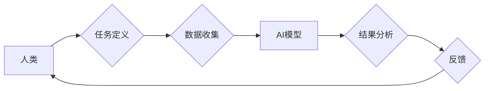

                 

## 人类-AI协作：增强人类智力

> 关键词：人工智能、协作、人类智力、算法、机器学习、深度学习、应用场景

### 1. 背景介绍

人工智能（AI）技术近年来发展迅速，从语音识别、图像识别到自然语言处理等领域取得了突破性进展。AI的强大能力引发了人们对未来工作的担忧，但也为人类提供了 unprecedented 的机遇。 

人类和AI的协作，将成为未来社会发展的重要趋势。AI可以帮助人类完成重复性、繁琐性工作，释放人类的创造力和智力，从而提升人类整体的生产力和生活质量。

### 2. 核心概念与联系

**2.1 人类-AI协作的本质**

人类-AI协作的核心在于将人类的智慧和AI的计算能力有机结合，形成一个互补、协同的系统。人类擅长理解复杂的情境、进行创造性思考和决策，而AI擅长处理海量数据、识别模式和进行精准计算。

**2.2 协作模式**

人类-AI协作模式多种多样，主要包括：

* **人类在控制中:** 人类制定目标和策略，AI辅助执行任务，人类对AI的输出进行监督和修正。
* **AI辅助决策:** AI提供数据分析和预测结果，辅助人类做出更明智的决策。
* **协同工作:** 人类和AI共同完成复杂任务，各自发挥优势，相互补充。

**2.3 架构图**



### 3. 核心算法原理 & 具体操作步骤

**3.1 算法原理概述**

人类-AI协作的核心算法通常基于机器学习和深度学习技术。

* **机器学习:**  通过训练模型，使模型能够从数据中学习规律，并对新数据进行预测或分类。
* **深度学习:**  一种更高级的机器学习方法，利用多层神经网络模拟人类大脑的学习过程，能够处理更复杂的数据和任务。

**3.2 算法步骤详解**

1. **数据收集:** 收集与任务相关的各种数据，例如文本、图像、音频等。
2. **数据预处理:** 对收集到的数据进行清洗、转换和格式化，使其适合模型训练。
3. **模型选择:** 根据任务需求选择合适的机器学习或深度学习模型。
4. **模型训练:** 使用训练数据训练模型，调整模型参数，使其能够准确地完成任务。
5. **模型评估:** 使用测试数据评估模型的性能，例如准确率、召回率等。
6. **模型部署:** 将训练好的模型部署到实际应用场景中，用于处理新的数据。

**3.3 算法优缺点**

* **优点:** 能够自动学习和改进，处理海量数据，提高效率和准确性。
* **缺点:** 需要大量的数据进行训练，训练过程耗时和耗能，模型解释性较差。

**3.4 算法应用领域**

* **自然语言处理:** 语音识别、机器翻译、文本摘要、情感分析等。
* **计算机视觉:** 图像识别、物体检测、图像分类、人脸识别等。
* **推荐系统:** 产品推荐、内容推荐、个性化服务等。
* **医疗诊断:** 病情预测、疾病诊断、辅助治疗等。

### 4. 数学模型和公式 & 详细讲解 & 举例说明

**4.1 数学模型构建**

机器学习模型通常可以看作是输入数据和输出结果之间的映射关系。

例如，线性回归模型可以表示为：

$$y = w_0 + w_1x_1 + w_2x_2 + ... + w_nx_n + \epsilon$$

其中：

* $y$ 是输出结果
* $x_1, x_2, ..., x_n$ 是输入特征
* $w_0, w_1, w_2, ..., w_n$ 是模型参数
* $\epsilon$ 是误差项

**4.2 公式推导过程**

模型参数的学习过程通常使用梯度下降算法。梯度下降算法的目标是找到使模型预测误差最小化的参数值。

梯度下降算法的迭代公式为：

$$w_i = w_i - \alpha \frac{\partial Loss}{\partial w_i}$$

其中：

* $w_i$ 是模型参数
* $\alpha$ 是学习率
* $Loss$ 是模型预测误差

**4.3 案例分析与讲解**

假设我们有一个线性回归模型，用于预测房价。输入特征包括房屋面积、房间数量、地理位置等。

通过训练模型，我们可以得到模型参数，例如房屋面积每增加1平方米，房价增加1000元。

然后，我们可以使用这个模型预测新房子的房价。

### 5. 项目实践：代码实例和详细解释说明

**5.1 开发环境搭建**

* Python 3.x
* TensorFlow 或 PyTorch 等深度学习框架
* Jupyter Notebook 或 VS Code 等开发工具

**5.2 源代码详细实现**

```python
import tensorflow as tf

# 定义模型
model = tf.keras.models.Sequential([
  tf.keras.layers.Dense(64, activation='relu', input_shape=(784,)),
  tf.keras.layers.Dense(10, activation='softmax')
])

# 编译模型
model.compile(optimizer='adam',
              loss='sparse_categorical_crossentropy',
              metrics=['accuracy'])

# 训练模型
model.fit(x_train, y_train, epochs=10)

# 评估模型
loss, accuracy = model.evaluate(x_test, y_test)
print('Loss:', loss)
print('Accuracy:', accuracy)
```

**5.3 代码解读与分析**

* 代码首先定义了一个简单的深度学习模型，包含两层全连接层。
* 然后，使用 Adam 优化器和交叉熵损失函数对模型进行编译。
* 接着，使用训练数据对模型进行训练，训练10个 epochs。
* 最后，使用测试数据评估模型的性能。

**5.4 运行结果展示**

运行结果会显示模型在训练和测试集上的损失值和准确率。

### 6. 实际应用场景

**6.1 医疗诊断**

AI可以辅助医生进行疾病诊断，例如分析医学影像，识别肿瘤，预测患者的风险。

**6.2 金融风险管理**

AI可以分析金融数据，识别欺诈行为，预测市场风险，帮助金融机构进行风险管理。

**6.3 自动驾驶**

AI可以帮助汽车感知周围环境，做出驾驶决策，实现自动驾驶。

**6.4 未来应用展望**

随着AI技术的不断发展，人类-AI协作将在更多领域得到应用，例如教育、娱乐、艺术等。

### 7. 工具和资源推荐

**7.1 学习资源推荐**

* **在线课程:** Coursera, edX, Udacity 等平台提供丰富的AI课程。
* **书籍:** 《深度学习》、《机器学习实战》等书籍。
* **开源项目:** TensorFlow, PyTorch 等开源深度学习框架。

**7.2 开发工具推荐**

* **Python:** 广泛用于AI开发的编程语言。
* **Jupyter Notebook:** 用于编写和执行Python代码的交互式环境。
* **VS Code:** 功能强大的代码编辑器。

**7.3 相关论文推荐**

* **《ImageNet Classification with Deep Convolutional Neural Networks》**
* **《Attention Is All You Need》**
* **《BERT: Pre-training of Deep Bidirectional Transformers for Language Understanding》**

### 8. 总结：未来发展趋势与挑战

**8.1 研究成果总结**

近年来，AI技术取得了显著进展，在图像识别、自然语言处理等领域取得了突破性成果。

**8.2 未来发展趋势**

* **更强大的模型:** 研究更深、更复杂的深度学习模型，提高模型的性能和泛化能力。
* **更广泛的应用:** 将AI技术应用到更多领域，例如医疗、教育、金融等。
* **更安全的AI:** 研究如何确保AI系统的安全性和可靠性。

**8.3 面临的挑战**

* **数据获取和隐私问题:** AI模型需要大量的数据进行训练，如何获取高质量的数据，并保护用户隐私是一个挑战。
* **模型解释性和可信度:** 深度学习模型的内部机制复杂，难以解释模型的决策过程，如何提高模型的解释性和可信度是一个重要问题。
* **伦理和社会影响:** AI技术的快速发展引发了伦理和社会问题，例如算法偏见、工作岗位替代等，需要认真思考和解决。

**8.4 研究展望**

未来，AI研究将继续朝着更智能、更安全、更可解释的方向发展。人类和AI的协作将成为未来社会发展的重要趋势，共同创造更美好的未来。

### 9. 附录：常见问题与解答

**9.1 如何选择合适的AI模型？**

选择合适的AI模型需要根据具体任务需求和数据特点进行选择。

**9.2 如何解决AI模型的过拟合问题？**

可以使用正则化技术、交叉验证等方法来解决AI模型的过拟合问题。

**9.3 如何评估AI模型的性能？**

可以使用准确率、召回率、F1-score等指标来评估AI模型的性能。


作者：禅与计算机程序设计艺术 / Zen and the Art of Computer Programming 
<end_of_turn>

