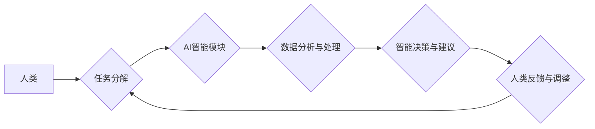

                 

## 人类-AI协作：增强人类潜能与AI能力的融合发展趋势分析预测展望

> 关键词：人工智能、人类-AI协作、协同智能、增强人类潜能、AI能力提升、未来趋势、应用场景

### 1. 背景介绍

人工智能（AI）技术的飞速发展，正在深刻地改变着人类社会各个领域。从自动驾驶到医疗诊断，从个性化教育到科学研究，AI技术的应用场景日益广泛。然而，AI技术的发展也引发了人们对未来工作模式、社会结构和人类自身价值的思考。

当前，AI技术主要集中在解决特定问题和执行特定任务上，而人类则拥有更广阔的认知能力、创造力、情感智能和复杂问题解决能力。因此，将人类和AI的优势结合起来，实现人类-AI协作，成为未来发展的重要趋势。

人类-AI协作是指人类与人工智能系统共同完成任务，双方相互补充、协同工作，以实现超越单一智能的更高效、更智能的目标。这种协作模式强调的是人类和AI的互补性，而不是替代性。

### 2. 核心概念与联系

**2.1 核心概念**

* **人工智能 (AI):** 指计算机模拟人类智能行为的能力，包括学习、推理、决策、感知和语言理解等。
* **协同智能 (CI):** 指人类和人工智能系统共同完成任务，双方相互补充、协同工作，以实现超越单一智能的更高效、更智能的目标。
* **增强人类潜能 (HPE):** 指通过AI技术辅助人类提升认知能力、创造力、效率和解决复杂问题的能力。

**2.2 架构图**



**2.3 联系分析**

人类-AI协作的核心是将人类的智慧和AI的计算能力有机结合起来。

* **人类提供:** 
    * 高阶认知能力：例如，战略规划、创意思考、复杂问题分析等。
    * 情感智能：例如，理解和回应人类情感，建立信任关系等。
    * 伦理判断：例如，评估AI决策的道德性和社会影响等。
* **AI提供:**
    * 海量数据处理能力：例如，快速分析和挖掘数据中的规律和模式。
    * 逻辑推理和决策能力：例如，根据数据和规则进行准确的预测和决策。
    * 自动化执行能力：例如，重复性任务的自动化执行，提高效率。

通过这种协作模式，人类可以专注于更具创造性和战略性的工作，而AI可以帮助人类处理繁琐、重复性的工作，从而提高整体效率和创造力。

### 3. 核心算法原理 & 具体操作步骤

**3.1 算法原理概述**

人类-AI协作的核心算法原理主要包括：

* **强化学习 (Reinforcement Learning):** AI系统通过与环境交互，学习最佳策略以获得最大奖励。
* **迁移学习 (Transfer Learning):** 利用已训练好的模型，在新的任务上进行快速学习。
* **知识图谱 (Knowledge Graph):** 建立知识的结构化表示，帮助AI系统理解和推理复杂关系。
* **自然语言处理 (NLP):** 理解和生成人类语言，实现人机自然交互。

**3.2 算法步骤详解**

1. **任务分解:** 将复杂任务分解成多个子任务，并确定每个子任务的责任主体（人类或AI）。
2. **数据收集与预处理:** 收集相关数据，并进行清洗、转换和特征提取等预处理工作。
3. **模型训练:** 根据任务需求，选择合适的算法模型，并利用训练数据进行模型训练。
4. **智能决策与建议:** AI系统根据训练好的模型，对输入数据进行分析和推理，并给出智能决策和建议。
5. **人类反馈与调整:** 人类根据AI的建议，进行评估和反馈，并对模型进行调整和优化。

**3.3 算法优缺点**

* **优点:**
    * 提高效率和准确性: AI可以自动化执行重复性任务，并提供更准确的分析和预测。
    * 增强人类能力: AI可以帮助人类处理复杂数据，提升决策能力和创造力。
    * 拓展应用场景: 人类-AI协作可以应用于更广泛的领域，例如医疗、教育、金融等。
* **缺点:**
    * 算法偏差: AI模型可能存在算法偏差，导致决策结果不公平或不准确。
    * 数据安全: 人类-AI协作需要共享大量数据，因此数据安全问题需要得到重视。
    * 伦理挑战: AI决策的伦理责任需要得到明确界定，避免出现负面社会影响。

**3.4 算法应用领域**

* **医疗保健:** AI辅助诊断、个性化治疗方案、药物研发等。
* **教育:** 智能辅导系统、个性化学习路径、自动批改作业等。
* **金融:** 风险评估、欺诈检测、投资决策等。
* **制造业:** 自动化生产、质量控制、 predictive maintenance等。

### 4. 数学模型和公式 & 详细讲解 & 举例说明

**4.1 数学模型构建**

人类-AI协作可以抽象为一个博弈模型，其中人类和AI是参与者，任务是游戏目标，决策是参与者的行动。

**4.2 公式推导过程**

假设人类和AI分别拥有决策权重为 $w_h$ 和 $w_a$，则最终决策结果可以表示为：

$$
D = w_h * D_h + w_a * D_a
$$

其中，$D$ 是最终决策结果，$D_h$ 是人类的决策，$D_a$ 是AI的决策。

**4.3 案例分析与讲解**

例如，在自动驾驶场景中，人类驾驶员和自动驾驶系统可以协同完成驾驶任务。

* 人类驾驶员负责决策高层目标，例如目的地和路线规划。
* 自动驾驶系统负责处理低层任务，例如车辆控制、避障和路径规划。

决策权重可以根据驾驶环境和任务复杂度进行动态调整。

### 5. 项目实践：代码实例和详细解释说明

**5.1 开发环境搭建**

* 操作系统: Ubuntu 20.04
* 编程语言: Python 3.8
* 深度学习框架: TensorFlow 2.0

**5.2 源代码详细实现**

```python
import tensorflow as tf

# 定义神经网络模型
model = tf.keras.models.Sequential([
    tf.keras.layers.Dense(128, activation='relu', input_shape=(10,)),
    tf.keras.layers.Dense(64, activation='relu'),
    tf.keras.layers.Dense(1, activation='sigmoid')
])

# 编译模型
model.compile(optimizer='adam', loss='binary_crossentropy', metrics=['accuracy'])

# 训练模型
model.fit(x_train, y_train, epochs=10)

# 预测结果
predictions = model.predict(x_test)
```

**5.3 代码解读与分析**

* 代码首先定义了一个简单的多层感知机模型，用于分类任务。
* 模型使用ReLU激活函数，并采用Adam优化器进行训练。
* 训练过程使用训练数据进行迭代，并根据损失函数进行模型参数更新。
* 训练完成后，可以使用测试数据进行模型评估。

**5.4 运行结果展示**

训练完成后，可以查看模型的训练和测试精度，评估模型的性能。

### 6. 实际应用场景

**6.1 医疗诊断辅助**

AI可以辅助医生进行疾病诊断，例如分析医学影像数据，识别肿瘤、骨折等异常情况。

**6.2 个性化教育**

AI可以根据学生的学习进度和特点，提供个性化的学习内容和辅导，提高学习效率。

**6.3 自动化客服**

AI可以用于构建智能客服系统，自动回复用户常见问题，提高客户服务效率。

**6.4 科学研究加速**

AI可以帮助科学家分析海量科研数据，发现新的规律和知识，加速科研进展。

**6.5 未来应用展望**

随着AI技术的不断发展，人类-AI协作将在更多领域得到应用，例如：

* **智能制造:** AI可以帮助实现智能工厂，提高生产效率和产品质量。
* **智慧城市:** AI可以用于城市管理、交通调度、环境监测等，打造更加智慧、便捷的城市生活。
* **个性化体验:** AI可以根据用户的喜好和需求，提供个性化的产品和服务体验。

### 7. 工具和资源推荐

**7.1 学习资源推荐**

* **在线课程:** Coursera, edX, Udacity 等平台提供丰富的AI相关课程。
* **书籍:** 《深度学习》、《人工智能：一种现代方法》等经典书籍。
* **开源社区:** TensorFlow, PyTorch 等深度学习框架的官方网站和社区论坛。

**7.2 开发工具推荐**

* **编程语言:** Python, R 等数据科学和机器学习常用的编程语言。
* **深度学习框架:** TensorFlow, PyTorch, Keras 等深度学习框架。
* **数据可视化工具:** Matplotlib, Seaborn, Plotly 等数据可视化工具。

**7.3 相关论文推荐**

* **AlphaGo论文:** DeepMind, 2016. Mastering the game of Go with deep neural networks and tree search.
* **BERT论文:** Devlin, J., Chang, M. W., Lee, K., & Toutanova, K. (2018). BERT: Pre-training of deep bidirectional transformers for language understanding.

### 8. 总结：未来发展趋势与挑战

**8.1 研究成果总结**

近年来，人类-AI协作取得了显著进展，在多个领域取得了突破性成果。例如，AlphaGo战胜人类围棋世界冠军，表明AI在复杂决策问题上的能力已经达到人类水平。

**8.2 未来发展趋势**

* **更智能的AI:** AI技术的不断发展，将使AI系统更加智能，能够更好地理解和响应人类需求。
* **更广泛的应用场景:** 人类-AI协作将应用于更多领域，例如医疗、教育、金融、制造等。
* **更紧密的协作模式:** 人类和AI将实现更紧密的协作模式，例如，人类提供创意和灵感，AI提供数据分析和执行能力。

**8.3 面临的挑战**

* **算法偏差:** AI模型可能存在算法偏差，导致决策结果不公平或不准确。
* **数据安全:** 人类-AI协作需要共享大量数据，因此数据安全问题需要得到重视。
* **伦理挑战:** AI决策的伦理责任需要得到明确界定，避免出现负面社会影响。

**8.4 研究展望**

未来，需要进一步研究如何解决算法偏差、数据安全和伦理挑战，确保人类-AI协作的健康发展。同时，还需要探索更紧密、更智能的协作模式，充分发挥人类和AI的优势，共同创造更加美好的未来。

### 9. 附录：常见问题与解答

**9.1 如何避免AI算法偏差？**

* 使用多样化的训练数据，确保数据代表真实世界。
* 定期评估模型的公平性，并进行调整和优化。
* 采用透明的算法设计，方便进行审计和解释。

**9.2 如何保障数据安全？**

* 使用加密技术保护数据传输和存储。
* 严格控制数据访问权限，防止数据泄露。
* 定期进行安全评估和漏洞修复。

**9.3 如何解决AI决策的伦理问题？**

* 制定明确的伦理准则，指导AI决策。
* 建立AI决策的透明机制，方便进行监督和解释。
* 鼓励多方参与讨论，形成社会共识。


作者：禅与计算机程序设计艺术 / Zen and the Art of Computer Programming 
<end_of_turn>

