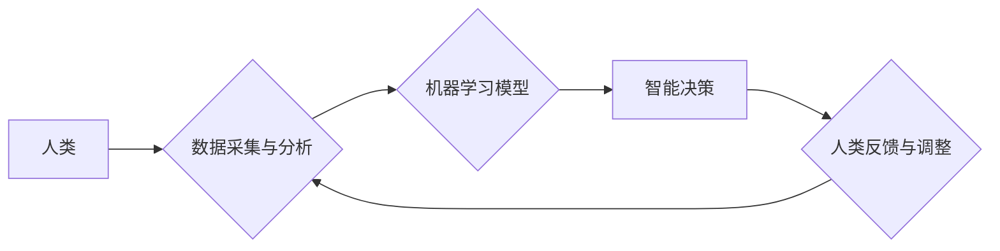

                 

## 人类计算：AI时代的未来就业市场与技能培训发展趋势预测分析挑战

> 关键词：人工智能、未来就业、技能培训、人类计算、自动化、机器学习、深度学习、数据科学、跨学科融合

## 1. 背景介绍

人工智能（AI）技术的飞速发展正在深刻地改变着我们的世界，其影响力渗透到各个领域，包括就业市场。随着自动化和机器学习的进步，一些传统工作岗位面临被取代的风险，而新的工作岗位也在不断涌现。在这种情况下，预测未来就业市场趋势和相应的技能培训发展方向至关重要，以帮助个人和社会适应AI时代的变革。

人类计算是指人类与人工智能协同工作，发挥各自优势，共同完成复杂任务的过程。它强调人与机器的互补性，认为人类的创造力、批判性思维和情感智能与机器的计算能力和数据处理能力相辅相成。在AI时代，人类计算将成为未来工作模式的重要组成部分，需要我们重新思考工作技能和教育体系。

## 2. 核心概念与联系

### 2.1 人类计算的本质

人类计算的核心概念是将人类的智慧和机器的计算能力结合起来，形成一个高效协作的系统。

* **人类优势:** 创造力、批判性思维、情感智能、复杂问题解决能力、伦理判断等。
* **机器优势:** 快速处理大量数据、精准执行重复性任务、识别模式、预测趋势等。

### 2.2 人类计算的架构

**流程图：**



**解释：**

1. 人类通过收集和分析数据，为机器学习模型提供输入。
2. 机器学习模型利用算法从数据中学习，识别模式和趋势，并做出智能决策。
3. 机器智能决策的结果反馈给人类，供人类进行评估和调整。
4. 人类根据反馈信息，对数据分析和机器学习模型进行优化，形成闭环反馈机制。

### 2.3 人类计算的应用场景

* **医疗保健:** AI辅助诊断、个性化治疗方案、药物研发等。
* **金融服务:** 风险评估、欺诈检测、投资决策等。
* **教育:** 个性化学习路径、智能辅导系统、自动批改作业等。
* **制造业:** 自动化生产、质量控制、 predictive maintenance 等。

## 3. 核心算法原理 & 具体操作步骤

### 3.1 算法原理概述

人类计算的核心算法原理主要包括：

* **机器学习:** 算法通过学习数据样本，识别模式和规律，并进行预测或分类。
* **深度学习:** 基于多层神经网络的机器学习算法，能够处理更复杂的数据结构和模式。
* **自然语言处理:** 算法能够理解和处理人类语言，例如文本分析、机器翻译、语音识别等。
* **计算机视觉:** 算法能够识别和理解图像和视频，例如物体识别、图像分类、人脸识别等。

### 3.2 算法步骤详解

以机器学习为例，其基本步骤包括：

1. **数据收集和预处理:** 收集相关数据，并进行清洗、转换、特征提取等预处理工作。
2. **模型选择:** 根据任务需求选择合适的机器学习算法模型，例如线性回归、逻辑回归、决策树、支持向量机等。
3. **模型训练:** 使用训练数据训练模型，调整模型参数，使其能够准确地预测或分类。
4. **模型评估:** 使用测试数据评估模型的性能，例如准确率、召回率、F1-score等。
5. **模型部署:** 将训练好的模型部署到实际应用场景中，用于进行预测或分类。

### 3.3 算法优缺点

**优点:**

* 自动化能力强，能够处理大量数据和复杂任务。
* 能够识别模式和趋势，提供数据驱动的决策支持。
* 持续学习和改进，随着数据量的增加，模型性能会不断提升。

**缺点:**

* 需要大量数据进行训练，数据质量直接影响模型性能。
* 算法解释性较弱，难以理解模型的决策过程。
* 存在算法偏差和公平性问题，需要进行仔细的评估和监控。

### 3.4 算法应用领域

机器学习算法广泛应用于各个领域，例如：

* **医疗保健:** 疾病诊断、药物研发、个性化治疗。
* **金融服务:** 风险评估、欺诈检测、投资决策。
* **电商:** 商品推荐、用户画像、精准营销。
* **交通运输:** 自动驾驶、交通流量预测、物流优化。

## 4. 数学模型和公式 & 详细讲解 & 举例说明

### 4.1 数学模型构建

机器学习算法通常基于数学模型进行构建，例如线性回归模型：

$$
y = \theta_0 + \theta_1x_1 + \theta_2x_2 + ... + \theta_nx_n + \epsilon
$$

其中：

* $y$ 是预测值
* $\theta_0, \theta_1, ..., \theta_n$ 是模型参数
* $x_1, x_2, ..., x_n$ 是输入特征
* $\epsilon$ 是误差项

### 4.2 公式推导过程

模型参数的学习过程通常使用最小二乘法进行优化，目标是找到使模型预测值与实际值误差最小的一组参数。

最小二乘法公式：

$$
\min_{\theta} \sum_{i=1}^{n}(y_i - \hat{y}_i)^2
$$

其中：

* $y_i$ 是实际值
* $\hat{y}_i$ 是模型预测值

### 4.3 案例分析与讲解

假设我们想要预测房价，输入特征包括房屋面积、房间数量、地理位置等。我们可以使用线性回归模型进行预测，并使用最小二乘法优化模型参数。通过训练数据，模型能够学习到房屋面积、房间数量等特征与房价之间的关系，并进行预测。

## 5. 项目实践：代码实例和详细解释说明

### 5.1 开发环境搭建

* Python 3.x
* Jupyter Notebook
* scikit-learn 机器学习库

### 5.2 源代码详细实现

```python
from sklearn.linear_model import LinearRegression
from sklearn.model_selection import train_test_split
import pandas as pd

# 加载数据
data = pd.read_csv('house_price.csv')

# 分割数据
X = data[['area', 'rooms']]
y = data['price']
X_train, X_test, y_train, y_test = train_test_split(X, y, test_size=0.2, random_state=42)

# 创建线性回归模型
model = LinearRegression()

# 训练模型
model.fit(X_train, y_train)

# 预测测试数据
y_pred = model.predict(X_test)

# 评估模型性能
from sklearn.metrics import mean_squared_error
mse = mean_squared_error(y_test, y_pred)
print(f'Mean Squared Error: {mse}')
```

### 5.3 代码解读与分析

* 使用 scikit-learn 库加载数据、分割数据、创建线性回归模型、训练模型、预测测试数据和评估模型性能。
* `train_test_split` 函数将数据随机分割成训练集和测试集。
* `fit` 方法用于训练模型，学习数据之间的关系。
* `predict` 方法用于预测测试数据。
* `mean_squared_error` 函数用于计算模型预测值与实际值之间的均方误差，作为模型性能的评估指标。

### 5.4 运行结果展示

运行代码后，会输出模型的均方误差值，该值越小，模型的预测性能越好。

## 6. 实际应用场景

### 6.1 人工智能客服

AI 驱动的聊天机器人可以处理客户常见问题，提供快速响应和个性化服务，减轻人工客服的压力。

### 6.2 自动化办公

AI 可以自动化许多重复性办公任务，例如数据录入、文档处理、邮件分类等，提高工作效率。

### 6.3 个性化教育

AI 可以根据学生的学习进度和特点，提供个性化学习路径和辅导，提升学习效果。

### 6.4 智能医疗诊断

AI 可以辅助医生进行疾病诊断，提高诊断准确率，并提供个性化治疗方案。

### 6.5 未来应用展望

随着 AI 技术的不断发展，人类计算将在更多领域得到应用，例如：

* **自动驾驶:** AI 驱动的自动驾驶汽车将改变交通出行方式。
* **个性化推荐:** AI 将提供更加精准的商品、服务和内容推荐。
* **科学研究:** AI 将加速科学研究，帮助科学家发现新的知识和解决复杂问题。

## 7. 工具和资源推荐

### 7.1 学习资源推荐

* **在线课程:** Coursera, edX, Udacity 等平台提供丰富的 AI 课程。
* **书籍:** 《深度学习》、《人工智能简史》、《机器学习实战》等。
* **开源项目:** TensorFlow, PyTorch, scikit-learn 等开源项目提供丰富的学习资源和实践案例。

### 7.2 开发工具推荐

* **Python:** 作为 AI 开发的主要编程语言，Python 拥有丰富的库和工具。
* **Jupyter Notebook:** 用于编写和运行 Python 代码，并可视化数据和结果。
* **云计算平台:** AWS, Azure, GCP 等云计算平台提供 AI 开发和部署的资源。

### 7.3 相关论文推荐

* **《ImageNet Classification with Deep Convolutional Neural Networks》:** 提出了深度卷积神经网络，推动了计算机视觉领域的发展。
* **《Attention Is All You Need》:** 提出了 Transformer 模型，在自然语言处理领域取得了突破性进展。
* **《Generative Adversarial Networks》:** 提出了生成对抗网络，在图像生成和数据合成领域取得了成功。

## 8. 总结：未来发展趋势与挑战

### 8.1 研究成果总结

人类计算是 AI 时代的重要发展趋势，它将推动工作模式的变革，创造新的工作机会，并提高人类生产力。

### 8.2 未来发展趋势

* **更强大的 AI 模型:** AI 模型将更加强大，能够处理更复杂的任务，并提供更精准的预测和决策支持。
* **更广泛的应用场景:** 人类计算将应用于更多领域，例如医疗保健、教育、金融服务等。
* **更紧密的 人机交互:** 人机交互方式将更加自然和智能，例如语音控制、手势识别等。

### 8.3 面临的挑战

* **数据安全和隐私保护:** 人类计算需要处理大量数据，因此数据安全和隐私保护至关重要。
* **算法偏见和公平性:** AI 算法可能存在偏见，需要进行仔细的评估和监控，确保公平性和公正性。
* **伦理问题:** 人类计算涉及到伦理问题，例如责任归属、决策透明度等，需要进行深入的探讨和规范。

### 8.4 研究展望

未来研究方向包括：

* **开发更安全、更可靠的 AI 算法。**
* **解决 AI 算法偏见和公平性问题。**
* **探索人类计算的伦理问题，并制定相应的规范和政策。**

## 9. 附录：常见问题与解答

**Q1: 人类计算会取代人类工作吗？**

A1: 人类计算不会完全取代人类工作，而是会改变工作方式，创造新的工作机会。人类的创造力、批判性思维和情感智能仍然是不可替代的。

**Q2: 如何学习人类计算相关知识？**

A2: 可以通过在线课程、书籍、开源项目等方式学习人类计算相关知识。

**Q3: 人类计算有哪些伦理问题？**

A3: 人类计算涉及到责任归属、决策透明度、数据隐私保护等伦理问题，需要进行深入的探讨和规范。


作者：禅与计算机程序设计艺术 / Zen and the Art of Computer Programming 
<end_of_turn>

