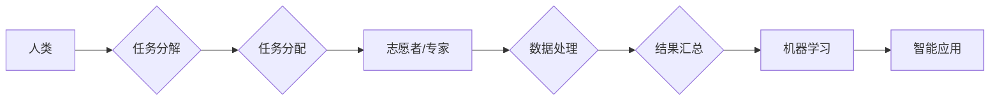

                 

## 人类计算：应用与案例分析

> 关键词：人类计算、计算任务、外包计算、Crowdsourcing、数据标注、人工智能、机器学习、数据分析

## 1. 背景介绍

随着人工智能（AI）技术的飞速发展，机器学习算法的复杂度和数据处理能力不断提升，但仍然存在一些无法完全解决的问题。例如，需要对大量文本、图像和音频进行细致的理解和分类，这些任务往往需要人类的智慧和判断力。因此，将人类的计算能力与机器的计算能力相结合，形成一种新的计算模式，即“人类计算”，逐渐成为一个重要的研究方向。

人类计算是指利用人类的认知能力、创造力和判断力来辅助或完成计算任务。它可以分为两种主要类型：

* **外包计算（Crowdsourcing）：** 将计算任务分解成许多小的子任务，并通过网络平台将这些子任务分配给大量的志愿者或专业人员进行完成。
* **协同计算（Collaborative Computing）：** 多个人类用户共同参与计算任务，通过协作和沟通来完成更复杂的任务。

人类计算在许多领域都有着广泛的应用，例如：

* **数据标注：** 为机器学习算法提供训练数据，例如图像识别、自然语言处理等领域。
* **知识图谱构建：** 通过人类的知识和理解，构建更加完善和准确的知识图谱。
* **创意设计：** 利用人类的想象力和创造力，辅助机器进行创意设计，例如音乐创作、艺术作品生成等。
* **科学研究：** 辅助科学家进行复杂的科学研究，例如蛋白质结构预测、药物研发等。

## 2. 核心概念与联系

人类计算的核心概念是将人类的智慧与机器的计算能力相结合，形成一种新的计算模式。

**Mermaid 流程图：**



## 3. 核心算法原理 & 具体操作步骤

### 3.1  算法原理概述

人类计算的核心算法原理是将复杂的任务分解成许多小的子任务，并通过网络平台将这些子任务分配给大量的志愿者或专业人员进行完成。

### 3.2  算法步骤详解

1. **任务分解：** 将复杂的任务分解成许多小的、易于理解和完成的子任务。
2. **任务分配：** 通过网络平台将这些子任务分配给大量的志愿者或专业人员。
3. **数据处理：** 志愿者或专业人员根据任务要求对数据进行处理，例如图像标注、文本分类等。
4. **结果汇总：** 收集所有志愿者或专业人员处理的结果，并进行汇总和验证。
5. **结果分析：** 对汇总的结果进行分析，并将其用于机器学习算法的训练或其他应用。

### 3.3  算法优缺点

**优点：**

* **利用人类的智慧和判断力：** 人类可以对复杂的任务进行更深入的理解和分析，并做出更准确的判断。
* **成本效益高：** 相比于雇佣专业人员进行计算任务，利用外包计算可以降低成本。
* **灵活性和可扩展性强：** 可以根据需要灵活调整任务规模和分配方式。

**缺点：**

* **数据质量问题：** 人类处理的数据可能存在偏差或错误。
* **效率问题：** 人类处理速度相对较慢，难以处理大量数据。
* **隐私安全问题：** 需要妥善处理用户数据，确保隐私安全。

### 3.4  算法应用领域

* **数据标注：** 为机器学习算法提供训练数据，例如图像识别、自然语言处理等领域。
* **知识图谱构建：** 通过人类的知识和理解，构建更加完善和准确的知识图谱。
* **创意设计：** 利用人类的想象力和创造力，辅助机器进行创意设计，例如音乐创作、艺术作品生成等。
* **科学研究：** 辅助科学家进行复杂的科学研究，例如蛋白质结构预测、药物研发等。

## 4. 数学模型和公式 & 详细讲解 & 举例说明

### 4.1  数学模型构建

人类计算可以抽象为一个多阶段的决策过程，其中每个阶段都涉及到人类的判断和选择。我们可以用以下数学模型来描述这个过程：

$$
P(O|I) = \sum_{h} P(O|I, h) P(h)
$$

其中：

* $P(O|I)$ 表示给定输入信息 $I$，观察到输出结果 $O$ 的概率。
* $P(O|I, h)$ 表示给定输入信息 $I$ 和人类决策 $h$，观察到输出结果 $O$ 的概率。
* $P(h)$ 表示人类决策 $h$ 的概率。

### 4.2  公式推导过程

这个公式表明，观察到输出结果 $O$ 的概率等于所有可能的决策 $h$ 下，观察到 $O$ 的概率加权平均，权重为每个决策的概率。

### 4.3  案例分析与讲解

例如，在图像识别任务中，输入信息 $I$ 是图像数据，输出结果 $O$ 是图像的类别标签。人类决策 $h$ 可以是识别图像中物体类型的判断。

在这个例子中，$P(O|I, h)$ 表示给定图像数据 $I$ 和人类决策 $h$，识别出正确的类别标签 $O$ 的概率。$P(h)$ 表示人类识别出不同类别标签的概率。

通过收集大量的人类决策和对应的输出结果，我们可以训练一个机器学习模型来估计 $P(O|I, h)$ 和 $P(h)$，从而实现自动图像识别。

## 5. 项目实践：代码实例和详细解释说明

### 5.1  开发环境搭建

* **操作系统：** Ubuntu 20.04 LTS
* **编程语言：** Python 3.8
* **开发工具：** Jupyter Notebook
* **库依赖：** numpy, pandas, scikit-learn

### 5.2  源代码详细实现

```python
import numpy as np
from sklearn.datasets import load_iris
from sklearn.model_selection import train_test_split
from sklearn.linear_model import LogisticRegression

# 加载鸢尾花数据集
iris = load_iris()
X = iris.data
y = iris.target

# 将数据划分为训练集和测试集
X_train, X_test, y_train, y_test = train_test_split(X, y, test_size=0.2, random_state=42)

# 训练逻辑回归模型
model = LogisticRegression()
model.fit(X_train, y_train)

# 对测试集进行预测
y_pred = model.predict(X_test)

# 计算模型准确率
accuracy = np.mean(y_pred == y_test)
print(f"模型准确率: {accuracy}")
```

### 5.3  代码解读与分析

这段代码实现了鸢尾花数据集的分类任务。首先，加载了鸢尾花数据集，并将其划分为训练集和测试集。然后，训练了一个逻辑回归模型，并使用测试集进行预测。最后，计算了模型的准确率。

### 5.4  运行结果展示

运行这段代码后，会输出模型的准确率。

## 6. 实际应用场景

### 6.1  数据标注

在机器学习领域，数据标注是训练模型的关键步骤。例如，在图像识别任务中，需要对图像进行标注，标记出图像中物体的类别。人类计算可以利用大量的志愿者或专业人员进行图像标注，从而为机器学习模型提供高质量的训练数据。

### 6.2  知识图谱构建

知识图谱是将知识表示为图结构的一种方式，可以用于存储和推理各种知识。人类计算可以利用人类的知识和理解，构建更加完善和准确的知识图谱。例如，可以利用志愿者对文本进行阅读和理解，并提取其中的知识点，构建知识图谱。

### 6.3  创意设计

在创意设计领域，人类计算可以辅助机器进行创意设计。例如，可以利用志愿者对音乐进行创作和评价，训练机器学习模型来生成新的音乐作品。

### 6.4  未来应用展望

随着人工智能技术的不断发展，人类计算的应用场景将会更加广泛。例如，可以利用人类计算来解决复杂科学问题，例如蛋白质结构预测、药物研发等。

## 7. 工具和资源推荐

### 7.1  学习资源推荐

* **书籍：**
    * 人工智能：一种现代方法
    * 深度学习
    * 人工智能：概念、算法和应用
* **在线课程：**
    * Coursera: 人工智能
    * edX: 深度学习
    * Udacity: 人工智能工程师

### 7.2  开发工具推荐

* **Python:** 
    * Jupyter Notebook
    * TensorFlow
    * PyTorch
* **云平台:**
    * AWS
    * Azure
    * Google Cloud Platform

### 7.3  相关论文推荐

* **人类计算：一种新的计算模式**
* **人类计算在机器学习中的应用**
* **人类计算的未来发展趋势**

## 8. 总结：未来发展趋势与挑战

### 8.1  研究成果总结

人类计算是一种将人类的智慧与机器的计算能力相结合的新型计算模式，在数据标注、知识图谱构建、创意设计等领域有着广泛的应用。

### 8.2  未来发展趋势

未来，人类计算将会更加智能化、自动化和协同化。例如，可以利用人工智能技术来辅助人类进行决策，提高人类计算的效率和准确性。

### 8.3  面临的挑战

人类计算仍然面临着一些挑战，例如数据质量问题、效率问题和隐私安全问题。需要进一步研究和解决这些问题，才能更好地发挥人类计算的潜力。

### 8.4  研究展望

未来，人类计算的研究方向将更加注重以下几个方面：

* **提高人类计算的效率和准确性：** 利用人工智能技术来辅助人类进行决策，提高人类计算的效率和准确性。
* **解决数据质量问题：** 开发新的算法和方法来提高数据标注的质量和效率。
* **保障数据隐私安全：** 开发新的技术和方法来保护用户数据隐私安全。


## 9. 附录：常见问题与解答

**Q1：人类计算与机器学习有什么区别？**

**A1：** 人类计算和机器学习都是人工智能领域的重要研究方向，但它们侧重点不同。机器学习是利用算法从数据中学习，而人类计算则是利用人类的智慧和判断力来辅助或完成计算任务。

**Q2：人类计算的应用场景有哪些？**

**A2：** 人类计算的应用场景非常广泛，例如数据标注、知识图谱构建、创意设计、科学研究等。

**Q3：人类计算有哪些挑战？**

**A3：** 人类计算面临着一些挑战，例如数据质量问题、效率问题和隐私安全问题。

**作者：禅与计算机程序设计艺术 / Zen and the Art of Computer Programming**<end_of_turn>

