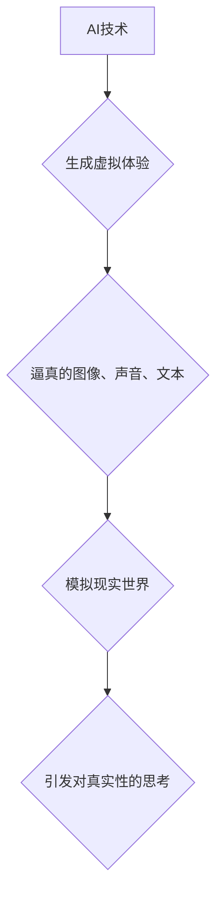

                 

## 体验的真实性：AI时代的authenticity追求

> 关键词：人工智能、真实性、体验、模拟、伦理、算法、数据、未来

## 1. 背景介绍

在人工智能（AI）飞速发展的时代，我们所感知的世界正在发生着深刻的变化。AI技术的不断进步，使得机器能够模拟人类的思维和行为，甚至创造出逼真的虚拟体验。然而，随着AI技术的应用越来越广泛，一个重要的伦理问题逐渐浮出水面：在AI时代，我们如何定义和追求“真实性”？

传统的“真实性”概念往往与物理世界和人类感知相联系。然而，随着虚拟现实（VR）、增强现实（AR）等技术的兴起，虚拟世界与现实世界之间的界限变得越来越模糊。AI生成的虚拟内容，例如逼真的图像、声音和文本，能够以令人难以置信的逼真度模拟现实世界，从而引发人们对“真实性”的重新思考。

## 2. 核心概念与联系

**2.1 真实性（Authenticity）**

真实性是一个多维概念，涵盖了以下几个方面：

* **客观真实性：** 指与客观世界相符的程度，例如图像、声音的准确性。
* **主观真实性：** 指与个体感知和体验相符的程度，例如虚拟体验的沉浸感和情感共鸣。
* **内在真实性：** 指内容的真实性和可信度，例如AI生成的文本是否具有逻辑性和可信度。

**2.2 AI生成的体验**

AI技术能够生成各种形式的体验，例如：

* **虚拟现实体验：** 通过VR技术，AI可以创造出逼真的虚拟环境，让人们沉浸其中，体验不同的场景和故事。
* **增强现实体验：** 通过AR技术，AI可以将虚拟内容叠加到现实世界中，增强现实世界的感知和互动。
* **个性化体验：** AI可以根据个体的喜好和需求，定制个性化的体验，例如推荐个性化的内容和服务。

**2.3  AI与真实性的关系**

AI技术可以模拟和创造出逼真的体验，但它并不等同于真实性。AI生成的体验可能具有高度的逼真度，但它仍然是基于算法和数据生成的，缺乏真实的感官体验和情感共鸣。

**2.4  Mermaid 流程图**



## 3. 核心算法原理 & 具体操作步骤

**3.1 算法原理概述**

AI技术生成真实性体验的核心算法主要包括：

* **生成对抗网络（GAN）：** GAN由两个网络组成：生成器和鉴别器。生成器试图生成逼真的虚拟内容，而鉴别器试图区分真实内容和生成内容。通过不断的对抗训练，生成器能够生成越来越逼真的内容。
* **变分自编码器（VAE）：** VAE通过学习数据的潜在表示，能够生成新的数据样本。VAE能够生成具有多样性和可控性的虚拟内容。
* **Transformer模型：** Transformer模型能够处理序列数据，例如文本和语音。通过学习语言的语法和语义，Transformer模型能够生成流畅自然的文本和语音。

**3.2 算法步骤详解**

以GAN为例，其训练过程可以分为以下步骤：

1. **初始化生成器和鉴别器网络**
2. **生成器生成虚拟内容**
3. **鉴别器判断虚拟内容的真实性**
4. **根据鉴别器的反馈，更新生成器和鉴别器的参数**
5. **重复步骤2-4，直到生成器能够生成逼真的虚拟内容**

**3.3 算法优缺点**

**GAN：**

* **优点：**能够生成逼真的图像、声音和文本。
* **缺点：**训练过程复杂，容易陷入局部最优解。

**VAE：**

* **优点：**能够生成具有多样性和可控性的虚拟内容。
* **缺点：**生成的虚拟内容可能不如GAN逼真。

**Transformer模型：**

* **优点：**能够处理序列数据，生成流畅自然的文本和语音。
* **缺点：**生成的内容可能缺乏创造力。

**3.4 算法应用领域**

* **游戏开发：**生成逼真的游戏场景和角色。
* **电影制作：**生成虚拟人物和场景。
* **医疗保健：**生成虚拟病人模型，用于医学训练和研究。
* **教育：**生成虚拟教学环境，提供沉浸式的学习体验。

## 4. 数学模型和公式 & 详细讲解 & 举例说明

**4.1 数学模型构建**

GAN的训练过程可以看作是一个博弈过程，生成器和鉴别器之间的对抗关系可以用数学模型来描述。

* **生成器网络：**G(z)

* **鉴别器网络：**D(x)

其中，z是随机噪声向量，x是真实数据样本。

**4.2 公式推导过程**

* **生成器的目标函数：**

$$
L_G = E_{z \sim p_z(z)}[log D(G(z))]
$$

* **鉴别器的目标函数：**

$$
L_D = E_{x \sim p_{data}(x)}[log D(x)] + E_{z \sim p_z(z)}[log(1 - D(G(z)))]
$$

**4.3 案例分析与讲解**

在训练过程中，生成器试图最大化目标函数 $L_G$，而鉴别器试图最大化目标函数 $L_D$。通过不断的对抗训练，生成器能够生成越来越逼真的虚拟内容，而鉴别器能够越来越准确地区分真实内容和生成内容。

## 5. 项目实践：代码实例和详细解释说明

**5.1 开发环境搭建**

* Python 3.x
* TensorFlow 或 PyTorch 深度学习框架
* CUDA 和 cuDNN（可选，用于GPU加速）

**5.2 源代码详细实现**

以下是一个简单的GAN代码示例，使用TensorFlow框架实现：

```python
import tensorflow as tf

# 定义生成器网络
def generator(z):
  # ...

# 定义鉴别器网络
def discriminator(x):
  # ...

# 定义损失函数和优化器
loss_fn = tf.keras.losses.BinaryCrossentropy()
optimizer_G = tf.keras.optimizers.Adam(learning_rate=0.0002)
optimizer_D = tf.keras.optimizers.Adam(learning_rate=0.0002)

# 训练循环
for epoch in range(num_epochs):
  for batch in dataset:
    # 生成虚拟数据
    fake_data = generator(z)

    # 训练鉴别器
    with tf.GradientTape() as tape_D:
      real_output = discriminator(real_data)
      fake_output = discriminator(fake_data)
      d_loss = loss_fn(tf.ones_like(real_output), real_output) + loss_fn(tf.zeros_like(fake_output), fake_output)
    gradients_D = tape_D.gradient(d_loss, discriminator.trainable_variables)
    optimizer_D.apply_gradients(zip(gradients_D, discriminator.trainable_variables))

    # 训练生成器
    with tf.GradientTape() as tape_G:
      fake_output = discriminator(fake_data)
      g_loss = loss_fn(tf.ones_like(fake_output), fake_output)
    gradients_G = tape_G.gradient(g_loss, generator.trainable_variables)
    optimizer_G.apply_gradients(zip(gradients_G, generator.trainable_variables))

```

**5.3 代码解读与分析**

* 代码定义了生成器和鉴别器网络，并使用TensorFlow框架实现训练过程。
* 训练循环中，首先使用生成器生成虚拟数据，然后训练鉴别器，最后训练生成器。
* 损失函数和优化器用于指导模型的训练。

**5.4 运行结果展示**

训练完成后，可以将生成器网络用于生成新的虚拟内容。

## 6. 实际应用场景

**6.1 游戏开发**

AI可以生成逼真的游戏场景、角色和NPC，提升游戏体验和沉浸感。例如，在开放世界游戏中，AI可以生成动态变化的城市环境，让玩家体验更真实的虚拟世界。

**6.2 电影制作**

AI可以生成虚拟人物和场景，降低电影制作成本，并创造出更具创意和想象力的视觉效果。例如，AI可以生成虚拟演员，为电影提供更灵活的表演选择。

**6.3 医疗保健**

AI可以生成虚拟病人模型，用于医学训练和研究。例如，外科医生可以使用虚拟病人模型进行手术模拟，提高手术技能和安全性。

**6.4 未来应用展望**

随着AI技术的不断发展，其在生成真实性体验方面的应用将更加广泛和深入。例如，AI可以生成个性化的虚拟教育环境，提供沉浸式的学习体验；AI可以生成虚拟社交伙伴，帮助人们缓解孤独感；AI可以生成虚拟旅游体验，让人们足不出户就能游览世界各地。

## 7. 工具和资源推荐

**7.1 学习资源推荐**

* **书籍：**

* “深度学习” by Ian Goodfellow, Yoshua Bengio, and Aaron Courville
* “Generative Deep Learning” by David Foster

* **在线课程：**

* Coursera: Deep Learning Specialization
* Udacity: Deep Learning Nanodegree

**7.2 开发工具推荐**

* TensorFlow
* PyTorch
* Keras

**7.3 相关论文推荐**

* “Generative Adversarial Networks” by Ian Goodfellow et al. (2014)
* “Variational Autoencoders for Generation” by Diederik P. Kingma and Max Welling (2013)

## 8. 总结：未来发展趋势与挑战

**8.1 研究成果总结**

近年来，AI技术在生成真实性体验方面取得了显著进展。GAN、VAE等算法能够生成逼真的图像、声音和文本，为虚拟现实、增强现实等领域提供了强大的技术支持。

**8.2 未来发展趋势**

* **更逼真的体验：** 未来AI将能够生成更加逼真、沉浸式的虚拟体验，例如能够感知和响应用户的感官信息。
* **更个性化的体验：** AI将能够根据个体的喜好和需求，定制个性化的虚拟体验，例如生成个性化的游戏场景和故事。
* **更广泛的应用场景：** AI生成的虚拟体验将应用于更多领域，例如教育、医疗保健、娱乐等。

**8.3 面临的挑战**

* **伦理问题：** AI生成的虚拟体验可能引发伦理问题，例如虚假信息传播、身份认同问题等。
* **技术挑战：** 生成更加逼真的虚拟体验需要克服技术挑战，例如提高算法效率、降低计算成本等。
* **社会影响：** AI生成的虚拟体验可能对社会产生深远影响，例如改变人们的社交方式、工作方式等。

**8.4 研究展望**

未来研究将重点关注以下几个方面：

* **开发更安全、更可靠的AI算法**
* **探索AI生成的虚拟体验的伦理和社会影响**
* **推动AI技术与其他领域的融合，创造更加丰富多彩的虚拟体验**

## 9. 附录：常见问题与解答

**9.1 如何区分AI生成的虚拟内容和真实内容？**

随着AI技术的进步，区分AI生成的虚拟内容和真实内容越来越困难。目前，一些方法可以帮助识别AI生成的虚拟内容，例如：

* **分析图像和文本的特征：** AI生成的虚拟内容可能存在一些特征，例如重复的图案、不自然的语法结构等。
* **使用专门的检测工具：** 一些研究机构和公司开发了专门的AI生成内容检测工具。

**9.2 AI生成的虚拟体验对人类社会有哪些潜在影响？**

AI生成的虚拟体验可能对人类社会产生深远影响，例如：

* **改变人们的社交方式：** 人们可能更倾向于在虚拟世界中与他人互动，而不是现实世界。
* **改变人们的工作方式：** AI可以生成虚拟工作环境，人们可以远程工作或进行虚拟协作。
* **改变人们的娱乐方式：** AI可以生成个性化的游戏和娱乐内容，满足人们不同的需求。

**9.3 如何确保AI生成的虚拟体验安全可靠？**

确保AI生成的虚拟体验安全可靠需要多方面的努力，例如：

* **开发更安全、更可靠的AI算法**
* **建立相关的法律法规和伦理规范**
* **加强对AI技术的监管和监督**


作者：禅与计算机程序设计艺术 / Zen and the Art of Computer Programming 
<end_of_turn>

