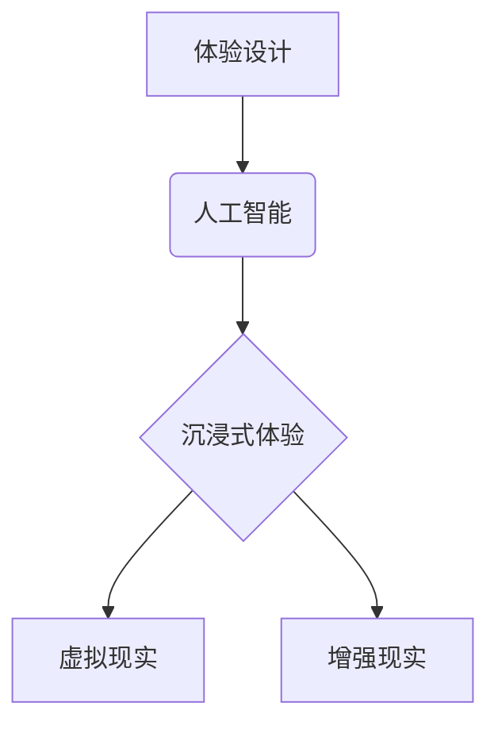

                 

## 体验设计的未来：AI驱动的沉浸式世界

> 关键词：体验设计、人工智能、沉浸式体验、虚拟现实、增强现实、交互设计、用户体验

### 1. 背景介绍

随着人工智能技术的飞速发展，体验设计正在经历一场深刻的变革。传统的体验设计主要关注于用户与产品或服务的直接交互，而AI驱动的沉浸式体验则将这一概念推向了新的高度。

沉浸式体验是指用户能够完全沉浸在虚拟或增强现实环境中，并与之进行深度交互的一种体验方式。这种体验能够超越传统的视觉和听觉感知，并通过触觉、嗅觉等多种感官刺激，创造出更加真实、生动、身临其境的体验。

AI技术为沉浸式体验提供了强大的支持。例如，AI可以用于生成逼真的虚拟环境、模拟用户行为、个性化体验内容，以及提供更加自然、流畅的交互方式。

### 2. 核心概念与联系

**2.1 核心概念**

* **体验设计 (Experience Design):**  关注用户在与产品或服务交互过程中所获得的整体体验，旨在创造出积极、愉悦、有意义的体验。
* **人工智能 (Artificial Intelligence):**  模拟人类智能的计算机系统，能够学习、推理、决策和解决问题。
* **沉浸式体验 (Immersive Experience):**  用户能够完全沉浸在虚拟或增强现实环境中，并与之进行深度交互的一种体验方式。
* **虚拟现实 (Virtual Reality):**  使用计算机技术模拟一个虚拟环境，用户可以通过头戴式显示器或其他设备与虚拟环境进行交互。
* **增强现实 (Augmented Reality):**  在现实世界中叠加虚拟元素，增强用户的现实世界感知。

**2.2 架构关系**



**2.3 联系分析**

AI技术为体验设计提供了强大的工具，可以帮助设计师创造出更加沉浸式、个性化、交互式的体验。

* **个性化体验:** AI可以根据用户的行为、偏好和需求，个性化定制体验内容，提供更加贴心的服务。
* **智能交互:** AI可以理解用户的自然语言输入，并提供更加自然、流畅的交互体验。
* **虚拟环境生成:** AI可以根据用户的需求，生成逼真的虚拟环境，创造出更加身临其境的体验。

### 3. 核心算法原理 & 具体操作步骤

**3.1 算法原理概述**

沉浸式体验的核心算法主要包括：

* **3D建模和渲染算法:** 用于生成逼真的虚拟环境。
* **路径规划算法:** 用于计算虚拟角色在虚拟环境中的移动路径。
* **自然语言处理算法:** 用于理解用户的语音或文本输入。
* **机器学习算法:** 用于个性化定制体验内容和预测用户的行为。

**3.2 算法步骤详解**

1. **环境建模:** 使用3D建模软件创建虚拟环境，包括场景、物体、人物等。
2. **环境渲染:** 使用渲染引擎将虚拟环境渲染成图像，并根据用户的视角进行动态更新。
3. **用户交互:** 用户可以通过手柄、键盘、语音等方式与虚拟环境进行交互。
4. **路径规划:** 根据用户的交互指令，使用路径规划算法计算虚拟角色的移动路径。
5. **行为预测:** 使用机器学习算法分析用户的行为模式，预测用户的下一步行动。
6. **内容定制:** 根据用户的行为和偏好，个性化定制虚拟环境中的内容和体验。

**3.3 算法优缺点**

* **优点:** 能够创造出更加逼真、沉浸式的体验，并提供更加个性化、交互式的服务。
* **缺点:** 算法复杂度高，需要强大的计算能力和存储空间。

**3.4 算法应用领域**

* **游戏:** 创建更加逼真、沉浸式的游戏体验。
* **教育:** 提供更加生动、互动式的学习体验。
* **医疗:** 用于手术模拟、康复训练等。
* **娱乐:** 创建更加身临其境的电影、音乐、艺术体验。

### 4. 数学模型和公式 & 详细讲解 & 举例说明

**4.1 数学模型构建**

沉浸式体验的数学模型主要包括：

* **3D空间模型:** 用于描述虚拟环境的几何结构。
* **光照模型:** 用于模拟光线在虚拟环境中的传播和反射。
* **材质模型:** 用于描述虚拟物体表面的材质特性。
* **运动模型:** 用于描述虚拟角色的运动轨迹。

**4.2 公式推导过程**

* **3D空间模型:** 使用坐标系和向量来描述虚拟环境中的物体位置和方向。
* **光照模型:** 使用光线追踪算法模拟光线在虚拟环境中的传播和反射，计算每个像素点的颜色值。
* **材质模型:** 使用漫反射、镜面反射等模型来描述虚拟物体表面的材质特性，例如颜色、纹理、光泽度等。
* **运动模型:** 使用物理引擎模拟虚拟角色的运动轨迹，考虑重力、摩擦力、惯性等因素。

**4.3 案例分析与讲解**

例如，在虚拟现实游戏中，可以使用3D空间模型来构建游戏场景，光照模型来模拟阳光照射在场景上的效果，材质模型来描述游戏角色的皮肤、衣服等材质特性，运动模型来模拟角色的行走、奔跑、跳跃等动作。

$$
\mathbf{P} = \mathbf{O} + \mathbf{R} \cdot \mathbf{T}
$$

其中：

* $\mathbf{P}$ 是物体在世界坐标系中的位置向量。
* $\mathbf{O}$ 是物体的原点位置向量。
* $\mathbf{R}$ 是物体的旋转矩阵。
* $\mathbf{T}$ 是物体的平移向量。

这个公式可以用来计算物体在世界坐标系中的位置，根据旋转矩阵和平移向量来改变物体的姿态和位置。

### 5. 项目实践：代码实例和详细解释说明

**5.1 开发环境搭建**

* **操作系统:** Windows、macOS、Linux
* **编程语言:** C++、Python、Java
* **虚拟现实平台:** Oculus、HTC Vive、SteamVR
* **增强现实平台:** ARKit、ARCore

**5.2 源代码详细实现**

以下是一个简单的虚拟现实场景代码示例，使用Unity引擎编写：

```csharp
using UnityEngine;

public class VRController : MonoBehaviour
{
    public GameObject vrCamera;

    void Update()
    {
        // 获取用户的移动方向
        Vector3 moveDirection = new Vector3(Input.GetAxis("Horizontal"), 0, Input.GetAxis("Vertical"));

        // 移动虚拟角色
        transform.position += moveDirection * Time.deltaTime * 5;

        // 旋转虚拟角色
        transform.rotation = Quaternion.Euler(0, Input.GetAxis("Mouse X") * 100, 0);

        // 更新虚拟摄像机的视角
        vrCamera.transform.position = transform.position;
        vrCamera.transform.rotation = transform.rotation;
    }
}
```

**5.3 代码解读与分析**

* 该代码定义了一个名为VRController的脚本，用于控制虚拟角色的移动和旋转。
* `Input.GetAxis("Horizontal")` 和 `Input.GetAxis("Vertical")` 获取用户的水平和垂直移动方向。
* `Time.deltaTime` 用于控制移动速度，确保移动速度与帧率无关。
* `Quaternion.Euler()` 用于旋转虚拟角色，`Input.GetAxis("Mouse X")` 获取用户的鼠标水平移动方向。
* `vrCamera.transform.position` 和 `vrCamera.transform.rotation` 更新虚拟摄像机的视角，使其跟随虚拟角色的移动和旋转。

**5.4 运行结果展示**

运行该代码后，用户可以通过键盘控制虚拟角色的移动方向，并通过鼠标控制虚拟角色的旋转方向。虚拟摄像机会跟随虚拟角色的移动和旋转，提供沉浸式的虚拟体验。

### 6. 实际应用场景

**6.1 游戏开发**

* **沉浸式游戏体验:** AI驱动的沉浸式体验可以为游戏玩家提供更加逼真、身临其境的体验，例如在虚拟现实游戏中，玩家可以身临其境地体验到游戏场景，与虚拟角色进行互动。
* **个性化游戏内容:** AI可以根据玩家的喜好和行为模式，个性化定制游戏内容，例如游戏难度、剧情走向、游戏角色等。

**6.2 教育培训**

* **虚拟实验室:** AI可以创建虚拟实验室，让学生在安全的环境中进行实验操作，例如模拟化学反应、生物实验等。
* **沉浸式教学:** AI可以创建沉浸式的教学场景，例如虚拟博物馆、历史遗址等，让学生更加直观地了解知识。

**6.3 医疗保健**

* **手术模拟:** AI可以模拟手术场景，让医生进行虚拟手术练习，提高手术技能。
* **康复训练:** AI可以根据患者的病情和需求，定制个性化的康复训练方案，例如虚拟现实辅助康复训练。

**6.4 娱乐体验**

* **沉浸式电影:** AI可以根据用户的视角和喜好，动态生成电影画面，提供更加身临其境的电影体验。
* **虚拟音乐会:** AI可以模拟虚拟音乐会场景，让用户体验到身临其境的音乐表演。

**6.5 未来应用展望**

* **元宇宙:** AI驱动的沉浸式体验将成为元宇宙的重要组成部分，为用户提供更加真实、生动的虚拟世界体验。
* **远程协作:** AI可以帮助用户在虚拟环境中进行远程协作，例如虚拟会议、远程办公等。
* **个性化服务:** AI可以根据用户的需求和喜好，提供更加个性化的沉浸式体验服务，例如定制虚拟旅行、虚拟购物等。

### 7. 工具和资源推荐

**7.1 学习资源推荐**

* **书籍:**
    * 《体验设计：为用户创造美好体验》
    * 《人工智能：一种现代方法》
    * 《虚拟现实技术》
* **在线课程:**
    * Coursera: 人工智能、体验设计、虚拟现实
    * Udemy: 人工智能、体验设计、虚拟现实
* **社区论坛:**
    * Reddit: r/artificialintelligence, r/vr, r/uxdesign

**7.2 开发工具推荐**

* **虚拟现实平台:** Oculus, HTC Vive, SteamVR
* **增强现实平台:** ARKit, ARCore
* **游戏引擎:** Unity, Unreal Engine
* **人工智能库:** TensorFlow, PyTorch, scikit-learn

**7.3 相关论文推荐**

* 《Generative Adversarial Networks》
* 《Deep Reinforcement Learning》
* 《Immersive Virtual Reality for Education》

### 8. 总结：未来发展趋势与挑战

**8.1 研究成果总结**

AI驱动的沉浸式体验技术已经取得了显著的进展，为用户提供了更加逼真、个性化、交互式的体验。

**8.2 未来发展趋势**

* **更加逼真的虚拟环境:** AI将能够生成更加逼真的虚拟环境，包括更加复杂的场景、更加逼真的物体和人物。
* **更加智能的交互方式:** AI将能够理解用户的更加复杂的交互指令，提供更加自然、流畅的交互体验。
* **更加个性化的体验内容:** AI将能够根据用户的行为和偏好，更加个性化定制体验内容，提供更加贴心的服务。

**8.3 面临的挑战**

* **计算能力:** 生成逼真的虚拟环境和提供智能交互需要强大的计算能力，这仍然是一个技术挑战。
* **数据隐私:** 沉浸式体验通常会收集用户的大量数据，如何保护用户的隐私是一个重要的伦理问题。
* **用户体验:** 如何设计更加舒适、安全、易于使用的沉浸式体验仍然是一个需要探索的问题。

**8.4 研究展望**

未来，AI驱动的沉浸式体验技术将继续发展，为用户带来更加丰富、更加精彩的体验。

### 9. 附录：常见问题与解答

* **Q: 沉浸式体验有什么应用场景？**

A: 沉浸式体验的应用场景非常广泛，包括游戏、教育、医疗、娱乐等领域。

* **Q: 如何开发沉浸式体验？**

A: 开发沉浸式体验需要掌握虚拟现实、增强现实、人工智能等相关技术。可以使用Unity、Unreal Engine等游戏引擎，以及TensorFlow、PyTorch等人工智能库。

* **Q: 沉浸式体验对用户有什么影响？**

A: 沉浸式体验能够增强用户的感知能力、提高用户的参与度，并提供更加身临其境、更加难忘的体验。


作者：禅与计算机程序设计艺术 / Zen and the Art of Computer Programming 
<end_of_turn>

