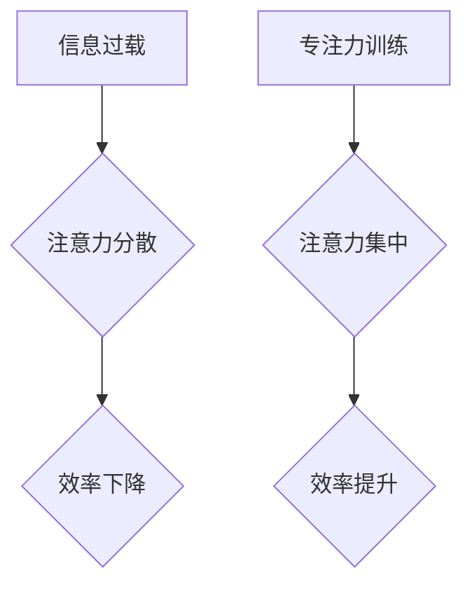

                 

## 信息时代的注意力管理挑战：在干扰和分心中保持专注

> 关键词：注意力管理、信息过载、专注力、深度工作、认知增强、干扰消除、分心机制、时间管理、效率提升

### 1. 背景介绍

在信息爆炸的时代，我们每天都被来自各种渠道的信息轰炸。电子邮件、社交媒体、即时通讯、新闻推送，无处不在的通知和提醒，不断地拉扯着我们的注意力。这种信息过载和干扰，严重影响着我们的专注力，让我们难以沉浸在工作或学习中，高效地完成任务。

注意力，是人类认知的核心能力之一，它决定着我们学习、工作、创造的效率。然而，现代社会的信息环境对我们的注意力提出了前所未有的挑战。研究表明，人类的注意力持续时间正在逐渐缩短，我们越来越难以集中精力完成一件事情。

### 2. 核心概念与联系

#### 2.1  注意力机制

注意力机制（Attention Mechanism）是近年来深度学习领域的重要突破，它能够帮助模型聚焦于输入数据中最重要的部分，从而提高学习效率和准确性。

注意力机制的灵感来源于人类的注意力机制。当我们阅读一篇文章时，我们不会把每个单词都平等地对待，而是会根据上下文和语义，将注意力集中在关键信息上。

#### 2.2  干扰与分心

干扰（Distraction）是指任何能够分散我们注意力的因素，而分心（Distraction）则是注意力被干扰所导致的结果。

干扰可以来自外部环境，例如噪音、手机铃声、同事的打扰等。也可以来自内部因素，例如思绪飘忽、焦虑、疲劳等。

#### 2.3  专注力训练

专注力训练（Focus Training）是指通过一系列练习和技巧，增强我们集中注意力的能力。

专注力训练可以帮助我们提高注意力持续时间、减少分心次数、增强抗干扰能力。

**Mermaid 流程图**



### 3. 核心算法原理 & 具体操作步骤

#### 3.1  算法原理概述

注意力机制的核心原理是通过一个加权机制，将输入数据中的不同部分赋予不同的权重，从而突出重要信息。

常见的注意力机制类型包括：

* **自注意力机制（Self-Attention）:**  用于处理序列数据，例如文本，能够捕捉序列中不同元素之间的关系。
* **交叉注意力机制（Cross-Attention）:** 用于处理多个序列数据，例如机器翻译，能够捕捉不同序列之间的关系。

#### 3.2  算法步骤详解

1. **计算注意力权重:**  通过一个注意力函数，计算输入数据中每个元素与目标元素之间的相关性，得到每个元素的注意力权重。
2. **加权求和:**  将注意力权重与输入数据相乘，然后求和，得到一个加权后的输出向量。

#### 3.3  算法优缺点

**优点:**

* 能够有效地捕捉输入数据中的重要信息。
* 能够处理长序列数据。
* 在许多自然语言处理任务中取得了优异的性能。

**缺点:**

* 计算复杂度较高。
* 训练数据量较大。

#### 3.4  算法应用领域

注意力机制在自然语言处理、计算机视觉、语音识别等领域都有广泛的应用。

* **机器翻译:**  捕捉源语言和目标语言之间的关系，提高翻译质量。
* **文本摘要:**  识别文本中的关键信息，生成简洁的摘要。
* **图像识别:**  聚焦于图像中的重要区域，提高识别准确率。

### 4. 数学模型和公式 & 详细讲解 & 举例说明

#### 4.1  数学模型构建

注意力机制的数学模型可以表示为：

$$
\text{Attention}(Q, K, V) = \text{softmax}\left(\frac{Q K^T}{\sqrt{d_k}}\right) V
$$

其中：

* $Q$：查询矩阵
* $K$：键矩阵
* $V$：值矩阵
* $d_k$：键向量的维度
* $\text{softmax}$：softmax函数，用于将注意力权重归一化

#### 4.2  公式推导过程

注意力机制的公式推导过程可以分为以下几个步骤：

1. 计算查询矩阵 $Q$ 与键矩阵 $K$ 的点积，得到一个得分矩阵。
2. 对得分矩阵进行归一化，得到注意力权重矩阵。
3. 将注意力权重矩阵与值矩阵 $V$ 相乘，得到加权后的输出向量。

#### 4.3  案例分析与讲解

假设我们有一个句子：

"The cat sat on the mat."

我们想要计算每个单词对句子最后一个单词 "mat" 的注意力权重。

我们可以将句子中的每个单词作为查询向量 $Q$，将每个单词作为键向量 $K$，并将每个单词作为值向量 $V$。

然后，我们可以使用注意力机制的公式计算每个单词对 "mat" 的注意力权重。

例如，单词 "cat" 的注意力权重可能比单词 "the" 的注意力权重更高，因为 "cat" 与 "mat" 的语义关系更密切。

### 5. 项目实践：代码实例和详细解释说明

#### 5.1  开发环境搭建

* Python 3.x
* TensorFlow 或 PyTorch

#### 5.2  源代码详细实现

```python
import tensorflow as tf

# 定义注意力机制
def attention_mechanism(query, key, value, mask=None):
    # 计算注意力权重
    scores = tf.matmul(query, key, transpose_b=True) / tf.math.sqrt(tf.cast(key.shape[-1], tf.float32))
    if mask is not None:
        scores += (1 - mask) * -1e9
    attention_weights = tf.nn.softmax(scores, axis=-1)
    # 加权求和
    context_vector = tf.matmul(attention_weights, value)
    return context_vector, attention_weights

# 示例使用
query = tf.random.normal([1, 5, 64])
key = tf.random.normal([1, 5, 64])
value = tf.random.normal([1, 5, 128])

context_vector, attention_weights = attention_mechanism(query, key, value)

print(context_vector.shape)
print(attention_weights.shape)
```

#### 5.3  代码解读与分析

* `attention_mechanism` 函数定义了注意力机制的计算过程。
* `scores` 计算了查询向量与键向量的点积，并进行归一化。
* `attention_weights` 使用 softmax 函数将得分矩阵转换为注意力权重矩阵。
* `context_vector` 通过将注意力权重与值向量相乘，得到加权后的输出向量。

#### 5.4  运行结果展示

运行上述代码，会输出 `context_vector` 和 `attention_weights` 的形状。

### 6. 实际应用场景

#### 6.1  信息过滤与筛选

注意力机制可以用于过滤和筛选信息流，例如：

* **电子邮件过滤:**  识别重要的邮件，并将其置顶显示。
* **新闻推荐:**  根据用户的兴趣，推荐相关的新闻文章。

#### 6.2  深度学习模型优化

注意力机制可以用于优化深度学习模型的性能，例如：

* **机器翻译:**  提高翻译质量，并减少翻译错误。
* **图像识别:**  提高识别准确率，并减少计算成本。

#### 6.3  用户体验增强

注意力机制可以用于增强用户体验，例如：

* **个性化推荐:**  根据用户的行为和偏好，提供个性化的推荐。
* **交互式学习:**  引导用户关注学习内容中的关键信息。

#### 6.4  未来应用展望

注意力机制在未来将有更广泛的应用，例如：

* **医疗诊断:**  帮助医生识别病症，并做出更准确的诊断。
* **自动驾驶:**  帮助车辆识别道路上的障碍物，并做出更安全的决策。
* **人机交互:**  使人机交互更加自然和流畅。

### 7. 工具和资源推荐

#### 7.1  学习资源推荐

* **论文:**  "Attention Is All You Need"
* **博客:**  https://towardsdatascience.com/
* **在线课程:**  Coursera, edX

#### 7.2  开发工具推荐

* **TensorFlow:**  https://www.tensorflow.org/
* **PyTorch:**  https://pytorch.org/

#### 7.3  相关论文推荐

* "Attention Is All You Need"
* "BERT: Pre-training of Deep Bidirectional Transformers for Language Understanding"
* "Transformer-XL: Attentive Language Models Beyond a Fixed-Length Context"

### 8. 总结：未来发展趋势与挑战

#### 8.1  研究成果总结

注意力机制在近年来取得了显著的进展，并在许多领域取得了优异的性能。

#### 8.2  未来发展趋势

未来，注意力机制的研究将朝着以下几个方向发展：

* **更有效的注意力机制:**  设计更有效的注意力机制，提高计算效率和性能。
* **多模态注意力机制:**  将注意力机制应用于多模态数据，例如文本、图像、音频等。
* **可解释性注意力机制:**  提高注意力机制的可解释性，帮助人们更好地理解模型的决策过程。

#### 8.3  面临的挑战

注意力机制也面临着一些挑战：

* **计算复杂度:**  一些注意力机制的计算复杂度较高，难以应用于大型模型。
* **数据依赖性:**  注意力机制的性能依赖于训练数据的质量。
* **可解释性:**  注意力机制的决策过程难以解释，这可能会影响其在一些应用场景中的可信度。

#### 8.4  研究展望

尽管面临着挑战，但注意力机制仍然是一个非常有前景的研究方向。未来，随着研究的深入，注意力机制将会有更广泛的应用，并为人工智能的发展做出更大的贡献。

### 9. 附录：常见问题与解答

#### 9.1  Q1: 注意力机制和深度学习有什么关系？

**A1:** 注意力机制是一种深度学习模型中常用的技术，它能够帮助模型聚焦于输入数据中最重要的部分，从而提高学习效率和准确性。

#### 9.2  Q2: 注意力机制有哪些类型？

**A2:** 常见的注意力机制类型包括自注意力机制和交叉注意力机制。

#### 9.3  Q3: 注意力机制的应用场景有哪些？

**A3:** 注意力机制在自然语言处理、计算机视觉、语音识别等领域都有广泛的应用。

#### 9.4  Q4: 如何学习注意力机制？

**A4:** 可以通过阅读相关论文、博客文章、在线课程等方式学习注意力机制。


作者：禅与计算机程序设计艺术 / Zen and the Art of Computer Programming 
<end_of_turn>

