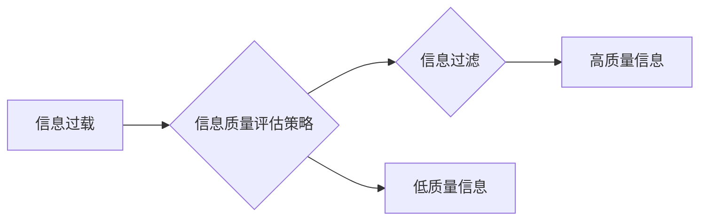

                 

## 信息过载与信息质量评估策略：批判性地评估和消费信息

> 关键词：信息过载、信息质量、评估策略、批判性思维、数据分析、信息过滤、知识管理

### 1. 背景介绍

在当今数字时代，信息以前所未有的速度和规模涌入我们的生活。从社交媒体到新闻网站，从学术期刊到在线论坛，我们每天接触到海量的数字信息。然而，这并非意味着我们拥有了更深层的理解或更明智的决策。相反，信息过载成为了一个普遍的挑战，阻碍着我们有效地获取、处理和利用信息。

信息过载是指个体或组织在面对大量信息时，难以有效地筛选、理解和记忆信息的能力下降。它会导致认知疲劳、决策困难、注意力分散以及对信息的信任度降低。

信息过载的负面影响已经渗透到各个方面，包括个人生活、工作效率、社会决策以及全球治理。面对信息爆炸，我们需要更加批判性地评估和消费信息，才能避免被误导，做出明智的判断。

### 2. 核心概念与联系

**2.1 信息质量**

信息质量是指信息在满足特定需求时，其准确性、完整性、及时性、相关性、一致性和可用性等方面的程度。高质量的信息能够帮助我们做出更明智的决策，促进知识的积累和创新。

**2.2 信息过载的影响**

信息过载会对个体和组织产生多方面的负面影响：

* **认知疲劳:** 处理大量信息会消耗大量的认知资源，导致注意力分散、记忆力下降和决策能力减弱。
* **信息筛选困难:** 难以从海量信息中筛选出真正有价值的信息，导致信息过滤效率低下。
* **决策困难:** 缺乏对信息的全面理解和准确评估，会导致决策失误和风险增加。
* **信任度降低:** 信息来源的多样性和可信度的差异，导致人们对信息的信任度降低。

**2.3 评估策略**

信息质量评估策略是指用于评估信息质量的系统方法和工具。这些策略可以帮助我们识别高质量的信息，并避免被低质量的信息误导。

**2.4 关键技术**

* **数据挖掘:** 从海量数据中提取有价值的信息，识别信息质量相关的特征。
* **机器学习:** 利用算法自动学习信息质量评估模型，提高评估效率和准确性。
* **自然语言处理:** 分析文本信息，识别信息质量相关的语义和结构特征。

**Mermaid 流程图**



### 3. 核心算法原理 & 具体操作步骤

**3.1 算法原理概述**

信息质量评估算法通常基于以下原理：

* **特征提取:** 从信息中提取相关特征，例如准确性、完整性、相关性、时效性等。
* **权重分配:** 为每个特征分配权重，根据其重要性进行加权。
* **评分模型:** 建立评分模型，根据特征值和权重计算信息质量得分。

**3.2 算法步骤详解**

1. **数据预处理:** 清洗和格式化数据，去除噪声和冗余信息。
2. **特征提取:** 使用数据挖掘和自然语言处理技术，从信息中提取相关特征。
3. **特征选择:** 基于特征重要性进行筛选，选择最能代表信息质量的特征。
4. **权重分配:** 为每个特征分配权重，根据其对信息质量的影响程度进行调整。
5. **评分模型构建:** 使用机器学习算法，构建信息质量评分模型。
6. **信息质量评估:** 将信息输入评分模型，计算其信息质量得分。

**3.3 算法优缺点**

* **优点:** 能够自动评估信息质量，提高效率和准确性。
* **缺点:** 需要大量的训练数据，算法模型的构建和优化需要专业知识。

**3.4 算法应用领域**

* **搜索引擎:** 提高搜索结果的质量和相关性。
* **新闻媒体:** 识别和过滤虚假新闻和谣言。
* **学术研究:** 评估研究论文的质量和可靠性。
* **电子商务:** 提高产品评论的真实性和有效性。

### 4. 数学模型和公式 & 详细讲解 & 举例说明

**4.1 数学模型构建**

信息质量评估模型可以采用多种数学模型，例如线性回归、支持向量机、决策树等。

**4.2 公式推导过程**

以线性回归为例，其目标是找到一条直线，将信息特征与信息质量得分进行拟合。

假设信息质量得分用 $y$ 表示，特征向量用 $x$ 表示，则线性回归模型可以表示为：

$$y = w_0 + w_1x_1 + w_2x_2 + ... + w_nx_n$$

其中，$w_0$ 为截距，$w_1, w_2, ..., w_n$ 为特征权重，$x_1, x_2, ..., x_n$ 为特征值。

**4.3 案例分析与讲解**

假设我们想要评估一篇新闻文章的信息质量，并选择了以下特征：

* $x_1$: 文章来源的信誉度
* $x_2$: 文章内容的准确性
* $x_3$: 文章的时效性

我们可以使用线性回归模型，根据训练数据，学习出特征权重 $w_1, w_2, w_3$ 和截距 $w_0$，从而预测该新闻文章的信息质量得分。

### 5. 项目实践：代码实例和详细解释说明

**5.1 开发环境搭建**

* Python 3.x
* scikit-learn 库

**5.2 源代码详细实现**

```python
from sklearn.linear_model import LinearRegression
from sklearn.model_selection import train_test_split

# 假设训练数据为 (特征向量, 信息质量得分)
X_train = [[1, 0.8, 0.9], [0.9, 0.7, 0.8], ...]
y_train = [0.8, 0.7, ...]

# 将数据分成训练集和测试集
X_train, X_test, y_train, y_test = train_test_split(X_train, y_train, test_size=0.2)

# 创建线性回归模型
model = LinearRegression()

# 训练模型
model.fit(X_train, y_train)

# 预测测试集的信息质量得分
y_pred = model.predict(X_test)

# 评估模型性能
from sklearn.metrics import mean_squared_error
mse = mean_squared_error(y_test, y_pred)
print(f"Mean Squared Error: {mse}")
```

**5.3 代码解读与分析**

* 使用 scikit-learn 库中的 `LinearRegression` 类创建线性回归模型。
* 使用 `train_test_split` 函数将数据分成训练集和测试集。
* 使用 `fit` 方法训练模型，学习特征权重和截距。
* 使用 `predict` 方法预测测试集的信息质量得分。
* 使用 `mean_squared_error` 函数评估模型性能。

**5.4 运行结果展示**

运行代码后，会输出测试集的平均平方误差 (MSE) 值，该值越小，模型的预测精度越高。

### 6. 实际应用场景

信息质量评估策略在各个领域都有广泛的应用场景：

* **搜索引擎:** 提高搜索结果的质量和相关性，过滤垃圾信息和虚假新闻。
* **新闻媒体:** 识别和过滤虚假新闻和谣言，提高新闻的可信度。
* **学术研究:** 评估研究论文的质量和可靠性，促进学术研究的规范化和高质量发展。
* **电子商务:** 提高产品评论的真实性和有效性，帮助消费者做出更明智的购买决策。
* **医疗保健:** 评估医疗信息的准确性和可靠性，提高医疗服务的质量。

**6.4 未来应用展望**

随着人工智能技术的不断发展，信息质量评估策略将更加智能化、自动化和个性化。未来，我们可以期待：

* **更精准的评估:** 利用深度学习等先进算法，实现更精准的信息质量评估。
* **更个性化的推荐:** 根据用户的需求和偏好，提供更个性化的信息推荐。
* **更有效的过滤:** 自动识别和过滤虚假信息、垃圾信息和恶意信息。
* **更全面的评估:** 评估信息质量的多个维度，包括准确性、完整性、时效性、相关性、可信度等。

### 7. 工具和资源推荐

**7.1 学习资源推荐**

* **书籍:**
    * 信息检索导论 (Introduction to Information Retrieval)
    * 数据挖掘 (Data Mining)
    * 机器学习 (Machine Learning)
* **在线课程:**
    * Coursera: 数据科学
    * edX: 机器学习
    * Udacity: 深度学习

**7.2 开发工具推荐**

* **Python:** 广泛应用于数据分析和机器学习领域。
* **scikit-learn:** Python 的机器学习库，提供各种算法和工具。
* **TensorFlow:** Google 开发的深度学习框架。
* **PyTorch:** Facebook 开发的深度学习框架。

**7.3 相关论文推荐**

* **Information Quality: Concepts, Models, and Measurement**
* **A Survey of Information Quality Assessment Techniques**
* **Deep Learning for Information Quality Assessment**

### 8. 总结：未来发展趋势与挑战

**8.1 研究成果总结**

信息质量评估策略已经取得了显著的进展，能够有效地评估信息质量，提高信息利用效率。

**8.2 未来发展趋势**

未来，信息质量评估策略将更加智能化、自动化和个性化，并应用于更广泛的领域。

**8.3 面临的挑战**

* **数据质量:** 信息质量评估依赖于高质量的数据，而现实世界的数据往往存在噪声、不完整和偏差等问题。
* **算法复杂性:** 一些信息质量评估算法非常复杂，需要大量的计算资源和专业知识。
* **伦理问题:** 信息质量评估可能会涉及到隐私、公平性和偏见等伦理问题。

**8.4 研究展望**

未来研究方向包括：

* 开发更鲁棒、更准确的信息质量评估算法。
* 探索新的信息质量评估指标和模型。
* 研究信息质量评估在不同领域和应用场景下的最佳实践。
* 关注信息质量评估的伦理问题，确保其公平、透明和可解释。

### 9. 附录：常见问题与解答

**9.1 如何选择合适的特征？**

特征的选择取决于具体的应用场景和信息类型。可以使用领域专家知识、数据分析和机器学习算法来选择最能代表信息质量的特征。

**9.2 如何评估模型的性能？**

可以使用多种指标来评估模型的性能，例如平均平方误差 (MSE)、R-squared 等。

**9.3 如何处理数据中的噪声和偏差？**

可以使用数据清洗、降维和异常值处理等技术来处理数据中的噪声和偏差。


作者：禅与计算机程序设计艺术 / Zen and the Art of Computer Programming 
<end_of_turn>

