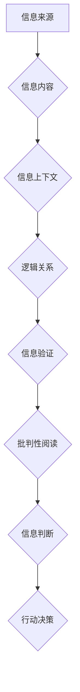

                 

## 信息验证和批判性阅读：在假新闻和媒体操纵时代导航

> 关键词：信息验证、批判性阅读、假新闻、媒体操纵、深度学习、自然语言处理、信息安全、网络安全、可信信息

### 1. 背景介绍

在信息爆炸的时代，我们每天都被海量的信息淹没。从社交媒体到新闻网站，从搜索引擎到电子邮件，信息无处不在。然而，这庞大的信息洪流中，真假难辨，虚假信息和恶意传播日益猖獗。假新闻、谣言、网络攻击等问题层出不穷，严重威胁着社会稳定和个人安全。

面对这种挑战，我们迫切需要掌握信息验证和批判性阅读的能力，才能在信息海洋中航行，辨别真伪，不被虚假信息所误导。

### 2. 核心概念与联系

**2.1 信息验证**

信息验证是指通过多种手段和方法，对信息的真实性、准确性和可靠性进行评估和确认的过程。它涉及到对信息来源、内容、上下文、逻辑关系等多方面的分析和判断。

**2.2 批判性阅读**

批判性阅读是指带着批判性思维去阅读和理解信息，不盲目接受，而是要积极思考、质疑、分析和评价。它要求读者能够识别信息的潜在偏见、逻辑谬误和情感操纵，并形成自己的独立判断。

**2.3 媒体操纵**

媒体操纵是指利用媒体平台和传播手段，有意地传播虚假信息、引导舆论、影响公众认知和行为的过程。它可以采取多种形式，例如制造假新闻、散播谣言、操控搜索结果、利用社交媒体进行舆论引导等。

**2.4  信息安全与网络安全**

信息安全是指保护信息不被未经授权的访问、使用、披露、修改或销毁的过程。网络安全则是指保护计算机网络和信息系统免受攻击、破坏和干扰的过程。

**2.5  深度学习与自然语言处理**

深度学习是一种机器学习方法，它利用多层神经网络来模拟人类大脑的学习过程。自然语言处理（NLP）则是指让计算机能够理解、处理和生成人类语言的技术。

**Mermaid 流程图**



### 3. 核心算法原理 & 具体操作步骤

**3.1 算法原理概述**

信息验证和批判性阅读的核心算法原理主要基于深度学习和自然语言处理技术。通过训练大量的真实和虚假信息数据，深度学习模型能够学习识别信息的特征和模式，从而判断信息的真实性。

**3.2 算法步骤详解**

1. **数据收集和预处理:** 收集大量真实和虚假信息的文本数据，并进行预处理，例如去除停用词、分词、词性标注等。
2. **模型训练:** 使用深度学习模型，例如循环神经网络（RNN）或卷积神经网络（CNN），对预处理后的数据进行训练，学习识别信息的特征和模式。
3. **特征提取:** 将待验证的信息输入到训练好的模型中，提取其特征向量。
4. **分类判断:** 根据特征向量，将信息分类为真实或虚假。
5. **结果输出:** 输出信息分类结果，并提供相关证据和分析。

**3.3 算法优缺点**

**优点:**

* **高准确率:** 深度学习模型能够学习识别复杂的模式，从而实现较高的信息验证准确率。
* **自动化程度高:** 信息验证过程可以自动化，提高效率。
* **可扩展性强:** 可以扩展到处理不同类型和语言的信息。

**缺点:**

* **数据依赖性强:** 模型的性能取决于训练数据的质量和数量。
* **解释性差:** 深度学习模型的决策过程难以解释，难以理解模型是如何判断信息的真实性的。
* **对抗攻击脆弱:** 恶意攻击者可以设计对抗样本，绕过模型的验证。

**3.4 算法应用领域**

* **新闻媒体:** 验证新闻真实性，识别假新闻和谣言。
* **社交媒体:** 识别恶意传播和网络攻击。
* **搜索引擎:** 提高搜索结果的准确性和可靠性。
* **教育领域:** 帮助学生提高批判性阅读能力。
* **政府机构:** 识别网络威胁和信息战。

### 4. 数学模型和公式 & 详细讲解 & 举例说明

**4.1 数学模型构建**

信息验证算法通常基于概率模型，例如贝叶斯网络或条件随机场（CRF）。这些模型将信息特征和标签（真实或虚假）之间的关系建模为概率分布。

**4.2 公式推导过程**

例如，使用贝叶斯网络进行信息验证，可以推导出以下公式：

$$P(真实|特征) = \frac{P(特征|真实) * P(真实)}{P(特征)}$$

其中：

* $P(真实|特征)$ 是给定特征条件下信息为真实的信息概率。
* $P(特征|真实)$ 是信息为真实的情况下出现特征的概率。
* $P(真实)$ 是信息为真实的信息概率。
* $P(特征)$ 是出现特征的概率。

**4.3 案例分析与讲解**

假设我们有一个信息，其特征包括：

* 来自不可信的网站
* 语言风格夸张
* 缺乏事实依据

我们可以根据这些特征，结合贝叶斯网络模型，计算出该信息为虚假的信息概率。

### 5. 项目实践：代码实例和详细解释说明

**5.1 开发环境搭建**

* Python 3.x
* TensorFlow 或 PyTorch 深度学习框架
* NLTK 自然语言处理库
* 其他必要的库和工具

**5.2 源代码详细实现**

```python
# 导入必要的库
import tensorflow as tf
from nltk.corpus import stopwords
from nltk.tokenize import word_tokenize

# 数据预处理
def preprocess_text(text):
    # 去除停用词
    stop_words = set(stopwords.words('english'))
    words = word_tokenize(text)
    filtered_words = [word for word in words if word.lower() not in stop_words]
    # 其他预处理步骤，例如词性标注、词嵌入等

# 模型训练
model = tf.keras.Sequential([
    tf.keras.layers.Embedding(input_dim=vocab_size, output_dim=embedding_dim),
    tf.keras.layers.LSTM(units=128),
    tf.keras.layers.Dense(units=1, activation='sigmoid')
])
model.compile(optimizer='adam', loss='binary_crossentropy', metrics=['accuracy'])
model.fit(X_train, y_train, epochs=10)

# 信息验证
def verify_text(text):
    # 预处理文本
    processed_text = preprocess_text(text)
    # 将预处理后的文本输入到模型中
    prediction = model.predict(processed_text)
    # 返回预测结果
    return prediction > 0.5

# 运行结果展示
text = "This is a fake news article."
is_fake = verify_text(text)
print(f"Is the text fake? {is_fake}")
```

**5.3 代码解读与分析**

这段代码展示了使用深度学习模型进行信息验证的基本流程。

* 数据预处理：将文本数据转换为模型可以理解的格式。
* 模型训练：使用训练数据训练深度学习模型，学习识别信息的特征和模式。
* 信息验证：将待验证的信息输入到训练好的模型中，获取预测结果。

**5.4 运行结果展示**

运行代码后，会输出一个布尔值，表示该文本是否被预测为虚假信息。

### 6. 实际应用场景

**6.1 新闻媒体**

新闻媒体可以使用信息验证技术来识别假新闻和谣言，提高新闻的真实性和可靠性。

**6.2 社交媒体**

社交媒体平台可以使用信息验证技术来识别恶意传播和网络攻击，保护用户免受虚假信息和有害内容的侵害。

**6.3 搜索引擎**

搜索引擎可以使用信息验证技术来提高搜索结果的准确性和可靠性，避免用户被虚假信息误导。

**6.4 未来应用展望**

随着人工智能技术的不断发展，信息验证技术将得到更广泛的应用，例如：

* **个性化信息验证:** 根据用户的兴趣和偏好，提供个性化的信息验证服务。
* **跨语言信息验证:** 支持多种语言的信息验证，打破语言障碍。
* **多模态信息验证:** 结合文本、图像、音频等多种模态信息进行验证，提高验证的准确性和可靠性。

### 7. 工具和资源推荐

**7.1 学习资源推荐**

* **书籍:**
    * 《深度学习》 by Ian Goodfellow, Yoshua Bengio, and Aaron Courville
    * 《自然语言处理》 by Dan Jurafsky and James H. Martin
* **在线课程:**
    * Coursera: Deep Learning Specialization
    * edX: Natural Language Processing with Deep Learning

**7.2 开发工具推荐**

* **TensorFlow:** https://www.tensorflow.org/
* **PyTorch:** https://pytorch.org/
* **NLTK:** https://www.nltk.org/

**7.3 相关论文推荐**

* **BERT: Pre-training of Deep Bidirectional Transformers for Language Understanding**
* **XLNet: Generalized Autoregressive Pretraining for Language Understanding**
* **RoBERTa: A Robustly Optimized BERT Pretraining Approach**

### 8. 总结：未来发展趋势与挑战

**8.1 研究成果总结**

近年来，信息验证和批判性阅读领域取得了显著进展，深度学习和自然语言处理技术为信息验证提供了强大的工具。

**8.2 未来发展趋势**

未来，信息验证技术将朝着以下方向发展：

* **更准确的验证:** 提高模型的准确率，减少虚假信息被误判为真实信息的概率。
* **更全面的验证:** 考虑更多信息特征，例如图像、音频、视频等，进行更全面的验证。
* **更可解释的验证:** 提高模型的解释性，让用户能够理解模型是如何判断信息的真实性的。

**8.3 面临的挑战**

信息验证技术也面临着一些挑战：

* **数据偏差:** 训练数据可能存在偏差，导致模型产生偏见。
* **对抗攻击:** 恶意攻击者可以设计对抗样本，绕过模型的验证。
* **伦理问题:** 信息验证技术可能会被滥用，例如用于监控和控制用户行为。

**8.4 研究展望**

未来，我们需要继续研究和探索信息验证技术，使其更加准确、全面、可解释，并解决其面临的挑战，为构建一个更加信任和安全的网络环境做出贡献。

### 9. 附录：常见问题与解答

**常见问题:**

* 如何判断一个信息是真实还是虚假？
* 如何提高自己的批判性阅读能力？
* 如何保护自己免受虚假信息和网络攻击的侵害？

**解答:**

* 信息验证是一个复杂的过程，需要综合考虑多种因素，例如信息来源、内容、上下文、逻辑关系等。
* 提高批判性阅读能力需要多方面努力，例如培养质疑精神、分析信息的能力、识别逻辑谬误的能力等。
* 保护自己免受虚假信息和网络攻击的侵害，可以采取一些措施，例如：
    * 关注信息来源的可靠性。
    * 仔细阅读信息内容，识别逻辑谬误和情感操纵。
    * 多方核实信息，不要轻易相信单一来源的信息。
    * 使用安全软件和工具，保护自己的设备和数据。


作者：禅与计算机程序设计艺术 / Zen and the Art of Computer Programming 
<end_of_turn>

