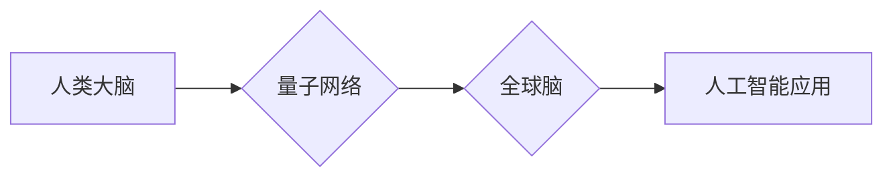

                 

## 全球脑与量子计算:突破认知极限的新可能

> 关键词：全球脑、量子计算、人工智能、认知增强、神经网络、量子算法、未来科技

## 1. 背景介绍

人类文明的进步离不开对认知能力的不断提升。从语言的出现到文字的创造，再到科学技术的革新，每一次突破都源于我们对世界和自身的更深层次的理解。然而，人类的认知能力始终存在着局限性。信息处理速度、记忆容量、推理能力等方面都受到生物学结构和进化历史的制约。

近年来，人工智能（AI）的蓬勃发展为突破认知极限提供了新的可能性。深度学习算法的出现，使得机器能够模拟人类大脑的部分功能，例如图像识别、自然语言处理等。然而，传统的AI模型仍然依赖于经典计算，其处理能力和效率有限，难以真正实现与人类大脑相媲美的认知水平。

量子计算作为一种新兴的计算 paradigm，拥有超越经典计算的强大潜力。它利用量子力学原理，例如叠加和纠缠，可以实现指数级的计算速度提升。量子计算的出现为构建“全球脑”——一个连接着人类大脑的超级智能网络——提供了技术基础。

## 2. 核心概念与联系

**2.1 全球脑的概念**

全球脑是一个由众多个体大脑连接而成的超级智能网络。它旨在通过共享信息、协同计算和共同学习，实现超越单个大脑的认知能力。

**2.2 量子计算的优势**

量子计算相对于经典计算具有以下优势：

* **指数级计算速度提升:** 量子算法可以利用叠加和纠缠等量子力学原理，在某些特定问题上比经典算法快出指数级。
* **解决经典计算难以解决的问题:** 一些经典计算问题，例如药物发现、材料设计、密码破解等，量子计算可以提供全新的解决方案。
* **模拟复杂系统:** 量子计算机可以模拟复杂量子系统，例如分子、原子等，为科学研究提供新的工具。

**2.3 全球脑与量子计算的结合**

将量子计算与全球脑相结合，可以实现以下目标：

* **加速信息处理和知识共享:** 量子计算可以极大地提高全球脑的信息处理速度和效率，实现更快速、更有效的知识共享。
* **增强认知能力:** 量子算法可以帮助全球脑进行更复杂的推理、决策和创造性思考，提升整体认知能力。
* **实现跨越物种的沟通:** 量子计算可以为不同物种之间建立沟通桥梁，促进生物多样性之间的理解和合作。

**2.4 架构图**



## 3. 核心算法原理 & 具体操作步骤

**3.1 算法原理概述**

构建全球脑的核心算法需要结合量子计算和神经网络等多种技术。

* **量子神经网络:** 将量子计算原理融入神经网络结构，利用量子叠加和纠缠等特性实现更强大的信息处理能力。
* **量子优化算法:** 用于解决全球脑中复杂的资源分配、任务调度等问题，提高整体效率。
* **量子机器学习:** 利用量子计算加速机器学习算法的训练和推理过程，提升全球脑的学习能力和适应性。

**3.2 算法步骤详解**

1. **数据采集和预处理:** 从人类大脑、网络、传感器等各种来源收集数据，并进行预处理，例如清洗、转换、特征提取等。
2. **量子神经网络训练:** 利用量子计算平台训练量子神经网络模型，学习数据中的模式和规律。
3. **量子优化:** 使用量子优化算法优化全球脑的资源分配、任务调度等策略，提高整体效率。
4. **量子机器学习:** 利用量子机器学习算法不断学习和更新全球脑的知识库，提升其认知能力和适应性。
5. **信息共享和协同计算:** 通过量子网络连接各个大脑节点，实现信息共享和协同计算，共同解决复杂问题。

**3.3 算法优缺点**

**优点:**

* 突破传统计算的局限性，实现指数级计算速度提升。
* 增强认知能力，实现更复杂的推理、决策和创造性思考。
* 促进跨越物种的沟通，促进生物多样性之间的理解和合作。

**缺点:**

* 量子计算技术尚处于发展初期，需要克服技术挑战。
* 数据安全和隐私保护需要得到充分保障。
* 全球脑的伦理和社会影响需要进行深入研究和讨论。

**3.4 算法应用领域**

* **科学研究:** 探索宇宙奥秘、发现新药、设计新材料等。
* **医疗保健:** 诊断疾病、个性化治疗、开发新疗法等。
* **教育:** 个性化学习、智能辅导、知识发现等。
* **艺术创作:** 生成艺术作品、创作音乐、编写剧本等。

## 4. 数学模型和公式 & 详细讲解 & 举例说明

**4.1 数学模型构建**

全球脑的数学模型可以基于图论、网络科学和信息论等理论构建。

* **图论:** 将人类大脑和量子网络节点视为图的节点，连接线表示信息传递路径。
* **网络科学:** 研究网络结构、信息传播和群体行为等，为全球脑的组织和运作提供理论基础。
* **信息论:** 量化信息传递和处理过程，为全球脑的效率和可靠性提供评估指标。

**4.2 公式推导过程**

例如，可以利用信息熵的概念来衡量全球脑的信息处理能力。

$$H(X) = - \sum_{i} p(x_i) \log_2 p(x_i)$$

其中，$H(X)$表示随机变量$X$的信息熵，$p(x_i)$表示事件$x_i$的概率。

**4.3 案例分析与讲解**

假设全球脑需要解决一个复杂的科学问题，例如寻找新的抗癌药物。

* **数据采集:** 从公开数据库、科研论文等来源收集相关数据，例如药物结构、生物活性等。
* **量子神经网络训练:** 利用量子计算平台训练量子神经网络模型，学习药物结构与生物活性的关系。
* **量子优化:** 使用量子优化算法优化药物设计方案，找到最有可能具有抗癌活性的药物候选物。
* **信息共享:** 将研究成果共享到全球脑网络中，供其他科学家参考和利用。

## 5. 项目实践：代码实例和详细解释说明

**5.1 开发环境搭建**

* **量子计算平台:** 选择合适的量子计算平台，例如IBM Quantum Experience、Google Quantum AI等。
* **编程语言:** 使用支持量子计算的编程语言，例如Qiskit、Cirq等。
* **软件工具:** 安装必要的软件工具，例如IDE、仿真器等。

**5.2 源代码详细实现**

```python
from qiskit import QuantumCircuit, Aer, execute

# 创建量子电路
qc = QuantumCircuit(2)

# 应用量子门
qc.h(0)
qc.cx(0, 1)

# 测量量子比特
qc.measure(0, 0)
qc.measure(1, 1)

# 模拟运行
simulator = Aer.get_backend('qasm_simulator')
job = execute(qc, simulator, shots=1024)
result = job.result()
counts = result.get_counts(qc)

# 打印结果
print(counts)
```

**5.3 代码解读与分析**

这段代码演示了如何使用Qiskit库创建并运行一个简单的量子电路。

* `QuantumCircuit(2)` 创建一个包含两个量子比特的量子电路。
* `qc.h(0)` 应用Hadamard门到第一个量子比特，将它置于叠加态。
* `qc.cx(0, 1)` 应用CNOT门，将第一个量子比特的状态复制到第二个量子比特。
* `qc.measure(0, 0)` 测量第一个量子比特并将其结果存储到经典比特0。
* `qc.measure(1, 1)` 测量第二个量子比特并将其结果存储到经典比特1。
* `execute(qc, simulator, shots=1024)` 模拟运行量子电路1024次。
* `result.get_counts(qc)` 获取测量结果的计数。

**5.4 运行结果展示**

运行结果将显示两个量子比特的测量结果计数，例如：

```
{00: 512, 11: 512}
```

这表明两个量子比特处于纠缠态，测量结果相互关联。

## 6. 实际应用场景

**6.1 科学研究**

* **药物发现:** 利用量子计算加速药物设计和筛选，找到更有效的治疗方案。
* **材料科学:** 模拟材料的微观结构和性质，设计新型材料。
* **宇宙学:** 研究宇宙的起源、演化和结构。

**6.2 医疗保健**

* **疾病诊断:** 利用量子计算分析患者的基因信息和医疗影像，提高诊断准确率。
* **个性化治疗:** 根据患者的基因信息和病史，制定个性化的治疗方案。
* **医疗影像分析:** 利用量子计算处理和分析医疗影像，辅助医生诊断和治疗。

**6.3 教育**

* **个性化学习:** 根据学生的学习进度和能力，提供个性化的学习内容和教学方法。
* **智能辅导:** 利用量子计算开发智能辅导系统，帮助学生解决学习难题。
* **知识发现:** 利用量子计算分析海量数据，发现新的知识和规律。

**6.4 未来应用展望**

* **人工智能增强:** 将量子计算与人工智能相结合，构建更强大的智能系统。
* **量子互联网:** 建立基于量子通信的全球网络，实现更安全、更高速的信息传输。
* **人类意识上传:** 将人类意识上传到量子计算机，实现永生和意识的扩展。

## 7. 工具和资源推荐

**7.1 学习资源推荐**

* **书籍:**
    * 《量子计算与量子信息》
    * 《量子机器学习》
    * 《全球脑》
* **在线课程:**
    * Coursera: 量子计算基础
    * edX: 量子信息科学
    * MIT OpenCourseWare: 量子力学

**7.2 开发工具推荐**

* **Qiskit:** Python 量子计算库
* **Cirq:** Python 量子计算库
* **PennyLane:** Python 量子机器学习库

**7.3 相关论文推荐**

* 《Quantum Supremacy Using a Programmable Superconducting Processor》
* 《Quantum Machine Learning》
* 《Global Brain: Towards a Collective Intelligence》

## 8. 总结：未来发展趋势与挑战

**8.1 研究成果总结**

近年来，量子计算和人工智能领域取得了显著进展，为构建全球脑提供了技术基础。量子计算的计算能力不断提升，人工智能算法不断完善，为突破认知极限提供了新的可能性。

**8.2 未来发展趋势**

* **量子硬件的不断发展:** 量子比特的稳定性和纠缠时间将进一步提升，量子计算能力将得到指数级增长。
* **量子算法的创新:** 将开发更多高效的量子算法，解决更复杂的问题。
* **人工智能与量子计算的融合:** 将量子计算与人工智能相结合，构建更强大的智能系统。

**8.3 面临的挑战**

* **量子硬件的制造成本高:** 量子计算机的制造和维护成本仍然很高，需要进一步降低成本。
* **量子算法的开发难度大:** 开发量子算法需要深入理解量子力学原理，难度较大。
* **数据安全和隐私保护:** 全球脑的运行需要处理大量数据，需要确保数据安全和隐私保护。

**8.4 研究展望**

未来，全球脑的研究将继续深入，探索人类认知的本质，并为人类社会带来新的机遇和挑战。


## 9. 附录：常见问题与解答

**9.1 全球脑是否会取代人类？**

全球脑的目的是增强人类认知能力，而不是取代人类。人类的创造力、情感和伦理意识是全球脑无法替代的。

**9.2 全球脑会带来哪些伦理问题？**

全球脑的运行需要考虑伦理问题，例如数据隐私、算法偏见、意识上传等。需要制定相应的伦理规范和法律法规，确保全球脑的健康发展。

**9.3 全球脑何时能够实现？**

全球脑的实现是一个长期目标，需要克服许多技术和伦理挑战。预计还需要相当长的时间才能实现。


作者：禅与计算机程序设计艺术 / Zen and the Art of Computer Programming 
<end_of_turn>

