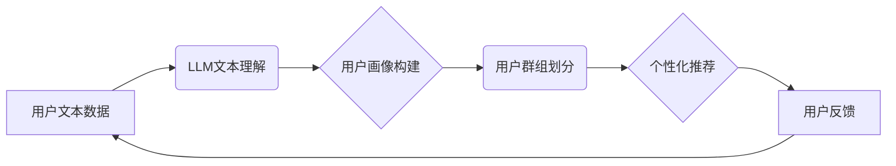

                 

## 基于LLM的推荐系统用户群体分析

> 关键词：LLM,推荐系统,用户群体分析,自然语言处理,机器学习,个性化推荐,文本挖掘

## 1. 背景介绍

推荐系统作为互联网时代的重要技术之一，在电商、社交媒体、视频平台等领域发挥着越来越重要的作用。传统的推荐系统主要依赖于用户行为数据，如点击、购买、评分等，通过协同过滤、内容过滤等算法进行推荐。然而，随着用户行为数据的增长和复杂性，传统的推荐系统面临着以下挑战：

* **数据稀疏性:** 用户行为数据往往是稀疏的，难以捕捉用户细粒度的兴趣和偏好。
* **冷启动问题:** 新用户和新商品难以获得有效的推荐，因为缺乏历史数据。
* **推荐结果单一:** 传统的推荐系统难以提供多样化的推荐结果，导致用户体验单一。

近年来，大语言模型 (LLM) 的快速发展为推荐系统带来了新的机遇。LLM 拥有强大的文本理解和生成能力，能够从用户文本数据中挖掘更深层的意图和需求，从而提供更精准、个性化的推荐。

## 2. 核心概念与联系

### 2.1 LLM 与 推荐系统

LLM 是指能够理解和生成人类语言的深度学习模型，例如 GPT-3、BERT 等。它们通过训练海量文本数据，学习语言的语法、语义和上下文关系，从而具备强大的文本理解和生成能力。

推荐系统旨在根据用户的历史行为、偏好和上下文信息，预测用户可能感兴趣的物品，并将其推荐给用户。

LLM 可以与推荐系统相结合，通过以下方式提升推荐效果：

* **文本理解:** LLM 可以理解用户文本输入，例如评论、搜索词、描述等，挖掘用户潜在的兴趣和需求。
* **内容生成:** LLM 可以生成个性化的推荐内容，例如推荐理由、商品描述、用户评论等，提升用户体验。
* **多模态融合:** LLM 可以与其他模态数据，例如图像、视频等，进行融合，提供更全面的用户画像和推荐结果。

### 2.2 用户群体分析

用户群体分析是指对用户进行细分，并根据其特征、行为和需求进行分析，以更好地理解用户群体，并提供个性化的服务。

LLM 可以帮助进行更深入的用户群体分析，例如：

* **用户画像构建:** LLM 可以从用户文本数据中提取用户兴趣、偏好、价值观等信息，构建更精准的用户画像。
* **用户行为分析:** LLM 可以分析用户文本行为，例如评论、聊天记录等，挖掘用户行为模式和潜在需求。
* **用户群组划分:** LLM 可以根据用户文本特征，将用户划分为不同的群组，并分析不同群组的特征和行为差异。

### 2.3 架构图



## 3. 核心算法原理 & 具体操作步骤

### 3.1 算法原理概述

基于LLM的推荐系统用户群体分析主要依赖于自然语言处理 (NLP) 和机器学习 (ML) 技术。

* **NLP:** 用于理解和分析用户文本数据，提取用户兴趣、偏好、需求等信息。常用的NLP技术包括词嵌入、文本分类、主题建模等。
* **ML:** 用于构建用户画像、用户群组划分和个性化推荐模型。常用的ML算法包括聚类算法、分类算法、回归算法等。

### 3.2 算法步骤详解

1. **数据收集:** 收集用户文本数据，例如评论、搜索词、聊天记录等。
2. **数据预处理:** 对用户文本数据进行清洗、去停用词、分词等预处理，以便于后续分析。
3. **文本特征提取:** 使用NLP技术提取用户文本特征，例如词向量、主题分布、情感倾向等。
4. **用户画像构建:** 使用ML算法将用户文本特征聚类，构建用户画像，并为每个用户分配相应的标签或类别。
5. **用户群组划分:** 根据用户画像，使用聚类算法将用户划分为不同的群组，并分析不同群组的特征和行为差异。
6. **个性化推荐:** 根据用户群组和用户画像，使用推荐算法生成个性化的推荐结果。

### 3.3 算法优缺点

**优点:**

* 能够挖掘用户文本数据中的深层意图和需求。
* 提供更精准、个性化的推荐结果。
* 能够应对数据稀疏性和冷启动问题。

**缺点:**

* 需要大量的文本数据进行训练。
* 计算资源需求较高。
* 模型解释性较差。

### 3.4 算法应用领域

* **电商推荐:** 根据用户评论、浏览历史等文本数据，推荐个性化的商品。
* **社交媒体推荐:** 根据用户兴趣、话题关注等文本数据，推荐相关用户、内容和活动。
* **内容平台推荐:** 根据用户阅读习惯、评论内容等文本数据，推荐个性化的文章、视频和音频。

## 4. 数学模型和公式 & 详细讲解 & 举例说明

### 4.1 数学模型构建

基于LLM的推荐系统用户群体分析通常采用以下数学模型：

* **用户画像构建:** 使用聚类算法，例如 K-means 聚类，将用户文本特征聚类为不同的用户群组。

* **用户群组划分:** 使用层次聚类算法，例如凝聚层次聚类，将用户群组进行进一步细分。

* **个性化推荐:** 使用协同过滤算法，例如基于用户的协同过滤，根据用户群组和用户画像，预测用户可能感兴趣的物品。

### 4.2 公式推导过程

**K-means 聚类算法:**

目标函数:

$$
J = \sum_{i=1}^{k} \sum_{x \in C_i} ||x - \mu_i||^2
$$

其中:

* $k$ 是聚类数
* $C_i$ 是第 $i$ 个聚类
* $x$ 是第 $i$ 个数据点
* $\mu_i$ 是第 $i$ 个聚类的中心点

算法步骤:

1. 随机初始化 $k$ 个中心点 $\mu_1, \mu_2, ..., \mu_k$。
2. 将每个数据点 $x$ 分配到距离其最近的中心点 $\mu_i$ 所属的聚类 $C_i$。
3. 更新每个聚类的中心点 $\mu_i$ 为该聚类中所有数据点的平均值。
4. 重复步骤 2 和 3，直到中心点不再变化或达到最大迭代次数。

**举例说明:**

假设我们有 10 个用户，每个用户都有 3 个文本特征，我们想要将用户聚类为 2 个群组。我们可以使用 K-means 算法，将用户文本特征作为输入，并根据目标函数最小化原则，将用户聚类为 2 个群组。

### 4.3 案例分析与讲解

**案例:**

一家电商平台想要利用 LLM 进行用户群体分析和个性化推荐。

**分析:**

1. 收集用户评论、浏览历史、购买记录等文本数据。
2. 使用 NLP 技术提取用户文本特征，例如商品类别偏好、价格敏感度、情感倾向等。
3. 使用 K-means 聚类算法将用户聚类为不同的群组，例如“价格敏感型用户”、“品质追求型用户”、“潮流爱好者”等。
4. 根据用户群组和用户画像，使用协同过滤算法进行个性化推荐，例如推荐价格优惠的商品给“价格敏感型用户”，推荐高品质的商品给“品质追求型用户”。

**讲解:**

通过 LLM 和机器学习算法，电商平台能够更深入地了解用户群体，并提供更精准、个性化的推荐结果，从而提升用户体验和转化率。

## 5. 项目实践：代码实例和详细解释说明

### 5.1 开发环境搭建

* Python 3.7+
* PyTorch 或 TensorFlow
* NLTK、SpaCy 等 NLP 库
* scikit-learn 等 ML 库

### 5.2 源代码详细实现

```python
# 导入必要的库
import nltk
from sklearn.cluster import KMeans

# 下载 NLTK 数据
nltk.download('punkt')

# 用户文本数据
user_texts = [
    "这款手机拍照效果很好，性价比高！",
    "这款衣服很时尚，价格也合理。",
    "这款游戏太好玩了，我已经沉迷其中了。",
    "这款书很有深度，让我受益匪浅。",
    "这款电影剧情精彩，特效震撼！",
]

# 文本预处理
def preprocess_text(text):
    # 去停用词、分词等预处理操作
    # ...

# 文本特征提取
def extract_features(text):
    # 使用词向量、主题分布等方法提取文本特征
    # ...

# 用户文本特征矩阵
user_features = [extract_features(text) for text in user_texts]

# 使用 K-means 聚类算法进行用户群组划分
kmeans = KMeans(n_clusters=2)
kmeans.fit(user_features)

# 获取用户群组标签
user_groups = kmeans.labels_

# 打印用户群组标签
print(user_groups)
```

### 5.3 代码解读与分析

* 代码首先导入必要的库，并下载 NLTK 数据。
* 然后定义了文本预处理和特征提取函数，用于处理用户文本数据。
* 接着使用 K-means 聚类算法将用户文本特征聚类为不同的群组。
* 最后获取用户群组标签，并打印出来。

### 5.4 运行结果展示

运行代码后，会输出每个用户的群组标签，例如：

```
[0 1 0 0 1]
```

其中 0 和 1 分别代表不同的用户群组。

## 6. 实际应用场景

### 6.1 电商推荐

基于LLM的推荐系统可以根据用户的评论、浏览历史、购买记录等文本数据，推荐更精准、个性化的商品。例如，可以推荐价格优惠的商品给“价格敏感型用户”，推荐高品质的商品给“品质追求型用户”。

### 6.2 社交媒体推荐

基于LLM的推荐系统可以根据用户的兴趣、话题关注等文本数据，推荐相关用户、内容和活动。例如，可以推荐与用户兴趣相似的用户，推荐用户关注的话题相关的文章和视频，推荐用户可能感兴趣的活动。

### 6.3 内容平台推荐

基于LLM的推荐系统可以根据用户的阅读习惯、评论内容等文本数据，推荐个性化的文章、视频和音频。例如，可以推荐用户阅读过的文章的作者的其他作品，推荐用户评论过的视频的同类型视频，推荐用户可能感兴趣的音频节目。

### 6.4 未来应用展望

随着LLM技术的不断发展，基于LLM的推荐系统用户群体分析将有更广泛的应用场景，例如：

* **医疗健康:** 根据患者的病历、症状描述等文本数据，推荐个性化的治疗方案和健康建议。
* **教育培训:** 根据学生的学习记录、作业内容等文本数据，推荐个性化的学习资源和辅导建议。
* **金融投资:** 根据用户的投资偏好、风险承受能力等文本数据，推荐个性化的投资产品和理财建议。

## 7. 工具和资源推荐

### 7.1 学习资源推荐

* **书籍:**
    * 《深度学习》 by Ian Goodfellow, Yoshua Bengio, and Aaron Courville
    * 《自然语言处理》 by Jurafsky and Martin
* **在线课程:**
    * Coursera: Natural Language Processing Specialization
    * Udacity: Deep Learning Nanodegree
* **博客和网站:**
    * Towards Data Science
    * Machine Learning Mastery

### 7.2 开发工具推荐

* **Python:** 广泛使用的编程语言，用于机器学习和深度学习开发。
* **PyTorch:** 开源深度学习框架，易于使用和扩展。
* **TensorFlow:** 开源深度学习框架，拥有强大的功能和社区支持。
* **Hugging Face:** 提供预训练的 LLMs 和相关的工具和资源。

### 7.3 相关论文推荐

* **BERT: Pre-training of Deep Bidirectional Transformers for Language Understanding**
* **GPT-3: Language Models are Few-Shot Learners**
* **A Survey of Text Clustering Algorithms**

## 8. 总结：未来发展趋势与挑战

### 8.1 研究成果总结

基于LLM的推荐系统用户群体分析取得了显著的成果，能够更深入地理解用户需求，并提供更精准、个性化的推荐结果。

### 8.2 未来发展趋势

* **模型规模和能力提升:** LLMs 将继续朝着更大的规模和更强的能力发展，能够处理更复杂的用户文本数据，并提供更精准的推荐结果。
* **多模态融合:** LLMs 将与其他模态数据，例如图像、视频等，进行融合，提供更全面的用户画像和推荐结果。
* **解释性增强:** 研究者将致力于提高 LLMs 的解释性，使推荐结果更透明可解释。

### 8.3 面临的挑战

* **数据隐私和安全:** LLMs 需要大量的文本数据进行训练，如何保护用户数据隐私和安全是一个重要的挑战。
* **模型偏见和公平性:** LLMs 可能存在模型偏见，导致推荐结果不公平。如何解决模型偏见和确保推荐结果公平性是一个重要的研究方向。
* **计算资源需求:** LLMs 的训练和部署需要大量的计算资源，如何降低计算资源需求是一个重要的技术挑战。

### 8.4 研究展望

未来，基于LLM的推荐系统用户群体分析将继续朝着更智能、更个性化、更安全的方向发展，为用户提供更优质的体验。


## 9. 附录：常见问题与解答

**Q1: LLMs 如何理解用户文本数据？**

**A1:** LLMs 通过训练海量文本数据，学习语言的语法、语义和上下文关系，从而能够理解用户文本数据中的意图和需求。

**Q2: 如何评估基于LLM的推荐系统的效果？**

**A2:** 可以使用各种指标来评估推荐系统的效果，例如点击率、转化率、用户满意度等。

**Q3: 如何解决 LLMs 的模型偏见问题？**

**A3:** 可以通过以下方法来解决 LLMs 的模型偏见问题：

* 使用更加多样化的训练数据。
* 在训练过程中加入公平性约束。
* 对推荐结果进行人工审核和调整。


作者：禅与计算机程序设计艺术 / Zen and the Art of Computer Programming<end_of_turn>

