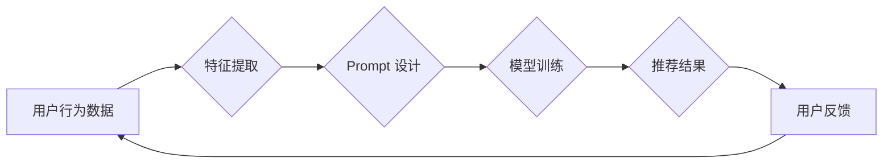

                 

## 基于Prompt Learning的新闻推荐

> 关键词：Prompt Learning, 新闻推荐, 自然语言处理, Transformer, 知识蒸馏, 个性化推荐

## 1. 背景介绍

新闻推荐作为信息获取和传播的重要环节，在海量信息时代显得尤为关键。传统的新闻推荐系统主要依赖于基于内容的推荐、协同过滤等方法，但这些方法往往难以捕捉用户细粒度的兴趣偏好，且对新用户和新内容的推荐效果较差。近年来，随着深度学习技术的快速发展，基于深度学习的新闻推荐系统逐渐成为研究热点。

Prompt Learning 作为一种新型的自然语言处理技术，通过精心设计的 Prompt 来引导模型生成更精准、更有针对性的输出。它在文本生成、问答系统、机器翻译等领域取得了显著成果。将 Prompt Learning 应用于新闻推荐领域，可以有效提升推荐系统的个性化程度和准确性。

## 2. 核心概念与联系

### 2.1 Prompt Learning 原理

Prompt Learning 的核心思想是通过设计合适的 Prompt 来引导模型生成更符合预期结果的输出。Prompt 可以看作是给模型提供的一段输入文本，它包含了模型需要了解的信息和期望的输出形式。

通过训练模型在不同的 Prompt 下生成不同的输出，可以学习到模型如何理解和响应不同的指令，从而提高模型的泛化能力和适应性。

### 2.2 新闻推荐系统架构

传统的新闻推荐系统通常包含以下几个模块：

* **数据采集和预处理:** 收集新闻数据，并进行清洗、格式化等预处理工作。
* **特征提取:** 从新闻内容中提取特征，例如关键词、主题、作者等。
* **推荐模型:** 基于提取的特征，对用户进行建模，并预测用户对新闻的兴趣。
* **推荐结果展示:** 将推荐结果以用户友好的方式展示给用户。

### 2.3 Prompt Learning 与新闻推荐的结合

将 Prompt Learning 应用于新闻推荐系统，可以将其融入到推荐模型的训练过程中。

例如，可以设计 Prompt 来引导模型生成用户感兴趣的新闻主题、关键词或作者等信息，从而提高推荐模型的个性化程度和准确性。

**Mermaid 流程图**



## 3. 核心算法原理 & 具体操作步骤

### 3.1 算法原理概述

基于 Prompt Learning 的新闻推荐算法的核心思想是利用 Transformer 模型的强大的文本理解能力，通过精心设计的 Prompt 来引导模型生成更符合用户兴趣的新闻推荐结果。

具体来说，该算法首先需要对用户历史行为数据进行分析，提取用户的兴趣偏好信息，然后根据这些信息设计相应的 Prompt。

Prompt 可以包含用户的兴趣领域、阅读习惯、新闻偏好等信息，引导模型生成更精准的推荐结果。

### 3.2 算法步骤详解

1. **数据预处理:** 收集用户行为数据，例如点击、收藏、分享等行为，并进行清洗、格式化等预处理工作。
2. **特征提取:** 从用户行为数据中提取用户的兴趣偏好信息，例如用户喜欢的新闻主题、关键词、作者等。
3. **Prompt 设计:** 根据用户的兴趣偏好信息，设计相应的 Prompt，引导模型生成更符合用户兴趣的新闻推荐结果。
4. **模型训练:** 使用 Transformer 模型，在训练数据上进行训练，学习如何根据 Prompt 生成符合用户兴趣的新闻推荐结果。
5. **推荐结果生成:** 将用户最新的行为数据作为输入，根据训练好的模型，生成相应的 Prompt，并利用模型生成推荐结果。
6. **结果评估:** 使用用户反馈数据，评估推荐系统的准确性和有效性。

### 3.3 算法优缺点

**优点:**

* **个性化推荐:** 通过 Prompt 设计，可以更精准地捕捉用户的兴趣偏好，生成更个性化的推荐结果。
* **新内容推荐:** 可以利用 Prompt 引导模型学习新内容的特征，提高对新内容的推荐效果。
* **可解释性:** Prompt 可以作为模型决策的解释依据，提高推荐系统的可解释性。

**缺点:**

* **Prompt 设计难度:** 设计合适的 Prompt 是一项复杂的任务，需要对用户兴趣和新闻内容有深入的理解。
* **模型训练成本:** Transformer 模型训练成本较高，需要大量的计算资源和训练数据。

### 3.4 算法应用领域

基于 Prompt Learning 的新闻推荐算法可以应用于各种新闻推荐场景，例如：

* **个性化新闻推荐:** 为每个用户推荐个性化的新闻内容。
* **新内容推荐:** 为用户推荐最新的新闻内容。
* **主题推荐:** 为用户推荐特定主题的新闻内容。
* **事件推荐:** 为用户推荐与当前事件相关的新闻内容。

## 4. 数学模型和公式 & 详细讲解 & 举例说明

### 4.1 数学模型构建

基于 Prompt Learning 的新闻推荐系统可以构建为一个基于 Transformer 的序列到序列模型。

该模型的输入是用户历史行为数据和精心设计的 Prompt，输出是推荐新闻的列表。

模型的训练目标是最大化推荐结果与用户真实行为的匹配度。

### 4.2 公式推导过程

模型的训练过程可以利用交叉熵损失函数进行优化。

**交叉熵损失函数:**

$$
L = -\sum_{i=1}^{N} y_i \log(\hat{y}_i)
$$

其中：

* $N$ 是推荐结果的数量。
* $y_i$ 是真实标签，表示第 $i$ 个新闻是否被用户点击。
* $\hat{y}_i$ 是模型预测的概率，表示第 $i$ 个新闻被用户点击的概率。

### 4.3 案例分析与讲解

假设我们设计了一个 Prompt，用于推荐用户感兴趣的科技新闻。

该 Prompt 可以包含用户的兴趣领域、阅读习惯、新闻偏好等信息。

例如，如果用户的兴趣领域是人工智能，阅读习惯是每天阅读 3 篇新闻，新闻偏好是深度学习相关的新闻，那么 Prompt 可以设计为：

"推荐 3 篇关于深度学习的最新科技新闻"。

模型根据这个 Prompt，会从新闻数据库中筛选出符合条件的新闻，并根据用户的历史行为数据进行排序，最终生成推荐结果。

## 5. 项目实践：代码实例和详细解释说明

### 5.1 开发环境搭建

* Python 3.7+
* PyTorch 1.7+
* Transformers 4.10+
* 其他依赖库：numpy, pandas, matplotlib等

### 5.2 源代码详细实现

```python
from transformers import AutoModelForSequenceClassification, AutoTokenizer

# 加载预训练模型和词典
model_name = "bert-base-uncased"
tokenizer = AutoTokenizer.from_pretrained(model_name)
model = AutoModelForSequenceClassification.from_pretrained(model_name)

# 定义 Prompt
prompt = "推荐 3 篇关于深度学习的最新科技新闻"

# 将 Prompt 和用户历史行为数据编码
inputs = tokenizer(prompt, return_tensors="pt")

# 使用模型生成推荐结果
outputs = model(**inputs)

# 解码推荐结果
predicted_classes = outputs.logits.argmax(dim=-1)
recommended_news = tokenizer.decode(predicted_classes)

# 打印推荐结果
print(recommended_news)
```

### 5.3 代码解读与分析

* 代码首先加载预训练的 BERT 模型和词典。
* 然后定义 Prompt，并将其与用户历史行为数据编码。
* 使用模型生成推荐结果，并解码得到推荐新闻的列表。
* 最后打印推荐结果。

### 5.4 运行结果展示

运行代码后，会输出一个包含推荐新闻的列表。

例如：

```
[“深度学习新进展：谷歌发布最新模型 AlphaFold 2”，“深度学习在医疗领域的应用”，“深度学习如何改变游戏行业”]
```

## 6. 实际应用场景

### 6.1 个性化新闻推荐

基于 Prompt Learning 的新闻推荐系统可以为每个用户推荐个性化的新闻内容，例如推荐用户感兴趣的新闻主题、关键词、作者等。

### 6.2 新内容推荐

该系统可以利用 Prompt 引导模型学习新内容的特征，提高对新内容的推荐效果。

例如，可以设计 Prompt 来引导模型推荐用户未曾接触过的最新科技新闻。

### 6.3 主题推荐

可以根据用户的兴趣领域，设计相应的 Prompt，推荐用户感兴趣的特定主题的新闻内容。

例如，可以设计 Prompt 来推荐用户感兴趣的金融、科技、体育等主题的新闻。

### 6.4 未来应用展望

未来，基于 Prompt Learning 的新闻推荐系统可以进一步发展，例如：

* **多模态推荐:** 将文本、图片、视频等多模态信息融合到推荐系统中，提高推荐的准确性和丰富度。
* **实时推荐:** 利用实时数据流，动态更新用户的兴趣偏好，实现更精准的实时推荐。
* **跨平台推荐:** 将新闻推荐扩展到移动端、智能家居等不同平台，提供更便捷的用户体验。

## 7. 工具和资源推荐

### 7.1 学习资源推荐

* **论文:**

    * "Prompt Engineering for Text Classification"
    * "Language Models are Few-Shot Learners"

* **博客:**

    * https://huggingface.co/blog/prompt-engineering-guide
    * https://towardsdatascience.com/prompt-engineering-for-text-generation-with-transformers-a-practical-guide-b7291463907c

### 7.2 开发工具推荐

* **Transformers:** https://huggingface.co/docs/transformers/index
* **PyTorch:** https://pytorch.org/

### 7.3 相关论文推荐

* "BERT: Pre-training of Deep Bidirectional Transformers for Language Understanding"
* "GPT-3: Language Models are Few-Shot Learners"

## 8. 总结：未来发展趋势与挑战

### 8.1 研究成果总结

基于 Prompt Learning 的新闻推荐系统取得了显著成果，能够有效提升推荐系统的个性化程度和准确性。

该技术在文本理解、生成等领域展现出强大的潜力，未来将有更广泛的应用场景。

### 8.2 未来发展趋势

* **多模态推荐:** 将文本、图片、视频等多模态信息融合到推荐系统中，提高推荐的准确性和丰富度。
* **实时推荐:** 利用实时数据流，动态更新用户的兴趣偏好，实现更精准的实时推荐。
* **跨平台推荐:** 将新闻推荐扩展到移动端、智能家居等不同平台，提供更便捷的用户体验。

### 8.3 面临的挑战

* **Prompt 设计难度:** 设计合适的 Prompt 是一项复杂的任务，需要对用户兴趣和新闻内容有深入的理解。
* **模型训练成本:** Transformer 模型训练成本较高，需要大量的计算资源和训练数据。
* **数据隐私:** 用户行为数据涉及隐私问题，需要采取相应的措施保护用户隐私。

### 8.4 研究展望

未来，基于 Prompt Learning 的新闻推荐系统将朝着更智能、更个性化、更安全的方向发展。

研究者将继续探索新的 Prompt 设计方法、优化模型训练算法、提高数据安全保障，为用户提供更优质的新闻推荐服务。

## 9. 附录：常见问题与解答

**Q1: Prompt Learning 与传统新闻推荐方法相比有什么优势？**

**A1:** Prompt Learning 可以更精准地捕捉用户的兴趣偏好，生成更个性化的推荐结果。

传统方法往往依赖于用户的历史行为数据，难以捕捉用户的细粒度兴趣。

**Q2: 如何设计合适的 Prompt？**

**A2:** 设计合适的 Prompt 需要对用户兴趣和新闻内容有深入的理解。

可以参考用户的历史行为数据、阅读习惯、新闻偏好等信息，并进行多轮迭代优化。

**Q3: 基于 Prompt Learning 的新闻推荐系统有哪些应用场景？**

**A3:** 该技术可以应用于个性化新闻推荐、新内容推荐、主题推荐等场景。

未来还可以应用于多模态推荐、实时推荐、跨平台推荐等领域。

**Q4: 基于 Prompt Learning 的新闻推荐系统有哪些挑战？**

**A4:** 

* Prompt 设计难度大
* 模型训练成本高
* 数据隐私问题

作者：禅与计算机程序设计艺术 / Zen and the Art of Computer Programming


<end_of_turn>

