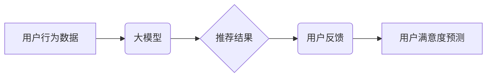

                 

## 基于大模型的推荐系统用户满意度预测

> 关键词：大模型、推荐系统、用户满意度预测、自然语言处理、深度学习、Transformer

## 1. 背景介绍

随着互联网的蓬勃发展，推荐系统已成为各大平台的核心功能，为用户提供个性化服务，提升用户体验。传统的推荐系统主要基于用户行为数据，如点击、购买、评分等，通过协同过滤、内容过滤等算法进行推荐。然而，这些方法难以捕捉用户复杂的需求和情感，导致推荐结果的准确性和用户满意度难以提升。

近年来，大模型技术取得了突破性进展，其强大的语义理解和文本生成能力为推荐系统带来了新的机遇。基于大模型的推荐系统能够更深入地理解用户的意图和偏好，从而提供更精准、更个性化的推荐，提升用户满意度。

## 2. 核心概念与联系

### 2.1 大模型

大模型是指参数量在数十亿甚至千亿级别的神经网络模型，通过海量数据训练，具备强大的泛化能力和语义理解能力。常见的代表性大模型包括GPT-3、BERT、LaMDA等。

### 2.2 推荐系统

推荐系统旨在根据用户的历史行为、偏好和上下文信息，预测用户对特定物品的兴趣，并提供个性化的推荐列表。

### 2.3 用户满意度预测

用户满意度预测是指通过分析用户行为数据、文本反馈等信息，预测用户对推荐结果的满意程度。

**核心概念与联系流程图:**



## 3. 核心算法原理 & 具体操作步骤

### 3.1 算法原理概述

基于大模型的用户满意度预测算法通常采用以下步骤：

1. **数据预处理:** 收集用户行为数据、文本反馈等信息，进行清洗、转换和特征提取。
2. **大模型训练:** 使用预处理后的数据训练大模型，使其能够理解用户需求和情感。
3. **推荐结果生成:** 基于用户的历史行为和偏好，利用训练好的大模型生成推荐结果。
4. **用户满意度预测:** 对推荐结果进行评估，预测用户对推荐结果的满意程度。

### 3.2 算法步骤详解

1. **数据预处理:**

   - **用户行为数据:** 收集用户点击、购买、评分等行为数据，并进行特征提取，例如用户性别、年龄、兴趣标签等。
   - **文本反馈:** 收集用户对推荐结果的评论、评价等文本数据，进行文本清洗、分词、词性标注等处理，提取用户情感和意图信息。

2. **大模型训练:**

   - 选择合适的预训练大模型，例如BERT、RoBERTa等。
   - 对大模型进行微调，使用预处理后的数据训练，使其能够更好地理解用户需求和情感。
   - 训练过程中，可以使用交叉熵损失函数，优化模型参数，提高模型预测精度。

3. **推荐结果生成:**

   - 基于用户的历史行为和偏好，利用训练好的大模型生成推荐结果。
   - 可以采用基于内容的推荐、基于协同过滤的推荐等方法，结合大模型的语义理解能力，提供更精准的推荐。

4. **用户满意度预测:**

   - 使用训练好的大模型对推荐结果进行评估，预测用户对推荐结果的满意程度。
   - 可以采用用户点击、评分、评论等行为数据作为评价指标，训练模型预测用户满意度。

### 3.3 算法优缺点

**优点:**

- 能够更好地理解用户的复杂需求和情感。
- 提供更精准、更个性化的推荐。
- 提升用户满意度和留存率。

**缺点:**

- 需要大量的训练数据和计算资源。
- 模型训练和部署成本较高。
- 算法解释性较差，难以理解模型的决策过程。

### 3.4 算法应用领域

- 电子商务平台推荐商品
- 流媒体平台推荐视频
- 音乐平台推荐歌曲
- 社交平台推荐好友
- 新闻平台推荐文章

## 4. 数学模型和公式 & 详细讲解 & 举例说明

### 4.1 数学模型构建

用户满意度预测模型可以构建为一个回归问题，预测用户对推荐结果的满意度评分。

假设用户 $u$ 对推荐结果 $r$ 的满意度评分为 $y_{ur}$，则模型的目标是学习一个函数 $f(x)$，使得 $f(x)$ 可以预测 $y_{ur}$。

其中，$x$ 包含用户 $u$ 的特征信息和推荐结果 $r$ 的特征信息。

### 4.2 公式推导过程

可以使用线性回归模型或深度学习模型进行用户满意度预测。

**线性回归模型:**

$$
y_{ur} = \beta_0 + \beta_1 x_{u1} + \beta_2 x_{u2} + ... + \beta_n x_{rn} + \epsilon
$$

其中，$\beta_0, \beta_1, ..., \beta_n$ 是模型参数，$x_{u1}, x_{u2}, ..., x_{un}$ 是用户 $u$ 的特征信息，$x_{r1}, x_{r2}, ..., x_{rn}$ 是推荐结果 $r$ 的特征信息，$\epsilon$ 是误差项。

**深度学习模型:**

可以使用多层感知机 (MLP)、卷积神经网络 (CNN) 或循环神经网络 (RNN) 等深度学习模型进行用户满意度预测。

### 4.3 案例分析与讲解

假设我们想要预测用户对电影的满意度评分。

用户特征信息包括年龄、性别、兴趣标签等。

电影特征信息包括电影类型、评分、评论等。

我们可以使用深度学习模型，例如多层感知机，将用户特征信息和电影特征信息作为输入，预测用户对电影的满意度评分。

## 5. 项目实践：代码实例和详细解释说明

### 5.1 开发环境搭建

- Python 3.7+
- TensorFlow 2.0+
- PyTorch 1.0+
- Jupyter Notebook

### 5.2 源代码详细实现

```python
import tensorflow as tf

# 定义模型结构
model = tf.keras.models.Sequential([
    tf.keras.layers.Embedding(input_dim=vocab_size, output_dim=embedding_dim),
    tf.keras.layers.LSTM(units=128),
    tf.keras.layers.Dense(units=1, activation='linear')
])

# 编译模型
model.compile(optimizer='adam', loss='mse')

# 训练模型
model.fit(x_train, y_train, epochs=10, batch_size=32)

# 评估模型
loss = model.evaluate(x_test, y_test)
print('Loss:', loss)
```

### 5.3 代码解读与分析

- 使用 TensorFlow 或 PyTorch 库构建深度学习模型。
- 使用 Embedding 层将用户和电影的文本特征转换为向量表示。
- 使用 LSTM 层捕捉用户和电影之间的时间序列关系。
- 使用 Dense 层进行最终的预测。
- 使用 Adam 优化器和均方误差损失函数进行模型训练。

### 5.4 运行结果展示

- 训练完成后，可以评估模型的性能，例如预测准确率、均方误差等。
- 可以使用测试数据对模型进行预测，并与实际用户满意度评分进行比较。

## 6. 实际应用场景

### 6.1 电子商务平台

- 基于用户浏览历史、购买记录、评价等数据，预测用户对商品的满意度，提供更精准的商品推荐。
- 根据用户满意度预测结果，优化商品排序和展示，提升用户购物体验。

### 6.2 流媒体平台

- 基于用户观看历史、评分、评论等数据，预测用户对视频的满意度，推荐更符合用户兴趣的视频。
- 根据用户满意度预测结果，个性化推荐视频播放列表，提升用户观看体验。

### 6.3 音乐平台

- 基于用户播放历史、收藏、点赞等数据，预测用户对歌曲的满意度，推荐更符合用户口味的歌曲。
- 根据用户满意度预测结果，个性化推荐音乐播放列表，提升用户音乐体验。

### 6.4 未来应用展望

- 将用户满意度预测与其他推荐算法结合，例如协同过滤、内容过滤等，提升推荐效果。
- 利用大模型的文本生成能力，根据用户满意度预测结果，生成个性化的推荐文案，提升用户点击率和转化率。
- 将用户满意度预测与用户画像结合，更深入地理解用户需求，提供更精准的个性化服务。

## 7. 工具和资源推荐

### 7.1 学习资源推荐

- **书籍:**
    - Deep Learning by Ian Goodfellow, Yoshua Bengio, and Aaron Courville
    - Natural Language Processing with Python by Steven Bird, Ewan Klein, and Edward Loper
- **在线课程:**
    - TensorFlow Tutorials: https://www.tensorflow.org/tutorials
    - PyTorch Tutorials: https://pytorch.org/tutorials/

### 7.2 开发工具推荐

- **TensorFlow:** https://www.tensorflow.org/
- **PyTorch:** https://pytorch.org/
- **Jupyter Notebook:** https://jupyter.org/

### 7.3 相关论文推荐

- BERT: Pre-training of Deep Bidirectional Transformers for Language Understanding
- GPT-3: Language Models are Few-Shot Learners
- Transformer: Attention Is All You Need

## 8. 总结：未来发展趋势与挑战

### 8.1 研究成果总结

基于大模型的用户满意度预测算法取得了显著的成果，能够更精准地预测用户对推荐结果的满意度，提升用户体验。

### 8.2 未来发展趋势

- **模型架构创新:** 探索更深、更广的模型架构，例如 Transformer 的变体、图神经网络等，提升模型的表达能力和预测精度。
- **多模态融合:** 将文本、图像、音频等多模态数据融合到模型中，更全面地理解用户需求和情感。
- **个性化定制:** 基于用户的个性化特征和偏好，定制个性化的推荐模型和预测策略。

### 8.3 面临的挑战

- **数据稀缺性:** 用户满意度数据往往稀缺，难以训练高质量的模型。
- **模型解释性:** 大模型的决策过程难以解释，难以理解模型的预测结果。
- **公平性与偏见:** 大模型可能存在公平性问题和偏见，需要进行充分的评估和调优。

### 8.4 研究展望

未来，基于大模型的用户满意度预测算法将朝着更精准、更个性化、更可解释的方向发展，为用户提供更优质的推荐服务。

## 9. 附录：常见问题与解答

**Q1: 如何处理用户满意度数据稀缺的问题？**

**A1:** 可以使用数据增强技术，例如文本生成、数据合成等，增加用户满意度数据的规模。

**Q2: 如何评估大模型的预测精度？**

**A2:** 可以使用均方误差 (MSE)、平均绝对误差 (MAE) 等指标评估模型的预测精度。

**Q3: 如何解决大模型的公平性问题？**

**A3:** 可以使用公平性度量指标，例如公平性损失函数，在模型训练过程中进行公平性约束。

作者：禅与计算机程序设计艺术 / Zen and the Art of Computer Programming


<end_of_turn>

