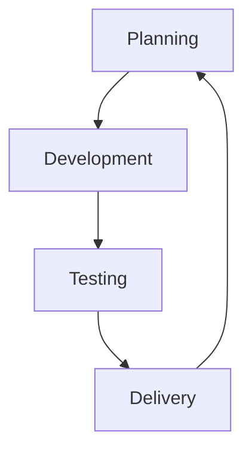
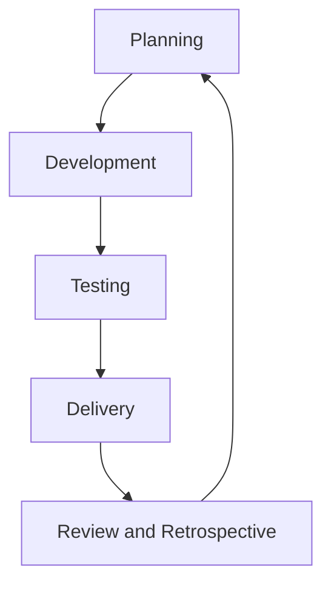

                 

### 文章标题

### How to Build Agile Product Iteration and Verification Process

关键词：敏捷迭代，产品验证，流程设计，持续交付，质量控制

摘要：本文深入探讨了如何构建敏捷的产品迭代与验证流程，重点分析了敏捷原则在产品开发中的应用，以及如何通过持续交付和质量控制来优化产品迭代过程。文章旨在为开发团队提供实用的策略和工具，以实现高效、高质量的产品交付。

在当今快速变化的市场环境中，敏捷开发已经成为产品开发的主流方法。敏捷的核心在于快速迭代、持续交付和客户反馈。为了确保敏捷流程的有效实施，构建一个敏捷的产品迭代与验证流程至关重要。本文将围绕这一主题展开，旨在帮助开发团队构建一个高效、可靠的产品迭代与验证体系。

首先，我们将介绍敏捷开发的基本原则和核心概念，并探讨这些原则如何在产品迭代与验证流程中发挥作用。接着，我们将详细讨论如何设计一个有效的敏捷迭代流程，包括迭代计划、开发、测试和交付的各个阶段。此外，文章还将介绍如何通过持续交付和质量控制来提高产品的可靠性和客户满意度。最后，我们将提供一些实用的工具和资源，以帮助开发团队更好地实施敏捷流程。

通过本文的阅读，开发团队将能够理解敏捷流程的设计原则，掌握构建敏捷迭代与验证流程的方法，并在实际项目中应用这些策略，从而实现高效、高质量的产品交付。

### Background Introduction

Agile development has emerged as the dominant approach in product development in today's fast-paced market environment. At its core, agility is about rapid iteration, continuous delivery, and customer feedback. To ensure the effective implementation of agile practices, it is crucial to build an agile product iteration and verification process.

The Agile Manifesto, published in 2001, outlines the core values and principles of agile development. These principles include:

1. Individuals and interactions over processes and tools
2. Working software over comprehensive documentation
3. Customer collaboration over contract negotiation
4. Responding to change over following a plan

These principles emphasize the importance of flexibility, collaboration, and customer-centricity in the development process. By adhering to these principles, teams can quickly adapt to changes, deliver value to customers, and improve the overall quality of the product.

The agile product iteration and verification process is a cyclical process that involves planning, development, testing, and delivery. Each iteration aims to deliver a functional and validated piece of the product. This iterative approach allows teams to continuously refine and improve the product based on customer feedback and market changes.

One of the key advantages of agile development is its focus on continuous delivery. Continuous delivery ensures that the product is continuously tested and deployed to production, reducing the time between development and customer feedback. This rapid feedback loop enables teams to quickly identify and address issues, improving the overall quality of the product.

Quality control is another critical aspect of the agile product iteration and verification process. By incorporating quality control measures throughout the development lifecycle, teams can ensure that the product meets the highest standards of quality. This includes automated testing, code reviews, and continuous integration.

In this article, we will delve into the principles of agile development, discuss how to design an effective agile iteration process, and explore strategies for continuous delivery and quality control. We will also provide practical tools and resources to help teams implement agile practices successfully.

### Core Concepts and Connections

#### Agile Development Principles

To understand how to build an agile product iteration and verification process, it is essential to first grasp the core principles of agile development. These principles, outlined in the Agile Manifesto, provide a foundation for agile practices and guide teams in creating efficient and effective development processes.

1. **Individuals and interactions over processes and tools**: This principle emphasizes the importance of human communication and collaboration over rigid processes and tools. Agile teams prioritize face-to-face interactions and foster a collaborative environment where team members can share ideas, solve problems, and make decisions collectively.

2. **Working software over comprehensive documentation**: This principle highlights the value of delivering working software over extensive documentation. While documentation is necessary, agile teams focus on creating just enough documentation to support the development process. The emphasis is on delivering functional and valuable software that meets customer needs.

3. **Customer collaboration over contract negotiation**: Agile development emphasizes continuous customer collaboration to ensure that the product aligns with customer needs and expectations. By involving customers throughout the development process, teams can gather feedback, validate assumptions, and make adjustments as needed. This customer-centric approach leads to higher customer satisfaction and better product outcomes.

4. **Responding to change over following a plan**: This principle recognizes that change is inevitable in the development process. Agile teams are adaptable and responsive to change, whether it comes from customer feedback, market dynamics, or new requirements. By embracing change, teams can quickly adjust their plans and deliver a product that better meets customer needs.

#### Agile Iteration and Verification Process

The agile iteration and verification process is a cyclical process that involves several stages: planning, development, testing, and delivery. Each stage has specific activities and objectives that contribute to the overall success of the project.

1. **Planning**: In the planning stage, the team defines the goals, scope, and timeline for the iteration. This includes identifying user stories, estimating the effort required to complete each story, and creating a prioritized backlog. The planning stage sets the foundation for the development process and ensures that everyone is aligned on the objectives and expectations.

2. **Development**: The development stage involves building and implementing the features identified in the planning stage. Agile teams typically use an incremental approach, where they develop and deliver small, manageable pieces of functionality in each iteration. This approach allows for faster feedback and continuous improvement.

3. **Testing**: The testing stage is an integral part of the agile iteration process. Agile teams perform various types of testing, including unit testing, integration testing, and system testing, to ensure that the developed features function as intended and meet the specified requirements. Automated testing tools and frameworks are often used to streamline the testing process and improve efficiency.

4. **Delivery**: The delivery stage involves deploying the completed features to production and making them available to users. Continuous delivery ensures that the product is continuously tested and deployed to production, reducing the time between development and customer feedback. This rapid feedback loop enables teams to quickly identify and address issues, improving the overall quality of the product.

#### Mermaid Flowchart of Agile Iteration and Verification Process



In this flowchart, the iterative process is represented as a cycle, with each iteration consisting of planning, development, testing, and delivery stages. The process continues indefinitely, allowing teams to continuously refine and improve the product based on feedback and changing requirements.

### Core Algorithm Principles and Specific Operational Steps

#### Agile Development Methodology

Agile development methodology is a flexible and iterative approach to software development that emphasizes collaboration, flexibility, and customer-centricity. It is based on several key principles and practices that guide teams in building high-quality software that meets customer needs.

1. **User Stories**: User stories are short, simple descriptions of a feature from the perspective of the end user. They are written in the format "As a [user], I want [feature] so that [benefit]." User stories help teams focus on delivering value to customers and serve as the basis for planning and prioritizing work.

2. **Sprint Planning**: Sprint planning is a meeting held at the beginning of each iteration where the team reviews the backlog, discusses priorities, and selects user stories to work on during the sprint. The team estimates the effort required for each selected story and creates a sprint backlog, which is a list of the tasks to be completed during the sprint.

3. **Daily Stand-ups**: Daily stand-up meetings are short, time-boxed meetings held every day to discuss progress, challenges, and plans for the day. These meetings promote communication and collaboration among team members and help identify and address any issues that may arise.

4. **Sprint Review and Retrospective**: At the end of each sprint, the team holds a sprint review meeting to demonstrate the completed work to stakeholders and gather feedback. Following the sprint review, the team conducts a retrospective to reflect on the sprint, identify areas for improvement, and make adjustments to their process.

5. **Continuous Integration and Continuous Delivery**: Continuous integration (CI) and continuous delivery (CD) are practices that ensure the software is continuously tested and deployed to production. CI involves automatically building and testing the code whenever changes are made, while CD involves automatically deploying the code to production after passing all tests.

#### Agile Iteration Process

The agile iteration process is a cyclical process that involves several key steps:

1. **Planning**: The team reviews the backlog, discusses priorities, and selects user stories to work on during the iteration. The team estimates the effort required for each selected story and creates a sprint backlog.

2. **Development**: The team develops and implements the selected user stories, following best practices such as test-driven development (TDD) and code reviews. The team collaborates closely with stakeholders, including customers and product owners, to ensure that the work aligns with business goals and customer needs.

3. **Testing**: The team performs various types of testing, including unit testing, integration testing, and system testing, to ensure that the developed features function as intended and meet the specified requirements. Automated testing tools and frameworks are often used to streamline the testing process and improve efficiency.

4. **Delivery**: The team deploys the completed features to production and makes them available to users. Continuous delivery ensures that the product is continuously tested and deployed to production, reducing the time between development and customer feedback.

5. **Review and Retrospective**: At the end of the iteration, the team holds a sprint review meeting to demonstrate the completed work to stakeholders and gather feedback. Following the sprint review, the team conducts a retrospective to reflect on the iteration, identify areas for improvement, and make adjustments to their process.

#### Mermaid Flowchart of Agile Iteration Process



In this flowchart, the iterative process is represented as a cycle, with each iteration consisting of planning, development, testing, delivery, and review and retrospective stages. The process continues indefinitely, allowing teams to continuously refine and improve the product based on feedback and changing requirements.

### Mathematical Models and Formulas & Detailed Explanation and Examples

In agile product development, several mathematical models and formulas are used to measure progress, estimate effort, and optimize the iteration process. These models and formulas provide a quantitative basis for decision-making and help teams ensure the success of their agile initiatives. Below are some key mathematical models and their detailed explanations along with examples:

#### 1. Earned Value Management (EVM)

Earned Value Management (EVM) is a performance measurement technique that integrates project scope, schedule, and resources. It provides a quantifiable measure of project performance and progress.

**Formula:**
\[ EVM = EV - AC \]
\[ where \]
- EV (Earned Value) = \[ % of work completed \] \[ Budgeted Cost of Work Scheduled (BCWS) \]
- AC (Actual Cost) = \[ Cost incurred \] for the work completed

**Example:**
Suppose a project has a total budget of $100,000, and 50% of the work is completed. The actual cost incurred so far is $60,000.

- EV = 50% \[ $100,000 \] = $50,000
- AC = $60,000

EVM = $50,000 - $60,000 = -$10,000

The negative EVM indicates that the project is over budget.

#### 2. Velocity

Velocity is a measure of the amount of work a team can complete in a given iteration. It is typically measured in story points or hours.

**Formula:**
\[ Velocity = \sum_{i=1}^{n} (Points \] completed for iteration \( i \))

**Example:**
If a team completes 25 story points in the first iteration, 30 story points in the second iteration, and 35 story points in the third iteration, the velocity is:

\[ Velocity = 25 + 30 + 35 = 90 \] story points

#### 3. Cycle Time

Cycle Time is the total time it takes to complete a task from start to finish.

**Formula:**
\[ Cycle Time = \sum_{i=1}^{n} (Time \] taken to complete task \( i \))

**Example:**
If a team completes three tasks with cycle times of 5 days, 3 days, and 7 days, the average cycle time is:

\[ Cycle Time = (5 + 3 + 7) / 3 = 5 \] days

#### 4. Throughput

Throughput is the amount of work completed in a given time period, typically measured in units of output.

**Formula:**
\[ Throughput = \sum_{i=1}^{n} (Units \] completed for iteration \( i \))

**Example:**
If a team completes 10 units in the first iteration, 15 units in the second iteration, and 20 units in the third iteration, the throughput is:

\[ Throughput = 10 + 15 + 20 = 45 \] units

#### 5. Variance

Variance measures the difference between planned and actual values, providing insights into the predictability of the process.

**Formula:**
\[ Variance = \sum_{i=1}^{n} ((Actual \] value for iteration \( i \]) - (Planned \] value for iteration \( i \]))^2

**Example:**
If a project has planned values of 10, 15, and 20 for three iterations, and actual values of 9, 16, and 18 for the same iterations, the variance is:

\[ Variance = ((9 - 10)^2 + (16 - 15)^2 + (18 - 20)^2) = 2 \]

### Detailed Explanation and Examples of Agile Metrics

Agile metrics are essential tools for measuring progress, performance, and quality in agile development. By using these metrics, teams can gain insights into their processes and make data-driven decisions to improve their work. Below are detailed explanations and examples of some common agile metrics:

#### 1. Burn Down Chart

A burn down chart visualizes the remaining work in a project over time. It helps teams track progress and identify potential issues.

**Example:**
Suppose a project has a total of 100 story points, and the burn down chart shows that after two weeks, there are 50 story points remaining. This indicates that the team is on track to complete the project within the planned timeframe.

#### 2. CFD (Cumulative Flow Diagram)

A CFD visualizes the flow of work items through different stages of the development process, highlighting bottlenecks and delays.

**Example:**
If a CFD shows that a large number of work items are stuck in the "In Review" stage, it indicates a potential bottleneck in the process. The team can investigate and address the issue to improve the overall flow of work.

#### 3. Cycle Time Distribution

Cycle Time Distribution charts show the distribution of cycle times for completed tasks, highlighting the variability in task completion times.

**Example:**
If a cycle time distribution chart shows that most tasks are completed within 3-5 days but a few tasks take over a week, the team can investigate the reasons behind the longer cycle times and identify opportunities for process improvement.

#### 4. Sprint Velocity

Sprint Velocity measures the amount of work completed in each sprint, providing insights into the team's capacity and performance.

**Example:**
If a team's sprint velocity remains consistent over time, it indicates that the team is able to maintain a steady pace of work. However, if the velocity fluctuates significantly, the team may need to adjust their planning and prioritize process improvements.

By leveraging these agile metrics, teams can gain a deeper understanding of their processes and make informed decisions to optimize their agile development efforts. Regularly reviewing and analyzing these metrics allows teams to continuously improve their performance and deliver high-quality products.

### Project Practice: Code Examples and Detailed Explanation

In this section, we will delve into a practical example to demonstrate how to implement an agile product iteration and verification process in a real-world project. The example will be a simple web application for a to-do list, and we will walk through the entire process, from setting up the development environment to deploying the application to production.

#### 1. Development Environment Setup

To begin, we need to set up the development environment for our to-do list application. We will use a modern web development stack, including Node.js for the backend and React for the frontend. Here's a step-by-step guide to setting up the environment:

**Step 1: Install Node.js and npm**

Download and install the latest version of Node.js from the [official website](https://nodejs.org/). Once installed, open a terminal and run:

```bash
node -v
npm -v
```

to verify the installation.

**Step 2: Install React and Create-React-App**

Install Create-React-App, a popular React application starter kit, using npm:

```bash
npm install -g create-react-app
create-react-app todo-app
cd todo-app
```

This command will create a new React application named "todo-app" and navigate into the project directory.

**Step 3: Install Backend Dependencies**

Create a new directory for the backend and install the necessary dependencies:

```bash
mkdir backend
cd backend
npm init -y
npm install express body-parser cors
```

This will set up a basic Node.js backend with Express, a popular web application framework.

**Step 4: Set Up Database**

For simplicity, we will use SQLite as the database to store the to-do items. Install the SQLite package:

```bash
npm install sqlite3
```

#### 2. Source Code Detailed Implementation

With the environment set up, we can now start implementing the to-do list application. We will break down the implementation into several steps:

**Step 1: Create the Backend API**

In the "backend" directory, create a file named "server.js" and implement the basic API routes:

```javascript
const express = require('express');
const bodyParser = require('body-parser');
const cors = require('cors');

const app = express();

app.use(cors());
app.use(bodyParser.json());

// Database connection
const db = require('./db');

// Define API routes
app.get('/todos', async (req, res) => {
  try {
    const todos = await db.getAllTodos();
    res.json(todos);
  } catch (error) {
    res.status(500).send('Error fetching todos');
  }
});

app.post('/todos', async (req, res) => {
  try {
    const newTodo = await db.createTodo(req.body.title);
    res.status(201).json(newTodo);
  } catch (error) {
    res.status(500).send('Error adding todo');
  }
});

app.delete('/todos/:id', async (req, res) => {
  try {
    await db.deleteTodo(req.params.id);
    res.status(204).send();
  } catch (error) {
    res.status(500).send('Error deleting todo');
  }
});

const PORT = process.env.PORT || 5000;
app.listen(PORT, () => {
  console.log(`Server running on port ${PORT}`);
});
```

**Step 2: Implement the Database Schema**

In the "backend" directory, create a file named "db.js" to define the database schema and connection:

```javascript
const sqlite3 = require('sqlite3').verbose();
const db = new sqlite3.Database(':memory:');

// Initialize database
db.serialize(() => {
  db.run('CREATE TABLE todos (id INTEGER PRIMARY KEY, title TEXT, completed BOOLEAN)');
});

// Export database methods
module.exports = {
  getAllTodos: () => {
    return new Promise((resolve, reject) => {
      db.all('SELECT * FROM todos', (err, rows) => {
        if (err) reject(err);
        resolve(rows);
      });
    });
  },
  createTodo: (title) => {
    return new Promise((resolve, reject) => {
      db.run('INSERT INTO todos (title, completed) VALUES (?, ?)', [title, false], (err) => {
        if (err) reject(err);
        resolve({ id: this.lastID, title: title, completed: false });
      });
    });
  },
  deleteTodo: (id) => {
    return new Promise((resolve, reject) => {
      db.run('DELETE FROM todos WHERE id = ?', id, (err) => {
        if (err) reject(err);
        resolve();
      });
    });
  },
};
```

**Step 3: Create the Frontend Components**

In the "todo-app" directory, create the necessary React components for the to-do list application:

- `components/Header.js`: This component renders the application header.
- `components/TodoList.js`: This component displays the list of to-do items.
- `components/TodoItem.js`: This component represents a single to-do item.
- `components/AddTodo.js`: This component allows users to add new to-do items.

Here's an example of the `TodoList.js` component:

```javascript
import React from 'react';
import TodoItem from './TodoItem';

const TodoList = ({ todos, onToggleCompleted, onRemoveTodo }) => {
  return (
    <ul>
      {todos.map((todo) => (
        <TodoItem key={todo.id} todo={todo} onToggleCompleted={onToggleCompleted} onRemoveTodo={onRemoveTodo} />
      ))}
    </ul>
  );
};

export default TodoList;
```

**Step 4: Integrate the Frontend and Backend**

In the "todo-app" directory, create a file named "App.js" to integrate the frontend components with the backend API:

```javascript
import React, { useState, useEffect } from 'react';
import Header from './components/Header';
import TodoList from './components/TodoList';
import AddTodo from './components/AddTodo';

const App = () => {
  const [todos, setTodos] = useState([]);

  const fetchTodos = async () => {
    const response = await fetch('/todos');
    const data = await response.json();
    setTodos(data);
  };

  const addTodo = async (title) => {
    const response = await fetch('/todos', {
      method: 'POST',
      headers: {
        'Content-Type': 'application/json',
      },
      body: JSON.stringify({ title }),
    });
    const data = await response.json();
    setTodos([...todos, data]);
  };

  const toggleCompleted = async (id) => {
    const updatedTodo = { ...todos.find((todo) => todo.id === id), completed: !todos.find((todo) => todo.id === id).completed };
    const response = await fetch(`/todos/${id}`, {
      method: 'PUT',
      headers: {
        'Content-Type': 'application/json',
      },
      body: JSON.stringify(updatedTodo),
    });
    if (response.ok) {
      setTodos(todos.map((todo) => (todo.id === id ? updatedTodo : todo)));
    }
  };

  const removeTodo = async (id) => {
    const response = await fetch(`/todos/${id}`, {
      method: 'DELETE',
    });
    if (response.ok) {
      setTodos(todos.filter((todo) => todo.id !== id));
    }
  };

  useEffect(() => {
    fetchTodos();
  }, []);

  return (
    <div>
      <Header />
      <AddTodo onAddTodo={addTodo} />
      <TodoList todos={todos} onToggleCompleted={toggleCompleted} onRemoveTodo={removeTodo} />
    </div>
  );
};

export default App;
```

#### 3. Code Analysis and Explanation

In this section, we will analyze the code and explain the key components of the to-do list application.

**Backend Analysis**

- **Server Setup**: The backend server is set up using the Express framework. The `app.use(cors())` middleware enables cross-origin resource sharing, allowing the frontend to make requests to the backend.
- **Database Connection**: The `db.js` file establishes a connection to the SQLite database and defines the schema and methods for interacting with the database.
- **API Routes**: The `server.js` file defines the API routes for fetching, creating, updating, and deleting to-do items. The `GET /todos` route fetches all to-do items from the database, while the `POST /todos` route creates a new to-do item. The `DELETE /todos/:id` route deletes a to-do item based on its ID.

**Frontend Analysis**

- **Components**: The application consists of several React components, including `Header`, `TodoList`, `TodoItem`, and `AddTodo`. Each component is responsible for rendering a specific part of the application.
- **State Management**: The `App` component uses the `useState` and `useEffect` hooks to manage the state of the to-do items and perform side effects, such as fetching the initial list of to-do items from the backend.
- **API Integration**: The `App` component integrates with the backend API using the `fetch` function. The `addTodo`, `toggleCompleted`, and `removeTodo` functions send requests to the backend API to create, update, and delete to-do items, respectively.

#### 4. Running the Application

To run the application, follow these steps:

1. Start the backend server:

```bash
cd backend
node server.js
```

1. Start the frontend development server:

```bash
cd todo-app
npm start
```

The application will be accessible at <http://localhost:3000/>. Users can add new to-do items, mark them as completed, and remove them from the list.

#### 5. Running Automated Tests

To ensure the reliability and correctness of the application, we will use automated tests. We will use the Jest and React Testing Library testing frameworks for frontend testing and the Mocha and Chai frameworks for backend testing.

**Step 1: Install Testing Dependencies**

For the frontend tests:

```bash
npm install --save-dev jest @testing-library/react @testing-library/jest-dom
```

For the backend tests:

```bash
npm install --save-dev mocha chai supertest
```

**Step 2: Write Tests**

Create test files for each component and API route. For example, create a `TodoList.test.js` file for the `TodoList` component:

```javascript
import { render, screen } from '@testing-library/react';
import TodoList from './TodoList';

test('renders list of todos', () => {
  const todos = [{ id: 1, title: 'Buy groceries', completed: false }];
  render(<TodoList todos={todos} onToggleCompleted={() => { }} onRemoveTodo={() => { }} />);
  expect(screen.getByText('Buy groceries')).toBeInTheDocument();
});
```

**Step 3: Run Tests**

Run the tests using the following commands:

For the frontend:

```bash
npm test
```

For the backend:

```bash
npm test-backend
```

#### 6. Deploying to Production

To deploy the application to production, follow these steps:

1. Build the frontend and backend:

```bash
cd todo-app
npm run build
cd backend
npm install
```

1. Deploy the backend to a hosting service, such as Heroku or AWS Lambda. For this example, we will use Heroku:

```bash
git init
git add .
git commit -m "Initial commit"
heroku create
git push heroku master
```

1. Deploy the frontend to a static hosting service, such as Netlify or Vercel. For this example, we will use Netlify:

```bash
npm install -g netlify-cli
netlify init
cd netlify
git init
git add .
git commit -m "Initial commit"
netlify publish
```

The application will now be accessible at the deployed domain, such as <https://your-to-do-app.netlify.app/>.

By following this practical example, you can see how to implement an agile product iteration and verification process in a real-world project. The key steps include setting up the development environment, implementing the frontend and backend components, running automated tests, and deploying the application to production. By following these steps, development teams can ensure the reliability and quality of their products while delivering them to customers in a timely and efficient manner.

### Practical Application Scenarios

The agile product iteration and verification process can be applied to various scenarios across different industries and types of projects. Here are some examples of how agile practices can be effectively utilized in real-world situations:

#### 1. Software Development for Startups

Startups often operate in highly competitive markets, where the ability to rapidly develop and iterate on products is crucial for success. Agile methodologies, with their focus on flexibility, customer collaboration, and continuous delivery, enable startups to respond quickly to market changes and customer feedback. By following agile practices, startups can release minimum viable products (MVPs) that allow them to validate their ideas and gather real-world feedback early in the development process. This feedback can then be used to refine and improve the product, ensuring that it meets the needs of the target market.

#### 2. Large-Scale Enterprise Projects

Large-scale enterprise projects, such as the development of complex software systems or the implementation of new IT infrastructure, can benefit significantly from agile methodologies. Agile allows large teams to work collaboratively, breaking down the project into manageable iterations. This iterative approach helps in managing complexity, reducing risks, and ensuring that the project delivers value at each stage. Additionally, the emphasis on continuous delivery and quality control ensures that the final product is of high quality and meets the requirements of stakeholders.

#### 3. E-commerce Platforms

E-commerce platforms, which often handle high volumes of traffic and require frequent updates to stay competitive, can greatly benefit from agile practices. Agile allows e-commerce teams to continuously release new features and improvements, ensuring that the platform remains responsive, user-friendly, and secure. By incorporating customer feedback into each iteration, e-commerce teams can tailor their products to better meet the needs and preferences of their customers. This iterative approach also allows for quick responses to market trends and competitor actions, helping e-commerce platforms stay ahead in a dynamic market environment.

#### 4. Healthcare Software Development

The healthcare industry faces stringent regulatory requirements and a high demand for secure, reliable, and user-friendly software systems. Agile methodologies can be applied to healthcare software development to ensure that systems are developed in a manner that meets regulatory standards and addresses the specific needs of healthcare professionals and patients. Agile practices, such as regular stakeholder meetings and iterative development, help in maintaining transparency and alignment between development teams and healthcare providers. This ensures that the software is both functional and compliant with industry regulations.

#### 5. Mobile Application Development

Mobile applications often require frequent updates to address new device capabilities, operating system changes, and user feedback. Agile methodologies can be effectively used in mobile app development to ensure that apps are kept up-to-date and responsive to user needs. By following an iterative development process, mobile app development teams can release new features and improvements regularly, keeping the app competitive and engaging for users. Additionally, the focus on continuous testing and quality control ensures that mobile apps are stable and perform well on a variety of devices.

In summary, the agile product iteration and verification process can be adapted to a wide range of scenarios and industries. Its focus on flexibility, collaboration, and continuous improvement makes it an ideal approach for teams working on dynamic and complex projects. By embracing agile practices, teams can deliver high-quality products more efficiently and respond effectively to changing market conditions and customer needs.

### Tools and Resources Recommendations

To successfully implement an agile product iteration and verification process, development teams can leverage a variety of tools and resources that enhance collaboration, streamline workflows, and improve overall productivity. Below are some recommendations for tools and resources that can support agile practices:

#### 1. Project Management Tools

**JIRA:** JIRA is a powerful project management tool that enables teams to track issues, manage workflows, and collaborate on projects. Its extensive features include agile boards, sprint planning, and real-time reports, making it an ideal choice for teams following agile methodologies.

**Trello:** Trello offers a simple yet effective way to visualize and manage workflows using boards, lists, and cards. Its intuitive interface and flexibility make it suitable for both small teams and large organizations.

**Asana:** Asana provides a comprehensive project management platform with features such as task management, team collaboration, and goal tracking. Its robust interface allows teams to stay organized and focused on their goals.

#### 2. Version Control Systems

**Git:** Git is a distributed version control system that enables developers to track changes to their codebase, collaborate on features, and manage different branches. Its flexibility and robustness make it a go-to choice for many development teams.

**GitHub:** GitHub is a popular code hosting platform that integrates with Git, providing features such as issue tracking, pull requests, and continuous integration. It is widely used for collaborative software development.

**GitLab:** GitLab is an open-source alternative to GitHub that offers a complete DevOps lifecycle, including code management, CI/CD, and monitoring. It provides a self-hosted solution, making it suitable for organizations that prefer to keep their code in-house.

#### 3. Automated Testing Tools

**Selenium:** Selenium is a widely used automation testing framework that supports various browsers and platforms. It allows teams to write test scripts in multiple programming languages and automate web application testing.

**Jest:** Jest is a popular JavaScript testing framework that provides fast and reliable testing for React applications. Its easy-to-use interface and comprehensive features make it a popular choice for frontend developers.

**JUnit:** JUnit is a widely-used Java testing framework that provides a simple and flexible way to write and execute tests. It is often used in combination with other tools, such as TestNG, to create comprehensive test suites.

#### 4. Continuous Integration and Continuous Deployment Tools

**Jenkins:** Jenkins is an open-source automation server that provides continuous integration and continuous deployment (CI/CD) capabilities. It supports a wide range of plugins and integrates well with other tools, making it suitable for complex development environments.

**CircleCI:** CircleCI is a cloud-based CI/CD tool that offers fast and reliable builds and deployments. Its user-friendly interface and easy integration with popular development tools make it a popular choice for teams looking to streamline their development processes.

**GitLab CI/CD:** GitLab CI/CD is an integrated CI/CD solution provided by GitLab. It offers out-of-the-box pipelines for building, testing, and deploying applications, making it a convenient choice for teams using GitLab for version control.

#### 5. Learning Resources

**Books:**
- "Agile Project Management with Scrum" by Ken Schwaber and Jeff Sutherland
- "User Stories Applied: For Agile Software Development" by Mike Cohn
- "The Agile Project Guide: A Practical Guide to Creating and Sustaining Product Development Teams" by Laura R. Ruby and August Detlefsen

**Online Courses:**
- "Agile Project Management" on Coursera
- "Agile Software Development" on edX
- "Agile Development: Scrum Master Certification" on Udemy

**Websites:**
- Agile Alliance (https://www.agilealliance.org/)
- Scrum Alliance (https://www.scrumalliance.org/)
- Atlassian Academy (https://www.atlassian.com/learn)

By leveraging these tools and resources, development teams can effectively implement agile practices, enhance collaboration, and deliver high-quality products in a timely manner.

### Summary: Future Development Trends and Challenges

As the software development landscape continues to evolve, the future of agile product iteration and verification processes is poised to bring both exciting opportunities and significant challenges. Here, we will explore the key trends and challenges that are likely to shape the future of agile development.

#### Key Trends

1. **Increased Emphasis on Automation and AI:**
   The integration of automation and artificial intelligence (AI) into agile processes is set to become more prevalent. Automated testing, AI-powered code review, and predictive analytics can significantly enhance the efficiency and reliability of product development. AI-driven tools can analyze large datasets to identify patterns, predict potential issues, and even suggest improvements, enabling teams to be more proactive in their development efforts.

2. **Blended Agile Approaches:**
   Organizations are increasingly adopting blended agile methodologies that combine the best practices of traditional agile frameworks with other approaches like Kanban, Lean, and DevOps. These blended approaches help teams tailor their processes to suit their specific needs, leading to more flexible and adaptive development practices.

3. **Focus on DevSecOps:**
   With the growing importance of security in software development, the concept of DevSecOps is gaining traction. DevSecOps integrates security practices into the entire development lifecycle, ensuring that security is considered from the outset. This trend is driven by the need to address security concerns more effectively and to reduce the risk of vulnerabilities in software products.

4. **Remote and Hybrid Work:**
   The shift towards remote and hybrid work models has accelerated, and agile methodologies are well-suited to support these new ways of working. Virtual collaboration tools and agile practices enable teams to maintain communication and coordination, regardless of geographical constraints. This trend is likely to continue as organizations recognize the benefits of flexible work arrangements.

#### Key Challenges

1. **Skill Gaps:**
   The rapid evolution of technology requires teams to continuously update their skills and knowledge. However, there is a growing skill gap, particularly in areas like AI, automation, and cloud computing. Organizations will need to invest in training and upskilling their teams to keep pace with technological advancements.

2. **Cultural Resistance:**
   Agile methodologies require a cultural shift within organizations, emphasizing collaboration, transparency, and flexibility. Resistance to change from employees who are accustomed to traditional development practices can hinder the adoption and success of agile approaches. Overcoming cultural resistance will be a key challenge for organizations looking to embrace agile practices.

3. **Scalability:**
   As projects grow in complexity and scale, maintaining agility becomes more challenging. Large-scale agile projects require robust processes and tools to manage communication, coordination, and collaboration across multiple teams and geographies. Ensuring scalability while preserving the core principles of agility will be a significant challenge for organizations.

4. **Integration and Standardization:**
   The use of multiple tools and platforms in agile development can lead to fragmentation and lack of standardization. Integrating different tools and ensuring seamless collaboration across platforms will be crucial for maximizing the benefits of agile methodologies. Organizations will need to invest in integrating their toolchain and standardizing processes to achieve a cohesive development environment.

In conclusion, the future of agile product iteration and verification processes will be shaped by the increasing integration of automation and AI, the adoption of blended methodologies, and the focus on security and flexibility. However, these trends will also bring challenges related to skill gaps, cultural resistance, scalability, and integration. By addressing these challenges proactively and leveraging the opportunities presented by technological advancements, organizations can build resilient and agile development practices that drive success in an ever-changing market.

### Appendix: Frequently Asked Questions and Answers

**Q1. What is the difference between agile and Scrum?**

Agile is a broader framework of principles and practices that emphasizes flexibility, collaboration, and continuous improvement in software development. Scrum is one of the most popular methodologies within the agile framework. It is a specific approach to implementing agile practices, characterized by iterative development, sprints, and daily stand-ups.

**Q2. How often should sprints be conducted?**

Sprint length can vary depending on the project and team, but a common range is between 1 to 4 weeks. Shorter sprints (1-2 weeks) can provide more frequent feedback and faster iterations, while longer sprints (3-4 weeks) allow for more extensive work to be completed within a single iteration.

**Q3. What is the role of the Product Owner in agile development?**

The Product Owner is a key role in agile development, responsible for defining the product vision, prioritizing the backlog, and ensuring that the team is building the right product. They work closely with stakeholders, including customers, to gather requirements, provide feedback, and make decisions about what features to include in the next iteration.

**Q4. What is the difference between user stories and epics?**

User stories are short, simple descriptions of a feature from the end user's perspective. Epics are larger, more abstract themes that represent a set of related user stories. Epics help organize and prioritize larger bodies of work and can be broken down into smaller, more manageable user stories for the development team.

**Q5. How do you handle changes in requirements during an iteration?**

Agile methodologies embrace change and are designed to handle requirements changes throughout the development process. If a change is identified during an iteration, the team can evaluate its impact on the current sprint and prioritize it accordingly. If the change is critical and cannot be accommodated within the current sprint, it may be deferred to a future iteration.

**Q6. What are the key benefits of continuous integration and continuous delivery?**

Continuous Integration (CI) ensures that code changes are frequently integrated and tested, reducing the likelihood of integration issues and ensuring that the software remains functional. Continuous Delivery (CD) automates the deployment of code to production, ensuring that new features are delivered to users quickly and reliably. The key benefits include faster feedback, improved quality, and reduced time to market.

**Q7. How do you balance user feedback with technical debt?**

Balancing user feedback with technical debt requires prioritization and planning. User feedback should be prioritized based on its impact on customer satisfaction and business value. Technical debt should also be managed through regular refactoring and code improvements. By aligning user feedback with technical debt management, teams can deliver high-quality products without compromising on technical excellence.

By addressing these frequently asked questions, we aim to provide clarity on key concepts and practices related to agile product iteration and verification processes.

### Extended Reading & References

For those interested in further exploring the topics covered in this article, the following resources offer valuable insights and in-depth information on agile product iteration and verification processes, software development methodologies, and related subjects:

**Books:**
- **"Agile Product Management with Scrum" by Roman Pichler**
- **"Sprint: How to Solve Big Problems and Test New Ideas in Just Five Days" by Jake Knapp, John Zeratsky, and Braden Kowitz**
- **"User Story Mapping: Discover the Whole Story, Build the Right Product" by Jeff Patton**

**Online Courses:**
- **"Agile Project Management: Fundamentals" on Coursera**
- **"Scrum Framework for Agile Project Management" on edX**
- **"Agile Project Management: Beyond the Basics" on Udemy**

**Websites:**
- **Agile Alliance (https://www.agilealliance.org/)**: Offers a wealth of resources, articles, and events on agile methodologies.
- **Scrum Alliance (https://www.scrumalliance.org/)**: Provides information on Scrum, certified Scrum trainers, and related resources.
- **Atlassian (https://www.atlassian.com/agile)**: Features articles, webinars, and case studies on agile practices and tools.

**Research Papers:**
- **"Agile Methodology: Definition, Benefits, and Challenges" by Thomas C. Jimenez and Steven G. Macías**
- **"Scrum: The Art of Doing Twice the Work in Half the Time" by Jeff Sutherland**

These resources can provide additional perspectives and practical guidance to deepen your understanding of agile development practices and enhance your ability to implement effective product iteration and verification processes.

