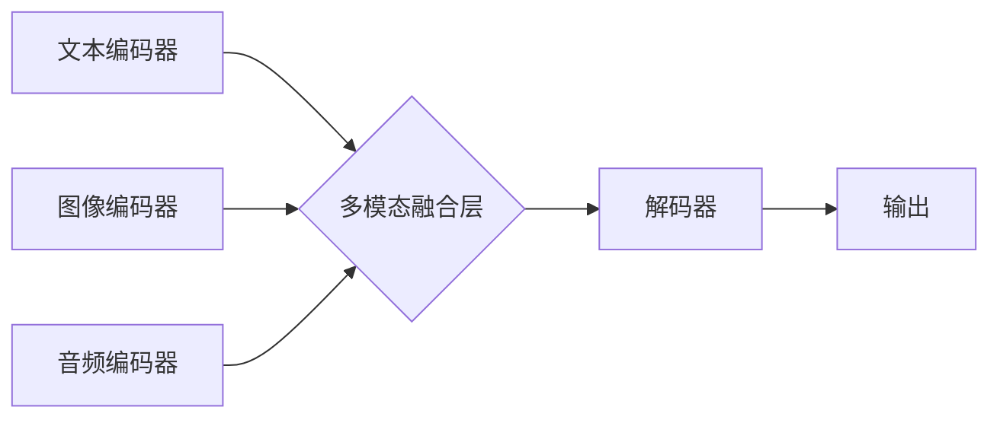

                 

## 多模态Transformer：跨域AI的新范式

> 关键词：多模态学习、Transformer、跨域AI、自然语言处理、计算机视觉、音频处理、多媒体理解

### 1. 背景介绍

人工智能（AI）的发展经历了从单模态到多模态的演进。早期AI模型主要专注于单一模态数据，例如文本或图像。随着技术的进步，多模态学习逐渐成为研究热点，旨在训练模型能够理解和处理多种模态数据，从而更全面地感知和理解世界。

多模态学习在许多领域具有广泛的应用前景，例如：

* **智能客服:**  理解用户文本和语音输入，并提供更精准的回复。
* **医疗诊断:**  结合患者的病历、影像数据和语音记录，辅助医生进行诊断。
* **内容创作:**  根据文本提示生成图像、视频或音频内容。
* **人机交互:**  实现更自然、更丰富的用户体验。

### 2. 核心概念与联系

**2.1 多模态学习**

多模态学习是指训练模型能够从多个模态数据中学习知识，并进行跨模态推理和理解。例如，一个多模态模型可以学习文本和图像之间的关系，从而能够根据文本描述生成相应的图像，或者根据图像内容理解文本的含义。

**2.2 Transformer**

Transformer是一种基于注意力机制的神经网络架构，在自然语言处理领域取得了突破性的进展。其核心特点是能够捕捉长距离依赖关系，并具有并行计算能力，使其在处理大量文本数据时表现出色。

**2.3 多模态Transformer**

多模态Transformer将Transformer架构扩展到多个模态数据，旨在学习不同模态之间的关系和交互。它通过融合不同模态的特征表示，实现跨模态的理解和生成。

**2.4 架构图**



### 3. 核心算法原理 & 具体操作步骤

**3.1 算法原理概述**

多模态Transformer的核心算法原理是通过将不同模态的数据编码成特征向量，然后在多模态融合层进行融合，最终生成跨模态的表示。

* **文本编码器:** 使用Transformer架构对文本数据进行编码，生成文本的特征向量表示。
* **图像编码器:** 使用CNN或其他视觉模型对图像数据进行编码，生成图像的特征向量表示。
* **音频编码器:** 使用音频处理模型对音频数据进行编码，生成音频的特征向量表示。
* **多模态融合层:** 将不同模态的特征向量进行融合，生成跨模态的特征表示。
* **解码器:** 使用Transformer架构对融合后的特征向量进行解码，生成最终的输出结果。

**3.2 算法步骤详解**

1. **数据预处理:** 将文本、图像和音频数据进行预处理，例如文本分词、图像裁剪、音频降噪等。
2. **模态编码:** 使用相应的编码器对每个模态数据进行编码，生成特征向量表示。
3. **多模态融合:** 将不同模态的特征向量进行融合，可以使用多种方法，例如拼接、注意力机制等。
4. **解码:** 使用解码器对融合后的特征向量进行解码，生成最终的输出结果。
5. **模型训练:** 使用训练数据训练多模态Transformer模型，优化模型参数。

**3.3 算法优缺点**

**优点:**

* 能够学习不同模态之间的关系和交互。
* 表现出色于跨模态理解和生成任务。
* 具有强大的泛化能力。

**缺点:**

* 训练数据量大，计算资源需求高。
* 模型复杂度高，推理速度相对较慢。

**3.4 算法应用领域**

* **图像字幕生成:** 根据图像内容生成文本描述。
* **视频问答:** 根据视频内容回答问题。
* **文本到图像生成:** 根据文本描述生成图像。
* **多媒体检索:** 根据文本或图像查询相关的多媒体内容。

### 4. 数学模型和公式 & 详细讲解 & 举例说明

**4.1 数学模型构建**

多模态Transformer模型可以看作是一个多层感知机，其输入是不同模态的数据，输出是跨模态的表示。模型的每一层包含以下组件：

* **多头注意力层:** 用于捕捉不同模态之间的关系。
* **前馈神经网络:** 用于对特征进行非线性变换。
* **归一化层:** 用于稳定模型训练。

**4.2 公式推导过程**

多头注意力层的计算过程可以表示为：

$$
Attention(Q, K, V) = softmax(\frac{QK^T}{\sqrt{d_k}})V
$$

其中：

* $Q$ 是查询矩阵，
* $K$ 是键矩阵，
* $V$ 是值矩阵，
* $d_k$ 是键向量的维度。

**4.3 案例分析与讲解**

假设我们有一个多模态Transformer模型，用于图像字幕生成任务。

* **输入:** 图像特征向量和一个特殊的“开始”标记。
* **过程:** 模型首先将图像特征向量和“开始”标记输入到编码器中，生成图像的编码表示。然后，将图像编码表示输入到解码器中，解码器会根据图像编码表示和之前生成的文本序列，生成下一个单词的概率分布。
* **输出:** 模型会根据概率分布选择最可能的单词，并将其添加到文本序列中，直到生成完整的字幕。

### 5. 项目实践：代码实例和详细解释说明

**5.1 开发环境搭建**

* Python 3.7+
* PyTorch 1.7+
* CUDA 10.2+

**5.2 源代码详细实现**

```python
import torch
import torch.nn as nn

class MultimodalTransformer(nn.Module):
    def __init__(self, vocab_size, embedding_dim, num_heads, num_layers):
        super(MultimodalTransformer, self).__init__()
        # ... (定义编码器、解码器、多模态融合层等组件)

    def forward(self, text_input, image_input):
        # ... (将文本和图像输入到模型中，进行编码和解码)
        return output_text

```

**5.3 代码解读与分析**

* `MultimodalTransformer` 类定义了多模态Transformer模型的结构。
* `__init__` 方法初始化模型参数，例如词汇表大小、嵌入维度、注意力头数、Transformer层数等。
* `forward` 方法定义了模型的推理过程，将文本和图像输入到模型中，并生成输出文本。

**5.4 运行结果展示**

使用训练好的模型，可以将图像输入到模型中，并生成相应的字幕。

### 6. 实际应用场景

**6.1 智能客服**

多模态Transformer可以理解用户文本和语音输入，并提供更精准的回复，例如：

* 根据用户的问题，从知识库中检索相关信息。
* 根据用户的情绪，调整回复的语气和风格。
* 根据用户的需求，提供个性化的服务。

**6.2 医疗诊断**

多模态Transformer可以结合患者的病历、影像数据和语音记录，辅助医生进行诊断，例如：

* 分析患者的影像数据，识别潜在的疾病。
* 理解患者的病史和症状描述，辅助医生做出诊断。
* 生成个性化的治疗方案。

**6.3 内容创作**

多模态Transformer可以根据文本提示生成图像、视频或音频内容，例如：

* 根据文本描述生成相应的图像。
* 根据文本剧本生成视频内容。
* 根据文本内容生成音频朗读。

**6.4 未来应用展望**

* **更精准的跨模态理解:** 随着模型的不断发展，多模态Transformer将能够更精准地理解不同模态之间的关系，从而实现更复杂的跨模态推理和理解。
* **更丰富的用户体验:** 多模态Transformer将能够为用户提供更丰富的用户体验，例如，通过语音和图像交互，实现更自然、更直观的交互方式。
* **更智能的应用场景:** 多模态Transformer将能够应用于更多智能应用场景，例如，自动驾驶、机器人、虚拟现实等。

### 7. 工具和资源推荐

**7.1 学习资源推荐**

* **论文:**
    * Vaswani et al. (2017). Attention Is All You Need.
    * Lu et al. (2019). ViT: An Image Transformer.
* **博客:**
    * Jay Alammar's Blog: https://jalammar.github.io/
    * The Illustrated Transformer: https://jalammar.github.io/illustrated-transformer/

**7.2 开发工具推荐**

* **PyTorch:** https://pytorch.org/
* **Hugging Face Transformers:** https://huggingface.co/transformers/

**7.3 相关论文推荐**

* **Multimodal Transformer Networks for Visual Question Answering:** https://arxiv.org/abs/1903.08979
* **Cross-Modal Retrieval with Multimodal Transformers:** https://arxiv.org/abs/2006.09213

### 8. 总结：未来发展趋势与挑战

**8.1 研究成果总结**

多模态Transformer在跨域AI领域取得了显著的进展，能够有效地学习不同模态之间的关系，并实现跨模态的理解和生成。

**8.2 未来发展趋势**

* **模型规模和能力提升:** 未来多模态Transformer模型将更加庞大，能够处理更多模态数据，并实现更复杂的跨模态推理。
* **高效训练方法:** 随着模型规模的增长，高效训练方法将变得更加重要，例如，模型剪枝、知识蒸馏等。
* **跨域知识迁移:** 如何将跨域知识迁移到新的任务和领域，将是未来研究的重点。

**8.3 面临的挑战**

* **数据获取和标注:** 多模态数据的获取和标注成本高，这限制了模型的训练和发展。
* **模型解释性和可解释性:** 多模态Transformer模型的复杂性使得其解释性和可解释性成为挑战。
* **伦理和安全问题:** 多模态AI的应用可能带来伦理和安全问题，例如，数据隐私、算法偏见等。

**8.4 研究展望**

未来，多模态Transformer将继续推动跨域AI的发展，并应用于更多智能应用场景，为人类社会带来更多便利和福祉。


### 9. 附录：常见问题与解答

**9.1 如何选择合适的多模态Transformer模型？**

选择合适的模型取决于具体的应用场景和数据特点。例如，对于图像字幕生成任务，可以考虑使用预训练的ViT模型；对于视频问答任务，可以考虑使用预训练的VideoBERT模型。

**9.2 如何训练多模态Transformer模型？**

训练多模态Transformer模型需要大量的多模态数据，以及强大的计算资源。可以使用PyTorch或TensorFlow等深度学习框架进行训练。

**9.3 多模态Transformer模型的应用有哪些？**

多模态Transformer模型的应用场景非常广泛，例如：智能客服、医疗诊断、内容创作、自动驾驶、机器人等。


作者：禅与计算机程序设计艺术 / Zen and the Art of Computer Programming 
<end_of_turn>

