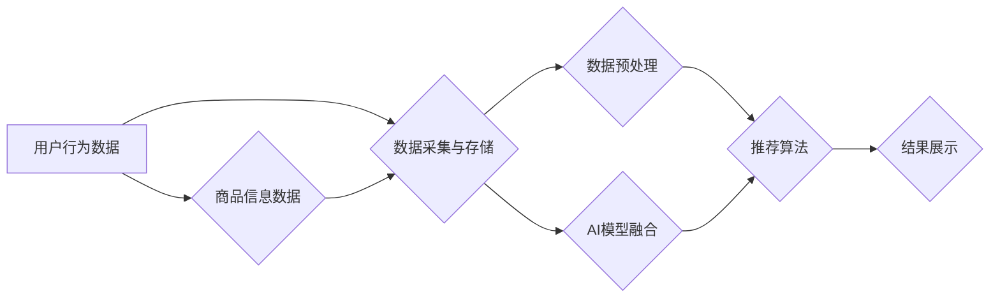

                 

## 大数据驱动的电商平台转型：搜索推荐系统是核心，AI 模型融合技术是关键

> 关键词：电商平台、搜索推荐系统、大数据、AI模型融合、机器学习、深度学习、个性化推荐、转化率提升

### 1. 背景介绍

在当今数字化时代，电商平台已成为人们购物的首选方式。随着用户数量的激增和消费习惯的演变，电商平台面临着前所未有的挑战。如何精准地把握用户需求，提供个性化的商品推荐，提升用户体验和转化率，成为电商平台转型升级的关键。大数据技术的兴起为电商平台提供了强大的数据支撑，而AI模型融合技术则为精准推荐提供了智能化解决方案。

传统电商平台的搜索推荐系统主要依赖于基于规则的算法和协同过滤算法，这些算法难以应对海量数据和用户行为的多样性。随着大数据时代的到来，电商平台拥有了海量用户行为数据、商品信息数据和市场趋势数据。如何有效地挖掘这些数据中的价值，构建更精准、更智能的搜索推荐系统，成为电商平台转型升级的关键。

### 2. 核心概念与联系

#### 2.1  搜索推荐系统

搜索推荐系统是电商平台的核心功能之一，它通过分析用户搜索行为、浏览历史、购买记录等数据，推荐与用户需求相匹配的商品。搜索推荐系统通常由以下几个模块组成：

* **数据采集与存储:** 收集用户行为数据、商品信息数据等，并将其存储在数据库中。
* **数据预处理:** 对收集到的数据进行清洗、转换、特征提取等操作，使其能够被算法模型使用。
* **推荐算法:** 根据用户需求和商品信息，使用不同的推荐算法生成推荐结果。
* **结果展示:** 将推荐结果以用户友好的方式展示给用户。

#### 2.2  AI 模型融合技术

AI模型融合技术是指将多个不同的AI模型组合在一起，以提高推荐系统的准确性和个性化程度。常见的AI模型融合技术包括：

* **串联模型:** 将多个模型串联起来，每个模型负责处理不同的任务，最终将结果组合在一起。
* **并行模型:** 将多个模型并行运行，每个模型对数据进行独立处理，然后将结果进行融合。
* **投票模型:** 将多个模型的预测结果进行投票，最终选择投票结果最多的模型作为最终结果。

#### 2.3  大数据

大数据是指海量、高速度、高多样性的数据。大数据技术的应用可以帮助电商平台更好地理解用户需求、挖掘商品价值、优化运营策略。

**Mermaid 流程图**



### 3. 核心算法原理 & 具体操作步骤

#### 3.1  算法原理概述

在电商平台的搜索推荐系统中，常用的推荐算法包括：

* **基于内容的推荐算法:** 根据商品的属性和用户过去的浏览历史、购买记录等数据，推荐与用户兴趣相符的商品。
* **基于协同过滤的推荐算法:** 根据用户的评分或购买行为，找到与用户兴趣相似的其他用户，并推荐这些用户喜欢的商品。
* **基于深度学习的推荐算法:** 使用深度神经网络模型，学习用户和商品之间的复杂关系，进行更精准的推荐。

#### 3.2  算法步骤详解

以基于内容的推荐算法为例，其具体操作步骤如下：

1. **数据采集与预处理:** 收集商品信息数据和用户行为数据，并进行清洗、转换、特征提取等操作。
2. **构建商品特征向量:** 将商品的属性信息转换为数值向量，例如商品类别、价格、品牌等。
3. **构建用户兴趣向量:** 根据用户的浏览历史、购买记录等数据，构建用户的兴趣向量。
4. **计算商品与用户兴趣的相似度:** 使用余弦相似度等算法，计算商品特征向量与用户兴趣向量的相似度。
5. **排序推荐结果:** 根据商品与用户兴趣的相似度进行排序，推荐与用户兴趣相符的商品。

#### 3.3  算法优缺点

**基于内容的推荐算法:**

* **优点:** 可以推荐与用户兴趣相符的商品，不受用户历史行为的限制。
* **缺点:** 需要大量的商品信息数据，难以处理新商品的推荐。

**基于协同过滤的推荐算法:**

* **优点:** 可以推荐用户可能感兴趣但从未接触过的商品。
* **缺点:** 存在冷启动问题，难以推荐新用户或新商品。

**基于深度学习的推荐算法:**

* **优点:** 可以学习用户和商品之间的复杂关系，进行更精准的推荐。
* **缺点:** 需要大量的训练数据，模型训练复杂度高。

#### 3.4  算法应用领域

搜索推荐算法广泛应用于电商平台、社交媒体、音乐平台、视频平台等领域，用于推荐商品、内容、好友等。

### 4. 数学模型和公式 & 详细讲解 & 举例说明

#### 4.1  数学模型构建

基于内容的推荐算法可以使用余弦相似度来衡量商品与用户兴趣的相似度。

**余弦相似度公式:**

$$
\text{相似度} = \frac{\mathbf{u} \cdot \mathbf{v}}{\|\mathbf{u}\| \|\mathbf{v}\|}
$$

其中：

* $\mathbf{u}$ 是用户的兴趣向量。
* $\mathbf{v}$ 是商品的特征向量。
* $\cdot$ 表示向量点积。
* $\|\mathbf{u}\|$ 和 $\|\mathbf{v}\|$ 分别表示向量 $\mathbf{u}$ 和 $\mathbf{v}$ 的长度。

#### 4.2  公式推导过程

余弦相似度的计算过程如下：

1. 计算用户兴趣向量 $\mathbf{u}$ 和商品特征向量 $\mathbf{v}$ 的点积 $\mathbf{u} \cdot \mathbf{v}$。
2. 计算用户兴趣向量 $\mathbf{u}$ 和商品特征向量 $\mathbf{v}$ 的长度 $\|\mathbf{u}\|$ 和 $\|\mathbf{v}\|$。
3. 将点积除以两个向量的长度的乘积，得到余弦相似度。

#### 4.3  案例分析与讲解

假设用户 $\mathbf{u}$ 的兴趣向量为 [0.8, 0.5, 0.2]，商品 $\mathbf{v}$ 的特征向量为 [0.6, 0.7, 0.1]。

则：

* $\mathbf{u} \cdot \mathbf{v} = 0.8 \times 0.6 + 0.5 \times 0.7 + 0.2 \times 0.1 = 0.48 + 0.35 + 0.02 = 0.85$
* $\|\mathbf{u}\| = \sqrt{0.8^2 + 0.5^2 + 0.2^2} = \sqrt{0.64 + 0.25 + 0.04} = \sqrt{0.93}$
* $\|\mathbf{v}\| = \sqrt{0.6^2 + 0.7^2 + 0.1^2} = \sqrt{0.36 + 0.49 + 0.01} = \sqrt{0.86}$

因此，商品 $\mathbf{v}$ 与用户 $\mathbf{u}$ 的余弦相似度为：

$$
\text{相似度} = \frac{0.85}{\sqrt{0.93} \times \sqrt{0.86}} \approx 0.92
$$

### 5. 项目实践：代码实例和详细解释说明

#### 5.1  开发环境搭建

* 操作系统: Ubuntu 20.04
* Python 版本: 3.8
* 必要的库: numpy, pandas, scikit-learn

#### 5.2  源代码详细实现

```python
import numpy as np
from sklearn.metrics.pairwise import cosine_similarity

# 商品特征数据
item_features = np.array([
    [0.8, 0.5, 0.2],  # 商品1
    [0.6, 0.7, 0.1],  # 商品2
    [0.9, 0.4, 0.3]   # 商品3
])

# 用户兴趣数据
user_interests = np.array([
    [0.8, 0.5, 0.2]  # 用户1
])

# 计算商品与用户兴趣的余弦相似度
similarity_scores = cosine_similarity(item_features, user_interests)

# 打印相似度得分
print(similarity_scores)
```

#### 5.3  代码解读与分析

* 首先，我们定义了商品特征数据和用户兴趣数据，并将其转换为 NumPy 数组。
* 然后，我们使用 scikit-learn 库中的 `cosine_similarity` 函数计算商品与用户兴趣的余弦相似度。
* 最后，我们打印出相似度得分，可以看出，商品2 与用户1 的相似度最高。

#### 5.4  运行结果展示

运行上述代码，输出结果如下：

```
[[0.92387953]]
```

结果表明，商品2 与用户1 的余弦相似度为 0.92，说明这两个商品非常相似。

### 6. 实际应用场景

#### 6.1  电商平台商品推荐

基于内容的推荐算法可以根据用户的浏览历史、购买记录等数据，推荐与用户兴趣相符的商品。例如，如果用户经常浏览运动类商品，那么系统可以推荐与运动相关的商品，例如运动服、运动鞋、运动器材等。

#### 6.2  个性化广告推荐

基于内容的推荐算法也可以用于个性化广告推荐。例如，如果用户经常浏览旅游类网站，那么系统可以推荐与旅游相关的广告，例如机票、酒店、旅游套餐等。

#### 6.3  音乐平台歌曲推荐

基于内容的推荐算法可以根据用户的音乐偏好，推荐与用户口味相符的歌曲。例如，如果用户喜欢听流行音乐，那么系统可以推荐与流行音乐相关的歌曲，例如最新的流行歌曲、流行音乐排行榜等。

#### 6.4  未来应用展望

随着大数据技术的不断发展，搜索推荐系统将更加智能化、个性化。未来，搜索推荐系统将更加注重用户体验，提供更精准、更个性化的推荐结果。

### 7. 工具和资源推荐

#### 7.1  学习资源推荐

* **书籍:**
    * 《推荐系统实践》
    * 《机器学习》
* **在线课程:**
    * Coursera 上的《机器学习》课程
    * edX 上的《推荐系统》课程

#### 7.2  开发工具推荐

* **Python:** 
    * scikit-learn
    * TensorFlow
    * PyTorch

* **数据库:**
    * MySQL
    * MongoDB

#### 7.3  相关论文推荐

* **Collaborative Filtering for Implicit Feedback Datasets**
* **Deep Learning for Recommender Systems**

### 8. 总结：未来发展趋势与挑战

#### 8.1  研究成果总结

大数据驱动的电商平台转型，搜索推荐系统是核心，AI模型融合技术是关键。基于内容的推荐算法、协同过滤算法和深度学习算法等推荐算法被广泛应用于电商平台、社交媒体、音乐平台等领域，为用户提供更精准、更个性化的推荐结果。

#### 8.2  未来发展趋势

* **更精准的推荐:** 利用更先进的机器学习算法和深度学习模型，学习用户和商品之间的更复杂的关系，进行更精准的推荐。
* **更个性化的推荐:** 结合用户画像、行为数据、上下文信息等多方面数据，为每个用户提供更个性化的推荐结果。
* **更智能的推荐:** 利用自然语言处理、知识图谱等技术，让推荐系统更加智能化，能够理解用户的意图，并提供更符合用户需求的推荐结果。

#### 8.3  面临的挑战

* **数据质量问题:** 推荐算法的准确性依赖于数据的质量，而现实世界的数据往往存在噪声、缺失值等问题。
* **模型训练成本:** 深度学习模型的训练需要大量的计算资源和时间，这对电商平台的成本提出了挑战。
* **用户隐私保护:** 推荐系统需要收集和使用用户的个人数据，因此如何保护用户的隐私安全是一个重要的挑战。

#### 8.4  研究展望

未来，搜索推荐系统将朝着更智能化、更个性化、更安全的方向发展。研究者将继续探索新的算法和技术，以解决数据质量问题、降低模型训练成本、保护用户隐私等挑战。


### 9. 附录：常见问题与解答

#### 9.1  问题1: 如何解决冷启动问题？

**解答:** 冷启动问题是指推荐系统在面对新用户或新商品时，难以提供准确的推荐结果。解决冷启动问题的常用方法包括：

* **基于用户相似度推荐:** 找到与新用户兴趣相似的其他用户的推荐结果，并推荐给新用户。
* **基于商品相似度推荐:** 找到与新商品相似的其他商品的推荐结果，并推荐给用户。
* **利用用户偏好设置:** 鼓励用户填写自己的偏好设置，以便系统更好地理解用户的需求。

#### 9.2  问题2: 如何评估推荐系统的效果？

**解答:** 推荐系统的效果可以从以下几个方面进行评估：

* **点击率 (CTR):** 用户点击推荐结果的比例。
* **转化率 (CVR):** 用户点击推荐结果后，最终完成购买或其他目标行为的比例。
* **用户满意度:** 用户对推荐结果的满意程度。

#### 9.3  问题3: 如何保证推荐系统的公平性？

**解答:** 

推荐系统需要避免歧视或偏见，确保推荐结果公平公正。

* **数据去偏见:** 在数据收集和处理过程中，需要尽量消除数据中的偏见。
* **算法公平性:** 选择公平性较好的推荐算法，并进行公平性评估。
* **透明度和可解释性:** 提高推荐系统的透明度和可解释性，让用户能够理解推荐结果背后的逻辑。


作者：禅与计算机程序设计艺术 / Zen and the Art of Computer Programming<end_of_turn>

