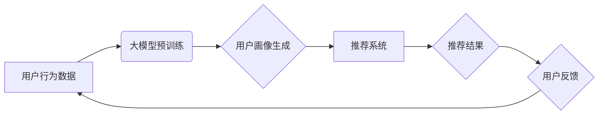

                 

## 大模型辅助的推荐系统用户画像构建

> 关键词：推荐系统、用户画像、大模型、深度学习、自然语言处理、Transformer、联邦学习

## 1. 背景介绍

推荐系统作为互联网时代的重要技术支柱，在电商、社交媒体、内容平台等领域发挥着至关重要的作用。其核心目标是根据用户的历史行为、偏好和上下文信息，预测用户对特定商品、内容或服务感兴趣，并提供个性化的推荐结果。

传统的推荐系统主要依赖于基于内容的过滤、协同过滤等方法，这些方法通常基于用户的显性反馈（如评分、点赞）或隐性反馈（如浏览记录、购买历史）。然而，随着数据量的激增和用户行为的复杂化，传统的推荐系统面临着以下挑战：

* **数据稀疏性:** 用户行为数据往往是稀疏的，难以捕捉用户的细微偏好和兴趣。
* **冷启动问题:** 新用户或新商品缺乏历史数据，难以进行有效的推荐。
* **个性化程度不足:** 传统的推荐方法难以充分挖掘用户的深层需求和意图。

近年来，大模型技术的发展为推荐系统带来了新的机遇。大模型，例如GPT-3、BERT等，拥有强大的语义理解和文本生成能力，能够从海量文本数据中学习用户画像，并生成更精准、更个性化的推荐结果。

## 2. 核心概念与联系

### 2.1 用户画像

用户画像是指对用户进行深入分析和描述，构建出用户特征、行为模式、兴趣偏好等多维度的综合画像。用户画像是推荐系统的重要基础，能够帮助系统更好地理解用户的需求，提供更精准的推荐。

### 2.2 大模型

大模型是指参数量巨大、训练数据海量的人工智能模型。大模型通常基于深度学习技术，例如Transformer架构，能够学习复杂的语义关系和模式。

### 2.3 推荐系统

推荐系统是指利用数据挖掘、机器学习等技术，根据用户的历史行为、偏好和上下文信息，预测用户对特定商品、内容或服务感兴趣，并提供个性化的推荐结果的系统。

**大模型辅助推荐系统用户画像构建的架构**



## 3. 核心算法原理 & 具体操作步骤

### 3.1 算法原理概述

大模型辅助用户画像构建的核心算法原理是利用大模型的强大的语义理解能力，从用户的行为数据中提取特征，构建用户画像。

具体来说，大模型可以学习用户在不同场景下的语言表达模式，识别用户的兴趣爱好、价值观、生活方式等特征，并将其转化为可量化的用户画像。

### 3.2 算法步骤详解

1. **数据收集与预处理:** 收集用户的行为数据，例如浏览记录、搜索历史、购买记录、评论内容等。对数据进行清洗、去噪、格式化等预处理操作。

2. **大模型预训练:** 利用海量文本数据对大模型进行预训练，使其具备强大的语义理解和文本生成能力。

3. **用户特征提取:** 将用户的行为数据输入到预训练好的大模型中，提取用户的特征向量。

4. **用户画像构建:** 将提取的用户特征向量进行聚类、降维等操作，构建用户的多维用户画像。

5. **推荐系统训练:** 将构建的用户画像作为输入，训练推荐系统模型，提高推荐的精准度和个性化程度。

### 3.3 算法优缺点

**优点:**

* **精准度高:** 大模型能够从海量文本数据中学习用户的深层需求和意图，构建更精准的用户画像。
* **个性化程度高:** 大模型可以根据用户的个性化特征，提供更个性化的推荐结果。
* **适应性强:** 大模型能够适应不断变化的用户行为和市场趋势。

**缺点:**

* **计算资源消耗大:** 大模型的训练和推理需要大量的计算资源。
* **数据隐私问题:** 大模型的训练需要使用用户的个人数据，需要妥善处理数据隐私问题。
* **模型解释性差:** 大模型的决策过程较为复杂，难以解释其推荐结果背后的逻辑。

### 3.4 算法应用领域

大模型辅助的用户画像构建技术广泛应用于以下领域:

* **电商推荐:** 为用户推荐个性化的商品，提高转化率。
* **内容推荐:** 为用户推荐个性化的新闻、视频、音乐等内容。
* **社交推荐:** 为用户推荐新的朋友、兴趣小组等，提高用户粘性。
* **广告推荐:** 为用户推荐精准的广告，提高广告效果。

## 4. 数学模型和公式 & 详细讲解 & 举例说明

### 4.1 数学模型构建

用户画像构建可以看作是一个特征提取和聚类问题。

我们可以使用以下数学模型来表示用户画像：

* **用户特征向量:**  $u = (u_1, u_2, ..., u_n)$，其中 $u_i$ 表示用户在第 $i$ 个特征维度上的值。

* **用户画像:** $P = \{p_1, p_2, ..., p_m\}$，其中 $p_i$ 表示第 $i$ 个用户画像，是一个用户特征向量的集合。

### 4.2 公式推导过程

用户特征向量可以根据用户的行为数据进行计算。例如，我们可以使用词袋模型来计算用户的兴趣爱好：

* **词袋模型:**  对于用户的文本数据，我们可以统计每个词的出现频率，将其作为用户的兴趣爱好特征。

用户画像的聚类可以使用k-means算法等聚类算法进行。

* **k-means算法:**  将用户特征向量划分为k个簇，每个簇代表一个用户画像。

### 4.3 案例分析与讲解

假设我们有一个电商平台，用户行为数据包括用户的浏览记录、购买记录和评论内容。我们可以使用大模型来提取用户的特征向量，例如用户的兴趣爱好、消费偏好、年龄段等。

然后，我们可以使用k-means算法将用户特征向量聚类，构建不同的用户画像，例如“时尚爱好者”、“科技达人”、“家庭主妇”等。

最后，我们可以根据用户的画像，为其推荐个性化的商品。

## 5. 项目实践：代码实例和详细解释说明

### 5.1 开发环境搭建

* **操作系统:** Linux/macOS
* **编程语言:** Python
* **深度学习框架:** TensorFlow/PyTorch
* **大模型库:** HuggingFace Transformers

### 5.2 源代码详细实现

```python
# 导入必要的库
import tensorflow as tf
from transformers import AutoTokenizer, AutoModel

# 加载预训练模型和词典
model_name = "bert-base-uncased"
tokenizer = AutoTokenizer.from_pretrained(model_name)
model = AutoModel.from_pretrained(model_name)

# 预处理用户行为数据
def preprocess_text(text):
    # ...

# 生成用户特征向量
def generate_user_embedding(text):
    inputs = tokenizer(text, return_tensors="tf")
    outputs = model(**inputs)
    embedding = outputs.last_hidden_state[:, 0, :]
    return embedding

# 聚类用户特征向量
def cluster_users(embeddings):
    # ...

# 构建用户画像
def build_user_profile(embeddings, clusters):
    # ...

# ...
```

### 5.3 代码解读与分析

* **加载预训练模型和词典:** 使用HuggingFace Transformers库加载预训练的BERT模型和词典。
* **预处理用户行为数据:** 对用户的文本数据进行预处理，例如去除停用词、分词等。
* **生成用户特征向量:** 使用BERT模型对用户的文本数据进行编码，生成用户的特征向量。
* **聚类用户特征向量:** 使用k-means算法等聚类算法将用户的特征向量进行聚类，构建不同的用户画像。
* **构建用户画像:** 根据用户的特征向量和聚类结果，构建用户的多维用户画像。

### 5.4 运行结果展示

运行代码后，可以得到用户的特征向量和聚类结果，并根据聚类结果构建用户的多维用户画像。

## 6. 实际应用场景

### 6.1 电商推荐

大模型辅助的用户画像构建技术可以帮助电商平台更精准地推荐商品，提高用户转化率。例如，可以根据用户的兴趣爱好、消费偏好、年龄段等特征，推荐个性化的商品。

### 6.2 内容推荐

大模型可以帮助内容平台更精准地推荐新闻、视频、音乐等内容，提高用户粘性。例如，可以根据用户的阅读习惯、观看历史、音乐偏好等特征，推荐个性化的内容。

### 6.3 社交推荐

大模型可以帮助社交平台更精准地推荐新的朋友、兴趣小组等，提高用户活跃度。例如，可以根据用户的兴趣爱好、社交关系、地理位置等特征，推荐新的朋友和兴趣小组。

### 6.4 未来应用展望

大模型辅助的用户画像构建技术在未来将有更广泛的应用场景，例如：

* **个性化教育:** 根据学生的学习习惯、知识掌握情况等特征，提供个性化的学习方案。
* **医疗诊断:** 根据患者的症状、病史、基因信息等特征，辅助医生进行诊断。
* **金融风险控制:** 根据用户的信用记录、消费习惯等特征，评估用户的风险等级。

## 7. 工具和资源推荐

### 7.1 学习资源推荐

* **书籍:**
    * 《深度学习》 by Ian Goodfellow, Yoshua Bengio, Aaron Courville
    * 《自然语言处理》 by Dan Jurafsky, James H. Martin
* **在线课程:**
    * Coursera: Deep Learning Specialization
    * Udacity: Deep Learning Nanodegree
* **博客和网站:**
    * HuggingFace Blog: https://huggingface.co/blog
    * TensorFlow Blog: https://blog.tensorflow.org/

### 7.2 开发工具推荐

* **深度学习框架:** TensorFlow, PyTorch
* **大模型库:** HuggingFace Transformers
* **数据处理工具:** Pandas, NumPy

### 7.3 相关论文推荐

* **BERT: Pre-training of Deep Bidirectional Transformers for Language Understanding**
* **GPT-3: Language Models are Few-Shot Learners**
* **Transformer-XL: Attentive Language Models with Gated Recurrence**

## 8. 总结：未来发展趋势与挑战

### 8.1 研究成果总结

大模型辅助的用户画像构建技术取得了显著的成果，能够构建更精准、更个性化的用户画像，提高推荐系统的精准度和个性化程度。

### 8.2 未来发展趋势

* **模型规模和能力的提升:** 未来大模型的规模和能力将继续提升，能够学习更复杂的语义关系和模式，构建更精细的用户画像。
* **多模态用户画像构建:** 未来将结合文本、图像、音频等多模态数据，构建更全面的用户画像。
* **联邦学习和隐私保护:** 未来将更加注重数据隐私保护，采用联邦学习等技术，在不泄露用户隐私的情况下构建用户画像。

### 8.3 面临的挑战

* **数据质量和稀疏性:** 大模型需要海量高质量的数据进行训练，而用户行为数据往往是稀疏的，需要进行有效的数据增强和处理。
* **模型解释性和可解释性:** 大模型的决策过程较为复杂，难以解释其推荐结果背后的逻辑，需要进行模型解释性和可解释性的研究。
* **公平性和偏见:** 大模型可能会学习到用户的偏见和歧视，需要进行公平性和偏见检测和缓解。

### 8.4 研究展望

未来，大模型辅助的用户画像构建技术将继续发展，为推荐系统、个性化服务等领域带来更多创新和应用。


## 9. 附录：常见问题与解答

**Q1: 大模型辅助的用户画像构建技术与传统的推荐系统相比有什么优势？**

**A1:** 大模型辅助的用户画像构建技术能够从海量文本数据中学习用户的深层需求和意图，构建更精准的用户画像，相比传统的推荐系统能够提供更精准、更个性化的推荐结果。

**Q2: 大模型辅助的用户画像构建技术有哪些应用场景？**

**A2:** 大模型辅助的用户画像构建技术广泛应用于电商推荐、内容推荐、社交推荐等领域。

**Q3: 如何评估大模型辅助的用户画像构建技术的性能？**

**A3:** 可以使用准确率、召回率、F1-score等指标来评估大模型辅助的用户画像构建技术的性能。

**Q4: 大模型辅助的用户画像构建技术有哪些挑战？**

**A4:** 大模型辅助的用户画像构建技术面临着数据质量和稀疏性、模型解释性和可解释性、公平性和偏见等挑战。


作者：禅与计算机程序设计艺术 / Zen and the Art of Computer Programming 
<end_of_turn>

