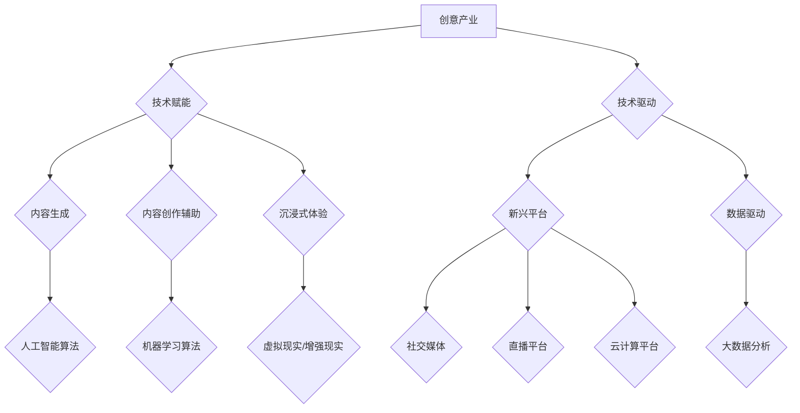

                 

## 如何利用技术能力进行创意产业革新

> 关键词：人工智能、创意产业、技术革新、机器学习、深度学习、数据驱动、算法、自动化、数字孪生

## 1. 背景介绍

创意产业，涵盖了电影、音乐、文学、艺术、设计等领域，一直是人类文化发展的重要组成部分。然而，随着数字技术的快速发展，创意产业面临着前所未有的机遇和挑战。一方面，新兴技术为创意工作者提供了全新的创作工具和平台，推动着创意产业的数字化转型；另一方面，技术带来的效率提升和成本降低也加剧了市场竞争，迫使创意产业不断寻求新的突破口。

在这样的背景下，如何有效利用技术能力进行创意产业革新，成为一个至关重要的议题。

## 2. 核心概念与联系

**2.1  创意产业与技术融合**

创意产业的核心在于“创意”，而技术则为创意的实现提供工具和平台。

* **技术赋能创意：**

人工智能、机器学习、虚拟现实、增强现实等新兴技术为创意工作者提供了强大的工具，例如：
    * **内容生成：** 利用人工智能算法生成音乐、剧本、绘画等创意内容。
    * **内容创作辅助：** 使用机器学习算法辅助创意工作者进行内容创作、编辑和优化。
    * **沉浸式体验：** 通过虚拟现实和增强现实技术打造沉浸式的创意体验。

* **技术驱动创新：**

技术本身也能够驱动创意产业的创新，例如：
    * **新兴平台：**  社交媒体、直播平台、云计算平台等新兴技术平台为创意内容的传播和商业化提供了新的途径。
    * **数据驱动：** 利用大数据分析技术洞察用户需求，为创意内容的开发和营销提供数据支持。

**2.2  技术革新路径**

技术革新可以从以下几个方面进行：

* **算法优化：**  不断改进人工智能算法，提高其生成创意内容的质量和效率。
* **数据增强：**  收集和训练更多高质量的数据，为人工智能算法提供更丰富的学习素材。
* **技术融合：**  将不同技术领域的技术进行融合，例如将人工智能与虚拟现实、增强现实等技术结合，创造更具沉浸性和交互性的创意体验。

**Mermaid 流程图**



## 3. 核心算法原理 & 具体操作步骤

**3.1  算法原理概述**

在创意产业中，人工智能算法扮演着越来越重要的角色。其中，深度学习算法在生成创意内容方面表现尤为出色。深度学习算法通过多层神经网络结构，学习数据中的复杂模式和关系，从而能够生成具有创造性的内容。

**3.2  算法步骤详解**

深度学习算法的具体操作步骤如下：

1. **数据收集和预处理：** 收集大量与创意内容相关的训练数据，并进行预处理，例如文本清洗、图像增强等。
2. **模型构建：** 根据具体的创意任务，选择合适的深度学习模型架构，例如生成对抗网络（GAN）、变分自编码器（VAE）等。
3. **模型训练：** 利用训练数据训练深度学习模型，调整模型参数，使其能够生成高质量的创意内容。
4. **模型评估：** 使用测试数据评估模型的性能，例如生成内容的质量、多样性和原创性等。
5. **模型部署：** 将训练好的模型部署到实际应用场景中，例如用于内容创作、内容推荐等。

**3.3  算法优缺点**

**优点：**

* **生成高质量的创意内容：** 深度学习算法能够学习数据中的复杂模式，生成具有创造性的内容。
* **自动化创作：** 深度学习算法可以自动化创意内容的生成过程，提高效率。
* **个性化定制：** 深度学习算法可以根据用户的需求进行个性化定制，生成符合用户偏好的内容。

**缺点：**

* **数据依赖：** 深度学习算法需要大量高质量的数据进行训练，否则生成的创意内容质量会下降。
* **黑盒效应：** 深度学习模型的内部工作机制比较复杂，难以解释其生成创意内容的逻辑。
* **伦理问题：** 深度学习算法生成的创意内容可能存在版权问题、偏见问题等伦理问题。

**3.4  算法应用领域**

深度学习算法在创意产业的应用领域非常广泛，例如：

* **音乐创作：** 生成新的音乐旋律、伴奏和歌曲。
* **剧本创作：** 生成电影剧本、电视剧剧本、舞台剧剧本等。
* **绘画创作：** 生成新的绘画作品，包括油画、水彩画、素描等。
* **游戏设计：** 生成游戏场景、游戏角色、游戏剧情等。
* **广告创意：** 生成创意广告文案、广告图片、广告视频等。

## 4. 数学模型和公式 & 详细讲解 & 举例说明

**4.1  数学模型构建**

深度学习算法的核心是神经网络模型。神经网络模型由多个层组成，每层包含多个神经元。神经元之间通过连接进行信息传递，每个连接都有一个权重。

**4.2  公式推导过程**

深度学习算法的训练过程是通过调整神经网络模型的权重来实现的。常用的优化算法包括梯度下降法、动量法、Adam算法等。这些算法通过计算神经网络模型的损失函数，并根据损失函数的梯度来更新神经网络模型的权重。

**损失函数**

$$L = \frac{1}{N} \sum_{i=1}^{N} \left\| y_i - \hat{y}_i \right\|^2$$

其中：

* $L$ 是损失函数
* $N$ 是训练数据的数量
* $y_i$ 是第 $i$ 个训练数据的真实值
* $\hat{y}_i$ 是第 $i$ 个训练数据的预测值

**梯度下降法**

$$\theta = \theta - \alpha \nabla L(\theta)$$

其中：

* $\theta$ 是神经网络模型的权重
* $\alpha$ 是学习率
* $\nabla L(\theta)$ 是损失函数对权重的梯度

**4.3  案例分析与讲解**

例如，在图像生成任务中，可以使用生成对抗网络（GAN）算法。GAN由两个网络组成：生成器网络和判别器网络。生成器网络负责生成图像，判别器网络负责判断图像是否为真实图像。这两个网络在对抗游戏中相互竞争，最终生成器网络能够生成逼真的图像。

## 5. 项目实践：代码实例和详细解释说明

**5.1  开发环境搭建**

* **操作系统：** Linux、macOS、Windows
* **编程语言：** Python
* **深度学习框架：** TensorFlow、PyTorch
* **其他工具：** Git、Jupyter Notebook

**5.2  源代码详细实现**

以下是一个使用 TensorFlow 框架实现图像生成器的简单代码示例：

```python
import tensorflow as tf

# 定义生成器网络
def generator(z):
  # ...

# 定义判别器网络
def discriminator(x):
  # ...

# 训练过程
optimizer = tf.keras.optimizers.Adam(learning_rate=0.0002)
for epoch in range(100):
  # ...
```

**5.3  代码解读与分析**

* **生成器网络：** 生成器网络从随机噪声向量 $z$ 中生成图像。
* **判别器网络：** 判别器网络判断图像是否为真实图像。
* **训练过程：** 训练过程包括生成器网络和判别器网络的交替训练。

**5.4  运行结果展示**

训练完成后，可以使用生成器网络生成新的图像。

## 6. 实际应用场景

**6.1  电影制作**

* **角色动画：** 利用深度学习算法生成角色动画，提高动画制作效率。
* **场景生成：** 利用深度学习算法生成电影场景，降低场景制作成本。
* **特效制作：** 利用深度学习算法生成特效，提升电影视觉效果。

**6.2  音乐创作**

* **音乐作曲：** 利用深度学习算法生成新的音乐旋律和伴奏。
* **音乐风格转换：** 利用深度学习算法将一首音乐转换为不同的音乐风格。
* **音乐伴奏生成：** 利用深度学习算法根据歌词生成相应的音乐伴奏。

**6.3  游戏开发**

* **游戏场景生成：** 利用深度学习算法生成游戏场景，提高游戏场景的多样性和真实感。
* **游戏角色设计：** 利用深度学习算法生成游戏角色，降低角色设计成本。
* **游戏剧情生成：** 利用深度学习算法生成游戏剧情，提高游戏剧情的丰富性和可玩性。

**6.4  未来应用展望**

随着人工智能技术的不断发展，未来创意产业将更加依赖于技术的力量。例如：

* **数字孪生：** 利用数字孪生技术，构建创意作品的虚拟模型，实现对创意作品的实时模拟和分析。
* **沉浸式体验：** 利用虚拟现实、增强现实等技术，打造更加沉浸式的创意体验。
* **个性化定制：** 利用人工智能算法，根据用户的需求进行个性化定制，生成符合用户偏好的创意内容。

## 7. 工具和资源推荐

**7.1  学习资源推荐**

* **在线课程：** Coursera、edX、Udacity 等平台提供深度学习相关的在线课程。
* **书籍：** 《深度学习》、《动手学深度学习》等书籍对深度学习算法和应用进行了详细介绍。
* **开源代码库：** TensorFlow、PyTorch 等深度学习框架的开源代码库可以帮助开发者学习和实践深度学习算法。

**7.2  开发工具推荐**

* **深度学习框架：** TensorFlow、PyTorch、Keras 等深度学习框架提供了丰富的工具和功能，方便开发者进行深度学习模型的开发和训练。
* **数据处理工具：** Pandas、NumPy 等数据处理工具可以帮助开发者进行数据预处理和分析。
* **可视化工具：** Matplotlib、Seaborn 等可视化工具可以帮助开发者可视化深度学习模型的训练过程和结果。

**7.3  相关论文推荐**

* **生成对抗网络（GAN）：** Goodfellow et al., Generative Adversarial Networks.
* **变分自编码器（VAE）：** Kingma & Welling, Auto-Encoding Variational Bayes.

## 8. 总结：未来发展趋势与挑战

**8.1  研究成果总结**

近年来，深度学习算法在创意产业的应用取得了显著进展，例如在图像生成、音乐创作、游戏开发等领域取得了突破性成果。

**8.2  未来发展趋势**

未来，深度学习算法在创意产业的应用将更加广泛和深入，例如：

* **更加逼真的创意内容生成：** 深度学习算法将能够生成更加逼真、更加具有创意的内容。
* **更加个性化的创意体验：** 深度学习算法将能够根据用户的需求进行个性化定制，生成符合用户偏好的创意内容。
* **更加高效的创意工作流程：** 深度学习算法将能够自动化许多创意工作流程，提高创意工作效率。

**8.3  面临的挑战**

深度学习算法在创意产业的应用也面临着一些挑战，例如：

* **数据获取和标注：** 深度学习算法需要大量高质量的数据进行训练，获取和标注高质量数据是一个挑战。
* **算法解释性和可控性：** 深度学习模型的内部工作机制比较复杂，难以解释其生成创意内容的逻辑，这可能会导致算法的可控性和透明性问题。
* **伦理问题：** 深度学习算法生成的创意内容可能存在版权问题、偏见问题等伦理问题，需要引起重视。

**8.4  研究展望**

未来，需要进一步研究以下问题：

* 如何提高深度学习算法的生成创意内容的质量和多样性？
* 如何增强深度学习算法的解释性和可控性？
* 如何解决深度学习算法在创意产业应用中的伦理问题？


## 9. 附录：常见问题与解答

**9.1  深度学习算法是否能够完全替代人类创意？**

深度学习算法可以辅助人类进行创意工作，但目前还无法完全替代人类创意。人类的创造力来自于对世界复杂现象的理解、思考和感悟，而深度学习算法只能学习数据中的模式和关系，无法真正理解和感悟。

**9.2  深度学习算法生成的创意内容是否具有版权？**

深度学习算法生成的创意内容的版权问题是一个复杂的问题，目前还没有明确的法律规定。

**9.3  如何避免深度学习算法生成的创意内容存在偏见？**

深度学习算法的训练数据可能会包含偏见，从而导致算法生成的创意内容也存在偏见。为了避免这种情况，需要在训练数据中进行去偏见处理，并对算法生成的创意内容进行人工审核。


作者：禅与计算机程序设计艺术 / Zen and the Art of Computer Programming 
<end_of_turn>

