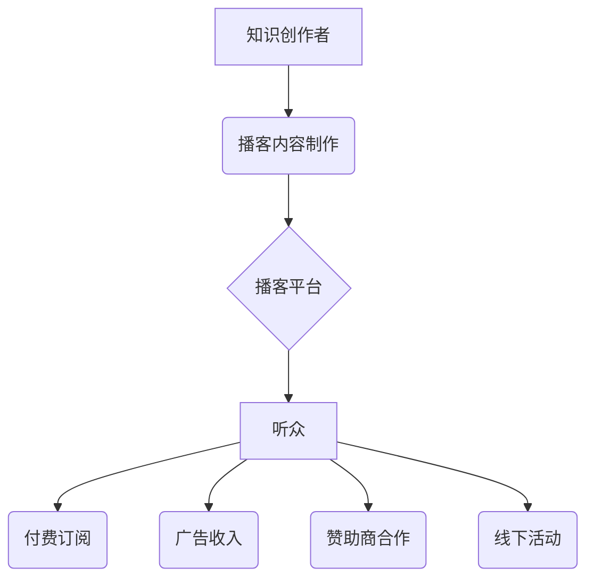

                 

## 如何利用播客平台实现知识变现

> 关键词：播客、知识变现、音频内容、付费订阅、广告收入、赞助商合作、社区建设、品牌推广

### 1. 背景介绍

在数字时代，知识是至关重要的资产。随着互联网的普及和移动设备的广泛使用，人们对获取知识的需求日益增长。播客作为一种音频内容形式，凭借其便捷、高效、个性化的特点，逐渐成为知识传播和分享的重要平台。

播客的兴起为知识创作者提供了新的变现机会。通过制作高质量的播客内容，知识创作者可以吸引听众，建立个人品牌，并通过多种方式实现收益。

### 2. 核心概念与联系

**2.1 播客平台概述**

播客平台是指提供播客内容发布、存储、播放和管理服务的网络平台。常见的播客平台包括 Apple Podcasts、Spotify、Google Podcasts、喜马拉雅FM 等。

**2.2 知识变现模式**

知识变现是指通过分享知识和技能，获取经济回报的过程。常见的知识变现模式包括：

* **付费订阅:** 创作者提供付费订阅服务，听众可以通过付费订阅获得独家内容、会员福利等。
* **广告收入:** 播客平台通过在播客内容中插入广告来获取收入，并与创作者分享广告分成。
* **赞助商合作:** 创作者与赞助商合作，在播客内容中推广赞助商的产品或服务。
* **线下活动:** 创作者通过举办线下活动，例如讲座、研讨会等，向听众提供更深入的知识分享和互动体验。

**2.3 播客与知识变现的联系**

播客平台为知识创作者提供了便捷的平台，可以将知识内容以音频形式发布，并通过多种模式实现变现。

**2.4 核心架构**



### 3. 核心算法原理 & 具体操作步骤

**3.1 算法原理概述**

播客平台的知识变现模式主要基于以下算法原理：

* **内容推荐算法:** 根据用户的听众历史、偏好和行为数据，推荐相关播客内容。
* **广告匹配算法:** 根据用户的兴趣和行为数据，匹配合适的广告内容。
* **付费订阅算法:** 根据用户的订阅行为和价值判断，制定不同的付费订阅方案。

**3.2 算法步骤详解**

* **内容推荐算法:**

    1. 收集用户听众数据，包括历史播放记录、评分、评论等。
    2. 利用机器学习算法，构建用户兴趣模型。
    3. 根据用户兴趣模型，推荐相关播客内容。

* **广告匹配算法:**

    1. 收集用户兴趣和行为数据，例如浏览历史、搜索关键词等。
    2. 利用机器学习算法，构建用户画像。
    3. 根据用户画像，匹配合适的广告内容。

* **付费订阅算法:**

    1. 收集用户的订阅行为和价值判断，例如付费订阅时长、内容消费量等。
    2. 利用机器学习算法，构建用户价值模型。
    3. 根据用户价值模型，制定不同的付费订阅方案。

**3.3 算法优缺点**

* **优点:**

    * 个性化推荐，提高用户体验。
    * 精准广告匹配，提升广告效果。
    * 动态调整付费订阅方案，提高收益。

* **缺点:**

    * 数据隐私问题。
    * 算法偏差问题。
    * 用户体验问题。

**3.4 算法应用领域**

* **播客平台:** 内容推荐、广告匹配、付费订阅。
* **电商平台:** 商品推荐、广告投放。
* **社交媒体平台:** 内容推荐、广告匹配。

### 4. 数学模型和公式 & 详细讲解 & 举例说明

**4.1 数学模型构建**

假设一个播客平台有 N 个用户，M 个播客节目。用户 i 对节目 j 的评分为 $r_{ij}$。

我们可以构建一个用户-节目评分矩阵 $R$，其中 $R_{ij} = r_{ij}$。

**4.2 公式推导过程**

基于用户-节目评分矩阵，我们可以利用协同过滤算法进行内容推荐。

协同过滤算法的基本思想是：

* 如果用户 A 和用户 B 对相似的节目有相同的评分，那么用户 A 可能也喜欢用户 B 喜欢的节目。

协同过滤算法的具体推导过程比较复杂，涉及到矩阵分解、相似度计算等数学概念。

**4.3 案例分析与讲解**

假设用户 A 和用户 B 都喜欢节目 1 和节目 3，并且对这两个节目的评分都比较高。

根据协同过滤算法，我们可以推断出用户 A 可能也喜欢用户 B 喜欢的节目 2。

### 5. 项目实践：代码实例和详细解释说明

**5.1 开发环境搭建**

* Python 3.x
* Flask 或 Django 框架
* 数据库 (例如 MySQL 或 PostgreSQL)
* 音频处理库 (例如 Librosa 或 PyDub)

**5.2 源代码详细实现**

```python
from flask import Flask, request, jsonify

app = Flask(__name__)

# 数据库连接

# 播客内容模型

# 用户模型

@app.route('/recommend', methods=['POST'])
def recommend():
    user_id = request.json.get('user_id')
    # 根据用户 ID 获取用户历史播放记录
    # 利用协同过滤算法推荐节目
    # 返回推荐节目列表

if __name__ == '__main__':
    app.run(debug=True)
```

**5.3 代码解读与分析**

* 代码使用 Flask 框架构建了一个简单的播客推荐 API。
* API 接收用户 ID 作为参数，并根据用户 ID 获取用户历史播放记录。
* 利用协同过滤算法推荐节目，并返回推荐节目列表。

**5.4 运行结果展示**

当用户向 API 发送请求时，API 将返回一个 JSON 格式的推荐节目列表。

### 6. 实际应用场景

* **个性化推荐:** 播客平台可以根据用户的听众历史和偏好，推荐个性化的播客内容。
* **广告精准投放:** 播客平台可以根据用户的兴趣和行为数据，精准投放广告，提高广告效果。
* **付费订阅服务:** 播客平台可以提供付费订阅服务，为用户提供独家内容和会员福利。

**6.4 未来应用展望**

* **人工智能驱动的播客内容生成:** 利用人工智能技术，自动生成播客内容，例如新闻播报、天气预报等。
* **沉浸式音频体验:** 利用虚拟现实和增强现实技术，打造沉浸式的音频体验。
* **跨平台播客互动:** 

实现跨平台的播客互动，例如直播、在线问答等。

### 7. 工具和资源推荐

**7.1 学习资源推荐**

* **书籍:**

    * 《播客制作指南》
    * 《音频制作入门》

* **在线课程:**

    * Udemy 上的播客制作课程
    * Coursera 上的音频制作课程

**7.2 开发工具推荐**

* **录音软件:** Audacity, GarageBand
* **音频编辑软件:** Adobe Audition, Logic Pro X
* **播客托管平台:** Libsyn, Buzzsprout

**7.3 相关论文推荐**

* **协同过滤算法:**

    * "Collaborative Filtering: A User-Based Approach"
    * "Collaborative Filtering: Item-Based Approach"

* **内容推荐算法:**

    * "Content-Based Recommendation Systems"
    * "Hybrid Recommender Systems"

### 8. 总结：未来发展趋势与挑战

**8.1 研究成果总结**

播客平台为知识创作者提供了新的变现机会，并推动了音频内容的创新发展。

**8.2 未来发展趋势**

* 人工智能技术将进一步应用于播客平台，例如内容生成、推荐算法优化等。
* 沉浸式音频体验将成为未来播客发展的重要趋势。
* 跨平台播客互动将更加丰富，例如直播、在线问答等。

**8.3 面临的挑战**

* 数据隐私问题
* 算法偏差问题
* 用户体验问题

**8.4 研究展望**

未来研究将重点关注以下方面：

* 开发更加安全、可靠、公平的算法模型。
* 提升用户体验，打造更加个性化、交互式的播客平台。
* 探索新的播客变现模式，例如虚拟礼物、粉丝打赏等。

### 9. 附录：常见问题与解答

* **如何选择合适的播客平台？**

    需要根据自己的目标受众、内容类型、变现模式等因素选择合适的播客平台。

* **如何制作高质量的播客内容？**

    需要准备充分的素材，使用专业的录音设备，进行后期剪辑和混音。

* **如何推广自己的播客节目？**

    可以通过社交媒体、博客、论坛等渠道推广自己的播客节目。


作者：禅与计算机程序设计艺术 / Zen and the Art of Computer Programming 
<end_of_turn>

