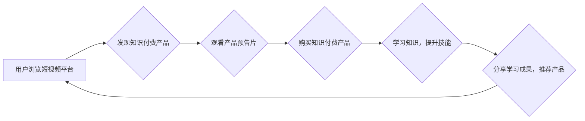

                 

## 如何利用短视频平台推广知识付费产品

> 关键词：短视频营销、知识付费、内容创作、用户运营、数据分析、算法推荐

### 1. 背景介绍

知识付费行业近年来发展迅速，人们对学习和提升自我的需求日益增长。短视频平台作为信息传播和娱乐消费的主要阵地，拥有庞大的用户群体和活跃的互动氛围，为知识付费产品提供了广阔的推广平台。

然而，知识付费产品与传统商品不同，其价值难以直接量化，需要通过内容的吸引力和用户体验来建立信任和转化。因此，如何在短视频平台上有效推广知识付费产品，成为众多创作者和企业面临的挑战。

### 2. 核心概念与联系

#### 2.1 短视频营销

短视频营销是指利用短视频平台的特性，通过制作和传播短视频内容，吸引目标用户，提升品牌知名度和产品销量。其核心优势在于：

* **内容易传播:** 短视频内容简洁易懂，易于分享和传播，能够快速触达目标用户。
* **互动性强:** 短视频平台拥有丰富的互动功能，例如评论、点赞、转发等，能够促进用户参与和互动，提升用户粘性。
* **成本相对较低:** 相比于传统广告，短视频营销成本相对较低，更容易被中小企业和个人接受。

#### 2.2 知识付费

知识付费是指通过付费的方式获取知识、技能和经验。其核心价值在于：

* **知识的独特性:** 知识付费产品通常由专业人士或领域专家创作，拥有独特的视角和价值。
* **知识的实用性:** 知识付费产品旨在解决用户实际问题，提升用户技能和能力。
* **知识的持续性:** 知识付费产品可以被用户反复学习和复习，具有长期的价值。

#### 2.3 短视频平台与知识付费的结合

短视频平台为知识付费产品提供了高效的推广渠道，而知识付费产品则为短视频平台提供了优质的内容资源。两者结合能够实现互利共赢：

* **平台方:** 通过知识付费产品，平台方可以增加收入来源，提升用户粘性，打造优质内容生态。
* **创作者:** 通过短视频平台，创作者可以快速积累粉丝，提升品牌影响力，推广知识付费产品。
* **用户:** 用户可以便捷地获取优质知识，提升自我价值，实现个人成长。

**Mermaid 流程图**



### 3. 核心算法原理 & 具体操作步骤

#### 3.1 算法原理概述

短视频平台的推荐算法是核心技术，其目的是根据用户的兴趣偏好和行为数据，推荐用户感兴趣的内容，包括知识付费产品。推荐算法通常基于以下原理：

* **协同过滤:** 根据用户的历史行为数据，推荐与相似用户喜欢的产品。
* **内容过滤:** 根据产品的特征和标签，推荐与用户兴趣相符的产品。
* **深度学习:** 利用深度神经网络，学习用户行为和产品特征之间的复杂关系，进行更精准的推荐。

#### 3.2 算法步骤详解

1. **数据采集:** 收集用户行为数据，例如观看记录、点赞、评论、分享等，以及产品信息数据，例如标题、标签、内容等。
2. **数据预处理:** 对数据进行清洗、转换和特征提取，例如去除噪声数据、将文本数据转换为向量等。
3. **模型训练:** 利用机器学习算法，训练推荐模型，例如协同过滤模型、内容过滤模型或深度学习模型。
4. **推荐结果生成:** 根据用户的行为数据和产品信息，利用训练好的模型，生成推荐结果，并对结果进行排序和展示。
5. **结果评估:** 通过用户点击、观看和购买等行为数据，评估推荐算法的性能，并进行模型优化和迭代。

#### 3.3 算法优缺点

**优点:**

* **精准推荐:** 能够根据用户的兴趣偏好，推荐更精准的内容。
* **个性化体验:** 为每个用户提供个性化的内容推荐，提升用户体验。
* **内容发现:** 帮助用户发现新的内容和产品，拓展知识面。

**缺点:**

* **数据依赖:** 推荐算法依赖于海量用户行为数据，数据质量直接影响推荐效果。
* **冷启动问题:** 对新用户和新产品，由于缺乏历史数据，难以进行精准推荐。
* **算法偏差:** 算法本身可能存在偏差，导致推荐结果不公平或不准确。

#### 3.4 算法应用领域

推荐算法广泛应用于各个领域，例如：

* **电商平台:** 推荐商品、优惠券和促销活动。
* **社交媒体:** 推荐好友、群组和内容。
* **视频平台:** 推荐视频、电视剧和电影。
* **音乐平台:** 推荐歌曲、专辑和音乐人。
* **新闻平台:** 推荐新闻文章、视频和音频。

### 4. 数学模型和公式 & 详细讲解 & 举例说明

#### 4.1 数学模型构建

协同过滤推荐算法的核心是用户-物品评分矩阵，其中每个用户对每个物品的评分都存储在一个数值中。

假设用户集合为U，物品集合为I，则用户-物品评分矩阵为R(U x I)。

#### 4.2 公式推导过程

基于用户-物品评分矩阵，协同过滤推荐算法可以利用以下公式进行推荐：

* **基于用户的协同过滤:**

$$
r_{u,i} = \frac{\sum_{v \in N(u)} r_{v,i}}{\left|N(u)\right|}
$$

其中：

* $r_{u,i}$ 表示用户u对物品i的评分。
* $N(u)$ 表示与用户u兴趣相似的用户集合。
* $\left|N(u)\right|$ 表示用户集合N(u)的大小。

* **基于物品的协同过滤:**

$$
r_{u,i} = \frac{\sum_{v \in N(i)} r_{u,v}}{\left|N(i)\right|}
$$

其中：

* $r_{u,i}$ 表示用户u对物品i的评分。
* $N(i)$ 表示与物品i相似的物品集合。
* $\left|N(i)\right|$ 表示物品集合N(i)的大小。

#### 4.3 案例分析与讲解

假设有一个用户-物品评分矩阵，其中用户1对电影A评分为5，用户2对电影A评分为4，用户1对电影B评分为3，用户2对电影B评分为5。

基于用户的协同过滤，我们可以计算用户1对电影B的推荐评分：

$$
r_{1,B} = \frac{r_{2,B}}{\left|N(1)\right|} = \frac{5}{1} = 5
$$

基于物品的协同过滤，我们可以计算用户1对电影A的推荐评分：

$$
r_{1,A} = \frac{r_{1,B}}{\left|N(A)\right|} = \frac{3}{1} = 3
$$

### 5. 项目实践：代码实例和详细解释说明

#### 5.1 开发环境搭建

* **操作系统:** Windows/macOS/Linux
* **编程语言:** Python
* **库依赖:** pandas, numpy, scikit-learn

#### 5.2 源代码详细实现

```python
import pandas as pd
from sklearn.metrics.pairwise import cosine_similarity

# 加载用户-物品评分矩阵
ratings = pd.read_csv('ratings.csv')

# 计算用户之间的相似度
user_similarity = cosine_similarity(ratings)

# 获取用户1的相似用户
similar_users = user_similarity[0].argsort()[:-6:-1]

# 计算用户1对电影B的推荐评分
user1_ratings = ratings.loc[0]
similar_user_ratings = ratings.loc[similar_users]
weighted_ratings = (similar_user_ratings * user_similarity[0][similar_users]).sum(axis=0)
user1_predicted_rating = weighted_ratings[1]

print(f'用户1对电影B的推荐评分: {user1_predicted_rating}')
```

#### 5.3 代码解读与分析

* **数据加载:** 使用pandas库加载用户-物品评分矩阵。
* **相似度计算:** 使用scikit-learn库的cosine_similarity函数计算用户之间的相似度。
* **相似用户获取:** 根据用户1的相似度排序，获取其相似用户。
* **推荐评分计算:** 利用相似用户的评分和相似度权重，计算用户1对电影B的推荐评分。

#### 5.4 运行结果展示

运行代码后，会输出用户1对电影B的推荐评分。

### 6. 实际应用场景

#### 6.1 知识付费产品推广

* **短视频预告片:** 制作短视频预告片，展示知识付费产品的核心内容和价值，吸引用户关注。
* **用户案例分享:** 邀请用户分享学习知识付费产品后的成果和体验，增强用户信任感。
* **直播课程:** 利用短视频平台的直播功能，进行知识付费产品的线上课程，与用户实时互动。
* **付费会员:** 推出付费会员制度，提供更多优质内容和服务，提升用户粘性。

#### 6.2 内容创作与运营

* **内容策划:** 根据用户兴趣和平台算法，策划优质的短视频内容，吸引用户观看和分享。
* **内容制作:** 利用专业的拍摄和剪辑工具，制作高质量的短视频内容。
* **用户运营:** 与用户互动，收集用户反馈，不断优化内容和运营策略。
* **数据分析:** 利用平台数据分析工具，分析用户行为数据，优化内容推荐和推广策略。

#### 6.3 未来应用展望

* **人工智能驱动的个性化推荐:** 利用人工智能技术，实现更精准的个性化推荐，提升用户体验。
* **沉浸式互动体验:** 利用VR/AR技术，打造沉浸式的互动体验，提升用户参与度。
* **跨平台内容生态:** 打造跨平台的内容生态，实现内容的无缝衔接和传播。

### 7. 工具和资源推荐

#### 7.1 学习资源推荐

* **书籍:** 《推荐系统实践》、《深度学习》
* **在线课程:** Coursera, Udacity, edX
* **博客:** Towards Data Science, Analytics Vidhya

#### 7.2 开发工具推荐

* **Python:** 强大的编程语言，广泛应用于数据科学和机器学习。
* **pandas:** 用于数据分析和处理的库。
* **numpy:** 用于数值计算的库。
* **scikit-learn:** 用于机器学习的库。
* **TensorFlow/PyTorch:** 用于深度学习的框架。

#### 7.3 相关论文推荐

* **Collaborative Filtering for Implicit Feedback Datasets**
* **Matrix Factorization Techniques for Recommender Systems**
* **Deep Learning for Recommender Systems**

### 8. 总结：未来发展趋势与挑战

#### 8.1 研究成果总结

短视频平台与知识付费的结合，为用户提供了便捷高效的学习方式，也为创作者提供了新的推广渠道。推荐算法作为核心技术，不断发展和完善，为用户提供更精准的个性化推荐。

#### 8.2 未来发展趋势

* **人工智能驱动的个性化推荐:** 利用人工智能技术，实现更精准的个性化推荐，提升用户体验。
* **沉浸式互动体验:** 利用VR/AR技术，打造沉浸式的互动体验，提升用户参与度。
* **跨平台内容生态:** 打造跨平台的内容生态，实现内容的无缝衔接和传播。

#### 8.3 面临的挑战

* **数据隐私和安全:** 知识付费产品涉及用户个人信息，需要保障数据隐私和安全。
* **算法公平性和可解释性:** 算法本身可能存在偏差，导致推荐结果不公平或不准确，需要提高算法的公平性和可解释性。
* **内容质量和用户体验:** 需要不断提升内容质量和用户体验，才能吸引和留住用户。

#### 8.4 研究展望

未来，短视频平台与知识付费的结合将继续发展，需要不断探索新的技术和模式，提升用户体验，打造更优质的学习生态。

### 9. 附录：常见问题与解答

#### 9.1 如何提高短视频的推荐效果？

* **内容质量:** 制作高质量、吸引人的短视频内容。
* **标签优化:** 使用精准的标签，方便用户搜索和发现。
* **互动率:** 鼓励用户点赞、评论、转发，提升视频的互动率。
* **平台规则:** 遵守平台的规则和规范，避免被算法惩罚。

#### 9.2 如何选择合适的知识付费产品？

* **内容质量:** 选择内容专业、权威、有价值的产品。
* **授课老师:** 选择经验丰富、教学能力强的老师。
* **用户评价:** 参考其他用户的评价和反馈。
* **价格合理:** 选择价格合理、性价比高的产品。


作者：禅与计算机程序设计艺术 / Zen and the Art of Computer Programming<end_of_turn>

