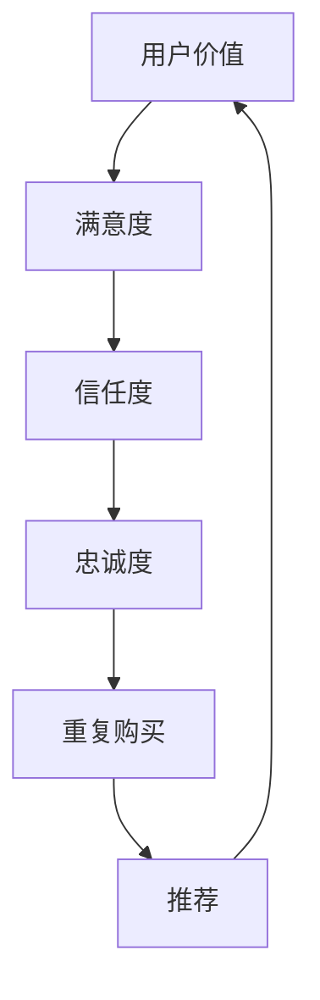

                 

# 如何提升用户价值增强客户忠诚度

> 关键词：用户价值、客户忠诚度、提升策略、用户体验、数据分析

> 摘要：本文将探讨如何在数字化时代中，通过提升用户价值，增强客户忠诚度，从而实现企业的可持续发展。文章首先介绍了用户价值与客户忠诚度的概念，随后分析了影响忠诚度的关键因素，最后提出了提升用户价值和客户忠诚度的具体策略和实施方法。

## 1. 背景介绍（Background Introduction）

在当今竞争激烈的市场环境中，企业面临的挑战愈发严峻。用户的选择越来越多，市场细分越来越明显，如何在这个纷繁复杂的环境中脱颖而出，成为企业关注的焦点。用户价值与客户忠诚度是衡量企业竞争力的两个关键指标。用户价值指的是企业通过满足用户需求所创造的价值，而客户忠诚度则是指客户对企业产品或服务的持续购买意愿和信任程度。提升用户价值，增强客户忠诚度，不仅是企业赢得市场的关键，更是实现长期发展的必由之路。

## 2. 核心概念与联系（Core Concepts and Connections）

### 2.1 用户价值的定义与评估

用户价值（User Value）是指用户在使用产品或服务时所获得的价值。这包括但不限于功能、性能、安全性、用户体验等多个维度。评估用户价值的方法主要有以下几种：

1. **感知价值评估**：通过用户对产品或服务的感知进行评估，常用的方法包括感知质量、感知价格和用户满意度。
2. **效用价值评估**：通过用户对产品或服务的效用进行量化评估，通常使用效用函数进行计算。
3. **成本价值评估**：通过计算用户在获得产品或服务过程中所承担的成本进行评估。

### 2.2 客户忠诚度的定义与衡量

客户忠诚度（Customer Loyalty）是指客户在重复购买、推荐他人使用产品或服务时的倾向性和稳定性。衡量客户忠诚度的方法包括：

1. **客户保留率**：通过计算一定时期内保留的客户数量与总客户数量的比例来衡量。
2. **推荐率**：通过统计客户向他人推荐产品或服务的比例来衡量。
3. **重复购买率**：通过计算一定时期内重复购买的用户数量与总用户数量的比例来衡量。

### 2.3 用户价值与客户忠诚度的关系

用户价值与客户忠诚度之间存在密切的联系。用户价值的提升可以增强客户的满意度和信任度，从而提高客户忠诚度。反之，客户忠诚度的增强又可以促使企业更加注重用户价值的创造，形成良性循环。

### 2.4 Mermaid 流程图（Mermaid Flowchart）

下面是用户价值与客户忠诚度关系的 Mermaid 流程图：



## 3. 核心算法原理 & 具体操作步骤（Core Algorithm Principles and Specific Operational Steps）

### 3.1 提升用户价值的具体步骤

1. **深入了解用户需求**：通过市场调研、用户访谈等方式，深入了解用户需求，确保产品或服务的设计满足用户的核心需求。
2. **优化产品或服务功能**：根据用户需求，优化产品或服务的功能，提高用户满意度。
3. **提升用户体验**：通过简化操作流程、提供个性化服务等方式，提升用户的整体体验。
4. **加强售后服务**：提供优质的售后服务，解决用户在使用产品或服务过程中遇到的问题，增强用户信任度。

### 3.2 增强客户忠诚度的具体步骤

1. **建立客户关系管理体系**：通过CRM系统，建立全面的客户关系管理体系，记录客户行为，分析客户需求。
2. **提供差异化服务**：根据不同客户的需求和偏好，提供个性化的服务，提高客户满意度。
3. **实施忠诚度计划**：通过积分、折扣、会员等忠诚度计划，激励客户重复购买。
4. **建立反馈机制**：及时收集客户反馈，持续改进产品或服务，增强客户信任。

## 4. 数学模型和公式 & 详细讲解 & 举例说明（Detailed Explanation and Examples of Mathematical Models and Formulas）

### 4.1 用户价值评估模型

用户价值评估模型可以采用以下公式：

$$
V = Q \times P \times S
$$

其中，\( V \) 为用户价值，\( Q \) 为感知质量，\( P \) 为感知价格，\( S \) 为用户满意度。

**举例说明**：假设某产品的感知质量为8分，感知价格为10分，用户满意度为7分，则该产品的用户价值为：

$$
V = 8 \times 10 \times 7 = 560
$$

### 4.2 客户忠诚度评估模型

客户忠诚度评估模型可以采用以下公式：

$$
L = R \times R + \frac{1}{R}
$$

其中，\( L \) 为客户忠诚度，\( R \) 为重复购买率。

**举例说明**：假设某客户的重复购买率为20%，则该客户的忠诚度为：

$$
L = 20\% \times 20\% + \frac{1}{20\%} = 4\% + 50 = 54\%
$$

## 5. 项目实践：代码实例和详细解释说明（Project Practice: Code Examples and Detailed Explanations）

### 5.1 开发环境搭建

在Python环境中，我们可以使用Pandas和Matplotlib等库进行数据处理和可视化。

```python
# 安装相关库
!pip install pandas matplotlib

# 导入相关库
import pandas as pd
import matplotlib.pyplot as plt
```

### 5.2 源代码详细实现

```python
# 读取用户价值数据
user_value_data = pd.read_csv('user_value.csv')

# 计算用户价值
user_value_data['User Value'] = user_value_data['Quality'] * user_value_data['Price'] * user_value_data['Satisfaction']

# 可视化用户价值分布
plt.hist(user_value_data['User Value'], bins=30)
plt.xlabel('User Value')
plt.ylabel('Frequency')
plt.title('User Value Distribution')
plt.show()

# 读取客户忠诚度数据
customer_loyalty_data = pd.read_csv('customer_loyalty.csv')

# 计算客户忠诚度
customer_loyalty_data['Loyalty'] = customer_loyalty_data['Repeat Purchase Rate'] * customer_loyalty_data['Repeat Purchase Rate'] + 1 / customer_loyalty_data['Repeat Purchase Rate']

# 可视化客户忠诚度分布
plt.hist(customer_loyalty_data['Loyalty'], bins=30)
plt.xlabel('Loyalty')
plt.ylabel('Frequency')
plt.title('Customer Loyalty Distribution')
plt.show()
```

### 5.3 代码解读与分析

该部分代码首先读取用户价值数据和客户忠诚度数据，然后分别计算用户价值和客户忠诚度，并使用hist函数绘制分布图，以便直观地分析用户价值和客户忠诚度的分布情况。

## 6. 实际应用场景（Practical Application Scenarios）

### 6.1 企业产品更新迭代

企业在产品更新迭代过程中，可以通过分析用户价值和客户忠诚度的数据，了解用户对产品的满意度以及忠诚度情况，从而针对性地优化产品功能和提升用户体验，提高用户价值，增强客户忠诚度。

### 6.2 市场营销策略制定

企业在制定市场营销策略时，可以结合用户价值和客户忠诚度的分析结果，有针对性地进行市场细分，设计出更符合目标客户需求的营销活动，提升客户满意度和忠诚度。

### 6.3 客户关系管理

企业可以通过CRM系统，收集和分析客户行为数据，了解客户的购买习惯、偏好等信息，从而提供个性化的服务和关怀，增强客户忠诚度。

## 7. 工具和资源推荐（Tools and Resources Recommendations）

### 7.1 学习资源推荐

1. 《用户体验要素》（书名：《The Elements of User Experience》）
2. 《CRM管理：策略、流程与实施》（书名：《CRM Management: Strategy, Processes, and Implementation》）

### 7.2 开发工具框架推荐

1. CRM系统：Salesforce、Microsoft Dynamics 365等
2. 数据分析工具：Python、R、Tableau等

### 7.3 相关论文著作推荐

1. "Customer Loyalty: Impact on Customer Behavior and Its Measurement"
2. "User Experience Design: An Introduction"

## 8. 总结：未来发展趋势与挑战（Summary: Future Development Trends and Challenges）

随着数字化转型的深入推进，用户价值和客户忠诚度在企业竞争中的地位愈发重要。未来，企业需要更加注重用户需求的挖掘和满足，通过数据分析和人工智能等技术手段，不断提升用户价值和客户忠诚度。然而，这也给企业带来了新的挑战，如数据隐私保护、个性化服务的实现等。企业需要不断创新，应对这些挑战，实现可持续发展。

## 9. 附录：常见问题与解答（Appendix: Frequently Asked Questions and Answers）

### 9.1 如何提升用户价值？

提升用户价值的关键在于深入了解用户需求，优化产品功能和用户体验，提供优质的售后服务。

### 9.2 如何增强客户忠诚度？

增强客户忠诚度需要建立客户关系管理体系，提供个性化服务，实施忠诚度计划，并持续改进产品或服务。

## 10. 扩展阅读 & 参考资料（Extended Reading & Reference Materials）

1. "Customer Value Management: Creating Wealth through Customer Focus"
2. "Customer Loyalty Programs: Conceptual Framework and Practical Application"

作者：禅与计算机程序设计艺术 / Zen and the Art of Computer Programming<|im_sep|>

