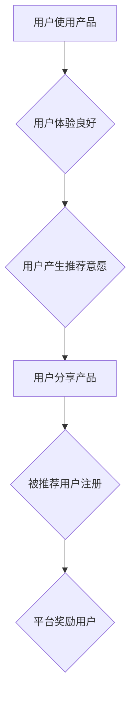

                 

## 如何提高知识付费产品的用户转介绍率

> 关键词：知识付费、用户转介绍、口碑营销、用户体验、产品设计、社区建设、内容价值

## 1. 背景介绍

知识付费行业近年来蓬勃发展，涌现出众多优秀的产品和平台。然而，用户转介绍率一直是知识付费产品面临的挑战之一。用户转介绍，即用户主动推荐产品给朋友或其他潜在用户，是口碑营销的重要驱动力，能够有效提升产品知名度和用户粘性。

传统的营销手段如广告投放、社交媒体推广等，虽然能够带来流量，但转化率往往有限。而用户转介绍则更具说服力，因为用户对产品的评价更真实、更具可信度。因此，提高知识付费产品的用户转介绍率，对于产品长远发展至关重要。

## 2. 核心概念与联系

### 2.1 用户转介绍机制

用户转介绍机制是指知识付费产品设计的一种机制，鼓励用户主动推荐产品给其他用户。这种机制通常通过以下方式实现：

* **奖励机制:** 为转介绍用户提供积分、优惠券、专属内容等奖励。
* **社交分享:** 提供便捷的社交分享功能，方便用户将产品分享到朋友圈、微博等平台。
* **口碑评价:** 建立用户评价体系，鼓励用户分享使用体验，并对优质评价给予奖励。

### 2.2 用户行为分析

用户转介绍行为受多种因素影响，包括：

* **产品价值:** 产品内容是否优质、实用、有价值是用户转介绍的首要因素。
* **用户体验:** 产品使用是否便捷、流畅、易懂，直接影响用户是否愿意推荐。
* **社交关系:** 用户与朋友、家人、同事的社交关系密切程度，会影响用户转介绍的意愿。
* **奖励机制:** 奖励机制的吸引力、公平性、易用性，会影响用户参与转介绍的积极性。

### 2.3 转介绍流程

用户转介绍流程通常包括以下步骤：

1. 用户使用产品并获得价值。
2. 用户对产品产生推荐意愿。
3. 用户通过分享功能将产品推荐给其他用户。
4. 被推荐用户注册并使用产品。
5. 平台对转介绍用户和被推荐用户进行奖励。

**Mermaid 流程图**



## 3. 核心算法原理 & 具体操作步骤

### 3.1 算法原理概述

用户转介绍率提升算法的核心在于分析用户行为数据，识别潜在转介绍用户，并通过个性化推荐、激励机制等方式引导用户进行转介绍。

常见的算法包括：

* **协同过滤算法:** 根据用户历史行为数据，预测用户对产品的喜好，并推荐潜在转介绍用户。
* **深度学习算法:** 利用深度神经网络，从用户行为数据中提取特征，识别转介绍意愿的用户。
* **强化学习算法:** 通过奖励机制，训练用户进行转介绍行为，提高转介绍率。

### 3.2 算法步骤详解

**以协同过滤算法为例，具体步骤如下：**

1. **数据收集:** 收集用户行为数据，包括用户购买记录、浏览记录、评价记录、分享记录等。
2. **数据预处理:** 对数据进行清洗、转换、特征提取等处理，构建用户-产品评分矩阵。
3. **模型训练:** 利用协同过滤算法，训练模型，预测用户对产品的评分。
4. **用户推荐:** 根据模型预测结果，推荐潜在转介绍用户。
5. **奖励机制:** 为转介绍用户提供奖励，鼓励用户进行转介绍行为。

### 3.3 算法优缺点

**协同过滤算法:**

* **优点:** 能够精准推荐用户感兴趣的产品，提高推荐效果。
* **缺点:** 数据依赖性强，需要大量用户行为数据才能训练出准确的模型。

**深度学习算法:**

* **优点:** 能够从海量数据中提取更深层的特征，提高推荐精度。
* **缺点:** 模型训练复杂，需要强大的计算资源。

**强化学习算法:**

* **优点:** 可以通过奖励机制引导用户行为，提高转介绍率。
* **缺点:** 需要设计合理的奖励机制，才能有效激励用户。

### 3.4 算法应用领域

用户转介绍率提升算法广泛应用于电商、教育、娱乐等领域，例如：

* **电商平台:** 推荐用户购买的商品给朋友，提高商品销量。
* **在线教育平台:** 推荐优质课程给用户朋友，提升课程注册率。
* **社交平台:** 推荐用户感兴趣的内容给朋友，提高用户活跃度。

## 4. 数学模型和公式 & 详细讲解 & 举例说明

### 4.1 数学模型构建

用户转介绍率可以定义为：

$$
T = \frac{N_t}{N_u}
$$

其中：

* $T$ 为用户转介绍率
* $N_t$ 为转介绍用户数量
* $N_u$ 为总用户数量

### 4.2 公式推导过程

用户转介绍率受多种因素影响，可以构建更复杂的数学模型来预测用户转介绍率。例如，可以考虑用户行为数据、产品属性、社交关系等因素，构建基于回归分析或机器学习的模型。

### 4.3 案例分析与讲解

假设一个知识付费平台，用户总数为1000人，其中有100人进行了转介绍，那么该平台的用户转介绍率为：

$$
T = \frac{100}{1000} = 0.1
$$

即10%的用户进行了转介绍。

## 5. 项目实践：代码实例和详细解释说明

### 5.1 开发环境搭建

* 操作系统: Ubuntu 20.04
* 编程语言: Python 3.8
* 开发工具: Jupyter Notebook

### 5.2 源代码详细实现

```python
import pandas as pd
from sklearn.metrics.pairwise import cosine_similarity

# 加载用户行为数据
data = pd.read_csv('user_behavior.csv')

# 构建用户-产品评分矩阵
user_product_matrix = data.pivot_table(index='user_id', columns='product_id', values='rating')

# 计算用户-用户相似度
user_similarity = cosine_similarity(user_product_matrix)

# 预测用户对产品的评分
def predict_rating(user_id, product_id):
    # 获取用户相似用户
    similar_users = user_similarity[user_id].argsort()[:-10:-1]
    # 计算预测评分
    predicted_rating = 0
    for similar_user in similar_users:
        if user_product_matrix.loc[similar_user, product_id] is not None:
            predicted_rating += user_product_matrix.loc[similar_user, product_id]
    return predicted_rating / len(similar_users)

# 获取用户转介绍推荐列表
def get_recommendation(user_id):
    # 获取用户已购买的产品
    purchased_products = data[data['user_id'] == user_id]['product_id'].tolist()
    # 获取用户未购买的产品
    unpurchased_products = list(set(user_product_matrix.columns) - set(purchased_products))
    # 预测用户对未购买产品的评分
    predicted_ratings = [predict_rating(user_id, product_id) for product_id in unpurchased_products]
    # 返回评分最高的推荐产品
    return unpurchased_products[predicted_ratings.index(max(predicted_ratings))]

# 示例
user_id = 1
recommended_product = get_recommendation(user_id)
print(f'用户 {user_id} 的推荐产品: {recommended_product}')
```

### 5.3 代码解读与分析

* 代码首先加载用户行为数据，构建用户-产品评分矩阵。
* 然后利用余弦相似度计算用户之间的相似度。
* 预测用户对产品的评分函数 `predict_rating` 根据用户相似用户对产品的评分进行加权平均。
* `get_recommendation` 函数获取用户已购买的产品，预测用户对未购买产品的评分，并返回评分最高的推荐产品。

### 5.4 运行结果展示

运行代码后，会输出用户1的推荐产品。

## 6. 实际应用场景

### 6.1 案例分析

* **在线教育平台:** 针对用户学习过的课程，推荐其他用户学习过的相关课程，提高用户学习兴趣和课程注册率。
* **知识付费社区:** 针对用户发布的优质内容，推荐给其他用户，提升内容曝光度和社区活跃度。

### 6.2 未来应用展望

* **个性化推荐:** 基于用户行为数据、兴趣偏好等信息，提供更精准的转介绍推荐。
* **智能化运营:** 利用机器学习算法，自动分析用户行为数据，优化转介绍机制，提高转介绍率。
* **跨平台推广:** 将转介绍机制扩展到多个平台，实现用户跨平台的转介绍和推广。

## 7. 工具和资源推荐

### 7.1 学习资源推荐

* **书籍:**
    * 《推荐系统实践》
    * 《机器学习》
* **在线课程:**
    * Coursera: Recommender Systems
    * Udacity: Machine Learning Engineer Nanodegree

### 7.2 开发工具推荐

* **Python:** 
    * Scikit-learn
    * TensorFlow
    * PyTorch
* **数据分析工具:**
    * Pandas
    * Jupyter Notebook

### 7.3 相关论文推荐

* **协同过滤算法:**
    * "Collaborative Filtering for Implicit Feedback Datasets"
    * "Matrix Factorization Techniques for Recommender Systems"
* **深度学习算法:**
    * "Deep Learning Recommendations for Everyone"
    * "Neural Collaborative Filtering"

## 8. 总结：未来发展趋势与挑战

### 8.1 研究成果总结

用户转介绍率提升算法在知识付费产品推广中取得了显著成果，能够有效提升用户粘性、品牌知名度和产品销量。

### 8.2 未来发展趋势

* **更精准的个性化推荐:** 基于更丰富的用户数据和更先进的算法，实现更精准的转介绍推荐。
* **更智能化的运营:** 利用人工智能技术，自动分析用户行为数据，优化转介绍机制，提高转介绍率。
* **更丰富的转介绍形式:** 探索更丰富的转介绍形式，例如视频推荐、直播分享等。

### 8.3 面临的挑战

* **数据隐私保护:** 用户行为数据涉及隐私信息，需要采取有效措施保障数据安全和用户隐私。
* **算法公平性:** 算法模型需要避免偏见和歧视，确保公平公正的推荐结果。
* **用户信任度:** 用户对转介绍推荐的信任度需要不断提升，需要建立良好的用户体验和口碑体系。

### 8.4 研究展望

未来，用户转介绍率提升算法将继续朝着更精准、更智能、更安全的方向发展，为知识付费产品带来更多机遇。


## 9. 附录：常见问题与解答

**Q1: 如何提高用户转介绍的意愿？**

**A1:** 

* 提供优质的产品和服务，让用户获得真实价值。
* 设计便捷的分享功能，方便用户分享产品。
* 设置合理的奖励机制，激励用户进行转介绍。
* 建立良好的用户社区，鼓励用户互动交流。

**Q2: 如何避免算法推荐的偏差？**

**A2:** 

* 使用多样化的数据来源，避免单一数据来源带来的偏差。
* 定期评估算法模型，及时发现和修正偏差。
* 采用公平性评估指标，确保推荐结果公平公正。

**Q3: 如何保障用户隐私安全？**

**A3:** 

* 明确收集和使用用户数据的目的和范围。
* 加密用户数据，防止数据泄露。
* 获得用户同意后才收集和使用用户数据。


作者：禅与计算机程序设计艺术 / Zen and the Art of Computer Programming 
<end_of_turn>

