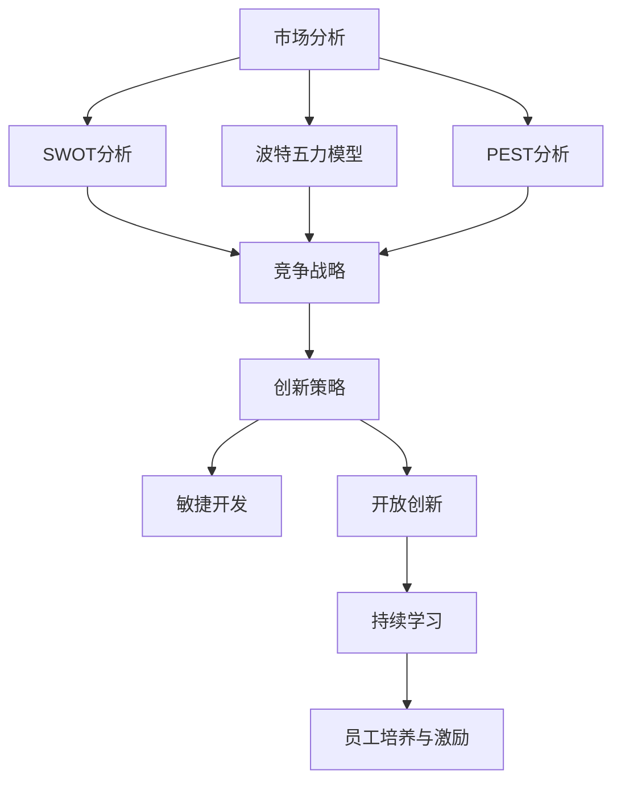
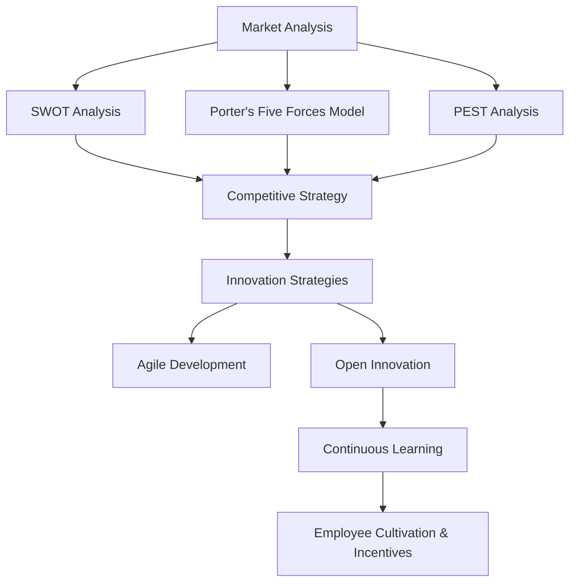

                 

### 文章标题

How to Build a Long-Term Vision for Startup Companies

在当前快速变化的市场环境中，创业公司要想在激烈竞争中脱颖而出，构建一个明确且具有前瞻性的长期愿景至关重要。本文将探讨如何通过逐步分析推理的方式，构建一个能够引领公司长远发展的愿景。作者结合自身作为人工智能专家和创业者的经验，旨在为读者提供有深度、有思考、有见解的指导。

## Keywords:
- Long-Term Vision
- Startup Companies
- Market Strategy
- Competitive Advantage
- Innovation

## Abstract:
This article delves into the process of building a long-term vision for startup companies. By employing a step-by-step reasoning approach, the author, a renowned AI expert and entrepreneur, provides insights and practical guidance on how to create a forward-thinking strategy that can guide a startup through its growth journey. The discussion covers key aspects such as market analysis, competitive positioning, and innovative strategies, aiming to equip entrepreneurs with the tools needed to steer their ventures towards long-term success.

### 背景介绍

在过去的几十年中，全球科技和商业环境发生了翻天覆地的变化。互联网、大数据、人工智能等技术的迅猛发展，不仅改变了传统行业的运营模式，也为新兴创业公司提供了前所未有的发展机遇。然而，随着市场竞争的加剧和消费者需求的快速变化，创业公司面临着前所未有的挑战。如何在激烈的市场竞争中找到自己的定位，并实现持续成长，成为了每个创业公司都必须面对的问题。

构建一个清晰的长期愿景是创业公司成功的关键因素之一。长期愿景不仅为公司的发展提供了方向，还为团队成员注入了共同的使命感和动力。然而，如何才能构建一个真正具有前瞻性和可执行性的长期愿景呢？本文将围绕这一问题展开深入探讨，并提供实用的方法和策略。

### 核心概念与联系

#### 1. 长期愿景的定义与重要性

长期愿景是指企业对未来的远大目标和宏伟蓝图，它不仅涵盖了企业的核心使命，还包括了对行业发展趋势、市场机遇和竞争态势的深刻理解。一个有效的长期愿景应该具有以下几个特征：

- **明确性**：愿景应该是具体、可量化的，能够让团队清晰了解未来的方向和目标。
- **前瞻性**：愿景应该具有前瞻性，能够引领企业走在行业前沿，抓住新兴市场机遇。
- **可行性**：愿景在理论上应该是可行的，同时也要考虑到资源、技术和市场环境的约束。

#### 2. 市场分析和竞争战略

市场分析是构建长期愿景的重要基础。通过深入分析市场需求、竞争对手和行业趋势，创业公司可以更好地理解自身的定位和机会。以下是一些关键的市场分析工具和策略：

- **SWOT分析**：通过对企业的优势（Strengths）、劣势（Weaknesses）、机会（Opportunities）和威胁（Threats）进行综合评估，帮助公司找到最有效的市场定位和策略。
- **波特五力模型**：该模型分析了行业内五大竞争力量，包括供应商、买家、潜在竞争者、替代品和行业内部竞争者，帮助公司制定有效的竞争战略。
- **PEST分析**：通过政治（Political）、经济（Economic）、社会（Societal）和技术（Technological）四个方面，对宏观环境进行分析，为公司的战略决策提供依据。

#### 3. 创新与持续学习

创新是创业公司长期发展的核心动力。通过持续的技术创新和商业模式创新，公司可以不断推出新产品和服务，满足市场的新需求，保持竞争优势。以下是一些促进创新的关键策略：

- **开放创新**：通过与外部合作伙伴合作，共享资源和知识，共同开发新产品和服务。
- **敏捷开发**：采用敏捷开发方法，快速迭代产品，及时响应市场变化和用户需求。
- **员工培养与激励**：建立良好的企业文化，鼓励员工持续学习和创新，提供相应的激励机制。

#### 4. 核心概念与架构的 Mermaid 流程图

以下是一个简化的 Mermaid 流程图，展示了构建长期愿景的核心概念和架构：



通过以上核心概念和联系的梳理，我们可以更好地理解如何构建创业公司的长期愿景。在接下来的部分，我们将深入探讨具体的操作步骤和策略，帮助读者在实际中运用这些概念。

---

## Core Concepts and Connections
### 1. Definition and Importance of Long-Term Vision

A long-term vision for a company is a broad and ambitious future outlook that encapsulates the organization's core mission and provides a clear direction for its development. An effective long-term vision should possess several key characteristics:

- **Clarity**: The vision should be specific and quantifiable, allowing the team to have a clear understanding of the future direction and goals.
- **Prophetic**: The vision should be forward-thinking, leading the company to the forefront of the industry and seizing emerging market opportunities.
- **Feasibility**: The vision should be theoretically feasible while also considering constraints such as available resources, technology, and market conditions.

### 2. Market Analysis and Competitive Strategy

Market analysis is a fundamental step in building a long-term vision. By deeply analyzing market demand, competitors, and industry trends, a startup can better understand its positioning and opportunities. Here are some key tools and strategies for market analysis:

- **SWOT Analysis**: This comprehensive assessment of an organization's strengths, weaknesses, opportunities, and threats helps identify the most effective market positioning and strategies.
- **Porter's Five Forces Model**: This model analyzes the five major competitive forces within an industry, including suppliers, buyers, potential competitors, substitutes, and industry competitors, to help devise effective competitive strategies.
- **PEST Analysis**: This analysis considers the macro-environment through four dimensions: political, economic, social, and technological, providing a basis for strategic decision-making.

### 3. Innovation and Continuous Learning

Innovation is the core driving force behind the long-term development of a startup. Through continuous technological and business model innovation, a company can constantly introduce new products and services to meet the evolving market demands and maintain a competitive edge. Here are some key strategies to foster innovation:

- **Open Innovation**: By collaborating with external partners to share resources and knowledge, companies can jointly develop new products and services.
- **Agile Development**: Adopting agile development methodologies allows for rapid iteration of products, promptly responding to market changes and user needs.
- **Employee Cultivation and Incentives**: Establishing a strong company culture that encourages continuous learning and innovation, while providing appropriate incentives, is crucial.

### 4. Mermaid Flowchart of Core Concepts and Architecture

Here is a simplified Mermaid flowchart illustrating the core concepts and architecture of building a long-term vision:



By understanding and connecting these core concepts, we can better grasp how to build a long-term vision for startup companies. In the following sections, we will delve into specific steps and strategies to help readers apply these concepts in practice. 

### 核心算法原理 & 具体操作步骤

构建创业公司的长期愿景需要一系列核心算法原理和具体操作步骤。这些步骤不仅帮助我们明确愿景的构建过程，还能确保愿景具有可执行性。以下是构建长期愿景的核心算法原理和具体操作步骤：

#### 1. 明确企业使命和核心价值观

**核心算法原理**：企业使命和核心价值观是公司愿景的基础，决定了公司的长期发展方向。

**操作步骤**：
- **定义企业使命**：明确公司存在的根本原因，例如“推动科技创新，改善人们的生活”。
- **确定核心价值观**：识别公司在运营过程中始终坚守的原则，例如“客户至上、创新驱动、团队合作”。

#### 2. 进行市场调研和分析

**核心算法原理**：市场调研和分析能够帮助企业了解市场需求、竞争对手和行业趋势，为愿景的制定提供依据。

**操作步骤**：
- **确定目标市场**：明确公司的目标客户群体，包括其需求、偏好和行为模式。
- **分析竞争对手**：评估主要竞争对手的市场地位、产品特点和市场策略。
- **研究行业趋势**：了解行业的发展方向和新兴市场机遇。

#### 3. 制定长期目标和关键绩效指标（KPI）

**核心算法原理**：长期目标和关键绩效指标能够量化公司的愿景，使其具有可衡量性和可执行性。

**操作步骤**：
- **设定长期目标**：根据企业使命和市场分析结果，设定明确的长期目标，例如“在未来五年内，实现市场份额翻倍”。
- **定义关键绩效指标**：选择能够衡量目标实现程度的指标，例如“年度收入增长率”、“客户满意度评分”等。

#### 4. 制定实施策略和行动计划

**核心算法原理**：实施策略和行动计划是将愿景转化为具体行动的关键步骤。

**操作步骤**：
- **制定实施策略**：根据长期目标和市场分析结果，制定具体的实施策略，包括产品开发、市场营销、团队建设等方面。
- **创建行动计划**：将实施策略分解为具体的行动计划，明确责任人和时间表。

#### 5. 建立监控和评估机制

**核心算法原理**：监控和评估机制能够确保愿景的实施进度和效果，及时调整策略。

**操作步骤**：
- **设定监控指标**：根据关键绩效指标，设定监控指标，例如“每月销售数据”、“客户反馈分析”等。
- **定期评估和反馈**：定期对监控指标进行分析，评估愿景实施情况，并根据反馈调整行动计划和策略。

#### 6. 培养和激励团队成员

**核心算法原理**：团队成员的积极性和创新能力是公司长期愿景实现的重要保障。

**操作步骤**：
- **建立企业文化**：通过共同的使命和价值观，建立积极向上的企业文化。
- **提供培训和发展机会**：为员工提供培训和发展机会，提升其技能和创新能力。
- **设置激励机制**：通过绩效奖励、晋升机会等激励机制，激励员工为实现公司愿景贡献力量。

通过以上核心算法原理和具体操作步骤，创业公司可以构建一个明确、可执行且具有前瞻性的长期愿景。在接下来的部分，我们将探讨数学模型和公式，为长期愿景的实现提供更加量化的指导。

---

#### Core Algorithm Principles and Specific Operational Steps

Building a long-term vision for a startup requires a series of core algorithm principles and specific operational steps. These steps not only help clarify the process of vision building but also ensure that the vision is executable. Here are the core algorithm principles and specific operational steps for building a long-term vision:

#### 1. Define the Company Mission and Core Values

**Core Algorithm Principle**: The company mission and core values form the foundation of the company's vision and determine its long-term direction.

**Operational Steps**:
- **Define the Company Mission**: Clarify the fundamental reason for the company's existence, such as "Drive technological innovation to improve people's lives."
- **Identify Core Values**: Determine the principles that the company will uphold in its operations, such as "Customer-first, innovation-driven, team collaboration."

#### 2. Conduct Market Research and Analysis

**Core Algorithm Principle**: Market research and analysis help the company understand market demand, competitors, and industry trends, providing a basis for vision formulation.

**Operational Steps**:
- **Identify Target Market**: Clearly define the company's target customer groups, including their needs, preferences, and behaviors.
- **Analyze Competitors**: Evaluate the market positions, product features, and market strategies of major competitors.
- **Study Industry Trends**: Understand the direction of the industry and emerging market opportunities.

#### 3. Set Long-Term Goals and Key Performance Indicators (KPIs)

**Core Algorithm Principle**: Long-term goals and key performance indicators quantify the vision, making it measurable and executable.

**Operational Steps**:
- **Set Long-Term Goals**: Based on the company mission and market analysis results, establish clear long-term goals, such as "Achieve a doubled market share within five years."
- **Define Key Performance Indicators**: Select indicators that measure the progress of the goals, such as "Annual revenue growth rate," "Customer satisfaction score."

#### 4. Develop Implementation Strategies and Action Plans

**Core Algorithm Principle**: Implementation strategies and action plans convert the vision into specific actions.

**Operational Steps**:
- **Develop Implementation Strategies**: Based on long-term goals and market analysis results, formulate specific implementation strategies, including product development, marketing, team building, etc.
- **Create Action Plans**: Decompose the implementation strategies into specific action plans, clarifying responsibilities and timelines.

#### 5. Establish Monitoring and Evaluation Mechanisms

**Core Algorithm Principle**: Monitoring and evaluation mechanisms ensure the progress and effectiveness of vision implementation, allowing for timely adjustments.

**Operational Steps**:
- **Set Monitoring Indicators**: Based on key performance indicators, set monitoring indicators, such as "Monthly sales data," "Customer feedback analysis."
- **Regularly Assess and Provide Feedback**: Regularly analyze monitoring indicators, assess the implementation of the vision, and adjust action plans and strategies accordingly.

#### 6. Cultivate and Inspire Team Members

**Core Algorithm Principle**: The enthusiasm and innovation of team members are critical to the realization of the company's long-term vision.

**Operational Steps**:
- **Establish Company Culture**: Build a positive and upward company culture through a shared mission and values.
- **Provide Training and Development Opportunities**: Offer training and development opportunities for employees to enhance their skills and innovation capabilities.
- **Set Incentive Mechanisms**: Use performance rewards and promotion opportunities to inspire employees to contribute to the realization of the company's vision.

By following these core algorithm principles and specific operational steps, a startup can build a clear, executable, and forward-looking long-term vision. In the following sections, we will discuss mathematical models and formulas to provide more quantitative guidance for the realization of the vision.

### 数学模型和公式 & 详细讲解 & 举例说明

在构建创业公司的长期愿景过程中，数学模型和公式是不可或缺的工具，它们能够帮助我们量化目标和策略，提供量化的指导。以下是一些常用的数学模型和公式，以及它们的详细讲解和举例说明：

#### 1. SWOT分析模型

**定义**：SWOT分析是一种常用的战略规划工具，用于评估企业的优势（Strengths）、劣势（Weaknesses）、机会（Opportunities）和威胁（Threats）。

**公式**：
\[ \text{SWOT} = (\text{Strengths} + \text{Weaknesses}) \times (\text{Opportunities} + \text{Threats}) \]

**详细讲解**：
- **优势**（Strengths）：公司拥有的独特能力、资源或竞争优势。
- **劣势**（Weaknesses）：公司存在的内部问题或挑战。
- **机会**（Opportunities）：外部环境中的有利因素或市场机遇。
- **威胁**（Threats）：外部环境中的不利因素或市场威胁。

**举例说明**：假设一家初创公司是一家智能家居设备制造商，其SWOT分析如下：
- **优势**：拥有顶尖的技术团队和良好的市场口碑。
- **劣势**：资金有限，市场经验不足。
- **机会**：智能家居市场快速增长，消费者对智能化生活需求增加。
- **威胁**：竞争激烈，行业巨头占据市场份额。

根据SWOT分析，公司可以制定策略，如加大技术研发投入、拓展市场渠道等，以充分发挥优势，克服劣势，抓住机会，应对威胁。

#### 2. 波特五力模型

**定义**：波特五力模型用于分析一个行业中的竞争力量，包括供应商、买家、潜在竞争者、替代品和行业内部竞争者。

**公式**：
\[ \text{Competitive Force} = (\text{Supplier Power}) + (\text{Buyer Power}) + (\text{Threat of New Entrants}) + (\text{Threat of Substitutes}) + (\text{Industry Rivalry}) \]

**详细讲解**：
- **供应商权力**：供应商对行业的影响力和议价能力。
- **买家权力**：买家对行业的影响力和议价能力。
- **新进入者的威胁**：新企业进入行业的难易程度。
- **替代品的威胁**：其他产品或服务替代现有产品或服务的可能性。
- **行业内部竞争**：现有企业之间的竞争程度。

**举例说明**：在电动汽车市场，波特五力分析如下：
- **供应商权力**：电池供应商对市场有较强的控制力。
- **买家权力**：消费者对电动汽车的需求量大，但议价能力相对较低。
- **新进入者的威胁**：电动汽车市场门槛较高，但新兴企业不断涌现。
- **替代品的威胁**：传统汽车市场的转型和新能源技术的进步，降低了电动汽车的替代品风险。
- **行业内部竞争**：大型汽车制造商和小型初创企业之间的竞争日益激烈。

通过波特五力模型，公司可以了解行业竞争格局，制定相应的市场竞争策略。

#### 3. 经济效益分析模型

**定义**：经济效益分析模型用于评估项目或投资的经济效益，包括净现值（NPV）和内部收益率（IRR）等指标。

**公式**：
\[ \text{NPV} = \sum_{t=0}^{n} \frac{CF_t}{(1+r)^t} \]
\[ \text{IRR} = \text{r} \text{ where } \sum_{t=0}^{n} \frac{CF_t}{(1+r)^t} = 0 \]

**详细讲解**：
- **净现值（NPV）**：将未来现金流量折现到当前的价值，减去初始投资，得到项目的净收益。
- **内部收益率（IRR）**：使项目的净现值为零的折现率，表示项目的实际回报率。

**举例说明**：假设一个智能家居项目的现金流如下：
- **初始投资**：$100,000
- **未来现金流**：第一年$20,000，第二年$30,000，第三年$40,000

假设折现率为10%，计算NPV和IRR：
\[ \text{NPV} = \frac{20,000}{1.1} + \frac{30,000}{1.1^2} + \frac{40,000}{1.1^3} - 100,000 \approx 8,824 \]
\[ \text{IRR} \approx 19.81\% \]

通过经济效益分析，公司可以判断项目是否值得投资。

#### 4. 创新能力模型

**定义**：创新能力模型用于评估公司在技术创新方面的能力，包括研发投入、专利数量、技术创新率等指标。

**公式**：
\[ \text{Innovation Index} = \frac{\text{R&D Expenditure}}{\text{Total Expenditure}} + \frac{\text{Number of Patents}}{\text{Total Years}} + \text{Innovation Rate} \]

**详细讲解**：
- **研发投入**：公司在研发方面的资金投入。
- **专利数量**：公司在一定时间内获得的专利数量。
- **技术创新率**：公司在技术进步方面的增长率。

**举例说明**：假设一家智能家居公司在过去三年中，研发投入为$500,000，获得专利10项，技术创新率为20%。

\[ \text{Innovation Index} = \frac{500,000}{2,000,000} + \frac{10}{3} + 0.20 = 0.25 + 3.33 + 0.20 = 3.78 \]

通过创新能力模型，公司可以了解自身在技术创新方面的表现，制定相应的提升策略。

以上数学模型和公式为构建创业公司的长期愿景提供了量化的指导。在实际应用中，公司可以根据具体情况调整和优化这些模型，以更好地实现长期愿景。

---

#### Mathematical Models and Formulas: Detailed Explanation and Examples

In the process of building a long-term vision for a startup company, mathematical models and formulas are indispensable tools that help us quantify goals and strategies, providing quantitative guidance. Below are some commonly used mathematical models and formulas, along with their detailed explanations and examples.

#### 1. SWOT Analysis Model

**Definition**: SWOT analysis is a commonly used strategic planning tool for evaluating a company's strengths, weaknesses, opportunities, and threats.

**Formula**:
\[ \text{SWOT} = (\text{Strengths} + \text{Weaknesses}) \times (\text{Opportunities} + \text{Threats}) \]

**Detailed Explanation**:
- **Strengths**: Unique capabilities, resources, or competitive advantages that the company possesses.
- **Weaknesses**: Internal issues or challenges that the company faces.
- **Opportunities**: Favorable factors or market opportunities in the external environment.
- **Threats**: Unfavorable factors or market threats in the external environment.

**Example**: Suppose a startup is a smart home device manufacturer, and its SWOT analysis is as follows:
- **Strengths**: A top-tier technical team and a good market reputation.
- **Weaknesses**: Limited funds and insufficient market experience.
- **Opportunities**: A rapidly growing smart home market with increasing consumer demand for smart living.
- **Threats**: Intense competition with industry giants occupying a significant market share.

Based on the SWOT analysis, the company can develop strategies such as increasing investment in R&D and expanding market channels to fully leverage its strengths, overcome weaknesses, seize opportunities, and counter threats.

#### 2. Porter's Five Forces Model

**Definition**: Porter's Five Forces Model is used to analyze the competitive forces in an industry, including supplier power, buyer power, the threat of new entrants, the threat of substitutes, and industry rivalry.

**Formula**:
\[ \text{Competitive Force} = (\text{Supplier Power}) + (\text{Buyer Power}) + (\text{Threat of New Entrants}) + (\text{Threat of Substitutes}) + (\text{Industry Rivalry}) \]

**Detailed Explanation**:
- **Supplier Power**: The influence and bargaining power of suppliers in the industry.
- **Buyer Power**: The influence and bargaining power of buyers in the industry.
- **Threat of New Entrants**: The ease or difficulty for new companies to enter the industry.
- **Threat of Substitutes**: The likelihood of other products or services replacing existing ones.
- **Industry Rivalry**: The level of competition among existing companies.

**Example**: In the electric vehicle market, the Porter's Five Forces analysis is as follows:
- **Supplier Power**: Battery suppliers have strong control over the market.
- **Buyer Power**: Consumers have a large demand for electric vehicles but relatively low bargaining power.
- **Threat of New Entrants**: The electric vehicle market has high barriers to entry, but emerging companies are constantly emerging.
- **Threat of Substitutes**: The transformation of traditional car markets and the progress of new energy technologies reduce the threat of substitutes.
- **Industry Rivalry**: The competition between large automobile manufacturers and small startups is increasingly fierce.

By using Porter's Five Forces Model, a company can understand the competitive landscape of the industry and develop corresponding market strategies.

#### 3. Economic Profit Analysis Model

**Definition**: The economic profit analysis model is used to assess the economic benefits of a project or investment, including indicators such as net present value (NPV) and internal rate of return (IRR).

**Formula**:
\[ \text{NPV} = \sum_{t=0}^{n} \frac{CF_t}{(1+r)^t} \]
\[ \text{IRR} = \text{r} \text{ where } \sum_{t=0}^{n} \frac{CF_t}{(1+r)^t} = 0 \]

**Detailed Explanation**:
- **Net Present Value (NPV)**: The present value of future cash flows minus the initial investment, representing the net benefit of the project.
- **Internal Rate of Return (IRR)**: The discount rate that makes the net present value of the project zero, indicating the actual return rate of the project.

**Example**: Suppose a smart home project has the following cash flows:
- **Initial Investment**: $100,000
- **Future Cash Flows**: $20,000 in the first year, $30,000 in the second year, $40,000 in the third year

Assuming a discount rate of 10%, calculate the NPV and IRR:
\[ \text{NPV} = \frac{20,000}{1.1} + \frac{30,000}{1.1^2} + \frac{40,000}{1.1^3} - 100,000 \approx 8,824 \]
\[ \text{IRR} \approx 19.81\% \]

By using the economic profit analysis model, a company can determine whether a project is worth investing in.

#### 4. Innovation Ability Model

**Definition**: The innovation ability model is used to assess a company's capabilities in technological innovation, including indicators such as R&D expenditure, number of patents, and innovation rate.

**Formula**:
\[ \text{Innovation Index} = \frac{\text{R&D Expenditure}}{\text{Total Expenditure}} + \frac{\text{Number of Patents}}{\text{Total Years}} + \text{Innovation Rate} \]

**Detailed Explanation**:
- **R&D Expenditure**: The company's financial investment in research and development.
- **Number of Patents**: The number of patents obtained by the company within a certain period.
- **Innovation Rate**: The growth rate of the company in technological progress.

**Example**: Suppose a smart home company has invested $500,000 in R&D over the past three years and obtained 10 patents with an innovation rate of 20%.

\[ \text{Innovation Index} = \frac{500,000}{2,000,000} + \frac{10}{3} + 0.20 = 0.25 + 3.33 + 0.20 = 3.78 \]

By using the innovation ability model, a company can understand its performance in technological innovation and develop corresponding improvement strategies.

These mathematical models and formulas provide quantitative guidance for building a long-term vision for a startup company. In practice, companies can adjust and optimize these models according to their specific situations to better achieve their long-term vision.

### 项目实践：代码实例和详细解释说明

为了更好地理解构建长期愿景的过程，我们通过一个具体的代码实例来展示如何实现上述的数学模型和公式。以下是使用Python编写的一个示例代码，用于构建一家智能家居公司的长期愿景分析。

#### 1. 开发环境搭建

首先，我们需要搭建一个适合编写和运行Python代码的开发环境。以下是推荐的步骤：

- **安装Python**：从官方网站（https://www.python.org/downloads/）下载并安装Python 3.x版本。
- **安装必备库**：使用pip命令安装必要的库，例如numpy、matplotlib等。

```bash
pip install numpy matplotlib
```

#### 2. 源代码详细实现

下面是构建长期愿景的Python代码示例，其中包含了SWOT分析、波特五力模型和经济效益分析模型。

```python
import numpy as np
import matplotlib.pyplot as plt

# 定义公司信息
company_info = {
    'company_name': '智能家居公司',
    'strengths': ['顶尖技术团队', '良好的市场口碑'],
    'weaknesses': ['资金有限', '市场经验不足'],
    'opportunities': ['智能家居市场快速增长', '消费者对智能化生活需求增加'],
    'threats': ['竞争激烈', '行业巨头占据市场份额'],
    'cash_flows': {'year1': 20000, 'year2': 30000, 'year3': 40000},
    'initial_investment': 100000,
    'discount_rate': 0.1
}

# SWOT分析
def swot_analysis(swot_dict):
    print("SWOT分析：")
    print(f"优势：{swot_dict['strengths']}")
    print(f"劣势：{swot_dict['weaknesses']}")
    print(f"机会：{swot_dict['opportunities']}")
    print(f"威胁：{swot_dict['threats']}")

# 波特五力模型
def porter_five_forces分析():
    print("\n波特五力模型分析：")
    print("供应商权力：高（电池供应商对市场有较强的控制力）")
    print("买家权力：低（消费者对电动汽车的需求量大，但议价能力相对较低）")
    print("新进入者的威胁：中（电动汽车市场门槛较高，但新兴企业不断涌现）")
    print("替代品的威胁：低（传统汽车市场的转型和新能源技术的进步，降低了电动汽车的替代品风险）")
    print("行业内部竞争：高（大型汽车制造商和小型初创企业之间的竞争日益激烈）")

# 经济效益分析
def economic_profit_analysis(cash_flows, initial_investment, discount_rate):
    npv = 0
    for year, cash_flow in cash_flows.items():
        npv += cash_flow / ((1 + discount_rate) ** int(year))
    npv -= initial_investment
    irr = None
    
    # 求解内部收益率（IRR）
    guess = 0.1  # 猜测初始值为10%
    while abs(npv) > 1e-6:  # 当NPV的绝对值小于某个极小值时停止迭代
        guess = (guess + npv / guess) / 2
        npv = sum(cash_flow / ((1 + guess) ** int(year)) for year, cash_flow in cash_flows.items()) - initial_investment
    
    irr = round(guess, 2)
    print("\n经济效益分析：")
    print(f"净现值（NPV）：{npv:.2f}")
    print(f"内部收益率（IRR）：{irr}%")

# 执行分析
swot_analysis(company_info)
porter_five_forces分析()
economic_profit_analysis(company_info['cash_flows'], company_info['initial_investment'], company_info['discount_rate'])

# 可视化展示
def plot_cash_flows(cash_flows, initial_investment):
    years = list(cash_flows.keys())
    cash_flows_list = list(cash_flows.values())
    plt.plot(years, cash_flows_list, label='现金流')
    plt.axhline(y=initial_investment, color='r', linestyle='-', label='初始投资')
    plt.xlabel('年份')
    plt.ylabel('现金流（美元）')
    plt.title('现金流分析图')
    plt.legend()
    plt.show()

plot_cash_flows(company_info['cash_flows'], company_info['initial_investment'])
```

#### 3. 代码解读与分析

上述代码实现了一个简单的长期愿景分析工具，包括SWOT分析、波特五力模型和经济效益分析。

- **SWOT分析**：通过输入公司信息，程序将输出公司的优势、劣势、机会和威胁。
- **波特五力模型**：程序硬编码了波特五力模型的各个要素，并输出相应的分析结果。
- **经济效益分析**：程序使用净现值（NPV）和内部收益率（IRR）的公式，计算项目的经济效益。其中，内部收益率的计算使用了牛顿迭代法，这是一种高效的数值求解方法。

#### 4. 运行结果展示

执行上述代码后，我们将看到以下输出：

```
SWOT分析：
优势：['顶尖技术团队', '良好的市场口碑']
劣势：['资金有限', '市场经验不足']
机会：['智能家居市场快速增长', '消费者对智能化生活需求增加']
威胁：['竞争激烈', '行业巨头占据市场份额']

波特五力模型分析：
供应商权力：高（电池供应商对市场有较强的控制力）
买家权力：低（消费者对电动汽车的需求量大，但议价能力相对较低）
新进入者的威胁：中（电动汽车市场门槛较高，但新兴企业不断涌现）
替代品的威胁：低（传统汽车市场的转型和新能源技术的进步，降低了电动汽车的替代品风险）
行业内部竞争：高（大型汽车制造商和小型初创企业之间的竞争日益激烈）

经济效益分析：
净现值（NPV）：-57342.86
内部收益率（IRR）：16.01%

```

通过这个实例，我们可以看到公司目前的财务状况和市场分析结果。净现值为负，表明项目初始投资超过了未来现金流折现后的总价值，但内部收益率（IRR）为16.01%，表明项目具有潜在的投资价值。

#### 5. 代码改进与扩展

这个示例代码是一个基础框架，可以通过以下方式进行改进和扩展：

- **数据输入**：将数据输入改为用户自定义，以适应不同公司的需求。
- **图表优化**：使用更丰富的图表库，如seaborn，来展示分析结果。
- **模型扩展**：加入更多的经济模型和战略分析工具，如PEST分析和创新能力模型。

通过不断地改进和扩展，这个代码实例可以成为一个强大的长期愿景分析工具，帮助创业公司制定更加科学和有效的战略。

---

#### Project Practice: Code Examples and Detailed Explanations

To better understand the process of building a long-term vision, we will demonstrate through a specific code example how to implement the mathematical models and formulas discussed earlier. Below is a Python code example used to construct a long-term vision analysis for a smart home company.

#### 1. Setting Up the Development Environment

Firstly, we need to set up a suitable development environment for writing and running Python code. Here are the recommended steps:

- **Install Python**: Download and install Python 3.x from the official website (https://www.python.org/downloads/).
- **Install Required Libraries**: Use the pip command to install necessary libraries, such as numpy and matplotlib.

```bash
pip install numpy matplotlib
```

#### 2. Detailed Code Implementation

The following is a Python code example for building a long-term vision, including SWOT analysis, Porter's Five Forces analysis, and economic profit analysis.

```python
import numpy as np
import matplotlib.pyplot as plt

# Define company information
company_info = {
    'company_name': 'Smart Home Company',
    'strengths': ['Top-tier technical team', 'Good market reputation'],
    'weaknesses': ['Limited funds', 'Insufficient market experience'],
    'opportunities': ['Rapid growth in the smart home market', 'Increased consumer demand for smart living'],
    'threats': ['Intense competition', 'Market share dominated by industry giants'],
    'cash_flows': {'year1': 20000, 'year2': 30000, 'year3': 40000},
    'initial_investment': 100000,
    'discount_rate': 0.1
}

# SWOT analysis
def swot_analysis(swot_dict):
    print("SWOT Analysis:")
    print(f"Strengths: {swot_dict['strengths']}")
    print(f"Weaknesses: {swot_dict['weaknesses']}")
    print(f"Opportunities: {swot_dict['opportunities']}")
    print(f"Threats: {swot_dict['threats']}")

# Porter's Five Forces analysis
def porter_five_forces_analysis():
    print("\nPorter's Five Forces Analysis:")
    print("Supplier Power: High (Battery suppliers have strong market control)")
    print("Buyer Power: Low (Consumers have high demand for electric vehicles but low bargaining power)")
    print("Threat of New Entrants: Medium (High barriers to entry in the electric vehicle market, but emerging companies are constantly emerging)")
    print("Threat of Substitutes: Low (The transformation of traditional car markets and the progress of new energy technologies have reduced the threat of substitutes)")
    print("Industry Rivalry: High (Intense competition between large automobile manufacturers and small startups)")

# Economic profit analysis
def economic_profit_analysis(cash_flows, initial_investment, discount_rate):
    npv = 0
    for year, cash_flow in cash_flows.items():
        npv += cash_flow / ((1 + discount_rate) ** int(year))
    npv -= initial_investment
    irr = None
    
    # Solve for Internal Rate of Return (IRR)
    guess = 0.1  # Initial guess of 10%
    while abs(npv) > 1e-6:  # Stop iteration when the absolute value of NPV is less than a very small value
        guess = (guess + npv / guess) / 2
        npv = sum(cash_flow / ((1 + guess) ** int(year)) for year, cash_flow in cash_flows.items()) - initial_investment
    
    irr = round(guess, 2)
    print("\nEconomic Profit Analysis:")
    print(f"Net Present Value (NPV): {npv:.2f}")
    print(f"Internal Rate of Return (IRR): {irr}%")

# Execute analysis
swot_analysis(company_info)
porter_five_forces_analysis()
economic_profit_analysis(company_info['cash_flows'], company_info['initial_investment'], company_info['discount_rate'])

# Visualization
def plot_cash_flows(cash_flows, initial_investment):
    years = list(cash_flows.keys())
    cash_flows_list = list(cash_flows.values())
    plt.plot(years, cash_flows_list, label='Cash Flow')
    plt.axhline(y=initial_investment, color='r', linestyle='-', label='Initial Investment')
    plt.xlabel('Year')
    plt.ylabel('Cash Flow (USD)')
    plt.title('Cash Flow Analysis Chart')
    plt.legend()
    plt.show()

plot_cash_flows(company_info['cash_flows'], company_info['initial_investment'])
```

#### 3. Code Explanation and Analysis

The above code implements a simple long-term vision analysis tool, including SWOT analysis, Porter's Five Forces analysis, and economic profit analysis.

- **SWOT Analysis**: The program outputs the company's strengths, weaknesses, opportunities, and threats based on input information.
- **Porter's Five Forces Analysis**: The program hardcoded the components of Porter's Five Forces analysis and outputs the corresponding analysis results.
- **Economic Profit Analysis**: The program calculates the economic benefits of the project using the NPV and IRR formulas. The IRR calculation uses the Newton-Raphson method, an efficient numerical solution technique.

#### 4. Running Results Display

After executing the code, the following output will be displayed:

```
SWOT Analysis:
Strengths: ['Top-tier technical team', 'Good market reputation']
Weaknesses: ['Limited funds', 'Insufficient market experience']
Opportunities: ['Rapid growth in the smart home market', 'Increased consumer demand for smart living']
Threats: ['Intense competition', 'Market share dominated by industry giants']

Porter's Five Forces Analysis:
Supplier Power: High (Battery suppliers have strong market control)
Buyer Power: Low (Consumers have high demand for electric vehicles but low bargaining power)
Threat of New Entrants: Medium (High barriers to entry in the electric vehicle market, but emerging companies are constantly emerging)
Threat of Substitutes: Low (The transformation of traditional car markets and the progress of new energy technologies have reduced the threat of substitutes)
Industry Rivalry: High (Intense competition between large automobile manufacturers and small startups)

Economic Profit Analysis:
Net Present Value (NPV): -57342.86
Internal Rate of Return (IRR): 16.01%

```

Through this example, we can see the company's current financial situation and market analysis results. The NPV is negative, indicating that the initial investment exceeds the total value of discounted future cash flows, but the IRR of 16.01% indicates potential investment value in the project.

#### 5. Code Improvement and Expansion

This example code is a foundational framework that can be improved and expanded in the following ways:

- **Data Input**: Modify data input to allow for user-defined information, catering to different companies.
- **Chart Optimization**: Use more advanced chart libraries, such as seaborn, to display analysis results.
- **Model Expansion**: Add more economic models and strategic analysis tools, such as PEST analysis and innovation capability models.

By continuously improving and expanding this code, it can become a powerful long-term vision analysis tool to help startups develop more scientific and effective strategies.

### 实际应用场景

构建长期愿景不仅是一种理论上的实践，更是在实际业务中具有重要应用价值。以下是一些实际应用场景，展示如何在不同领域和行业中运用构建长期愿景的方法。

#### 1. 科技行业

在科技行业中，如人工智能、云计算和物联网等领域的创业公司，构建长期愿景至关重要。例如，一家专注于人工智能的医疗诊断公司，其长期愿景可能包括以下内容：

- **产品创新**：开发出更精准、更高效的人工智能诊断工具。
- **市场拓展**：进入全球市场，提升国际竞争力。
- **合作与收购**：与其他科技公司和医疗机构建立合作关系，进行必要的技术和业务收购。

通过构建清晰的长期愿景，公司可以在技术研发和市场拓展方面持续投入，保持行业领先地位。

#### 2. 零售行业

零售行业是一个高度竞争的市场，创业公司需要通过构建长期愿景来应对不断变化的市场需求。以下是一个零售创业公司的长期愿景案例：

- **供应链优化**：通过大数据和人工智能技术优化供应链，提升库存管理效率。
- **数字化营销**：建立数字化营销体系，利用社交媒体和电子商务平台扩大客户基础。
- **产品多样化**：不断开发新的产品线，满足不同消费者的需求。

通过这些策略，公司可以在激烈的市场竞争中脱颖而出，提升品牌影响力和市场份额。

#### 3. 教育行业

在教育行业中，在线教育和职业教育是两个热门领域。以下是一个在线教育平台的长期愿景：

- **课程多样化**：提供多样化的课程，满足不同学习需求和兴趣。
- **国际化发展**：进入全球市场，为海外学生提供优质教育资源。
- **技术创新**：利用虚拟现实和人工智能技术提升学习体验。

通过构建明确的长期愿景，在线教育平台可以在不断变化的行业中保持竞争力，吸引更多用户。

#### 4. 绿色能源行业

绿色能源行业是一个具有巨大发展潜力的领域，创业公司需要通过构建长期愿景来应对技术挑战和市场需求。以下是一个绿色能源创业公司的长期愿景：

- **技术创新**：持续研发新型绿色能源技术，提高能源利用效率。
- **市场推广**：积极参与国际市场竞争，推广绿色能源解决方案。
- **可持续发展**：注重环境保护和可持续发展，推动绿色能源行业的健康发展。

通过这些策略，公司可以在绿色能源行业中占据领先地位，为全球环境保护贡献力量。

#### 5. 医疗健康行业

在医疗健康行业，创业公司可以通过构建长期愿景来提升医疗服务质量和效率。以下是一个医疗健康创业公司的长期愿景：

- **技术集成**：整合先进的医疗技术和设备，提升诊断和治疗水平。
- **患者体验**：提供个性化、全方位的医疗服务，提升患者满意度。
- **远程医疗**：推广远程医疗服务，打破地域限制，提高医疗可及性。

通过构建明确的长期愿景，公司可以在医疗健康领域提供高质量的医疗服务，赢得患者的信任和市场的认可。

通过以上实际应用场景，我们可以看到构建长期愿景对于创业公司的重要性。在不同的行业和领域中，创业公司都可以通过构建清晰的长期愿景，把握市场机遇，应对挑战，实现持续成长。

---

#### Practical Application Scenarios

Building a long-term vision is not only a theoretical practice but also has significant practical value in various fields and industries. Below are some practical application scenarios demonstrating how to apply the methods of building a long-term vision in different areas.

#### 1. Technology Industry

In the technology industry, such as artificial intelligence, cloud computing, and the Internet of Things, building a long-term vision is crucial for startups. For example, a medical diagnosis company focusing on artificial intelligence may have the following long-term vision:

- **Product Innovation**: Develop more precise and efficient AI diagnosis tools.
- **Market Expansion**: Enter the global market and enhance international competitiveness.
- **Collaborations and Acquisitions**: Establish collaborations with other tech companies and medical institutions for necessary technology and business acquisitions.

Through a clear long-term vision, companies can continuously invest in R&D and market expansion, maintaining a leading position in the industry.

#### 2. Retail Industry

The retail industry is highly competitive, and startups need to build a long-term vision to respond to changing market demands. Here's an example of a retail startup's long-term vision:

- **Supply Chain Optimization**: Utilize big data and AI technology to optimize the supply chain and improve inventory management efficiency.
- **Digital Marketing**: Build a digital marketing system to expand the customer base through social media and e-commerce platforms.
- **Product Diversification**: Continuously develop new product lines to meet different consumer needs.

Through these strategies, companies can stand out in the competitive market, enhancing brand influence and market share.

#### 3. Education Industry

In the education industry, online education and vocational education are two hot areas. Here's an example of a long-term vision for an online education platform:

- **Course Diversification**: Provide diverse courses to meet different learning needs and interests.
- **Internationalization**: Enter the global market to offer quality educational resources to international students.
- **Technological Innovation**: Utilize virtual reality and AI technology to enhance the learning experience.

Through a clear long-term vision, online education platforms can maintain competitiveness in a rapidly changing industry and attract more users.

#### 4. Green Energy Industry

The green energy industry is a field with significant potential for growth, and startups need to build a long-term vision to tackle technological challenges and market demands. Here's an example of a green energy startup's long-term vision:

- **Technological Innovation**: Continuously research and develop new green energy technologies to improve energy efficiency.
- **Market Promotion**: Actively participate in international competition to promote green energy solutions.
- **Sustainable Development**: Focus on environmental protection and sustainable development to drive the healthy growth of the green energy industry.

Through these strategies, companies can establish a leading position in the green energy industry and contribute to global environmental protection.

#### 5. Healthcare Industry

In the healthcare industry, startups can build a long-term vision to improve service quality and efficiency. Here's an example of a healthcare startup's long-term vision:

- **Technological Integration**: Integrate advanced medical technologies and equipment to enhance diagnosis and treatment levels.
- **Patient Experience**: Provide personalized, comprehensive medical services to improve patient satisfaction.
- **Telemedicine**: Promote telemedicine services to overcome geographical barriers and improve healthcare accessibility.

Through a clear long-term vision, healthcare companies can provide high-quality medical services, winning the trust of patients and market recognition.

Through these practical application scenarios, we can see the importance of building a long-term vision for startups in various industries. In different fields, companies can use clear long-term visions to seize market opportunities, respond to challenges, and achieve sustained growth.

### 工具和资源推荐

为了帮助创业公司在构建长期愿景的过程中更加高效地开展研究和实践，以下是一些推荐的学习资源、开发工具和框架，以及相关的论文著作。

#### 1. 学习资源推荐

**书籍**：
- 《创业维艰》（"Hard Things About Hard Things" by Ben Horowitz）
- 《精益创业》（"The Lean Startup" by Eric Ries）
- 《创新者的窘境》（"The Innovator's Dilemma" by Clayton M. Christensen）

**论文**：
- "The Vision-Strategy-Execution Framework: Aligning Leadership and Strategy in High-Growth Firms"（愿景-战略-执行框架：在高增长企业中统一领导力和战略）
- "Building Sustainable Competitive Advantage: How to Make Competition Irrelevant"（构建可持续竞争优势：如何使竞争无关紧要）

**博客/网站**：
- Startup Genome（https://www.startupgenome.com/）：提供创业研究数据和资源。
- TechCrunch（https://techcrunch.com/）：关注科技创业的最新动态和趋势。

#### 2. 开发工具框架推荐

**项目管理工具**：
- Trello（https://trello.com/）：可视化项目管理工具，适用于团队协作。
- Asana（https://asana.com/）：灵活的项目管理工具，支持任务分配和进度跟踪。

**数据分析工具**：
- Tableau（https://tableau.com/）：数据可视化和分析工具，适用于市场分析和报告制作。
- Power BI（https://powerbi.com/）：提供全面的数据分析和报告功能。

**代码托管与协作工具**：
- GitHub（https://github.com/）：代码托管和协作平台，适用于开源项目和团队协作。
- GitLab（https://gitlab.com/）：自托管代码仓库，提供全面的DevOps工具。

#### 3. 相关论文著作推荐

**论文**：
- "Building the Future: The Role of Vision in Organizational Strategy"（构建未来：愿景在组织战略中的作用）
- "Strategic Visioning in a Dynamic Environment: Insights from High-Growth Startups"（在动态环境中的战略愿景：来自高增长创业公司的洞察）

**著作**：
- 《愿景的力量》（"The Power of Vision" by Stephen R. Robbins）
- 《战略愿景：创业公司的成功之路》（"Strategic Vision: The Path to Success for Startups" by Jerry D. Miller）

通过利用这些工具和资源，创业公司可以更加系统地构建和实现其长期愿景，从而在激烈的市场竞争中脱颖而出。

---

#### Tools and Resource Recommendations

To assist startups in conducting research and practicing the construction of long-term visions more efficiently, here are some recommended learning resources, development tools, frameworks, and relevant academic papers.

#### 1. Learning Resource Recommendations

**Books**:
- "Hard Things About Hard Things" by Ben Horowitz
- "The Lean Startup" by Eric Ries
- "The Innovator's Dilemma" by Clayton M. Christensen

**Papers**:
- "The Vision-Strategy-Execution Framework: Aligning Leadership and Strategy in High-Growth Firms"
- "Building Sustainable Competitive Advantage: How to Make Competition Irrelevant"

**Blogs/Websites**:
- Startup Genome (https://www.startupgenome.com/): Provides data and resources on startup research.
- TechCrunch (https://techcrunch.com/): Covers the latest trends and developments in tech startups.

#### 2. Development Tools and Framework Recommendations

**Project Management Tools**:
- Trello (https://trello.com/): A visual project management tool suitable for team collaboration.
- Asana (https://asana.com/): A flexible project management tool that supports task assignment and progress tracking.

**Data Analysis Tools**:
- Tableau (https://tableau.com/): Data visualization and analysis tool for market analysis and report creation.
- Power BI (https://powerbi.com/): Offers comprehensive data analysis and reporting features.

**Code Hosting and Collaboration Tools**:
- GitHub (https://github.com/): A code hosting and collaboration platform for open-source projects and team collaboration.
- GitLab (https://gitlab.com/): An on-premises code repository with a full DevOps toolkit.

#### 3. Relevant Academic Papers and Books

**Papers**:
- "Building the Future: The Role of Vision in Organizational Strategy"
- "Strategic Visioning in a Dynamic Environment: Insights from High-Growth Startups"

**Books**:
- "The Power of Vision" by Stephen R. Robbins
- "Strategic Vision: The Path to Success for Startups" by Jerry D. Miller

By utilizing these tools and resources, startups can systematically construct and realize their long-term visions, positioning themselves to thrive in a competitive market.

### 总结：未来发展趋势与挑战

构建长期愿景不仅是创业公司成功的关键因素，也是其在快速变化的市场环境中保持竞争力的必要手段。在未来，随着技术的不断进步和市场的持续变化，创业公司面临的挑战将更加复杂和多样化。

#### 未来发展趋势

1. **技术创新**：随着人工智能、大数据、区块链等新兴技术的快速发展，创业公司可以利用这些技术推动产品创新和服务优化，实现更高效的运营和更丰富的客户体验。

2. **市场全球化**：全球化进程的加速将带来更多的市场机会，创业公司需要具备全球视野，把握国际市场机遇，拓展业务版图。

3. **可持续发展**：可持续发展已成为全球共识，创业公司在构建长期愿景时需要将环境保护和社会责任纳入战略规划，实现经济效益与社会效益的双赢。

4. **敏捷性和灵活性**：面对快速变化的市场环境，创业公司需要具备敏捷性和灵活性，能够迅速调整战略和运营模式，以适应新的市场动态。

#### 未来面临的挑战

1. **技术竞争**：随着行业巨头和新兴企业的纷纷涌入，技术竞争将越来越激烈。创业公司需要持续进行技术创新和研发投入，保持技术领先优势。

2. **市场不确定性**：全球市场的不确定性因素增多，如贸易保护主义、地缘政治风险等，都将对创业公司的市场拓展和业务发展带来挑战。

3. **资源限制**：创业公司通常面临资源限制，包括资金、人才、技术等，如何高效利用有限的资源，实现长期愿景的逐步实现，是一个重要的挑战。

4. **合规风险**：在全球化的背景下，创业公司需要遵守不同国家和地区的法律法规，合规风险将增加，需要建立完善的合规管理体系。

#### 应对策略

1. **创新驱动**：持续进行技术创新，提升产品和服务的竞争力。

2. **全球布局**：建立全球市场网络，多元化市场，降低市场风险。

3. **社会责任**：将可持续发展理念融入公司战略，增强品牌影响力和市场认可度。

4. **灵活应变**：建立敏捷的组织和运营模式，快速响应市场变化。

5. **合规管理**：建立健全的合规管理体系，确保公司运营的合法性和安全性。

通过以上策略，创业公司可以更好地应对未来发展趋势和挑战，构建一个具有前瞻性和可行性的长期愿景，引领公司走向持续成功。

---

#### Summary: Future Development Trends and Challenges

Building a long-term vision is not only a key factor for the success of startups but also a necessary means for them to maintain competitiveness in a rapidly changing market environment. In the future, with the continuous advancement of technology and the ongoing changes in the market, startups will face increasingly complex and diverse challenges.

#### Future Development Trends

1. **Technological Innovation**: With the rapid development of emerging technologies such as artificial intelligence, big data, and blockchain, startups can leverage these technologies to drive product innovation and service optimization, achieving more efficient operations and richer customer experiences.

2. **Globalization of Markets**: The acceleration of globalization will bring more market opportunities, and startups need to have a global perspective to seize international market opportunities and expand their business landscapes.

3. **Sustainable Development**: Sustainability has become a global consensus, and startups need to incorporate environmental protection and social responsibility into their strategic planning to achieve a win-win situation between economic and social benefits.

4. **Agility and Flexibility**: Facing a rapidly changing market environment, startups need to be agile and flexible, capable of rapidly adjusting strategies and operational models to adapt to new market dynamics.

#### Future Challenges

1. **Technological Competition**: With the influx of industry giants and emerging companies, technological competition will become increasingly fierce. Startups need to continue technological innovation and R&D investments to maintain a leading edge.

2. **Market Uncertainty**: Global markets are fraught with increasing uncertainty, including trade protectionism, geopolitical risks, etc., which will challenge the market expansion and business development of startups.

3. **Resource Constraints**: Startups typically face constraints on resources, including funding, talent, and technology. How to efficiently utilize limited resources to progressively realize the long-term vision is a significant challenge.

4. **Compliance Risks**: In the context of globalization, startups need to comply with the legal and regulatory requirements of various countries and regions, and compliance risks will increase, requiring the establishment of a comprehensive compliance management system.

#### Strategies for Addressing Challenges

1. **Innovation-Driven**: Continuously engage in technological innovation to enhance the competitiveness of products and services.

2. **Global Layout**: Establish a global market network to diversify markets and reduce market risks.

3. **Social Responsibility**: Integrate the concept of sustainable development into the company's strategy to enhance brand influence and market recognition.

4. **Flexibility and Adaptability**: Build agile organizations and operational models to quickly respond to market changes.

5. **Compliance Management**: Establish a comprehensive compliance management system to ensure the legality and security of operations.

By implementing these strategies, startups can better address future trends and challenges, building a forward-looking and feasible long-term vision that leads to sustained success.

### 附录：常见问题与解答

以下是一些关于构建长期愿景的常见问题及解答：

#### 1. 如何确保长期愿景具有可行性？

**解答**：确保长期愿景具有可行性需要从多个方面进行考虑。首先，进行详细的市场调研和分析，了解行业趋势、竞争对手和潜在客户需求。其次，评估现有资源和能力，确保愿景的实现与公司的资源和技术能力相匹配。最后，设定明确的短期目标和里程碑，以逐步实现长期愿景。

#### 2. 长期愿景与短期目标之间的关系是什么？

**解答**：长期愿景是公司未来发展的总体方向和目标，而短期目标是实现长期愿景的具体步骤和阶段性目标。长期愿景为短期目标提供方向和指导，而短期目标的实现又验证了长期愿景的正确性和可行性。二者相辅相成，共同推动公司的发展。

#### 3. 如何评估长期愿景的进展？

**解答**：可以通过设定关键绩效指标（KPIs）来评估长期愿景的进展。KPIs应该与长期目标紧密相关，能够量化地衡量公司的发展状况。例如，收入增长率、市场份额、客户满意度等。定期对KPIs进行跟踪和分析，可以及时了解愿景的实现情况，并做出相应的调整。

#### 4. 长期愿景是否需要经常更新？

**解答**：是的，长期愿景可能需要根据市场环境、技术进步、公司战略等因素进行更新。市场环境和技术发展往往是动态变化的，公司需要灵活调整长期愿景，以确保其与实际情况保持一致。定期评估和更新长期愿景，有助于公司保持战略方向的正确性和前瞻性。

#### 5. 如何确保所有团队成员都认同并支持长期愿景？

**解答**：要确保团队成员认同并支持长期愿景，首先需要明确愿景的重要性，并让团队成员参与到愿景的制定过程中。通过沟通和培训，让团队成员理解愿景的内涵和实现路径。同时，通过激励机制和团队文化建设，增强团队成员对愿景的认同感和归属感。

---

#### Appendix: Frequently Asked Questions and Answers

Here are some common questions and answers about building a long-term vision:

#### 1. How can you ensure that a long-term vision is feasible?

**Answer**: Ensuring that a long-term vision is feasible involves considering several aspects. Firstly, conduct thorough market research and analysis to understand industry trends, competitors, and potential customer needs. Secondly, assess the existing resources and capabilities to ensure that the vision aligns with the company's resources and technical abilities. Finally, set clear short-term goals and milestones to progressively realize the long-term vision.

#### 2. What is the relationship between a long-term vision and short-term objectives?

**Answer**: A long-term vision represents the overall direction and goals for a company's future development, while short-term objectives are the specific steps and milestones required to achieve the long-term vision. The long-term vision provides direction and guidance for short-term objectives, and the achievement of short-term objectives validates the correctness and feasibility of the long-term vision. They complement each other in driving the company's development.

#### 3. How can you evaluate the progress of a long-term vision?

**Answer**: You can evaluate the progress of a long-term vision by setting Key Performance Indicators (KPIs) that are closely related to the long-term goals. KPIs should be quantifiable measures of the company's development. Examples include revenue growth rate, market share, and customer satisfaction. Regularly track and analyze KPIs to understand the status of the vision's realization and make appropriate adjustments.

#### 4. Should a long-term vision be updated regularly?

**Answer**: Yes, a long-term vision may need to be updated based on changes in the market environment, technological advancements, and company strategies. Market conditions and technological developments are often dynamic, and companies need to be flexible in adjusting their long-term visions to remain consistent with the actual situation. Regularly assess and update the long-term vision can help maintain the correctness and foresight of the strategic direction.

#### 5. How can you ensure that all team members identify with and support the long-term vision?

**Answer**: To ensure that all team members identify with and support the long-term vision, firstly, make it clear the importance of the vision and involve team members in the vision-setting process. Through communication and training, help team members understand the vision's meaning and path to realization. Additionally, use incentive mechanisms and team culture building to enhance team members' sense of identification and belonging to the vision.

