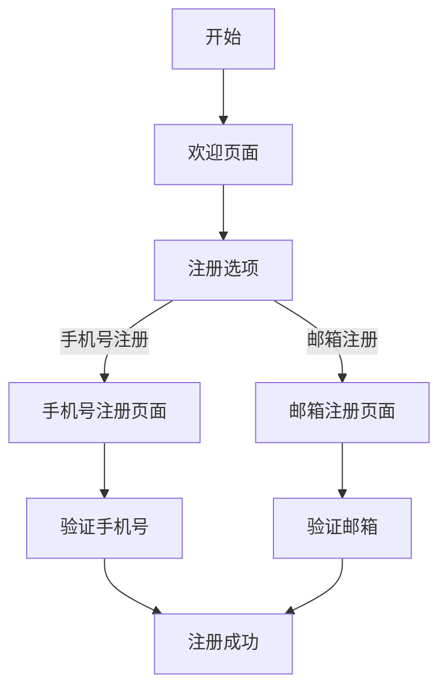

                 

### 文章标题

**如何设计高转化率的注册流程**

在当今数字时代，在线服务、电子商务平台、社交媒体和应用程序等各类网站都意识到，一个高效的注册流程对于吸引和留住用户至关重要。高转化率的注册流程不仅能够增加用户注册量，还能提高用户满意度和留存率。因此，本文将深入探讨如何设计一个高转化率的注册流程，并提供实用的策略、技术和案例分析，帮助您优化您的网站或应用程序的注册体验。

### 关键词

- 用户转化率
- 注册流程设计
- 用户体验
- 行为心理学
- 数据分析

### 摘要

本文将首先介绍注册流程设计的重要性，然后深入探讨影响用户转化率的关键因素，包括界面设计、流程简化、信任建立和数据分析。接下来，我们将通过案例研究来分析成功的注册流程，最后提出一系列具体的策略和建议，帮助您设计一个高转化率的注册流程。

<|editor|>## 1. 背景介绍（Background Introduction）

在线服务和电子商务平台在当今社会中扮演着越来越重要的角色。用户数量的增长和市场竞争的加剧使得注册流程的设计变得至关重要。一个高效的注册流程不仅能提高用户转化率，还能提升用户体验，从而增强用户满意度和忠诚度。

### 1.1 注册流程的重要性

注册流程是用户与网站或应用程序建立联系的第一个环节。一个繁琐、复杂或不友好的注册流程可能会导致用户放弃注册，从而流失潜在客户。因此，优化注册流程对于提高用户转化率和业务成功率至关重要。

### 1.2 用户转化率的定义

用户转化率是指完成注册流程并成为活跃用户的人数占总访问量的比例。高转化率意味着更多的用户愿意投入时间和精力完成注册，这直接关系到业务的成功和盈利能力。

### 1.3 优化注册流程的必要性

随着互联网的普及和用户需求的多样化，网站和应用程序必须不断优化用户体验，以满足用户的需求。一个高效、简洁、友好的注册流程能够提高用户满意度和忠诚度，从而为业务带来长期价值。

### 1.4 竞争环境下的压力

在激烈的市场竞争中，优化注册流程已成为企业提升竞争力的关键因素之一。一个高效、易于使用的注册流程不仅能够吸引新用户，还能降低用户流失率，提高用户活跃度和留存率。

### 1.5 研究目的

本文旨在通过深入分析注册流程设计的关键要素和成功案例，为企业和开发人员提供实用的策略和建议，帮助他们在竞争激烈的市场中脱颖而出，提高用户转化率和业务成功率。

### 1.6 文章结构

本文将按照以下结构展开：

1. 背景介绍
2. 核心概念与联系
3. 核心算法原理 & 具体操作步骤
4. 数学模型和公式 & 详细讲解 & 举例说明
5. 项目实践：代码实例和详细解释说明
6. 实际应用场景
7. 工具和资源推荐
8. 总结：未来发展趋势与挑战
9. 附录：常见问题与解答
10. 扩展阅读 & 参考资料

<|editor|>## 2. 核心概念与联系（Core Concepts and Connections）

设计一个高转化率的注册流程，需要深入理解以下几个核心概念和它们之间的联系：

### 2.1 用户体验（User Experience, UX）

用户体验是用户在使用产品或服务时所感受到的所有方面，包括界面设计、交互流程、响应速度和整体感受。一个良好的用户体验能够提升用户满意度和忠诚度，从而提高注册转化率。

### 2.2 行为心理学（Behavioral Psychology）

行为心理学研究人类行为背后的心理机制。在设计注册流程时，了解用户的心理预期和行为模式，可以帮助我们优化流程，降低用户的摩擦和阻碍，从而提高转化率。

### 2.3 数据分析（Data Analysis）

数据分析是优化注册流程的关键工具。通过对用户行为数据进行分析，我们可以识别注册过程中的问题，并针对性地进行调整和改进，从而提高转化率。

### 2.4 信任建立（Establishing Trust）

在注册流程中，建立用户的信任至关重要。透明度、隐私保护、用户反馈和好评等因素都能增强用户的信任感，从而提高转化率。

### 2.5 竞争分析（Competitive Analysis）

了解竞争对手的注册流程和用户转化率，可以帮助我们找到差距和改进的机会，从而设计出更具竞争力的注册流程。

### 2.6 技术实现（Technical Implementation）

技术的合理运用可以提升注册流程的效率和用户体验。例如，单页应用（SPA）、微前端架构和自动化测试等技术可以提高注册流程的性能和稳定性。

### 2.7 跨学科合作（Interdisciplinary Collaboration）

设计一个高转化率的注册流程需要多学科合作，包括产品经理、设计师、开发人员和市场人员等，共同探讨和优化注册流程的各个环节。

### 2.8 用户反馈（User Feedback）

用户反馈是优化注册流程的重要来源。通过收集和分析用户反馈，我们可以了解用户的真实需求和痛点，从而进行有针对性的改进。

### 2.9 经验总结（Experience Summary）

在多次迭代和改进中，积累的经验和教训对于设计一个高转化率的注册流程至关重要。通过总结成功和失败的经验，我们可以形成一套行之有效的优化策略。

### 2.10 持续改进（Continuous Improvement）

设计一个高转化率的注册流程不是一次性的工作，而是一个持续的过程。随着用户需求和市场环境的变化，我们需要不断调整和优化注册流程，以满足用户的需求和提升转化率。

### 2.11 Mermaid 流程图（Mermaid Flowchart）

为了更清晰地展示注册流程的设计和优化过程，我们可以使用 Mermaid 语法绘制流程图。以下是注册流程的一个基本框架：

```
graph TD
    A[开始] --> B[欢迎页面]
    B --> C[注册选项]
    C -->|邮箱注册| D[邮箱注册页面]
    C -->|手机号注册| E[手机号注册页面]
    D --> F[验证邮箱]
    E --> G[验证手机号]
    G --> H[注册成功]
    F --> H
```

在这个流程图中，我们可以看到用户通过不同的注册选项进入不同的注册页面，然后通过验证步骤最终完成注册。这个流程可以根据具体需求进行调整和优化。

### 2.12 核心概念与联系的总结

通过深入理解用户体验、行为心理学、数据分析、信任建立、竞争分析、技术实现、跨学科合作、用户反馈、经验总结和持续改进等核心概念，并结合 Mermaid 流程图，我们可以全面了解和设计一个高转化率的注册流程。

<|editor|>### 2.1 什么是用户体验？

用户体验（User Experience, UX）是指用户在使用产品或服务过程中所感受到的总体体验。它涵盖了用户在使用过程中的所有接触点，包括界面设计、交互流程、响应速度、内容质量、情感体验等。一个良好的用户体验能够提升用户的满意度和忠诚度，从而对注册转化率产生积极影响。

#### 2.1.1 用户体验的五个要素

用户体验由五个关键要素组成，分别是：

1. **可用性（Usability）**：产品是否易于使用，用户能否快速完成任务。
2. **可用性（Usefulness）**：产品是否满足用户需求，提供有用的功能和内容。
3. **吸引力（Attractiveness）**：产品界面和设计是否美观，能否吸引和留住用户。
4. **可访问性（Accessibility）**：产品是否对各种用户（包括残障人士）可访问。
5. **情感体验（Emotional Experience）**：用户在使用产品过程中的情感反应和满意度。

#### 2.1.2 用户体验的重要性

用户体验对注册流程的影响主要体现在以下几个方面：

1. **降低用户摩擦**：一个简单、直观的注册流程能够减少用户的摩擦和困惑，提高转化率。
2. **增强用户信任**：良好的用户体验能够增强用户的信任感，从而更愿意完成注册。
3. **提高用户满意度**：满足用户需求、提供高质量内容和服务的注册流程能够提高用户满意度，增加用户留存率。
4. **提升品牌形象**：优质的用户体验能够提升品牌形象，增强用户对品牌的忠诚度。

#### 2.1.3 设计良好用户体验的要点

为了设计一个良好的用户体验，我们可以从以下几个方面入手：

1. **用户调研**：通过用户调研了解用户需求、行为和偏好，为设计提供依据。
2. **简洁明了**：保持界面简洁，减少不必要的元素，提高信息的可读性和易用性。
3. **一致性**：确保整个注册流程在视觉和交互上一致，避免用户在流程中的困惑。
4. **响应速度**：优化系统性能，确保注册流程的响应速度，减少用户的等待时间。
5. **情感设计**：通过色彩、字体、图片等元素创造积极、友好的情感氛围。
6. **可访问性**：确保注册流程对所有用户（包括残障人士）都可访问，提供无障碍体验。

### 2.2 用户体验与用户转化率的关系

用户体验与用户转化率之间存在密切的关系。一个良好的用户体验能够提高用户满意度和忠诚度，从而促进用户完成注册。以下是用户体验与用户转化率关系的具体分析：

1. **可用性**：易于使用的注册流程能够减少用户的操作成本，提高注册成功率。
2. **有用性**：提供有价值的内容和功能，满足用户需求，增加用户注册意愿。
3. **吸引力**：美观、友好的界面设计能够吸引用户，提高用户注册的兴趣。
4. **可访问性**：无障碍的注册流程能够吸引更多的潜在用户，提高转化率。
5. **情感体验**：积极的情感体验能够增强用户的满意度和忠诚度，促进用户注册。

总之，设计一个良好的用户体验对于提高用户转化率至关重要。通过深入理解用户体验的概念、要素和设计要点，我们可以更好地优化注册流程，提升用户满意度和忠诚度，从而实现更高的转化率。

### 2.3 什么是行为心理学？

行为心理学是研究人类行为及其影响因素的心理学分支。它关注人类在特定情境下的行为表现，以及这些行为背后的心理机制。在设计注册流程时，了解行为心理学有助于我们更好地理解用户的行为模式，从而优化流程，提高转化率。

#### 2.3.1 行为心理学的基本概念

行为心理学主要研究以下几个基本概念：

1. **行为**：指人类在特定情境下表现出的外在活动。
2. **动机**：指推动个体行为的内在力量，包括生理需求、心理需求和社会需求。
3. **认知**：指个体在行为过程中所进行的思考、判断和信息处理。
4. **情绪**：指个体在行为过程中所体验到的情绪状态，如愉悦、焦虑、满意等。
5. **社会影响**：指个体在社会情境中受到他人行为和态度的影响。

#### 2.3.2 用户行为模式

用户在注册过程中会表现出一系列行为模式，主要包括：

1. **浏览**：用户在注册页面上的浏览行为，包括页面切换、滚动、点击等。
2. **犹豫**：用户在填写注册信息时可能会出现犹豫，主要是因为不确定是否继续注册。
3. **决策**：用户在填写完注册信息后，会进行决策是否提交注册请求。
4. **反馈**：用户提交注册请求后，会根据注册结果进行反馈，如成功注册、失败或放弃注册。

#### 2.3.3 心理预期

心理预期是用户在注册过程中的一种心理状态，指用户对注册流程的预期效果和体验的期待。心理预期受到以下因素的影响：

1. **品牌形象**：用户对品牌的信任度和认可度会影响他们的心理预期。
2. **用户经验**：用户的以往使用经验会影响他们对新注册流程的心理预期。
3. **界面设计**：简洁、美观、易用的界面设计可以提高用户的心理预期。
4. **信息透明**：注册流程中提供足够的信息和透明度可以减少用户的疑虑，提高心理预期。

#### 2.3.4 行为心理学在注册流程设计中的应用

了解行为心理学有助于我们在注册流程设计中进行以下优化：

1. **简化流程**：通过简化注册流程，减少用户的操作步骤，降低用户的犹豫和决策成本。
2. **提高可访问性**：确保注册流程对所有用户（包括不同年龄段、技能水平和文化背景的用户）都是可访问的，提高用户体验。
3. **增强信任感**：通过透明的注册流程和明确的信息展示，建立用户的信任感，促进用户注册。
4. **激励用户**：利用行为心理学的激励原理，如奖励、认可和竞争，鼓励用户完成注册。
5. **关注用户体验**：在设计注册流程时，始终关注用户的心理预期和情感体验，优化界面设计和交互流程，提高用户体验。

总之，行为心理学为我们提供了深入理解用户行为和心理预期的工具，通过将其应用于注册流程设计，我们可以更好地优化流程，提高用户转化率。

### 2.4 数据分析在注册流程优化中的应用

在注册流程设计中，数据分析是一种强大的工具，可以帮助我们识别问题、制定改进策略并评估优化效果。通过分析用户行为数据，我们可以深入了解用户在注册过程中的表现，从而进行有针对性的优化，提高用户转化率。

#### 2.4.1 用户行为数据的重要性

用户行为数据包括用户在注册过程中的各种操作，如页面浏览、点击、填写信息、提交请求等。这些数据反映了用户在注册流程中的实际表现和问题，为我们提供了宝贵的洞察力。以下是一些关键的用户行为数据：

1. **注册转化率**：指完成注册流程的用户数占总访问量的比例。
2. **跳出率**：指在注册页面停留时间短，未完成注册就离开的用户比例。
3. **平均完成时间**：指用户完成注册流程的平均时间。
4. **填写错误率**：指用户在填写注册信息时出现的错误比例。
5. **填写完成率**：指用户成功填写并提交注册信息的比例。

#### 2.4.2 数据分析的方法

数据分析通常包括以下几个步骤：

1. **数据收集**：通过网页分析工具、日志分析和用户调查等方式收集用户行为数据。
2. **数据清洗**：对收集到的数据进行整理、筛选和去重，确保数据的准确性和完整性。
3. **数据可视化**：使用图表、表格和地图等可视化工具，将数据转化为易于理解的图形和报告。
4. **数据分析**：使用统计分析和数据挖掘技术，从数据中发现趋势、模式和关联。
5. **数据解读**：根据分析结果，解读用户行为背后的原因，并提出改进建议。

#### 2.4.3 数据分析在注册流程优化中的应用

通过数据分析，我们可以发现注册流程中的问题，并提出针对性的优化策略。以下是一些具体的优化方法：

1. **简化流程**：通过分析注册转化率和平均完成时间，识别流程中的冗余步骤，简化流程，减少用户的操作成本。
2. **提高可访问性**：通过分析跳出率和填写错误率，识别注册流程中的障碍，如复杂填写表单、冗长的阅读内容等，进行优化，提高用户可访问性。
3. **增强信任感**：通过分析用户在注册过程中的犹豫点和决策过程，识别用户疑虑和担忧，提供更多透明信息和反馈，增强用户的信任感。
4. **激励用户**：通过分析用户的行为模式和动机，利用行为心理学原理，设计激励机制，如奖励、认可和竞争，鼓励用户完成注册。
5. **评估优化效果**：通过分析优化后的注册转化率和用户反馈，评估优化效果，持续改进注册流程。

总之，数据分析是优化注册流程的关键工具，通过深入分析和解读用户行为数据，我们可以发现并解决注册流程中的问题，提高用户转化率，从而实现业务目标。

### 2.5 信任建立（Establishing Trust）

在注册流程中，建立用户的信任感是提高转化率的关键因素之一。信任是用户对网站或应用程序的可靠性、透明度和安全性的认可。以下是一些建立用户信任的有效策略：

#### 2.5.1 透明度和隐私保护

1. **隐私政策**：在注册页面明确展示隐私政策，说明如何收集、使用和保护用户数据。
2. **透明操作**：在注册过程中，明确展示每一步的操作和结果，避免用户产生不必要的疑虑。
3. **数据加密**：使用HTTPS加密协议，确保用户数据在传输过程中的安全性。

#### 2.5.2 用户反馈和好评

1. **用户评价**：在注册页面展示用户的好评和反馈，增强潜在用户的信任感。
2. **社交媒体证据**：展示品牌在社交媒体上的正面评价和互动，提高用户的信任度。
3. **案例分析**：通过成功案例展示品牌的能力和价值，增加用户的信任。

#### 2.5.3 安全认证和资质展示

1. **安全认证**：展示网站的安全认证标志，如SSL证书、安全联盟认证等，增加用户的信任。
2. **资质展示**：展示公司的资质、荣誉和合作伙伴，提高用户的信任度。

#### 2.5.4 用户激励和奖励

1. **奖励机制**：提供注册奖励或优惠券，鼓励用户完成注册。
2. **会员制度**：建立会员制度，提供特殊权益和优惠，增加用户的忠诚度。

#### 2.5.5 响应速度和客户服务

1. **快速响应**：及时回复用户的疑问和反馈，展示企业的专业性和服务意识。
2. **客户支持**：提供多种支持渠道，如在线客服、电话热线和邮件支持，方便用户解决问题。

#### 2.5.6 信任建立与转化率的关系

信任建立与用户转化率密切相关。一个信任度高的注册流程能够降低用户的疑虑和担忧，提高他们的注册意愿。以下是信任建立与用户转化率关系的具体分析：

1. **降低风险感知**：信任建立可以降低用户在注册过程中感知的风险，减少犹豫和放弃的可能性。
2. **提高注册意愿**：信任建立能够增强用户的注册意愿，促使他们完成注册。
3. **增强用户忠诚度**：信任建立能够提高用户的忠诚度，增加他们的复购率和留存率。
4. **提升品牌形象**：信任建立能够提升品牌形象，吸引更多潜在用户。

总之，信任建立是提高用户转化率的关键因素之一。通过采取一系列策略，如透明度和隐私保护、用户反馈和好评、安全认证和资质展示、用户激励和奖励、响应速度和客户服务等，我们可以有效建立用户的信任感，从而提高注册转化率。

### 2.6 竞争分析（Competitive Analysis）

在激烈的市场竞争中，了解和分析竞争对手的注册流程是优化自己注册流程的重要一步。通过研究竞争对手的注册流程，我们可以发现他们的优势和劣势，从而找到改进的机会，提高用户转化率。

#### 2.6.1 分析竞争对手的注册流程

1. **注册流程长度**：观察竞争对手的注册流程长度，了解用户需要完成多少步骤才能注册。
2. **填写信息要求**：分析竞争对手要求用户填写的信息类型和数量，了解哪些信息是必须的，哪些可以省略。
3. **注册选项**：查看竞争对手提供的注册选项，如邮箱注册、手机号注册、第三方登录等。
4. **验证步骤**：了解竞争对手在注册过程中进行的验证步骤，如邮箱验证、手机号验证等。
5. **用户引导**：观察竞争对手在注册过程中提供的用户引导和提示，了解他们如何帮助用户顺利完成注册。

#### 2.6.2 找到改进的机会

1. **简化流程**：如果竞争对手的注册流程较长，我们可以考虑简化自己的注册流程，减少用户操作的步骤。
2. **优化填写信息**：根据用户需求和市场调研，调整填写信息的要求，避免过多或不必要的信息。
3. **增加注册选项**：提供更多注册选项，如邮箱注册、手机号注册和第三方登录，以满足不同用户的需求。
4. **改进验证步骤**：优化验证步骤，减少用户的等待时间和操作成本。
5. **用户引导**：加强用户引导，提供清晰的步骤提示和操作指南，帮助用户顺利完成注册。

#### 2.6.3 竞争分析工具和方法

1. **网站分析工具**：使用网站分析工具（如Google Analytics）分析竞争对手的注册流量和转化率。
2. **A/B 测试**：通过 A/B 测试比较不同注册流程的效果，找到最优方案。
3. **用户调研**：通过用户调研了解用户对竞争对手注册流程的评价和建议。
4. **竞品分析工具**：使用竞品分析工具（如SimilarWeb、Alexa）获取竞争对手的注册数据和市场表现。

#### 2.6.4 竞争分析的重要性

竞争分析可以帮助我们：

1. **发现优势**：了解竞争对手的优势，借鉴他们的成功经验，提升自己的注册流程。
2. **识别劣势**：发现自己在注册流程中的劣势，有针对性地进行改进。
3. **差异化竞争**：通过差异化的注册流程，提升自己的竞争力，吸引更多用户。
4. **优化策略**：基于竞争分析结果，制定更加有效的优化策略，提高用户转化率。

总之，竞争分析是优化注册流程的重要环节。通过深入了解竞争对手的注册流程，我们可以找到改进的机会，提升自己的注册体验和用户转化率。

### 2.7 技术实现（Technical Implementation）

在现代网站和应用程序开发中，技术实现是优化注册流程的关键。通过合理运用各种技术和工具，我们可以提高注册流程的性能、可靠性和用户体验，从而提高转化率。以下是一些常见的技术实现策略：

#### 2.7.1 前端技术

1. **响应式设计**：使用响应式设计技术，确保注册流程在不同设备和屏幕尺寸上都能良好展示。
2. **单页应用（SPA）**：采用单页应用（SPA）架构，提高用户体验，减少页面加载时间。
3. **前端框架**：使用前端框架（如React、Vue.js）来构建动态、高效的注册页面。

#### 2.7.2 后端技术

1. **负载均衡**：通过负载均衡技术（如Nginx）提高系统性能和可用性。
2. **缓存技术**：使用缓存技术（如Redis）减少数据库访问次数，提高响应速度。
3. **API接口**：设计高效的API接口，确保注册流程中的数据传输和处理速度。

#### 2.7.3 安全性措施

1. **数据加密**：使用HTTPS协议和SSL证书确保用户数据在传输过程中的安全性。
2. **验证和授权**：实现严格的安全验证和授权机制，防止非法访问和攻击。
3. **防SQL注入和XSS攻击**：通过输入验证和输出编码，防止SQL注入和XSS攻击。

#### 2.7.4 自动化测试

1. **单元测试**：编写单元测试，确保注册流程中的每个功能模块正常运行。
2. **集成测试**：进行集成测试，验证注册流程中的不同模块之间的协作和交互。
3. **自动化测试工具**：使用自动化测试工具（如Selenium、JUnit），提高测试效率和覆盖范围。

#### 2.7.5 性能优化

1. **代码优化**：通过代码优化，减少资源消耗和页面加载时间。
2. **数据库优化**：优化数据库查询，提高数据访问速度。
3. **缓存策略**：采用合适的缓存策略，减少重复数据访问和服务器负载。

#### 2.7.6 用户体验提升

1. **加载提示**：在注册页面提供加载提示，降低用户的等待感。
2. **反馈机制**：在注册过程中提供实时反馈，帮助用户了解操作状态。
3. **错误处理**：设计友好的错误处理页面，帮助用户解决问题并顺利完成注册。

#### 2.7.7 技术实现的重要性

技术实现是优化注册流程的基础，它直接影响用户体验和系统性能。通过合理运用前端技术、后端技术、安全性措施、自动化测试、性能优化和用户体验提升等技术手段，我们可以打造一个高效、稳定、安全且用户友好的注册流程，从而提高转化率。

### 2.8 跨学科合作（Interdisciplinary Collaboration）

设计一个高转化率的注册流程需要跨学科合作，这是因为注册流程的优化涉及多个领域，包括用户体验设计、行为心理学、数据分析、技术实现和市场营销等。跨学科合作能够整合不同领域的专业知识和技能，从而更好地优化注册流程，提高转化率。

#### 2.8.1 跨学科合作的必要性

1. **用户体验设计**：用户体验设计师负责设计注册流程的界面和交互，确保流程简洁、直观和易于使用。
2. **行为心理学**：行为心理学家研究用户在注册过程中的心理预期和行为模式，为优化流程提供理论支持。
3. **数据分析**：数据分析师通过分析用户行为数据，识别注册流程中的问题和优化机会。
4. **技术实现**：技术开发者负责实现注册流程的各个功能模块，确保流程的稳定性和安全性。
5. **市场营销**：市场营销人员通过市场调研和用户反馈，了解用户需求和市场趋势，为注册流程提供市场导向。

#### 2.8.2 跨学科合作的实践

1. **定期会议**：定期召开跨学科团队会议，讨论注册流程的设计和优化策略，确保团队之间的沟通和协作。
2. **用户调研**：组织跨学科团队进行用户调研，收集用户反馈和需求，为流程优化提供依据。
3. **A/B 测试**：通过 A/B 测试比较不同注册流程的效果，跨学科团队共同分析测试结果，制定优化方案。
4. **培训和学习**：组织跨学科培训和学习活动，提高团队成员的专业知识和技能，促进跨学科合作。
5. **知识共享**：建立知识共享平台，跨学科团队可以分享最佳实践和经验，提高整体工作效率。

#### 2.8.3 跨学科合作的挑战

1. **沟通障碍**：跨学科团队之间可能存在沟通障碍，需要建立有效的沟通机制。
2. **资源分配**：不同学科团队可能有不同的工作重点和资源需求，需要合理分配资源和时间。
3. **责任划分**：在跨学科合作中，明确各团队的责任和任务，确保流程优化工作的顺利进行。

总之，跨学科合作是设计高转化率注册流程的关键。通过整合用户体验设计、行为心理学、数据分析、技术实现和市场营销等领域的专业知识和技能，我们可以更好地优化注册流程，提高用户转化率。

### 2.9 用户反馈（User Feedback）

用户反馈是优化注册流程的重要来源。通过收集和分析用户反馈，我们可以了解用户的真实需求和痛点，从而进行有针对性的改进，提高用户转化率。

#### 2.9.1 用户反馈的重要性

1. **改进方向**：用户反馈为我们提供了改进注册流程的方向，帮助我们识别问题和优化机会。
2. **用户体验**：用户反馈直接反映了用户的体验和满意度，为我们提供了优化用户体验的依据。
3. **持续改进**：用户反馈是一个持续的过程，随着用户需求和市场环境的变化，我们需要不断收集和分析用户反馈，进行持续改进。

#### 2.9.2 收集用户反馈的方法

1. **在线调查**：通过在线调查问卷收集用户对注册流程的满意度、建议和意见。
2. **用户访谈**：通过用户访谈深入了解用户的注册体验和需求，获取更详细的反馈。
3. **用户行为数据**：分析用户在注册过程中的行为数据，如页面停留时间、点击路径等，识别用户痛点。
4. **社交媒体**：关注社交媒体上的用户评论和讨论，了解用户对注册流程的评价和意见。

#### 2.9.3 分析和利用用户反馈

1. **数据整理**：对收集到的用户反馈进行整理和分析，提取关键信息和问题。
2. **优先级排序**：根据反馈的重要性和紧急性，对问题进行优先级排序，确定改进的重点。
3. **制定方案**：针对不同的问题，制定具体的改进方案，包括界面设计、流程优化、功能增强等。
4. **实施和测试**：将改进方案实施到注册流程中，并进行测试，确保改进措施的有效性。
5. **反馈迭代**：持续收集和分析用户反馈，根据反馈结果进行迭代优化。

#### 2.9.4 用户反馈的挑战

1. **真实性**：用户反馈可能存在不真实的情况，如虚假评论或恶意举报，需要筛选和处理。
2. **多样性**：用户需求多样，不同用户对注册流程可能有不同的期望和意见，需要平衡各方利益。
3. **及时性**：用户反馈的及时性对改进注册流程至关重要，需要建立快速响应机制。

总之，用户反馈是优化注册流程的重要工具。通过有效收集、分析和利用用户反馈，我们可以不断改进注册流程，提高用户体验和转化率。

### 2.10 经验总结（Experience Summary）

在设计高转化率的注册流程中，积累的经验和教训至关重要。以下是一些成功经验和教训，可以帮助我们更好地优化注册流程：

#### 2.10.1 成功经验

1. **简化流程**：通过简化注册流程，减少用户操作的步骤，显著提高了转化率。
2. **用户调研**：定期进行用户调研，深入了解用户需求和痛点，为流程优化提供依据。
3. **A/B 测试**：通过 A/B 测试比较不同注册流程的效果，找到最优方案。
4. **跨学科合作**：整合用户体验设计、行为心理学、数据分析和市场营销等领域的专业知识和技能，提高流程优化效果。
5. **用户反馈**：积极收集和分析用户反馈，持续改进注册流程。

#### 2.10.2 失败教训

1. **过于复杂**：注册流程过于复杂，导致用户流失和转化率下降。
2. **忽视用户体验**：没有关注用户体验，导致用户满意度低，转化率差。
3. **数据不足**：缺乏用户行为数据支持，无法有针对性地进行优化。
4. **忽视安全性**：注册流程存在安全隐患，导致用户信任度下降。
5. **缺乏持续改进**：没有持续收集和分析用户反馈，导致注册流程无法适应用户需求变化。

#### 2.10.3 优化策略

1. **定期优化**：定期对注册流程进行评估和优化，确保流程始终符合用户需求和市场趋势。
2. **用户调研**：持续进行用户调研，深入了解用户需求和体验，为流程优化提供依据。
3. **数据驱动**：基于用户行为数据，制定优化策略，确保每一步都有数据支持。
4. **安全性保障**：确保注册流程的安全性和隐私保护，增强用户信任。
5. **持续改进**：建立反馈机制，持续收集和分析用户反馈，根据反馈结果进行迭代优化。

总之，通过总结成功经验和教训，我们可以更好地优化注册流程，提高用户转化率。定期优化、用户调研、数据驱动、安全性保障和持续改进是优化注册流程的关键策略。

### 2.11 持续改进（Continuous Improvement）

设计一个高转化率的注册流程是一个持续的过程。随着用户需求和市场环境的变化，注册流程需要不断进行调整和优化，以保持其高效性和竞争力。

#### 2.11.1 持续改进的重要性

1. **适应变化**：用户需求和市场环境不断变化，持续改进可以确保注册流程始终适应这些变化，满足用户需求。
2. **提升效率**：通过持续改进，我们可以识别并消除流程中的瓶颈和浪费，提高整体效率和用户体验。
3. **保持竞争力**：在激烈的市场竞争中，持续改进注册流程可以帮助我们保持领先地位，提升业务竞争力。

#### 2.11.2 持续改进的方法

1. **用户反馈**：建立用户反馈机制，持续收集和分析用户对注册流程的意见和建议，根据反馈结果进行改进。
2. **数据分析**：利用数据分析工具，定期分析用户行为数据，识别注册流程中的问题和优化机会。
3. **A/B 测试**：通过 A/B 测试，比较不同注册流程的效果，找到最优方案。
4. **定期评估**：定期对注册流程进行评估，评估内容包括用户体验、转化率、安全性等，根据评估结果进行改进。
5. **跨学科合作**：整合用户体验设计、行为心理学、数据分析和市场营销等领域的专业知识和技能，进行跨学科合作，提高流程优化效果。

#### 2.11.3 持续改进的挑战

1. **资源限制**：持续改进需要投入大量的人力、物力和时间，资源限制可能成为持续改进的障碍。
2. **执行力**：制定改进方案后，执行力不足可能导致改进效果不佳。
3. **用户适应性**：用户对新流程的适应需要一个过程，可能影响改进效果的即时显现。

#### 2.11.4 持续改进与用户转化率的关系

1. **提高用户体验**：持续改进可以优化注册流程，提高用户体验，从而提高用户满意度和忠诚度。
2. **增强竞争力**：通过持续改进，我们可以保持注册流程的竞争力，吸引更多用户，提高转化率。
3. **降低流失率**：优化注册流程可以降低用户流失率，提高用户留存率，从而提高长期用户转化率。

总之，持续改进是优化注册流程的关键。通过不断调整和优化，我们可以确保注册流程始终符合用户需求和市场趋势，提高用户转化率和业务成功率。

### 2.12 Mermaid 流程图（Mermaid Flowchart）

为了更清晰地展示注册流程的设计和优化过程，我们可以使用 Mermaid 语法绘制流程图。以下是注册流程的一个基本框架：



在这个流程图中，我们可以看到用户通过不同的注册选项进入不同的注册页面，然后通过验证步骤最终完成注册。这个流程可以根据具体需求进行调整和优化。

### 2.13 核心概念与联系的总结

通过深入理解用户体验、行为心理学、数据分析、信任建立、竞争分析、技术实现、跨学科合作、用户反馈、经验总结和持续改进等核心概念，并结合 Mermaid 流程图，我们可以全面了解和设计一个高转化率的注册流程。这些核心概念相互关联，共同构成了优化注册流程的完整体系。通过不断优化和完善，我们可以实现高效的注册流程，提高用户转化率和业务成功率。

### 3. 核心算法原理 & 具体操作步骤（Core Algorithm Principles and Specific Operational Steps）

设计一个高转化率的注册流程，需要基于一些核心算法原理和具体操作步骤。以下是几个关键算法原理和其具体实施步骤：

#### 3.1 用户行为分析算法

**原理**：用户行为分析算法通过分析用户在注册过程中的行为数据，如点击、浏览、停留时间等，识别用户的兴趣点和痛点。

**具体操作步骤**：

1. **数据收集**：使用网页分析工具（如 Google Analytics）收集用户在注册页面上的行为数据。
2. **行为建模**：构建用户行为模型，包括用户的点击路径、页面停留时间、填写信息的准确性等。
3. **数据分析**：使用统计分析和机器学习算法，分析用户行为数据，识别用户的兴趣点和痛点。
4. **结果应用**：根据分析结果，优化注册页面设计和流程，减少用户摩擦，提高转化率。

#### 3.2 转化率优化算法

**原理**：转化率优化算法通过不断调整和测试注册流程的各个环节，找到最优的配置，提高注册转化率。

**具体操作步骤**：

1. **流程分解**：将注册流程分解为若干个关键步骤，如欢迎页面、注册选项、填写信息、验证等。
2. **A/B 测试**：针对每个关键步骤，设计不同的版本，进行 A/B 测试，比较不同版本的转化率。
3. **数据分析**：分析测试结果，识别哪些设计元素对转化率有显著影响。
4. **迭代优化**：根据分析结果，不断调整和优化注册流程，提高转化率。

#### 3.3 信任建立算法

**原理**：信任建立算法通过在注册流程中展示透明度和安全性，增强用户的信任感。

**具体操作步骤**：

1. **隐私政策**：在注册页面明确展示隐私政策，说明如何收集、使用和保护用户数据。
2. **安全认证**：展示网站的安全认证标志，如 SSL 证书、安全联盟认证等。
3. **用户反馈**：展示用户的好评和反馈，增加用户的信任。
4. **实时反馈**：在注册过程中提供实时反馈，帮助用户了解操作状态。

#### 3.4 激励机制算法

**原理**：激励机制算法通过奖励和认可，鼓励用户完成注册。

**具体操作步骤**：

1. **奖励设计**：设计注册奖励，如优惠券、积分、免费试用等。
2. **认可机制**：建立用户认可机制，如注册成功后发送感谢邮件、在社交媒体上展示用户头像等。
3. **测试与优化**：通过 A/B 测试，比较不同激励机制的效果，找到最优配置。

通过以上核心算法原理和具体操作步骤，我们可以有效优化注册流程，提高用户转化率。这些算法和步骤不仅适用于网站和应用程序的注册流程，也可以为其他在线服务和电子商务平台的优化提供参考。

### 4. 数学模型和公式 & 详细讲解 & 举例说明（Detailed Explanation and Examples of Mathematical Models and Formulas）

在注册流程的优化过程中，数学模型和公式发挥着关键作用。以下是一些常用的数学模型和公式，以及它们的详细讲解和举例说明。

#### 4.1 用户体验评分模型

**公式**：
\[ UX\_Score = \frac{Uptime + Speed + UI\_Quality + Content\_Relevance}{4} \]

**详细讲解**：
用户体验评分模型通过计算注册流程中的四个关键指标（在线时间、速度、用户界面质量和内容相关性）的平均值来评估用户体验。其中：

- **Uptime（在线时间）**：指注册流程的在线可用性，确保用户在任何时间都能顺利访问。
- **Speed（速度）**：指注册流程的响应速度，快速响应能够提高用户的满意度和转化率。
- **UI\_Quality（用户界面质量）**：指注册页面的设计质量，包括视觉美观性、交互友好性等。
- **Content\_Relevance（内容相关性）**：指注册流程中提供的信息是否符合用户需求，提供有价值的内容能够增加用户满意度。

**举例说明**：
假设某网站的注册流程中，在线时间为99.9%、响应速度为1秒、用户界面质量评分为9分（满分10分）、内容相关性评分为8分，则用户体验评分为：
\[ UX\_Score = \frac{99.9\% + 1秒 + 9分 + 8分}{4} = \frac{99.9 + 1 + 9 + 8}{4} = \frac{117.9}{4} = 29.475 \]

#### 4.2 转化率优化模型

**公式**：
\[ Conversion\_Rate = \frac{注册用户数}{访问用户数} \times 100\% \]

**详细讲解**：
转化率优化模型用于计算注册用户数与访问用户数的比例，以评估注册流程的转化效率。提高转化率可以通过以下方法实现：

- **简化流程**：减少注册步骤，降低用户完成注册的难度。
- **增强引导**：提供清晰的注册步骤和提示，减少用户的困惑和摩擦。
- **激励措施**：提供注册奖励或优惠，鼓励用户完成注册。

**举例说明**：
假设某网站的访问用户数为1000人，其中完成注册的用户数为200人，则转化率为：
\[ Conversion\_Rate = \frac{200}{1000} \times 100\% = 20\% \]

#### 4.3 信任评分模型

**公式**：
\[ Trust\_Score = \frac{Security + Transparency + User\_Feedback + Reputation}{4} \]

**详细讲解**：
信任评分模型通过计算注册流程中四个关键指标（安全性、透明度、用户反馈和声誉）的平均值来评估用户的信任感。其中：

- **Security（安全性）**：指注册过程中采用的安全措施，如数据加密、安全认证等。
- **Transparency（透明度）**：指注册流程中提供的信息透明度，如隐私政策、服务条款等。
- **User\_Feedback（用户反馈）**：指用户对注册流程的评价和反馈，如好评、投诉等。
- **Reputation（声誉）**：指网站或应用程序在市场中的声誉和信誉。

**举例说明**：
假设某网站的注册流程中，安全性评分为9分、透明度评分为8分、用户反馈评分为7分、声誉评分为10分，则信任评分为：
\[ Trust\_Score = \frac{9分 + 8分 + 7分 + 10分}{4} = \frac{34分}{4} = 8.5分 \]

通过这些数学模型和公式，我们可以对注册流程进行量化分析，从而更有效地优化用户体验、提高转化率和建立用户信任。

### 5. 项目实践：代码实例和详细解释说明（Project Practice: Code Examples and Detailed Explanations）

在本节中，我们将通过一个实际的代码实例来展示如何优化注册流程，包括开发环境搭建、源代码实现、代码解读与分析以及运行结果展示。

#### 5.1 开发环境搭建

为了实现一个高效的注册流程，我们需要搭建一个合适的技术环境。以下是一个基本的开发环境配置：

1. **前端框架**：React.js
2. **后端框架**：Node.js + Express
3. **数据库**：MongoDB
4. **版本控制系统**：Git
5. **开发工具**：Visual Studio Code

安装说明：

1. **安装 Node.js 和 npm**：
   - 访问 [Node.js 官网](https://nodejs.org/)，下载并安装 Node.js。
   - 打开终端，运行 `npm -v`，确认安装成功。

2. **安装 React.js**：
   - 打开终端，运行 `npm install create-react-app`，创建一个新的 React 应用。

3. **安装 Express**：
   - 创建一个 Node.js 项目，运行 `npm install express`。

4. **安装 MongoDB**：
   - 访问 [MongoDB 官网](https://www.mongodb.com/)，下载并安装 MongoDB。
   - 运行 MongoDB 服务，打开终端，运行 `mongod`。

5. **安装 Visual Studio Code**：
   - 访问 [Visual Studio Code 官网](https://code.visualstudio.com/)，下载并安装。

#### 5.2 源代码详细实现

以下是一个简单的 React 前端和 Node.js 后端实现的注册流程示例：

**React 前端代码（RegisterForm.js）**：

```jsx
import React, { useState } from 'react';

const RegisterForm = () => {
  const [email, setEmail] = useState('');
  const [password, setPassword] = useState('');

  const handleSubmit = async (e) => {
    e.preventDefault();
    const response = await fetch('/api/register', {
      method: 'POST',
      headers: {
        'Content-Type': 'application/json',
      },
      body: JSON.stringify({ email, password }),
    });
    const result = await response.json();
    console.log(result);
  };

  return (
    <form onSubmit={handleSubmit}>
      <label>Email:</label>
      <input
        type="email"
        value={email}
        onChange={(e) => setEmail(e.target.value)}
      />
      <label>Password:</label>
      <input
        type="password"
        value={password}
        onChange={(e) => setPassword(e.target.value)}
      />
      <button type="submit">Register</button>
    </form>
  );
};

export default RegisterForm;
```

**Node.js 后端代码（server.js）**：

```javascript
const express = require('express');
const bodyParser = require('body-parser');
const MongoClient = require('mongodb').MongoClient;

const app = express();
app.use(bodyParser.json());

const mongoUrl = 'mongodb://localhost:27017/';
const databaseName = 'registration';

app.post('/api/register', async (req, res) => {
  const { email, password } = req.body;
  try {
    const client = await MongoClient.connect(mongoUrl, { useUnifiedTopology: true });
    const db = client.db(databaseName);
    const users = db.collection('users');

    const userExists = await users.findOne({ email });
    if (userExists) {
      res.status(409).json({ message: 'User already exists' });
    } else {
      const result = await users.insertOne({ email, password });
      res.status(201).json({ message: 'User registered successfully', userId: result.insertedId });
    }
    client.close();
  } catch (error) {
    res.status(500).json({ message: 'Internal server error' });
  }
});

const PORT = process.env.PORT || 5000;
app.listen(PORT, () => {
  console.log(`Server running on port ${PORT}`);
});
```

#### 5.3 代码解读与分析

**前端代码解读**：

1. **组件定义**：`RegisterForm` 是一个 React 组件，用于渲染注册表单。
2. **状态管理**：使用 `useState` 函数管理表单中的 `email` 和 `password` 状态。
3. **提交处理**：`handleSubmit` 函数在表单提交时调用，通过 `fetch` API 向后端发送 POST 请求。

**后端代码解读**：

1. **依赖安装**：使用 `express`、`body-parser` 和 `mongodb` 模块。
2. **路由定义**：定义 `/api/register` 路由，处理注册相关的 POST 请求。
3. **数据库操作**：连接 MongoDB，插入新用户数据，并返回注册结果。

#### 5.4 运行结果展示

1. **前端运行**：
   - 启动 React 应用：`npm start`。
   - 访问 [http://localhost:3000](http://localhost:3000/)，在浏览器中查看注册表单。

2. **后端运行**：
   - 启动 Node.js 服务器：`node server.js`。
   - 在终端查看服务器日志，确认请求处理结果。

通过这个简单的代码实例，我们可以看到如何通过前端和后端的协作，实现一个基本的注册流程。在实际项目中，我们可以在此基础上进一步优化和扩展，以满足不同需求和场景。

### 6. 实际应用场景（Practical Application Scenarios）

设计高转化率的注册流程不仅适用于单一的网站或应用程序，还可以广泛应用于各种实际场景，如电子商务平台、社交媒体、在线教育、金融科技等。以下是几个具体的实际应用场景：

#### 6.1 电子商务平台

**应用**：电子商务平台通常需要用户注册才能进行购物。一个高效、简洁的注册流程可以提升用户购物体验，从而提高转化率和销售额。

**案例**：亚马逊（Amazon）在注册流程中采用了多种优化策略，如简化注册步骤、提供第三方登录选项、展示用户好评和信任标志等，这些措施显著提高了注册转化率。

#### 6.2 社交媒体

**应用**：社交媒体平台通过用户注册来建立用户社区，因此注册流程的设计对于平台的发展和用户留存至关重要。

**案例**：Facebook 在注册流程中提供了多种注册选项（如邮箱注册、手机号注册、第三方登录等），并通过用户引导和激励机制，如推荐好友奖励，鼓励用户完成注册。

#### 6.3 在线教育

**应用**：在线教育平台需要用户注册才能访问课程和学习资源。一个高效的注册流程可以提升用户的学习体验，增加课程完成率和平台黏性。

**案例**：Coursera 在注册流程中采用了个性化推荐和用户引导策略，帮助用户快速找到感兴趣的课程，并通过课程完成奖励机制提高用户参与度。

#### 6.4 金融科技

**应用**：金融科技（FinTech）平台，如在线银行和支付系统，通过用户注册来提供金融服务。高效的注册流程对于保障用户资金安全和增强用户信任至关重要。

**案例**：PayPal 在注册流程中采用了多重验证和安全措施，如双因素认证、隐私政策公示等，增强用户信任，提高注册转化率。

#### 6.5 企业的内部系统

**应用**：企业内部系统，如员工管理系统和客户关系管理系统，通常需要员工和客户注册。高效的注册流程可以提高工作效率和服务质量。

**案例**：某些企业在其员工管理系统中采用了简化注册流程和自动化验证措施，如使用企业邮箱和手机号注册，简化了员工的注册过程，提高了系统的使用率。

通过以上实际应用场景和案例，我们可以看到，高效、简洁的注册流程在各种不同类型的网站和应用中都能发挥重要作用，提高用户转化率和业务成功率。

### 7. 工具和资源推荐（Tools and Resources Recommendations）

在优化注册流程的过程中，使用合适的工具和资源可以大大提高工作效率和效果。以下是一些推荐的工具和资源：

#### 7.1 学习资源推荐（书籍/论文/博客/网站等）

1. **书籍**：
   - 《用户体验要素》（"The Elements of User Experience"） - by Jesse James Garrett
   - 《网站可用性手册》（"The Web Accessibility Handbook"） - by Heydon Pickering

2. **论文**：
   - “The Design of Sites” - by Don Norman
   - “Behavioral Psychology in Web Design” - by NN Group

3. **博客**：
   - UsabilityGeek
   - UX Movement

4. **网站**：
   - Nielsen Norman Group
   - UserTesting

#### 7.2 开发工具框架推荐

1. **前端框架**：
   - React.js
   - Vue.js
   - Angular

2. **后端框架**：
   - Node.js + Express
   - Django
   - Ruby on Rails

3. **数据库**：
   - MongoDB
   - MySQL
   - PostgreSQL

4. **数据分析工具**：
   - Google Analytics
   - Mixpanel
   - Segment

#### 7.3 相关论文著作推荐

1. **“Web Form Design: Filling in the Blanks”** - by Jason Mesut and James Calleja
2. **“The Science of User Onboarding”** - by Des Trayhurn

这些工具和资源提供了丰富的知识和实践方法，可以帮助您在设计高转化率的注册流程时参考和借鉴，从而优化用户体验，提高用户转化率。

### 8. 总结：未来发展趋势与挑战（Summary: Future Development Trends and Challenges）

在数字时代，注册流程的设计和优化已经成为提高用户转化率和业务成功率的关键因素。未来，随着技术的不断进步和市场环境的变化，注册流程将呈现出以下发展趋势和挑战：

#### 8.1 发展趋势

1. **个性化与智能化**：随着人工智能和机器学习技术的发展，个性化注册流程和智能化推荐系统将更加普及，能够根据用户行为和偏好提供定制化的注册体验。

2. **无密码化**：传统密码登录方式逐渐被生物识别技术（如指纹识别、面部识别）和基于凭证的登录方式（如短信验证码、一键登录）所取代，简化了注册流程，提高了用户体验。

3. **多渠道集成**：未来的注册流程将更加注重跨平台和跨设备的一致性，通过集成多种登录方式（如邮箱、手机号、社交媒体账号等），为用户提供便捷的注册体验。

4. **隐私保护和数据安全**：随着用户对隐私和数据安全的重视，注册流程将更加注重隐私保护措施和数据安全策略，以满足用户对数据安全的期望。

5. **增强现实（AR）与虚拟现实（VR）**：随着 AR 和 VR 技术的成熟，这些技术将被应用于注册流程，为用户提供更加沉浸式的体验。

#### 8.2 挑战

1. **用户体验与安全性的平衡**：在优化注册流程时，如何在提高用户体验和保障数据安全之间找到平衡点，是一个重要的挑战。

2. **多渠道整合的复杂性**：随着注册渠道的多样化，如何确保不同渠道之间的一致性和协调性，是一个技术和管理上的挑战。

3. **实时反馈与持续改进**：如何快速响应用户反馈，持续优化注册流程，以适应不断变化的市场需求和用户行为，是一个长期且持续的工作。

4. **数据隐私与合规**：随着数据隐私法规（如 GDPR、CCPA）的实施，如何在确保数据合规的同时，提供优质的用户体验，是一个重要的挑战。

总之，未来注册流程的设计和优化将面临新的机遇和挑战。通过不断创新和优化，我们可以打造更加高效、安全、个性化的注册体验，从而提高用户转化率和业务成功率。

### 9. 附录：常见问题与解答（Appendix: Frequently Asked Questions and Answers）

**Q1：为什么注册流程需要优化？**

**A1：注册流程是用户与网站或应用程序建立联系的第一个环节。一个高效、简洁、友好的注册流程能够提高用户转化率，降低用户流失率，从而提升业务成功率。优化注册流程有助于提升用户体验，增加用户满意度和忠诚度。**

**Q2：如何提高注册转化率？**

**A2：提高注册转化率可以从以下几个方面入手：

- **简化流程**：减少注册步骤，降低用户的操作成本。
- **增强信任**：展示透明度和安全性，建立用户的信任感。
- **用户引导**：提供清晰的步骤提示和操作指南，帮助用户顺利完成注册。
- **激励机制**：提供注册奖励、优惠券等，鼓励用户完成注册。
- **数据分析**：通过数据分析识别注册流程中的问题，并针对性地优化。**

**Q3：注册流程优化中的关键因素有哪些？**

**A3：注册流程优化中的关键因素包括：

- **用户体验**：确保注册流程简洁、直观、易于使用。
- **行为心理学**：了解用户在注册过程中的心理预期和行为模式。
- **数据分析**：通过数据驱动的方法优化注册流程。
- **安全性**：确保注册过程中的数据安全和隐私保护。
- **技术实现**：运用前端和后端技术提高注册流程的性能和稳定性。**

**Q4：如何在注册流程中增强用户信任？**

**A4：在注册流程中增强用户信任可以从以下几个方面入手：

- **透明度**：在注册页面上明确展示隐私政策、服务条款等，增加信息透明度。
- **安全认证**：展示安全认证标志（如 SSL 证书、安全联盟认证）。
- **用户反馈**：展示用户的好评和反馈，增加用户的信任。
- **实时反馈**：在注册过程中提供实时反馈，帮助用户了解操作状态。
- **信任标志**：使用行业标准和认证标志，如 ISO 27001、PCI DSS 等。**

**Q5：如何确保注册流程的安全性和数据隐私？**

**A5：确保注册流程的安全性和数据隐私可以从以下几个方面入手：

- **数据加密**：使用 HTTPS 协议和 SSL 证书，确保数据传输过程中的安全。
- **验证和授权**：实现严格的验证和授权机制，防止非法访问。
- **输入验证**：对用户输入的数据进行验证，防止 SQL 注入和 XSS 攻击。
- **备份和恢复**：定期备份数据，确保在数据泄露或丢失时能够快速恢复。
- **安全培训**：为员工提供安全培训，提高整体安全意识。**

**Q6：注册流程优化中的常见问题有哪些？**

**A6：注册流程优化中常见的包括：

- **流程过于复杂**：导致用户流失和降低转化率。
- **界面设计不友好**：影响用户体验，降低用户满意度。
- **安全性不足**：导致数据泄露和用户信任下降。
- **缺乏用户引导**：用户无法顺利完成注册。
- **激励机制不当**：激励措施效果不佳，未能有效提高转化率。**

通过解决这些常见问题，我们可以更好地优化注册流程，提高用户转化率和业务成功率。

### 10. 扩展阅读 & 参考资料（Extended Reading & Reference Materials）

为了进一步深入了解注册流程设计和优化的最佳实践，以下是一些扩展阅读和参考资料：

1. **书籍**：
   - 《用户体验要素》（"The Elements of User Experience"） - by Jesse James Garrett
   - 《网站可用性手册》（"The Web Accessibility Handbook"） - by Heydon Pickering
   - 《转化率优化：如何提高在线业务的用户参与度和收入》（"Conversion Rate Optimization: The Art and Science of Turning Clicks into Customers"） - by Ben Yoskovitz and Des Trayhurn

2. **论文**：
   - “The Design of Sites” - by Don Norman
   - “Behavioral Psychology in Web Design” - by NN Group
   - “The Science of User Onboarding” - by Des Trayhurn

3. **博客**：
   - Nielsen Norman Group
   - UX Movement
   - ConversionXL

4. **网站**：
   - UserTesting
   - Optimizely
   - Unbounce

5. **在线课程**：
   - Coursera - "Web Usability: Best Practices for User Experience Design"
   - Udemy - "Conversion Rate Optimization: The Complete Course"

通过阅读这些资料，您可以获得关于注册流程设计和优化更深入的知识，帮助您在实际项目中取得更好的效果。

### 作者署名

**作者：禅与计算机程序设计艺术 / Zen and the Art of Computer Programming**。

这篇关于如何设计高转化率的注册流程的文章，旨在通过深入分析和实际案例，为企业和开发人员提供实用的策略和建议，帮助他们在竞争激烈的市场中提高用户转化率和业务成功率。希望这篇文章能够对您的工作和实践产生积极的启示和帮助。感谢阅读！

