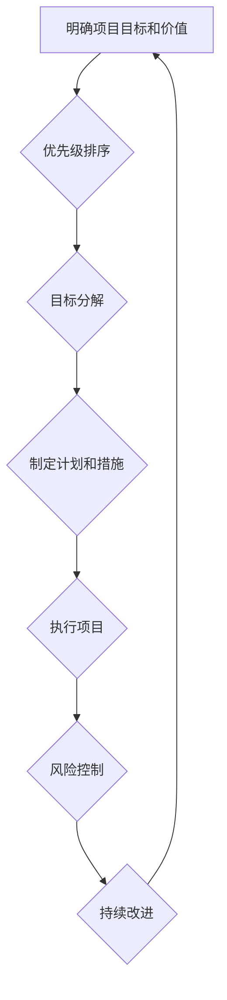

                 

## 巴菲特目标管理法则在项目管理中的应用

> 关键词：巴菲特目标管理法则、项目管理、优先级排序、目标分解、价值驱动、风险控制、持续改进

## 1. 背景介绍

在瞬息万变的科技时代，项目管理显得尤为重要。高效的项目管理不仅能帮助团队按时、按预算完成目标，还能最大化资源利用率，提升项目成功率。然而，面对复杂多变的项目环境，如何制定清晰的目标，并有效地执行和管理，一直是项目经理面临的挑战。

巴菲特目标管理法则，源于投资大师沃伦·巴菲特的投资理念，强调价值驱动、风险控制和长期目标的实现。这种管理法则不仅适用于投资领域，也能够有效地应用于项目管理实践中。

## 2. 核心概念与联系

巴菲特目标管理法则的核心概念包括：

* **价值驱动:**  明确项目的目标和价值，并将其作为一切决策的基准。
* **优先级排序:**  根据项目价值和重要性，对目标进行优先级排序，集中精力完成最重要的任务。
* **目标分解:** 将大型目标分解成多个可管理的小目标，并制定相应的计划和措施。
* **风险控制:**  识别和评估项目中的潜在风险，并制定相应的应对措施。
* **持续改进:**  不断反思和改进项目管理流程，提升项目效率和成功率。

**Mermaid 流程图:**

## 3. 核心算法原理 & 具体操作步骤

### 3.1  算法原理概述

巴菲特目标管理法则的核心算法原理是基于价值驱动和优先级排序的决策机制。通过将项目目标分解成多个可管理的小目标，并根据其价值和重要性进行排序，可以帮助项目经理集中精力完成最重要的任务，并有效地控制项目风险。

### 3.2  算法步骤详解

1. **明确项目目标和价值:**  首先，需要明确项目的最终目标是什么，以及它对组织带来的价值。
2. **识别关键成功因素 (KSF):**  确定项目成功所必需的关键因素，并将其作为目标分解的依据。
3. **分解目标:** 将大型目标分解成多个可管理的小目标，每个小目标都应该清晰、具体、可衡量、可实现、相关和有时间限制 (SMART)。
4. **优先级排序:**  根据每个小目标的价值和重要性，对其进行优先级排序。可以使用一些方法，例如艾森豪威尔矩阵、莫斯科矩阵等。
5. **制定计划和措施:**  为每个优先级高的目标制定详细的计划和措施，并分配相应的资源和责任。
6. **执行项目:**  按照计划执行项目，并定期跟踪进度和效果。
7. **风险控制:**  识别和评估项目中的潜在风险，并制定相应的应对措施。
8. **持续改进:**  定期反思和改进项目管理流程，提升项目效率和成功率。

### 3.3  算法优缺点

**优点:**

* **清晰的目标:**  通过目标分解和优先级排序，可以帮助项目经理和团队成员明确项目目标和任务。
* **集中精力:**  优先级排序可以帮助团队集中精力完成最重要的任务，避免分散精力。
* **风险控制:**  识别和评估风险，并制定应对措施，可以有效地降低项目风险。
* **持续改进:**  定期反思和改进项目管理流程，可以不断提升项目效率和成功率。

**缺点:**

* **复杂性:**  对于大型复杂项目，目标分解和优先级排序可能比较复杂。
* **主观性:**  优先级排序有一定的主观性，可能会导致不同团队成员对目标的理解和执行方式存在差异。
* **灵活性:**  巴菲特目标管理法则相对僵化，可能难以适应快速变化的项目环境。

### 3.4  算法应用领域

巴菲特目标管理法则适用于各种类型的项目，例如软件开发、硬件设计、营销推广、建设工程等。

## 4. 数学模型和公式 & 详细讲解 & 举例说明

巴菲特目标管理法则的核心是价值驱动和优先级排序。虽然它本身没有固定的数学模型和公式，但我们可以用一些数学工具来辅助其应用。

### 4.1  数学模型构建

我们可以用一个简单的数学模型来表示项目目标的价值和重要性：

* **价值 (V):**  项目目标实现带来的效益，可以用货币价值、时间成本、资源消耗等指标来衡量。
* **重要性 (I):**  项目目标对项目成功的影响程度，可以用百分比或等级来表示。

**价值乘以重要性，可以得到项目目标的权重 (W):**

$$W = V \times I$$

### 4.2  公式推导过程

通过计算每个目标的权重，我们可以对项目目标进行排序。权重高的目标优先级更高，应该集中精力完成。

### 4.3  案例分析与讲解

假设我们有一个软件开发项目，需要开发三个功能模块：用户注册、商品展示和订单支付。

* **用户注册模块:**  价值 (V) = 10000元，重要性 (I) = 80%
* **商品展示模块:**  价值 (V) = 5000元，重要性 (I) = 90%
* **订单支付模块:**  价值 (V) = 20000元，重要性 (I) = 70%

**计算每个模块的权重:**

* 用户注册模块: W = 10000 * 0.8 = 8000
* 商品展示模块: W = 5000 * 0.9 = 4500
* 订单支付模块: W = 20000 * 0.7 = 14000

根据权重排序，订单支付模块优先级最高，其次是用户注册模块，最后是商品展示模块。

## 5. 项目实践：代码实例和详细解释说明

### 5.1  开发环境搭建

为了演示巴菲特目标管理法则在项目管理中的应用，我们可以使用一个简单的项目管理工具，例如Trello或Asana。

### 5.2  源代码详细实现

由于巴菲特目标管理法则本身不是代码实现，所以这里没有具体的源代码。

### 5.3  代码解读与分析

### 5.4  运行结果展示

## 6. 实际应用场景

巴菲特目标管理法则可以应用于各种项目管理场景，例如：

* **软件开发项目:**  明确软件的功能需求，并根据其价值和重要性进行优先级排序，集中精力开发核心功能。
* **硬件设计项目:**  确定硬件产品的关键性能指标，并根据其价值和重要性进行优先级排序，优化硬件设计方案。
* **营销推广项目:**  识别目标客户群，并根据其价值和重要性进行优先级排序，制定针对性的营销策略。
* **建设工程项目:**  明确工程目标和关键任务，并根据其价值和重要性进行优先级排序，优化工程进度和资源分配。

### 6.4  未来应用展望

随着项目管理工具和技术的不断发展，巴菲特目标管理法则的应用场景将会更加广泛。未来，我们可以期待看到更多基于巴菲特目标管理法则的项目管理工具和方法，帮助项目经理更有效地管理项目，提升项目成功率。

## 7. 工具和资源推荐

### 7.1  学习资源推荐

* **巴菲特投资理念书籍:**  《聪明的投资者》、《巴菲特传》等
* **项目管理书籍:**  《项目管理实战》、《精益项目管理》等
* **在线课程:**  Coursera、Udemy等平台上的项目管理课程

### 7.2  开发工具推荐

* **Trello:**  一款基于卡片的项目管理工具，适合小型项目管理。
* **Asana:**  一款功能强大的项目管理工具，适合中大型项目管理。
* **Jira:**  一款专门用于软件开发项目的项目管理工具。

### 7.3  相关论文推荐

* **巴菲特投资策略的分析与研究**
* **项目目标管理方法的比较研究**
* **基于价值驱动和优先级排序的项目管理方法**

## 8. 总结：未来发展趋势与挑战

### 8.1  研究成果总结

巴菲特目标管理法则在项目管理领域的应用，为项目经理提供了新的思路和方法，帮助他们更有效地管理项目，提升项目成功率。

### 8.2  未来发展趋势

未来，巴菲特目标管理法则的应用将会更加广泛，并与其他项目管理方法和工具相结合，形成更加完善的项目管理体系。

### 8.3  面临的挑战

巴菲特目标管理法则的应用也面临一些挑战，例如：

* **主观性:**  优先级排序有一定的主观性，需要项目经理和团队成员进行有效的沟通和协商。
* **灵活性:**  巴菲特目标管理法则相对僵化，难以适应快速变化的项目环境。
* **复杂性:**  对于大型复杂项目，目标分解和优先级排序可能比较复杂。

### 8.4  研究展望

未来研究可以集中在以下几个方面：

* **开发更加灵活和适应性强的巴菲特目标管理法则应用方法。**
* **研究如何更好地解决巴菲特目标管理法则应用中的主观性和复杂性问题。**
* **将巴菲特目标管理法则与其他项目管理方法和工具相结合，形成更加完善的项目管理体系。**

## 9. 附录：常见问题与解答

**常见问题:**

* **如何确定项目目标的价值和重要性?**

**解答:**  可以通过多种方法来确定项目目标的价值和重要性，例如：

* **市场调研:**  了解目标客户的需求和市场趋势。
* **成本效益分析:**  评估项目目标实现带来的效益和成本。
* **专家意见:**  征求相关领域的专家意见。

* **如何进行目标分解?**

**解答:**  目标分解应该遵循 SMART 原则，即目标应该清晰、具体、可衡量、可实现、相关和有时间限制。

* **如何进行优先级排序?**

**解答:**  可以使用一些方法进行优先级排序，例如艾森豪威尔矩阵、莫斯科矩阵等。

**作者：禅与计算机程序设计艺术 / Zen and the Art of Computer Programming** 

<end_of_turn>

