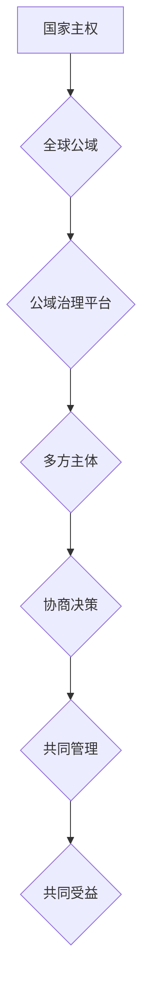

                 

## 2050年的全球治理：从国家主权到全球公域的治理模式创新

> 关键词：全球治理、国家主权、公域治理、人工智能、区块链、去中心化、数据共享、跨国合作

### 1. 背景介绍

21世纪初，全球化进程加速，科技发展日新月异，传统国家主权模式面临着前所未有的挑战。气候变化、跨国犯罪、网络安全、全球疫情等问题，都超越了国家边界，需要全球共同应对。同时，人工智能、区块链等新兴技术，为构建更加高效、透明、包容的全球治理模式提供了新的可能性。

2050年，世界将更加复杂、更加互联，国家主权将不再是绝对的，而是需要与全球治理模式相协调。全球公域治理模式将成为未来全球治理的重要组成部分，它强调共同拥有、共同管理、共同受益的理念，旨在解决全球性问题，促进人类共同发展。

### 2. 核心概念与联系

#### 2.1 国家主权与全球公域

**国家主权**是指国家在自身领土内拥有最高统治权，不受其他国家干涉的权利。这是现代国际体系的基础，也是国家独立自主的重要保障。

**全球公域**是指超越国家边界，属于所有人类共同拥有的公共资源和公共利益领域。例如，地球环境、互联网空间、知识产权等。

#### 2.2 公域治理模式

公域治理模式是指在全球公域领域内，由政府、企业、民间组织、个人等多方主体共同参与，协商决策、共同管理、共同受益的治理方式。

**核心架构：**



### 3. 核心算法原理 & 具体操作步骤

#### 3.1 算法原理概述

全球公域治理模式的实现需要依靠一系列先进的算法和技术，例如：

* **去中心化算法：** 确保治理决策更加公平、透明、不可篡改。
* **数据共享算法：** 促进数据流通，提高治理效率。
* **智能合约算法：** 自动执行治理规则，降低治理成本。

#### 3.2 算法步骤详解

1. **数据收集与分析：** 利用人工智能技术收集全球公域领域的各种数据，例如环境数据、社会数据、经济数据等，并进行分析，识别问题和趋势。
2. **利益相关者识别与参与：** 利用区块链技术建立一个去中心化的平台，识别和邀请所有利益相关者参与治理决策。
3. **决策制定与执行：** 利用智能合约技术，将治理规则转化为可执行的代码，并通过投票机制进行决策，确保决策的透明性和可追溯性。
4. **结果评估与改进：** 定期评估治理方案的效果，并根据评估结果进行改进，不断优化治理模式。

#### 3.3 算法优缺点

**优点：**

* **更加公平、透明、可信：** 去中心化算法和区块链技术可以确保治理决策更加公平、透明、不可篡改。
* **更加高效、灵活、响应性强：** 数据共享和智能合约可以提高治理效率，并使治理模式更加灵活、响应性强。
* **更加包容、合作、共赢：** 公域治理模式鼓励多方主体参与，促进合作共赢。

**缺点：**

* **技术复杂性：** 实现公域治理模式需要依赖先进的算法和技术，技术复杂性较高。
* **协调难度：** 多方主体参与治理，协调难度较大。
* **法律法规缺失：** 公域治理模式尚缺乏完善的法律法规保障。

#### 3.4 算法应用领域

* **环境治理：** 共同管理全球环境资源，应对气候变化。
* **知识产权保护：** 建立全球知识产权共享平台，促进创新发展。
* **跨国犯罪打击：** 共享犯罪信息，加强跨国合作，打击跨国犯罪。
* **全球公共卫生：** 共享疫情信息，加强全球合作，应对全球疫情。

### 4. 数学模型和公式 & 详细讲解 & 举例说明

#### 4.1 数学模型构建

我们可以用一个简单的数学模型来描述公域治理模式中的利益分配问题：

假设有N个利益相关者，每个利益相关者对公域资源的贡献度为Ci，对公域资源的收益期望为Ei。

则公域资源的分配方案可以表示为：

```latex
x_i = f(C_i, E_i)
```

其中，$x_i$表示第i个利益相关者获得的资源份额，$f$是一个分配函数，需要满足以下条件：

* **公平性：** 不同贡献度的利益相关者应该获得不同的资源份额。
* **效率性：** 资源分配方案应该最大化总体的利益。
* **稳定性：** 资源分配方案应该能够稳定地维持。

#### 4.2 公式推导过程

具体的分配函数可以根据不同的治理目标和利益相关者之间的关系进行设计。例如，我们可以使用以下公式来实现按贡献度分配资源：

```latex
x_i = \frac{C_i}{\sum_{j=1}^{N} C_j} * \sum_{j=1}^{N} E_j
```

这个公式将每个利益相关者的贡献度与总贡献度进行比对，然后根据总收益期望进行分配。

#### 4.3 案例分析与讲解

例如，在应对气候变化的全球治理中，我们可以使用这个模型来分配减排任务和资金。

* 每个国家根据其碳排放量和经济发展水平，计算其贡献度。
* 根据各国对减排行动的期望和对环境保护的重视程度，计算其收益期望。
* 利用上述公式，将减排任务和资金分配给各个国家。

### 5. 项目实践：代码实例和详细解释说明

#### 5.1 开发环境搭建

为了实现公域治理模式，我们需要搭建一个去中心化的平台，可以使用以下技术栈：

* **区块链平台：** Ethereum、Hyperledger Fabric等
* **智能合约语言：** Solidity、Go等
* **数据存储：** IPFS、Arweave等
* **前端框架：** React、Vue等

#### 5.2 源代码详细实现

以下是一个简单的智能合约代码示例，用于实现投票机制：

```solidity
pragma solidity ^0.8.0;

contract Voting {
    mapping(address => bool) public voters;
    address public winner;

    function vote(address candidate) public {
        require(!voters[msg.sender], "You have already voted.");
        voters[msg.sender] = true;
        // ... 投票逻辑 ...
    }

    function getWinner() public view returns (address) {
        // ... 获取投票结果 ...
        return winner;
    }
}
```

#### 5.3 代码解读与分析

* `mapping(address => bool) public voters;`：定义一个映射，用于记录已投票的用户地址。
* `address public winner;`：定义一个变量，用于存储投票结果的获胜者地址。
* `function vote(address candidate) public;`：定义一个投票函数，接受候选人地址作为参数。
* `function getWinner() public view returns (address);`：定义一个获取投票结果的函数。

#### 5.4 运行结果展示

通过部署智能合约到区块链网络，并进行投票操作，可以获取投票结果，并确定获胜者。

### 6. 实际应用场景

#### 6.1 环境治理

* 建立全球碳排放交易平台，利用区块链技术实现碳排放数据的透明记录和交易。
* 共享环境监测数据，促进跨国合作应对环境污染和气候变化。

#### 6.2 知识产权保护

* 建立全球知识产权共享平台，促进知识共享和创新发展。
* 利用区块链技术实现知识产权的数字化登记和保护。

#### 6.3 跨国犯罪打击

* 共享犯罪信息，加强跨国合作，打击跨国犯罪。
* 利用人工智能技术分析犯罪数据，预测犯罪趋势，预防犯罪发生。

#### 6.4 未来应用展望

随着人工智能、区块链等技术的不断发展，公域治理模式将应用于更多领域，例如：

* 全球公共卫生：共享疫情信息，加强全球合作，应对全球疫情。
* 国际金融：建立全球金融监管平台，促进金融稳定和发展。
* 国际贸易：建立全球贸易规则平台，促进公平贸易和经济发展。

### 7. 工具和资源推荐

#### 7.1 学习资源推荐

* **书籍：**
    * 《The Age of Surveillance Capitalism》 by Shoshana Zuboff
    * 《Blockchain Revolution》 by Don Tapscott and Alex Tapscott
    * 《Superintelligence》 by Nick Bostrom
* **在线课程：**
    * Coursera: Blockchain Specialization
    * edX: Artificial Intelligence
    * MIT OpenCourseWare: Introduction to Computer Science and Programming Using Python

#### 7.2 开发工具推荐

* **区块链开发平台：**
    * Ethereum
    * Hyperledger Fabric
    * Corda
* **智能合约开发工具：**
    * Remix
    * Truffle
    * Hardhat
* **数据存储工具：**
    * IPFS
    * Arweave

#### 7.3 相关论文推荐

* **去中心化治理：**
    * "Decentralized Governance: A Survey" by Vitalik Buterin
    * "The DAO: A Decentralized Autonomous Organization" by Slock.it
* **区块链技术：**
    * "Bitcoin: A Peer-to-Peer Electronic Cash System" by Satoshi Nakamoto
    * "A Secure Multi-Party Computation Protocol for Voting" by Ben Lynn
* **人工智能：**
    * "Deep Learning" by Ian Goodfellow, Yoshua Bengio, and Aaron Courville
    * "Attention Is All You Need" by Ashish Vaswani et al.

### 8. 总结：未来发展趋势与挑战

#### 8.1 研究成果总结

2050年，全球公域治理模式将成为全球治理的重要组成部分，它将推动全球合作，解决全球性问题，促进人类共同发展。

#### 8.2 未来发展趋势

* **技术创新：** 随着人工智能、区块链等技术的不断发展，公域治理模式将更加智能化、高效化、透明化。
* **治理体系完善：** 随着实践经验的积累，公域治理模式的治理体系将更加完善，更加适应全球治理的需要。
* **跨国合作加强：** 各国将加强跨国合作，共同构建全球公域治理体系。

#### 8.3 面临的挑战

* **技术难题：** 实现公域治理模式需要克服一系列技术难题，例如数据安全、隐私保护、算法公平性等。
* **制度障碍：** 公域治理模式需要突破传统的国家主权模式，需要建立新的法律法规和制度保障。
* **社会接受度：** 公域治理模式需要获得社会各界的广泛接受和支持。

#### 8.4 研究展望

未来，我们需要继续加强对公域治理模式的研究，探索其更有效的实现路径，并推动其在全球治理中的应用。

### 9. 附录：常见问题与解答

**1. 公域治理模式与国家主权的关系是什么？**

公域治理模式并不取代国家主权，而是与国家主权相协调。国家主权仍然是国际体系的基础，但公域治理模式为解决跨国问题提供了新的机制和工具。

**2. 公域治理模式的实现需要哪些技术支持？**

公域治理模式的实现需要人工智能、区块链、大数据等新兴技术的支持。

**3. 公域治理模式有哪些优势？**

公域治理模式更加公平、透明、高效、灵活、包容，能够促进全球合作，解决全球性问题。

**4. 公域治理模式有哪些挑战？**

公域治理模式面临的技术难题、制度障碍和社会接受度等挑战。

**5. 公域治理模式的未来发展趋势是什么？**

公域治理模式将更加智能化、高效化、透明化，并将在更多领域得到应用。


作者：禅与计算机程序设计艺术 / Zen and the Art of Computer Programming 
<end_of_turn>

