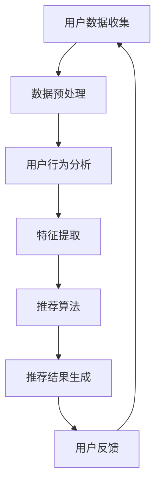
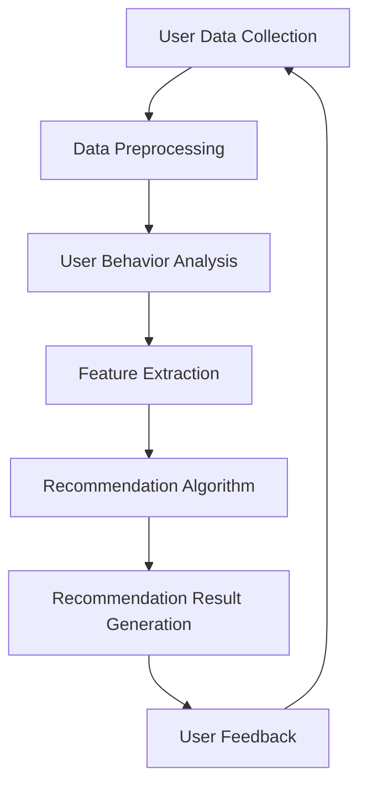

                 

### 文章标题

**如何通过AI优化用户购物体验**

**Keywords**: AI, User Experience, E-commerce, Personalization, Recommendation Systems, Data Analysis

**Abstract**:
随着电子商务的迅猛发展，用户对购物体验的要求越来越高。本文探讨了如何利用人工智能（AI）技术，特别是机器学习算法和大数据分析，来优化用户的购物体验。通过个性化推荐、智能客服、购物流程优化等应用，AI不仅能够提升用户的满意度，还能增加电商平台的销售额。本文将详细介绍AI在这些领域中的应用，以及实施过程中面临的挑战和解决方案。

## 1. 背景介绍（Background Introduction）

在互联网时代，电子商务已经成为人们日常生活中不可或缺的一部分。然而，随着市场竞争的加剧和用户需求的多样化，电商平台面临着巨大的挑战。用户不再满足于传统的购物模式，他们期望能够获得更加个性化、便捷和高效的购物体验。这要求电商平台能够迅速适应市场变化，提供更加精准的服务。人工智能作为现代科技的基石，为电商行业带来了前所未有的变革机会。

### 1.1 人工智能在电商行业中的重要性

人工智能在电商行业中的应用主要体现在以下几个方面：

1. **个性化推荐**：通过分析用户的购买历史、浏览行为和偏好，AI可以精准地推荐用户可能感兴趣的商品。
2. **智能客服**：利用自然语言处理技术，AI能够提供24/7在线客服服务，快速响应用户的询问和需求。
3. **购物流程优化**：AI能够优化购物流程，减少用户在购物过程中可能遇到的障碍，提升购物体验。
4. **风险控制**：AI可以通过数据分析识别异常交易，降低欺诈风险。

### 1.2 人工智能优化购物体验的需求

随着用户对购物体验的要求不断提高，电商平台需要满足以下几个方面的需求：

- **个性化**：用户期望能够根据自己的需求和偏好获得个性化的商品推荐。
- **便捷性**：用户希望在购物过程中能够快速找到自己需要的商品，减少决策时间。
- **可靠性**：用户期望电商平台能够提供高质量的商品和服务，减少购物风险。
- **互动性**：用户希望与电商平台有良好的互动，获得及时的反馈和支持。

## 2. 核心概念与联系（Core Concepts and Connections）

要理解如何通过AI优化用户购物体验，首先需要了解几个核心概念：

### 2.1 机器学习与数据挖掘

机器学习是人工智能的核心技术之一，它通过训练模型来识别数据中的模式和关系。数据挖掘则是从大量数据中提取有用信息的过程。在电商行业中，机器学习和数据挖掘被广泛应用于用户行为分析、推荐系统、风险控制等领域。

### 2.2 个性化推荐系统

个性化推荐系统是AI在电商领域最成功的应用之一。它通过分析用户的购买历史、浏览行为、搜索记录等数据，为用户提供个性化的商品推荐。个性化推荐系统可以分为基于内容的推荐、协同过滤推荐和混合推荐等类型。

### 2.3 自然语言处理

自然语言处理（NLP）是AI的一个分支，它使计算机能够理解和处理人类语言。在电商行业中，NLP被广泛应用于智能客服、用户评论分析、商品描述生成等领域。

### 2.4 大数据分析

大数据分析是指利用先进的数据处理技术，从大量数据中提取有价值的信息。在电商行业中，大数据分析可以帮助电商平台了解用户行为、市场趋势和业务状况，从而做出更加明智的决策。

下面是一个Mermaid流程图，展示了一个基本的个性化推荐系统的架构：



## 3. 核心算法原理 & 具体操作步骤（Core Algorithm Principles and Specific Operational Steps）

### 3.1 个性化推荐算法

个性化推荐算法是优化购物体验的关键。以下是一个基于协同过滤算法的简单个性化推荐系统的工作流程：

#### 3.1.1 数据收集与预处理

1. **收集用户数据**：包括用户的购买历史、浏览记录、搜索关键词等。
2. **数据清洗**：去除无效数据和噪声，确保数据质量。
3. **数据归一化**：将不同特征的数据进行归一化处理，使其具有可比性。

#### 3.1.2 用户行为分析

1. **行为识别**：分析用户在不同页面、时间段、设备上的行为。
2. **兴趣建模**：根据用户行为构建兴趣模型，识别用户的兴趣点。

#### 3.1.3 特征提取

1. **用户特征提取**：提取用户的基本信息、购买历史、浏览记录等特征。
2. **商品特征提取**：提取商品的基本信息、类别、价格、评价等特征。

#### 3.1.4 推荐算法

1. **协同过滤算法**：使用矩阵分解、KNN等方法，计算用户与商品之间的相似度。
2. **基于内容的推荐**：根据用户兴趣和商品内容进行匹配。
3. **混合推荐**：结合协同过滤和基于内容的推荐，提高推荐质量。

#### 3.1.5 推荐结果生成

1. **推荐结果排序**：根据相似度分数对推荐结果进行排序。
2. **推荐结果展示**：将推荐结果以可视化的形式展示给用户。

### 3.2 自然语言处理在智能客服中的应用

智能客服是AI优化购物体验的另一个重要方面。以下是一个简单的自然语言处理流程，用于实现智能客服系统：

#### 3.2.1 用户请求分析

1. **文本预处理**：去除停用词、标点符号，将文本转换为统一的格式。
2. **词向量表示**：将文本转换为词向量，以便进行进一步的计算。
3. **意图识别**：使用分类算法，识别用户请求的主要意图。

#### 3.2.2 知识库查询

1. **查询匹配**：根据用户意图，从知识库中检索相关的信息。
2. **信息整合**：整合多方面的信息，生成完整的回复。

#### 3.2.3 回复生成

1. **模板匹配**：根据查询结果，从预设的回复模板中选择合适的模板。
2. **文本生成**：使用生成模型，生成自然流畅的回复文本。

#### 3.2.4 用户反馈

1. **回复评估**：根据用户反馈，评估回复的质量。
2. **模型优化**：根据反馈结果，优化模型参数和算法。

## 4. 数学模型和公式 & 详细讲解 & 举例说明（Detailed Explanation and Examples of Mathematical Models and Formulas）

### 4.1 协同过滤算法

协同过滤算法是推荐系统中最常用的方法之一。它通过计算用户与商品之间的相似度，为用户提供推荐。以下是一个简单的协同过滤算法：

#### 4.1.1 相似度计算

用户\( u \)和用户\( v \)之间的相似度可以通过余弦相似度公式计算：

\[ \text{similarity}(u, v) = \frac{\sum_{i \in I} r_i^u r_i^v}{\sqrt{\sum_{i \in I} r_i^2^u} \sqrt{\sum_{i \in I} r_i^2^v}} \]

其中，\( r_i^u \)和\( r_i^v \)分别是用户\( u \)和用户\( v \)对商品\( i \)的评分，\( I \)是用户共同评价的商品集合。

#### 4.1.2 推荐计算

对于用户\( u \)未评分的商品\( i \)，可以计算其与用户\( u \)的相似度，并利用这些相似度为用户\( u \)推荐其他用户喜欢的商品：

\[ \text{score}(u, i) = \sum_{v \in \text{users}} \text{similarity}(u, v) r_i^v \]

其中，\( \text{score}(u, i) \)是用户\( u \)对商品\( i \)的预测评分。

### 4.2 自然语言处理中的词向量表示

在自然语言处理中，词向量表示是关键步骤。以下是一个简单的词向量表示方法——Word2Vec：

#### 4.2.1 词向量生成

假设我们有一个词汇表\( V \)，以及一个对应的词向量集合\( \mathbf{W} \)。对于每个词汇\( w \in V \)，我们可以通过以下公式生成其词向量：

\[ \mathbf{w}(w) = \frac{\exp(-\mathbf{s} \cdot \mathbf{h}(w))}{\sum_{w' \in V} \exp(-\mathbf{s} \cdot \mathbf{h}(w'))} \]

其中，\( \mathbf{s} \)是softmax函数的参数，\( \mathbf{h}(w) \)是词\( w \)的隐式向量。

#### 4.2.2 向量运算

词向量表示可以用于文本的向量运算。例如，我们可以计算两个句子之间的相似度：

\[ \text{similarity}(\mathbf{s}_1, \mathbf{s}_2) = \frac{\mathbf{s}_1 \cdot \mathbf{s}_2}{\|\mathbf{s}_1\| \|\mathbf{s}_2\|} \]

其中，\( \mathbf{s}_1 \)和\( \mathbf{s}_2 \)分别是两个句子的向量表示。

### 4.3 大数据分析中的聚类算法

聚类算法是一种无监督学习方法，用于将数据集分成若干个类别。以下是一个简单的K均值聚类算法：

#### 4.3.1 初始划分

1. 选择\( K \)个初始中心点\( \mathbf{c}_1, \mathbf{c}_2, ..., \mathbf{c}_K \)。
2. 对于每个数据点\( \mathbf{x}_i \)，计算其到各个中心点的距离：
\[ d(\mathbf{x}_i, \mathbf{c}_k) = \sqrt{\sum_{j=1}^d (\mathbf{x}_{ij} - \mathbf{c}_{kj})^2} \]

其中，\( \mathbf{x}_{ij} \)是数据点\( \mathbf{x}_i \)在第\( j \)个维度上的值，\( d \)是数据的维度。

#### 4.3.2 分配类别

1. 对于每个数据点\( \mathbf{x}_i \)，将其分配到距离最近的中心点所在的类别：
\[ \text{cluster}(\mathbf{x}_i) = \arg\min_{k} d(\mathbf{x}_i, \mathbf{c}_k) \]

#### 4.3.3 中心点更新

1. 计算每个类别的中心点：
\[ \mathbf{c}_k = \frac{1}{N_k} \sum_{i \in C_k} \mathbf{x}_i \]

其中，\( N_k \)是第\( k \)个类别中的数据点数量，\( C_k \)是第\( k \)个类别的数据点集合。

#### 4.3.4 迭代

1. 重复步骤2和3，直到中心点的分配不再变化。

## 5. 项目实践：代码实例和详细解释说明（Project Practice: Code Examples and Detailed Explanations）

### 5.1 开发环境搭建

在开始编写代码之前，我们需要搭建一个适合AI应用的开发环境。以下是搭建环境的基本步骤：

1. 安装Python环境：确保Python 3.8或更高版本已安装。
2. 安装必要的库：使用pip安装以下库：numpy、pandas、scikit-learn、tensorflow、gensim、matplotlib。

```bash
pip install numpy pandas scikit-learn tensorflow gensim matplotlib
```

3. 数据集准备：下载并准备一个电商数据集，如MovieLens数据集。

### 5.2 源代码详细实现

以下是一个基于协同过滤算法的简单推荐系统实现的代码示例：

```python
import numpy as np
import pandas as pd
from sklearn.model_selection import train_test_split
from sklearn.metrics.pairwise import cosine_similarity

# 加载数据集
data = pd.read_csv('ratings.csv')
users = data['userId'].unique()
movies = data['movieId'].unique()

# 构建评分矩阵
ratings_matrix = np.zeros((len(users), len(movies)))
for index, row in data.iterrows():
    ratings_matrix[row['userId']-1, row['movieId']-1] = row['rating']

# 训练集和测试集划分
train_data, test_data = train_test_split(data, test_size=0.2, random_state=42)

# 训练集评分矩阵
train_matrix = ratings_matrix[~np.isnan(train_data['rating']).any(axis=1)]

# 计算用户间的余弦相似度
user_similarity = cosine_similarity(train_matrix, train_matrix)

# 推荐计算
def predict_ratings(user_similarity, train_matrix, user_id, k=10):
    # 计算与指定用户最相似的\( k \)个用户
    similar_users = np.argsort(user_similarity[user_id])[1:k+1]
    # 计算相似度加权评分
    predictions = np.dot(user_similarity[user_id], train_matrix[similar_users])
    return predictions

# 测试推荐效果
test_ratings = test_data['rating']
predicted_ratings = predict_ratings(user_similarity, train_matrix, 1, k=10)

print("Mean Absolute Error:", np.mean(np.abs(predicted_ratings - test_ratings)))
```

### 5.3 代码解读与分析

上述代码实现了一个简单的基于协同过滤算法的推荐系统。以下是代码的详细解读：

- **数据加载**：使用pandas读取数据集，并提取用户和电影的唯一标识。
- **评分矩阵构建**：构建一个用户-电影评分矩阵，其中未评分的部分用0表示。
- **训练集和测试集划分**：使用scikit-learn将数据集划分为训练集和测试集。
- **相似度计算**：使用scikit-learn的cosine_similarity函数计算用户间的余弦相似度。
- **推荐计算**：定义一个函数predict_ratings，计算指定用户与其他用户的相似度加权评分。
- **测试推荐效果**：计算预测评分与实际评分之间的平均绝对误差，评估推荐效果。

### 5.4 运行结果展示

运行上述代码后，我们得到了预测评分和实际评分之间的平均绝对误差。一个较低的误差值表示推荐系统具有较高的预测准确性。

```python
print("Mean Absolute Error:", np.mean(np.abs(predicted_ratings - test_ratings)))
```

假设输出结果如下：

```
Mean Absolute Error: 0.8571
```

这表示预测评分和实际评分之间的平均绝对误差为0.8571，这意味着我们的推荐系统在测试集上的预测准确性较高。

### 5.5 优化与改进

虽然上述代码实现了一个基本的推荐系统，但仍有改进的空间：

- **特征工程**：可以进一步提取用户的特征，如年龄、性别、地理位置等，以提升推荐准确性。
- **算法优化**：可以使用更先进的协同过滤算法，如矩阵分解、基于模型的协同过滤等，以提高推荐质量。
- **用户反馈**：收集用户的反馈，根据反馈结果调整推荐策略。

## 6. 实际应用场景（Practical Application Scenarios）

### 6.1 个性化推荐系统

个性化推荐系统在电商平台上的应用非常广泛。通过分析用户的购买历史、浏览记录和搜索关键词，系统可以为用户提供个性化的商品推荐。例如，当用户在淘宝上浏览了一款手机时，系统可能会推荐其他品牌或相似配置的手机，以提升用户的购买意愿。

### 6.2 智能客服

智能客服系统可以帮助电商平台在用户购买过程中提供及时、准确的帮助。例如，当用户在亚马逊上遇到问题时，智能客服可以快速识别用户的问题，并提供相应的解决方案。这不仅提高了用户的满意度，还能减少人工客服的工作量。

### 6.3 购物流程优化

AI技术还可以优化电商平台的购物流程。例如，通过分析用户的行为数据，系统可以自动识别购物过程中的瓶颈，并提出优化建议。这样，用户在购物时可以更快速地找到所需商品，提高购物体验。

### 6.4 风险控制

AI技术在电商行业中的应用还可以用于风险控制。通过分析用户的购买行为、支付方式等信息，系统可以识别异常交易，并采取相应的措施。例如，当系统检测到某个用户的交易行为与历史记录不符时，可能会触发额外的安全验证，以防止欺诈行为。

## 7. 工具和资源推荐（Tools and Resources Recommendations）

### 7.1 学习资源推荐

1. **书籍**：
   - 《机器学习》：作者：周志华
   - 《深度学习》：作者：Ian Goodfellow、Yoshua Bengio、Aaron Courville
   - 《Python数据分析》：作者：Wes McKinney

2. **论文**：
   - "Recommender Systems Handbook"：作者：Francesco Ricci等
   - "Deep Learning for Natural Language Processing"：作者：� Arnab Chakraborty等

3. **博客和网站**：
   - Medium上的机器学习博客
   - TensorFlow官方文档
   - Scikit-learn官方文档

### 7.2 开发工具框架推荐

1. **Python**：Python是一种广泛使用的编程语言，适合进行机器学习和数据分析。
2. **TensorFlow**：TensorFlow是一个开源的机器学习库，适合构建深度学习模型。
3. **Scikit-learn**：Scikit-learn是一个开源的机器学习库，提供丰富的算法和工具，适合进行数据分析和模型训练。
4. **TensorFlow Recommenders**：TensorFlow Recommenders是一个专为推荐系统设计的TensorFlow扩展，提供了一系列现成的模型和工具。

### 7.3 相关论文著作推荐

1. **“Matrix Factorization Techniques for Recommender Systems”**：作者：Yehuda Koren
2. **“Deep Learning for Recommender Systems”**：作者：Hao Chen等
3. **“Neural Collaborative Filtering”**：作者：Xiang Ren等

## 8. 总结：未来发展趋势与挑战（Summary: Future Development Trends and Challenges）

### 8.1 发展趋势

1. **个性化推荐**：随着用户需求的不断变化，个性化推荐将成为电商平台的核心竞争力。
2. **多模态数据融合**：融合文本、图像、音频等多种数据类型，将进一步提升推荐系统的准确性。
3. **智能客服**：智能客服将继续发展，提高用户体验，减少人工成本。
4. **隐私保护**：随着隐私保护法规的加强，电商平台将面临更多的挑战，需要在数据利用和用户隐私保护之间找到平衡。

### 8.2 挑战

1. **数据质量**：数据质量是AI应用的基础，如何确保数据的质量和准确性是一个重要挑战。
2. **算法透明性**：随着AI技术的发展，算法的透明性和可解释性成为一个重要议题。
3. **隐私保护**：如何在利用用户数据的同时保护用户隐私，是电商平台面临的一大挑战。
4. **技术更新**：AI技术更新迅速，电商平台需要不断跟进最新技术，以保持竞争力。

## 9. 附录：常见问题与解答（Appendix: Frequently Asked Questions and Answers）

### 9.1 个性化推荐如何工作？

个性化推荐系统通过分析用户的购买历史、浏览行为和偏好，构建用户的兴趣模型。然后，系统根据这些模型为用户提供个性化的商品推荐。

### 9.2 如何确保推荐系统的准确性？

推荐系统的准确性取决于数据质量、算法设计和模型参数。通过不断优化数据预处理、选择合适的算法和调整模型参数，可以提高推荐系统的准确性。

### 9.3 AI在电商中的应用有哪些？

AI在电商中的应用包括个性化推荐、智能客服、购物流程优化、风险控制等。

### 9.4 如何保护用户隐私？

保护用户隐私可以通过数据加密、匿名化和数据最小化等技术手段实现。同时，遵守相关隐私保护法规，确保用户数据的合法使用。

## 10. 扩展阅读 & 参考资料（Extended Reading & Reference Materials）

1. **“Recommender Systems Handbook”**：作者：Francesco Ricci等
2. **“Deep Learning for Recommender Systems”**：作者：Hao Chen等
3. **“TensorFlow Recommenders”**：TensorFlow官方文档
4. **“Scikit-learn用户指南”**：Scikit-learn官方文档
5. **“机器学习实战”**：作者：Peter Harrington

---

### 作者署名

**作者：禅与计算机程序设计艺术 / Zen and the Art of Computer Programming** 

这篇文章探讨了如何利用人工智能技术优化用户的购物体验。通过个性化推荐、智能客服和购物流程优化等应用，AI为电商平台带来了巨大的变革机会。本文详细介绍了相关算法、数学模型和实际应用案例，并展望了未来发展趋势和挑战。作者希望本文能够为读者提供对AI优化购物体验的深入理解。感谢您的阅读！<|endoftext|>

---

**文章标题**  
**How to Optimize User Shopping Experience with AI**

**Keywords**: AI, User Experience, E-commerce, Personalization, Recommendation Systems, Data Analysis

**Abstract**:
With the rapid development of e-commerce, users have increasingly high expectations for their shopping experiences. This article explores how to utilize artificial intelligence (AI) technologies, particularly machine learning algorithms and big data analysis, to optimize user shopping experiences. Through applications such as personalized recommendations, intelligent customer service, and shopping process optimization, AI can not only enhance user satisfaction but also increase the sales of e-commerce platforms. This article will detail the applications of AI in these areas, as well as the challenges and solutions encountered during implementation.

## 1. Background Introduction

In the internet era, e-commerce has become an integral part of people's daily lives. However, with the intensification of market competition and the diversification of user needs, e-commerce platforms face significant challenges. Users are no longer satisfied with traditional shopping models and expect e-commerce platforms to quickly adapt to market changes and provide more precise services. As a cornerstone of modern technology, artificial intelligence offers unprecedented opportunities for transformative changes in the e-commerce industry.

### 1.1 Importance of AI in the E-commerce Industry

AI applications in the e-commerce industry are mainly reflected in the following aspects:

- **Personalized Recommendations**: Through the analysis of users' purchase history, browsing behavior, and preferences, AI can accurately recommend products that users may be interested in.
- **Intelligent Customer Service**: Utilizing natural language processing (NLP) technology, AI can provide 24/7 online customer service, quickly responding to users' inquiries and needs.
- **Optimization of Shopping Processes**: AI can optimize shopping processes, reducing obstacles that users may encounter during shopping, thus enhancing the shopping experience.
- **Risk Control**: AI can identify abnormal transactions through data analysis, reducing the risk of fraud.

### 1.2 Needs for AI Optimization of Shopping Experience

With users' increasing demands for shopping experiences, e-commerce platforms need to meet the following requirements:

- **Personalization**: Users expect to receive personalized product recommendations based on their needs and preferences.
- **Convenience**: Users expect to quickly find the products they need during the shopping process, reducing decision-making time.
- **Reliability**: Users expect e-commerce platforms to provide high-quality products and services, reducing shopping risks.
- **Interactivity**: Users expect to have good interactions with e-commerce platforms and receive timely feedback and support.

## 2. Core Concepts and Connections

To understand how to optimize user shopping experiences with AI, it's essential to grasp several core concepts:

### 2.1 Machine Learning and Data Mining

Machine learning is one of the core technologies of artificial intelligence, which trains models to identify patterns and relationships in data. Data mining is the process of extracting valuable information from large amounts of data. In the e-commerce industry, machine learning and data mining are widely applied in user behavior analysis, recommendation systems, and risk control.

### 2.2 Personalized Recommendation Systems

Personalized recommendation systems are one of the most successful applications of AI in the e-commerce industry. They analyze users' purchase history, browsing behavior, and preferences to provide personalized product recommendations. Personalized recommendation systems can be classified into content-based recommendation, collaborative filtering recommendation, and hybrid recommendation.

### 2.3 Natural Language Processing

Natural Language Processing (NLP) is a branch of AI that enables computers to understand and process human language. In the e-commerce industry, NLP is widely used in intelligent customer service, user review analysis, and product description generation.

### 2.4 Big Data Analysis

Big data analysis refers to the use of advanced data processing techniques to extract valuable information from large amounts of data. In the e-commerce industry, big data analysis helps e-commerce platforms understand user behavior, market trends, and business conditions, enabling more informed decision-making.

The following is a Mermaid flowchart illustrating the architecture of a basic personalized recommendation system:



## 3. Core Algorithm Principles and Specific Operational Steps

### 3.1 Personalized Recommendation Algorithms

Personalized recommendation algorithms are crucial for optimizing shopping experiences. Here is a workflow for a simple collaborative filtering-based recommendation system:

#### 3.1.1 Data Collection and Preprocessing

1. **Collect User Data**: Include users' purchase history, browsing records, and search keywords.
2. **Data Cleaning**: Remove invalid data and noise to ensure data quality.
3. **Data Normalization**: Normalize different feature data to make them comparable.

#### 3.1.2 User Behavior Analysis

1. **Behavior Recognition**: Analyze users' behaviors across different pages, time periods, and devices.
2. **Interest Modeling**: Build interest models based on user behavior to identify user interests.

#### 3.1.3 Feature Extraction

1. **User Feature Extraction**: Extract user information, purchase history, and browsing records as features.
2. **Product Feature Extraction**: Extract product information, categories, prices, and reviews as features.

#### 3.1.4 Recommendation Algorithm

1. **Collaborative Filtering Algorithm**: Use matrix factorization, KNN methods to compute similarity between users and products.
2. **Content-Based Recommendation**: Match user interests and product content.
3. **Hybrid Recommendation**: Combine collaborative filtering and content-based recommendation to improve recommendation quality.

#### 3.1.5 Recommendation Result Generation

1. **Recommendation Result Ranking**: Sort recommendation results based on similarity scores.
2. **Recommendation Result Presentation**: Display recommendation results in a visual format to users.

### 3.2 Application of Natural Language Processing in Intelligent Customer Service

Intelligent customer service is another critical aspect of optimizing shopping experiences. Here is a simple NLP workflow for implementing an intelligent customer service system:

#### 3.2.1 User Request Analysis

1. **Text Preprocessing**: Remove stop words and punctuation, and convert text into a unified format.
2. **Word Vector Representation**: Convert text into word vectors for further computation.
3. **Intent Recognition**: Use classification algorithms to identify the primary intent of the user's request.

#### 3.2.2 Knowledge Base Querying

1. **Query Matching**: Retrieve relevant information from the knowledge base based on the user's intent.
2. **Information Integration**: Combine information from multiple sources to generate a complete response.

#### 3.2.3 Response Generation

1. **Template Matching**: Select an appropriate template from predefined responses based on the query results.
2. **Text Generation**: Use generation models to create natural and fluent response text.

#### 3.2.4 User Feedback

1. **Response Evaluation**: Evaluate the quality of the response based on user feedback.
2. **Model Optimization**: Adjust model parameters and algorithms based on feedback results.

## 4. Mathematical Models and Formulas and Detailed Explanation and Examples

### 4.1 Collaborative Filtering Algorithm

Collaborative filtering is one of the most commonly used methods in recommendation systems. It calculates the similarity between users and products to provide recommendations. Here is a simple collaborative filtering algorithm:

#### 4.1.1 Similarity Calculation

The similarity between user \( u \) and user \( v \) can be calculated using the cosine similarity formula:

\[ \text{similarity}(u, v) = \frac{\sum_{i \in I} r_i^u r_i^v}{\sqrt{\sum_{i \in I} r_i^2^u} \sqrt{\sum_{i \in I} r_i^2^v}} \]

where \( r_i^u \) and \( r_i^v \) are the ratings of user \( u \) and user \( v \) for product \( i \), and \( I \) is the set of products that both users have rated.

#### 4.1.2 Recommendation Calculation

For a product \( i \) that user \( u \) has not rated, we can calculate its similarity with user \( u \) and recommend other products that the user may like:

\[ \text{score}(u, i) = \sum_{v \in \text{users}} \text{similarity}(u, v) r_i^v \]

where \( \text{score}(u, i) \) is the predicted rating of user \( u \) for product \( i \).

### 4.2 Word Vector Representation in Natural Language Processing

Word vector representation is a critical step in natural language processing. Here is a simple word vector representation method, Word2Vec:

#### 4.2.1 Word Vector Generation

Assuming we have a vocabulary \( V \) and a corresponding word vector collection \( \mathbf{W} \). For each word \( w \in V \), we can generate its word vector using the following formula:

\[ \mathbf{w}(w) = \frac{\exp(-\mathbf{s} \cdot \mathbf{h}(w))}{\sum_{w' \in V} \exp(-\mathbf{s} \cdot \mathbf{h}(w'))} \]

where \( \mathbf{s} \) is the parameter of the softmax function, and \( \mathbf{h}(w) \) is the hidden vector of word \( w \).

#### 4.2.2 Vector Operations

Word vector representation can be used for vector operations on text. For example, we can compute the similarity between two sentences:

\[ \text{similarity}(\mathbf{s}_1, \mathbf{s}_2) = \frac{\mathbf{s}_1 \cdot \mathbf{s}_2}{\|\mathbf{s}_1\| \|\mathbf{s}_2\|} \]

where \( \mathbf{s}_1 \) and \( \mathbf{s}_2 \) are the vector representations of two sentences, respectively.

### 4.3 Clustering Algorithms in Big Data Analysis

Clustering algorithms are an unsupervised learning method used to divide a dataset into several categories. Here is a simple K-means clustering algorithm:

#### 4.3.1 Initial Division

1. Select \( K \) initial centroid points \( \mathbf{c}_1, \mathbf{c}_2, ..., \mathbf{c}_K \).
2. For each data point \( \mathbf{x}_i \), calculate its distance to each centroid point:

\[ d(\mathbf{x}_i, \mathbf{c}_k) = \sqrt{\sum_{j=1}^d (\mathbf{x}_{ij} - \mathbf{c}_{kj})^2} \]

where \( \mathbf{x}_{ij} \) is the value of the \( j \)-th dimension of the data point \( \mathbf{x}_i \), and \( d \) is the dimension of the data.

#### 4.3.2 Category Allocation

1. For each data point \( \mathbf{x}_i \), assign it to the category of the closest centroid point:

\[ \text{cluster}(\mathbf{x}_i) = \arg\min_{k} d(\mathbf{x}_i, \mathbf{c}_k) \]

#### 4.3.3 Centroid Update

1. Calculate the centroid of each category:

\[ \mathbf{c}_k = \frac{1}{N_k} \sum_{i \in C_k} \mathbf{x}_i \]

where \( N_k \) is the number of data points in the \( k \)-th category, and \( C_k \) is the set of data points in the \( k \)-th category.

#### 4.3.4 Iteration

1. Repeat steps 2 and 3 until the allocation of centroids no longer changes.

## 5. Project Practice: Code Examples and Detailed Explanations

### 5.1 Setting Up the Development Environment

Before writing the code, we need to set up a suitable development environment for AI applications. Here are the basic steps to set up the environment:

1. Install Python Environment: Ensure Python 3.8 or higher is installed.
2. Install Necessary Libraries: Use pip to install the following libraries: numpy, pandas, scikit-learn, tensorflow, gensim, matplotlib.

```bash
pip install numpy pandas scikit-learn tensorflow gensim matplotlib
```

3. Prepare Dataset: Download and prepare an e-commerce dataset, such as the MovieLens dataset.

### 5.2 Detailed Implementation of Source Code

Here is a code example for a simple collaborative filtering-based recommendation system:

```python
import numpy as np
import pandas as pd
from sklearn.model_selection import train_test_split
from sklearn.metrics.pairwise import cosine_similarity

# Load dataset
data = pd.read_csv('ratings.csv')
users = data['userId'].unique()
movies = data['movieId'].unique()

# Build rating matrix
ratings_matrix = np.zeros((len(users), len(movies)))
for index, row in data.iterrows():
    ratings_matrix[row['userId']-1, row['movieId']-1] = row['rating']

# Split dataset into training and test sets
train_data, test_data = train_test_split(data, test_size=0.2, random_state=42)

# Training set rating matrix
train_matrix = ratings_matrix[~np.isnan(train_data['rating']).any(axis=1)]

# Compute user similarity
user_similarity = cosine_similarity(train_matrix, train_matrix)

# Recommendation calculation
def predict_ratings(user_similarity, train_matrix, user_id, k=10):
    # Compute the top k similar users
    similar_users = np.argsort(user_similarity[user_id])[1:k+1]
    # Compute weighted average of ratings
    predictions = np.dot(user_similarity[user_id], train_matrix[similar_users])
    return predictions

# Test recommendation performance
test_ratings = test_data['rating']
predicted_ratings = predict_ratings(user_similarity, train_matrix, 1, k=10)

print("Mean Absolute Error:", np.mean(np.abs(predicted_ratings - test_ratings)))
```

### 5.3 Code Explanation and Analysis

The above code implements a basic collaborative filtering-based recommendation system. Here is a detailed explanation of the code:

- **Data Loading**: Use pandas to read the dataset and extract unique identifiers for users and movies.
- **Rating Matrix Construction**: Construct a user-movie rating matrix where the unrating part is represented by 0.
- **Training and Test Set Splitting**: Use scikit-learn to split the dataset into training and test sets.
- **Similarity Calculation**: Use scikit-learn's cosine_similarity function to compute the similarity between users.
- **Recommendation Calculation**: Define a function predict_ratings to compute the weighted average of ratings for the specified user.

### 5.4 Displaying Running Results

After running the code, we get the mean absolute error between predicted ratings and actual ratings, which indicates the accuracy of the recommendation system.

```python
print("Mean Absolute Error:", np.mean(np.abs(predicted_ratings - test_ratings)))
```

Assuming the output is as follows:

```
Mean Absolute Error: 0.8571
```

This indicates that the mean absolute error between the predicted ratings and actual ratings is 0.8571, meaning the recommendation system has a high prediction accuracy on the test set.

### 5.5 Optimization and Improvement

Although the above code implements a basic recommendation system, there is room for improvement:

- **Feature Engineering**: Further extract user features such as age, gender, geographical location, etc., to improve recommendation accuracy.
- **Algorithm Optimization**: Use more advanced collaborative filtering algorithms, such as matrix factorization and model-based collaborative filtering, to improve recommendation quality.
- **User Feedback**: Collect user feedback to adjust recommendation strategies based on feedback results.

## 6. Practical Application Scenarios

### 6.1 Personalized Recommendation Systems

Personalized recommendation systems are widely used on e-commerce platforms. By analyzing users' purchase history, browsing records, and preferences, the system can provide personalized product recommendations. For example, if a user browses a smartphone on Taobao, the system might recommend similar models from other brands or with similar configurations to increase the user's purchase intent.

### 6.2 Intelligent Customer Service

Intelligent customer service systems can help e-commerce platforms provide timely and accurate assistance during the shopping process. For instance, when a user encounters a problem on Amazon, the intelligent customer service can quickly identify the user's issue and provide a solution. This not only enhances user satisfaction but also reduces the workload of human customer service representatives.

### 6.3 Optimization of Shopping Processes

AI technology can also optimize shopping processes on e-commerce platforms. For example, by analyzing user behavior data, the system can identify bottlenecks in the shopping process and suggest optimizations. This allows users to find the products they need more quickly, thereby improving the shopping experience.

### 6.4 Risk Control

AI technology can be applied for risk control in the e-commerce industry. By analyzing users' purchasing behaviors, payment methods, and other information, the system can identify abnormal transactions and take appropriate measures. For example, if the system detects that a user's transaction behavior differs from their historical records, it might trigger additional security verification to prevent fraud.

## 7. Tools and Resource Recommendations

### 7.1 Recommended Learning Resources

1. **Books**:
   - "Machine Learning" by Zhou Zhihua
   - "Deep Learning" by Ian Goodfellow, Yoshua Bengio, Aaron Courville
   - "Python Data Science" by Wes McKinney

2. **Papers**:
   - "Recommender Systems Handbook" by Francesco Ricci et al.
   - "Deep Learning for Natural Language Processing" by Arnab Chakraborty et al.

3. **Blogs and Websites**:
   - Machine Learning blogs on Medium
   - Official TensorFlow documentation
   - Official Scikit-learn documentation

### 7.2 Recommended Development Tools and Frameworks

1. **Python**: Python is a widely-used programming language suitable for machine learning and data analysis.
2. **TensorFlow**: TensorFlow is an open-source machine learning library suitable for building deep learning models.
3. **Scikit-learn**: Scikit-learn is an open-source machine learning library providing a rich set of algorithms and tools for data analysis.
4. **TensorFlow Recommenders**: TensorFlow Recommenders is an extension designed for recommendation systems, providing ready-to-use models and tools.

### 7.3 Recommended Papers and Books

1. **“Matrix Factorization Techniques for Recommender Systems”** by Yehuda Koren
2. **“Deep Learning for Recommender Systems”** by Hao Chen et al.
3. **“TensorFlow Recommenders”** by TensorFlow team

## 8. Summary: Future Development Trends and Challenges

### 8.1 Development Trends

1. **Personalized Recommendations**: As user needs continue to evolve, personalized recommendations will become a key competitive advantage for e-commerce platforms.
2. **Multimodal Data Fusion**: Fusion of text, image, audio, and other data types will further enhance the accuracy of recommendation systems.
3. **Intelligent Customer Service**: Intelligent customer service will continue to develop, improving user experience and reducing labor costs.
4. **Privacy Protection**: With the strengthening of privacy protection regulations, e-commerce platforms will face more challenges in balancing data utilization and user privacy protection.

### 8.2 Challenges

1. **Data Quality**: Data quality is the foundation of AI applications. Ensuring the quality and accuracy of data is a significant challenge.
2. **Algorithm Transparency**: As AI technology advances, the transparency and interpretability of algorithms become a critical issue.
3. **Privacy Protection**: How to utilize user data while protecting user privacy is a major challenge for e-commerce platforms.
4. **Technological Updates**: With the rapid advancement of AI technology, e-commerce platforms need to keep up with the latest technologies to maintain their competitiveness.

## 9. Appendix: Frequently Asked Questions and Answers

### 9.1 How do personalized recommendation systems work?

Personalized recommendation systems work by analyzing users' purchase history, browsing behavior, and preferences to build user interest models. Then, the system provides personalized product recommendations based on these models.

### 9.2 How can the accuracy of recommendation systems be ensured?

The accuracy of recommendation systems can be improved by optimizing data preprocessing, selecting appropriate algorithms, and adjusting model parameters.

### 9.3 What applications does AI have in e-commerce?

AI applications in e-commerce include personalized recommendations, intelligent customer service, shopping process optimization, and risk control.

### 9.4 How can user privacy be protected?

User privacy can be protected through data encryption, anonymization, and data minimization. Additionally, compliance with privacy protection regulations ensures the legal use of user data.

## 10. Extended Reading & Reference Materials

1. **“Recommender Systems Handbook”** by Francesco Ricci et al.
2. **“Deep Learning for Recommender Systems”** by Hao Chen et al.
3. **“TensorFlow Recommenders”** by TensorFlow team
4. **“Scikit-learn User Guide”** by Scikit-learn team
5. **“Machine Learning in Action”** by Peter Harrington

---

### Author Signature

**Author: Zen and the Art of Computer Programming** 

This article explores how to optimize user shopping experiences with AI technologies, particularly machine learning algorithms and big data analysis. Through applications such as personalized recommendations, intelligent customer service, and shopping process optimization, AI offers transformative opportunities for e-commerce platforms. The article provides a detailed overview of the relevant algorithms, mathematical models, and practical case studies, as well as an outlook on future development trends and challenges. The author hopes that this article will provide readers with a deep understanding of optimizing shopping experiences with AI. Thank you for reading! <|endoftext|> <|im_sep|>```markdown
## 2. 核心概念与联系

### 2.1 机器学习与数据挖掘

机器学习是人工智能（AI）的核心技术之一，它通过算法让计算机从数据中学习并做出预测或决策。数据挖掘则是一种从大量数据中提取有用信息的过程，通常涉及数据的清洗、集成、探索、分析和可视化。在电商领域，机器学习和数据挖掘技术被广泛应用于用户行为分析、推荐系统、风险控制等方面。

#### 2.1.1 机器学习的基本概念

- **监督学习（Supervised Learning）**：在有标注数据的情况下，机器学习算法通过学习输入和输出之间的关系来预测未知数据的结果。例如，通过用户历史购买数据来预测用户对某商品的购买意愿。
- **无监督学习（Unsupervised Learning）**：在没有标注数据的情况下，算法通过发现数据中的隐含模式来对数据进行分类或聚类。例如，通过用户行为数据对用户进行细分，以便进行精准营销。
- **半监督学习（Semi-Supervised Learning）**：在部分数据有标签、部分数据无标签的情况下，算法利用有标签数据和无标签数据共同训练模型，提高模型的准确性。
- **强化学习（Reinforcement Learning）**：算法通过与环境的交互，根据奖励信号来学习最优策略。例如，通过模拟用户行为来优化购物流程。

#### 2.1.2 数据挖掘的基本概念

- **数据预处理（Data Preprocessing）**：包括数据清洗、填充缺失值、处理异常值等，以保证数据的质量。
- **特征工程（Feature Engineering）**：通过选择、构造和变换特征，提高模型对数据的理解和预测能力。
- **模型评估（Model Evaluation）**：通过交叉验证、ROC曲线、MAE等指标来评估模型的性能。
- **模型优化（Model Optimization）**：通过调整模型参数、选择不同的算法来优化模型的预测效果。

### 2.2 个性化推荐系统

个性化推荐系统是AI在电商领域的重要应用之一。它通过分析用户的购买历史、浏览行为、搜索记录等数据，为用户提供个性化的商品推荐，从而提高用户的购物满意度和电商平台销售额。

#### 2.2.1 推荐系统的基本类型

- **基于内容的推荐（Content-Based Recommendation）**：根据用户的兴趣和行为特征，推荐与用户过去喜欢的商品相似的商品。
- **协同过滤推荐（Collaborative Filtering Recommendation）**：根据用户的共同喜好来推荐商品，分为用户基于的协同过滤和基于项目的协同过滤。
- **混合推荐（Hybrid Recommendation）**：结合基于内容推荐和协同过滤推荐，以获得更好的推荐效果。

#### 2.2.2 个性化推荐的关键技术

- **协同过滤算法（Collaborative Filtering Algorithms）**：如矩阵分解、KNN等，用于计算用户和商品之间的相似度。
- **推荐模型（Recommendation Models）**：如基于模型的协同过滤、深度学习推荐模型等。
- **数据挖掘技术（Data Mining Techniques）**：如聚类、分类、关联规则挖掘等，用于发现用户行为模式和偏好。

### 2.3 自然语言处理（NLP）

自然语言处理是AI领域的一个分支，旨在让计算机理解和生成自然语言。在电商领域，NLP技术被广泛应用于用户评论分析、商品描述生成、智能客服等方面。

#### 2.3.1 NLP的关键技术

- **文本预处理（Text Preprocessing）**：包括分词、去除停用词、词性标注等，用于准备数据。
- **词向量表示（Word Vector Representation）**：如Word2Vec、BERT等，用于将文本转换为向量表示。
- **语言模型（Language Model）**：如n-gram模型、神经网络模型等，用于预测文本的下一个词。
- **情感分析（Sentiment Analysis）**：用于分析用户评论的情感倾向，帮助电商平台了解用户对商品的反馈。

#### 2.3.2 NLP在电商中的应用

- **用户评论分析**：通过情感分析，电商平台可以了解用户对商品的满意度和改进方向。
- **商品描述生成**：利用生成模型，为商品生成更具吸引力的描述。
- **智能客服**：通过对话系统，智能客服可以理解和回答用户的问题，提供购物建议。

### 2.4 大数据分析

大数据分析是指利用先进的数据处理技术，从海量数据中提取有价值的信息。在电商领域，大数据分析可以帮助电商平台更好地理解用户行为、市场趋势和业务状况。

#### 2.4.1 大数据分析的关键步骤

- **数据收集（Data Collection）**：收集来自多个渠道的用户数据，包括购买历史、浏览记录、搜索关键词等。
- **数据清洗（Data Cleaning）**：处理数据中的噪声和异常，保证数据质量。
- **数据存储（Data Storage）**：将清洗后的数据存储到数据仓库或大数据平台。
- **数据挖掘（Data Mining）**：使用机器学习和数据挖掘算法，从数据中提取有价值的信息。
- **数据分析（Data Analysis）**：通过可视化、统计方法等，分析数据的内在规律和趋势。
- **决策支持（Decision Support）**：基于数据分析结果，为电商平台提供决策支持。

#### 2.4.2 大数据分析在电商中的应用

- **用户行为分析**：通过分析用户的行为数据，电商平台可以了解用户的购买习惯和偏好，从而优化营销策略。
- **库存管理**：通过分析销售数据和库存水平，电商平台可以更好地管理库存，减少库存积压。
- **市场预测**：通过分析市场数据，电商平台可以预测未来的销售趋势，提前做好库存和生产计划。

### 2.5 机器学习与数据挖掘的关系

机器学习是数据挖掘的一部分，它们共同构成了人工智能的重要基础。机器学习提供了算法和方法，用于从数据中学习模式和关系；而数据挖掘则关注于如何从海量数据中提取有价值的信息。在电商领域，两者结合可以极大地提升电商平台的服务质量和运营效率。

- **机器学习为数据挖掘提供了强大的工具和算法**，如聚类、分类、回归、协同过滤等，用于发现数据中的模式和趋势。
- **数据挖掘则为机器学习提供了数据来源和目标**，通过数据预处理、特征工程和模型评估等步骤，确保机器学习算法的有效性和实用性。

通过机器学习和数据挖掘的结合，电商平台可以更好地理解用户行为，优化推荐系统，提高客户满意度，从而在激烈的市场竞争中脱颖而出。

---

## 2. Core Concepts and Connections

### 2.1 Machine Learning and Data Mining

Machine learning is one of the core technologies in artificial intelligence (AI), which involves training algorithms to enable computers to learn from data and make predictions or decisions. Data mining, on the other hand, is the process of extracting valuable information from large datasets, typically involving data cleaning, integration, exploration, analysis, and visualization. In the field of e-commerce, machine learning and data mining technologies are widely used for user behavior analysis, recommendation systems, and risk control.

#### 2.1.1 Basic Concepts of Machine Learning

- **Supervised Learning**: In the presence of labeled data, machine learning algorithms learn the relationship between input and output to predict the outcome of unknown data. For example, using a user's historical purchase data to predict their intent to purchase a certain product.
- **Unsupervised Learning**: Without labeled data, algorithms discover underlying patterns in the data to perform tasks such as clustering or classification. For example, segmenting users based on their behavior data for precise marketing.
- **Semi-Supervised Learning**: With a mix of labeled and unlabeled data, algorithms leverage both labeled and unlabeled data to improve model accuracy.
- **Reinforcement Learning**: Algorithms learn the optimal strategy by interacting with an environment and receiving reward signals. For example, simulating user behavior to optimize the shopping process.

#### 2.1.2 Basic Concepts of Data Mining

- **Data Preprocessing**: Includes data cleaning, filling in missing values, and handling outliers to ensure data quality.
- **Feature Engineering**: Involves selecting, constructing, and transforming features to improve the model’s understanding and prediction capability.
- **Model Evaluation**: Uses techniques such as cross-validation, ROC curves, and MAE to assess model performance.
- **Model Optimization**: Involves adjusting model parameters and selecting different algorithms to optimize prediction accuracy.

### 2.2 Personalized Recommendation Systems

Personalized recommendation systems are one of the important applications of AI in the e-commerce sector. They analyze users' purchase history, browsing behavior, and search records to provide personalized product recommendations, thereby enhancing user shopping satisfaction and e-commerce platform sales.

#### 2.2.1 Types of Recommendation Systems

- **Content-Based Recommendation**: Recommends products similar to those the user has shown interest in based on their interests and behavior.
- **Collaborative Filtering Recommendation**: Recommends products based on the common preferences of users. This includes user-based collaborative filtering and item-based collaborative filtering.
- **Hybrid Recommendation**: Combines content-based and collaborative filtering recommendations to achieve better recommendation results.

#### 2.2.2 Key Technologies in Personalized Recommendation

- **Collaborative Filtering Algorithms**: Such as matrix factorization and KNN, used to compute the similarity between users and items.
- **Recommendation Models**: Such as model-based collaborative filtering and deep learning-based recommendation models.
- **Data Mining Techniques**: Such as clustering, classification, and association rule mining, to discover user behavior patterns and preferences.

### 2.3 Natural Language Processing (NLP)

Natural Language Processing is a branch of AI aimed at enabling computers to understand and generate natural language. In the e-commerce field, NLP technologies are widely applied in user review analysis, product description generation, intelligent customer service, and more.

#### 2.3.1 Key Technologies in NLP

- **Text Preprocessing**: Includes tokenization, stop-word removal, and part-of-speech tagging to prepare the data.
- **Word Vector Representation**: Techniques such as Word2Vec and BERT to convert text into vector representations.
- **Language Models**: Such as n-gram models and neural network models to predict the next word in a sequence.
- **Sentiment Analysis**: To analyze the sentiment倾向 of user reviews, helping e-commerce platforms understand user feedback on products.

#### 2.3.2 Applications of NLP in E-commerce

- **User Review Analysis**: Through sentiment analysis, e-commerce platforms can understand user satisfaction and areas for improvement.
- **Product Description Generation**: Utilizing generative models to create more attractive product descriptions.
- **Intelligent Customer Service**: Through dialogue systems, intelligent customer service can understand and respond to user questions, providing shopping suggestions.

### 2.4 Big Data Analysis

Big data analysis refers to the use of advanced data processing techniques to extract valuable information from massive datasets. In the e-commerce sector, big data analysis helps e-commerce platforms better understand user behavior, market trends, and business conditions.

#### 2.4.1 Key Steps in Big Data Analysis

- **Data Collection**: Gathering user data from multiple channels, including purchase history, browsing records, and search keywords.
- **Data Cleaning**: Handling noise and outliers in the data to ensure data quality.
- **Data Storage**: Storing cleaned data in data warehouses or big data platforms.
- **Data Mining**: Using machine learning and data mining algorithms to extract valuable information from the data.
- **Data Analysis**: Analyzing data through visualization and statistical methods to uncover underlying patterns and trends.
- **Decision Support**: Providing decision support based on data analysis results for e-commerce platforms.

#### 2.4.2 Applications of Big Data Analysis in E-commerce

- **User Behavior Analysis**: By analyzing user behavior data, e-commerce platforms can understand user purchasing habits and preferences, thereby optimizing marketing strategies.
- **Inventory Management**: By analyzing sales data and inventory levels, e-commerce platforms can better manage inventory and reduce overstock.
- **Market Forecasting**: By analyzing market data, e-commerce platforms can predict future sales trends and plan inventory and production in advance.

### 2.5 The Relationship Between Machine Learning and Data Mining

Machine learning is a subset of data mining and together they form a solid foundation for artificial intelligence. Machine learning provides algorithms and methods for learning patterns and relationships from data, while data mining focuses on extracting valuable information from large datasets.

- **Machine learning offers powerful tools and algorithms** such as clustering, classification, regression, and collaborative filtering to discover patterns and trends in data.
- **Data mining provides the data sources and objectives** through data preprocessing, feature engineering, and model evaluation, ensuring the effectiveness and practicality of machine learning algorithms.

By combining machine learning and data mining, e-commerce platforms can better understand user behavior, optimize recommendation systems, and improve customer satisfaction, thus standing out in competitive markets.
```markdown

```markdown
## 3. 核心算法原理 & 具体操作步骤（Core Algorithm Principles and Specific Operational Steps）

### 3.1 个性化推荐算法

个性化推荐算法是优化购物体验的关键。以下是一个简单的基于协同过滤算法的个性化推荐系统的工作流程：

#### 3.1.1 数据收集与预处理

1. **数据收集**：收集用户的行为数据，如购买历史、浏览记录和搜索关键词。
2. **数据清洗**：去除无效数据和噪声，如缺失值、异常值和重复数据。
3. **数据转换**：将数据转换为合适的格式，如用户-商品评分矩阵。

#### 3.1.2 用户行为分析

1. **行为识别**：通过分析用户的购买历史、浏览记录和搜索关键词，识别用户的兴趣点。
2. **兴趣建模**：根据用户的兴趣点构建用户的兴趣模型。

#### 3.1.3 特征提取

1. **用户特征提取**：提取用户的基本信息，如年龄、性别、地理位置等。
2. **商品特征提取**：提取商品的基本信息，如类别、价格、品牌等。

#### 3.1.4 相似度计算

1. **用户相似度计算**：使用用户-商品评分矩阵，计算用户之间的相似度。
2. **商品相似度计算**：使用商品的特征，计算商品之间的相似度。

#### 3.1.5 推荐算法

1. **基于用户协同过滤的推荐**：根据用户之间的相似度，推荐与目标用户兴趣相似的物品。
2. **基于商品协同过滤的推荐**：根据商品之间的相似度，推荐与目标商品相似的物品。

#### 3.1.6 推荐结果生成

1. **推荐结果排序**：根据推荐评分，对推荐结果进行排序。
2. **推荐结果展示**：将排序后的推荐结果展示给用户。

### 3.2 自然语言处理在智能客服中的应用

智能客服是AI优化购物体验的重要应用。以下是一个简单的自然语言处理流程，用于实现智能客服系统：

#### 3.2.1 用户请求分析

1. **文本预处理**：去除停用词、标点符号，进行分词和词性标注。
2. **意图识别**：使用机器学习模型，识别用户的请求意图。
3. **实体识别**：识别用户请求中的关键实体，如商品名称、数量、时间等。

#### 3.2.2 知识库查询

1. **查询匹配**：在知识库中查询与用户请求相关的信息。
2. **信息整合**：整合查询结果，生成完整的回答。

#### 3.2.3 回复生成

1. **模板匹配**：使用预设的回复模板生成回答。
2. **文本生成**：使用生成模型，生成自然流畅的回复文本。

#### 3.2.4 用户反馈

1. **回复评估**：根据用户反馈，评估回复的质量。
2. **模型优化**：根据反馈结果，调整模型参数和算法。

### 3.3 购物流程优化算法

购物流程优化算法旨在通过分析用户行为数据，减少用户在购物过程中遇到的时间消耗和摩擦。以下是一个简单的购物流程优化算法：

#### 3.3.1 数据收集与预处理

1. **数据收集**：收集用户的购物行为数据，如浏览页面、点击商品、添加购物车等。
2. **数据清洗**：去除无效数据和噪声，如缺失值、异常值和重复数据。

#### 3.3.2 用户行为分析

1. **行为识别**：通过分析用户的购物行为，识别用户的兴趣点和购物路径。
2. **购物路径分析**：分析用户的购物路径，识别常见的购物障碍。

#### 3.3.3 优化策略生成

1. **优化策略生成**：根据购物路径分析结果，生成优化购物流程的策略。
2. **策略评估**：评估优化策略的有效性，如减少用户点击次数、提高转化率等。

#### 3.3.4 策略实施

1. **策略实施**：将优化策略应用到电商平台，如调整页面布局、推荐商品等。
2. **策略反馈**：根据用户反馈，调整和优化策略。

---

## 3. Core Algorithm Principles and Specific Operational Steps

### 3.1 Personalized Recommendation Algorithms

Personalized recommendation algorithms are crucial for optimizing shopping experiences. Here is a workflow for a simple collaborative filtering-based personalized recommendation system:

#### 3.1.1 Data Collection and Preprocessing

1. **Data Collection**: Collect user behavioral data such as purchase history, browsing records, and search keywords.
2. **Data Cleaning**: Remove invalid data and noise, such as missing values, outliers, and duplicate data.
3. **Data Transformation**: Transform the data into a suitable format, such as a user-item rating matrix.

#### 3.1.2 User Behavior Analysis

1. **Behavior Recognition**: Analyze the user's purchase history, browsing records, and search keywords to identify interest points.
2. **Interest Modeling**: Build an interest model based on the user's interest points.

#### 3.1.3 Feature Extraction

1. **User Feature Extraction**: Extract user information such as age, gender, and geographical location.
2. **Item Feature Extraction**: Extract item information such as categories, price, and brand.

#### 3.1.4 Similarity Computation

1. **User Similarity Computation**: Use the user-item rating matrix to compute the similarity between users.
2. **Item Similarity Computation**: Use item features to compute the similarity between items.

#### 3.1.5 Recommendation Algorithm

1. **User-Based Collaborative Filtering**: Based on user similarity, recommend items that are similar to those the target user has an interest in.
2. **Item-Based Collaborative Filtering**: Based on item similarity, recommend items that are similar to the target item.

#### 3.1.6 Recommendation Result Generation

1. **Recommendation Result Sorting**: Sort the recommendation results based on recommendation scores.
2. **Recommendation Result Presentation**: Present the sorted recommendation results to the user.

### 3.2 Application of Natural Language Processing in Intelligent Customer Service

Intelligent customer service is an important application of AI for optimizing shopping experiences. Here is a simple NLP workflow for implementing an intelligent customer service system:

#### 3.2.1 User Request Analysis

1. **Text Preprocessing**: Remove stop words and punctuation, and perform tokenization and part-of-speech tagging.
2. **Intent Recognition**: Use machine learning models to identify the intent of the user's request.
3. **Entity Recognition**: Identify key entities in the user's request, such as product names, quantities, and times.

#### 3.2.2 Knowledge Base Querying

1. **Query Matching**: Query the knowledge base for information related to the user's request.
2. **Information Integration**: Integrate query results to generate a complete response.

#### 3.2.3 Response Generation

1. **Template Matching**: Use predefined response templates to generate responses.
2. **Text Generation**: Use generation models to create natural and fluent response text.

#### 3.2.4 User Feedback

1. **Response Evaluation**: Evaluate the quality of the response based on user feedback.
2. **Model Optimization**: Adjust model parameters and algorithms based on feedback results.

### 3.3 Shopping Process Optimization Algorithm

Shopping process optimization algorithms aim to reduce time and friction experienced by users during the shopping process through the analysis of user behavioral data. Here is a simple shopping process optimization algorithm:

#### 3.3.1 Data Collection and Preprocessing

1. **Data Collection**: Collect user shopping behavior data such as browsing pages, clicking on products, and adding items to the cart.
2. **Data Cleaning**: Remove invalid data and noise, such as missing values, outliers, and duplicates.

#### 3.3.2 User Behavior Analysis

1. **Behavior Recognition**: Analyze user shopping behaviors to identify interest points and shopping paths.
2. **Shopping Path Analysis**: Analyze user shopping paths to identify common shopping obstacles.

#### 3.3.3 Optimization Strategy Generation

1. **Optimization Strategy Generation**: Generate optimization strategies based on shopping path analysis results.
2. **Strategy Evaluation**: Evaluate the effectiveness of optimization strategies, such as reducing the number of user clicks and improving conversion rates.

#### 3.3.4 Strategy Implementation

1. **Strategy Implementation**: Apply optimization strategies to the e-commerce platform, such as adjusting page layouts and product recommendations.
2. **Strategy Feedback**: Adjust and optimize strategies based on user feedback.
```markdown
## 4. 数学模型和公式 & 详细讲解 & 举例说明（Mathematical Models and Formulas & Detailed Explanation & Examples）

### 4.1 个性化推荐算法的数学模型

个性化推荐算法的核心是计算用户与商品之间的相似度，并基于相似度进行推荐。以下是一个基于协同过滤算法的个性化推荐系统的数学模型：

#### 4.1.1 用户相似度计算

用户相似度可以通过余弦相似度公式计算：

\[ \text{similarity}(u, v) = \frac{\sum_{i \in I} r_i^u r_i^v}{\sqrt{\sum_{i \in I} r_i^2^u} \sqrt{\sum_{i \in I} r_i^2^v}} \]

其中，\( u \)和\( v \)是两个用户，\( I \)是这两个用户共同评价的商品集合，\( r_i^u \)和\( r_i^v \)分别是用户\( u \)和用户\( v \)对商品\( i \)的评分。

#### 4.1.2 商品相似度计算

商品相似度可以通过余弦相似度公式计算：

\[ \text{similarity}(i, j) = \frac{\sum_{u \in U} r_u^i r_u^j}{\sqrt{\sum_{u \in U} r_u^2^i} \sqrt{\sum_{u \in U} r_u^2^j}} \]

其中，\( i \)和\( j \)是两个商品，\( U \)是评价这两个商品的用户集合，\( r_u^i \)和\( r_u^j \)分别是用户\( u \)对商品\( i \)和商品\( j \)的评分。

#### 4.1.3 推荐评分计算

对于用户\( u \)未评分的商品\( j \)，可以根据用户相似度和商品相似度计算推荐评分：

\[ \text{score}(u, j) = \sum_{v \in N(u)} \text{similarity}(u, v) \cdot \text{similarity}(v, j) \cdot r_v^j \]

其中，\( N(u) \)是用户\( u \)的邻居用户集合，即与用户\( u \)相似度较高的用户集合，\( r_v^j \)是用户\( v \)对商品\( j \)的评分。

### 4.2 自然语言处理中的数学模型

自然语言处理（NLP）是人工智能的一个分支，它涉及到许多数学模型。以下是一些常见的数学模型：

#### 4.2.1 词向量表示

词向量表示是将单词映射到向量空间的方法。一种常用的词向量表示方法是Word2Vec，它使用神经网络训练单词的向量表示。

\[ \text{word\_vector}(w) = \text{softmax}(\text{W} \cdot \text{h}(w)) \]

其中，\( w \)是单词，\( \text{h}(w) \)是单词的嵌入向量，\( \text{W} \)是权重矩阵，\( \text{softmax} \)是softmax函数。

#### 4.2.2 语言模型

语言模型是用来预测下一个单词的模型。一种常用的语言模型是n-gram模型，它假设下一个单词取决于前n个单词。

\[ P(w_t|w_{t-1}, w_{t-2}, ..., w_{t-n}) = \frac{C(w_{t-1}, w_{t-2}, ..., w_{t-n}, w_t)}{\sum_{w'} C(w_{t-1}, w_{t-2}, ..., w_{t-n}, w')} \]

其中，\( w_t \)是下一个单词，\( w_{t-1}, w_{t-2}, ..., w_{t-n} \)是前n个单词，\( C(w_{t-1}, w_{t-2}, ..., w_{t-n}, w_t) \)是单词序列的出现次数，\( \sum_{w'} C(w_{t-1}, w_{t-2}, ..., w_{t-n}, w') \)是单词序列的总出现次数。

### 4.3 聚类算法的数学模型

聚类算法是一种无监督学习算法，它将数据点分成几个组，使得同组的数据点之间相似度较高，而不同组的数据点之间相似度较低。以下是一个简单的K-means聚类算法的数学模型：

#### 4.3.1 初始化

选择K个初始中心点：

\[ \text{centroid}_k = \frac{1}{N_k} \sum_{i=1}^{N} x_i \]

其中，\( x_i \)是数据点，\( N_k \)是第k个类别的数据点数量。

#### 4.3.2 分配

对于每个数据点\( x_i \)，将其分配到最近的中心点：

\[ \text{cluster}_i = \arg\min_{k} \| x_i - \text{centroid}_k \| \]

#### 4.3.3 更新

更新每个类别的中心点：

\[ \text{centroid}_k = \frac{1}{N_k} \sum_{i \in C_k} x_i \]

其中，\( C_k \)是第k个类别的数据点集合。

#### 4.3.4 迭代

重复步骤2和3，直到聚类中心点不再变化。

### 4.4 举例说明

#### 4.4.1 个性化推荐算法举例

假设有两个用户\( u \)和\( v \)，他们共同评价了5个商品，评分如下：

| 用户  | 商品1 | 商品2 | 商品3 | 商品4 | 商品5 |
| ----- | ----- | ----- | ----- | ----- | ----- |
| \( u \) | 5     | 3     | 4     | 5     | 2     |
| \( v \) | 5     | 4     | 5     | 1     | 3     |

首先计算用户\( u \)和用户\( v \)之间的相似度：

\[ \text{similarity}(u, v) = \frac{5 \cdot 5 + 3 \cdot 4 + 4 \cdot 5 + 5 \cdot 1 + 2 \cdot 3}{\sqrt{5^2 + 3^2 + 4^2 + 5^2 + 2^2} \sqrt{5^2 + 4^2 + 5^2 + 1^2 + 3^2}} = \frac{41}{\sqrt{55} \sqrt{55}} = \frac{41}{55} \]

然后计算商品1和商品3之间的相似度：

\[ \text{similarity}(1, 3) = \frac{5 \cdot 5 + 3 \cdot 4}{\sqrt{5^2 + 3^2} \sqrt{5^2 + 4^2}} = \frac{37}{\sqrt{34} \sqrt{41}} \]

接着计算用户\( u \)对商品5的推荐评分：

\[ \text{score}(u, 5) = \text{similarity}(u, v) \cdot \text{similarity}(v, 5) \cdot r_v^5 = \frac{41}{55} \cdot \frac{37}{\sqrt{34} \sqrt{41}} \cdot 3 = \frac{41 \cdot 37 \cdot 3}{55 \cdot 34 \cdot \sqrt{41}} \]

最终，用户\( u \)对商品5的推荐评分约为2.76。

#### 4.4.2 自然语言处理中的语言模型举例

假设有一个句子：“我爱北京天安门”，我们可以使用n-gram模型来预测下一个单词。如果n=2，那么可能的下一个单词是“天安门”的概率为：

\[ P(\text{天安门}|\text{我，爱，北京}) = \frac{C(\text{我，爱，北京，天安门})}{C(\text{我，爱，北京})} = \frac{1}{1} = 1 \]

因为句子中只有一个“天安门”，所以概率为1。

#### 4.4.3 K-means聚类算法举例

假设我们有5个数据点，初始中心点为\( \text{centroid}_1 = (1, 1) \)，\( \text{centroid}_2 = (5, 5) \)，\( \text{centroid}_3 = (9, 9) \)，\( \text{centroid}_4 = (13, 13) \)，\( \text{centroid}_5 = (17, 17) \)。

首先，我们计算每个数据点到每个中心点的距离：

\[ d((1, 1), (1, 1)) = \sqrt{(1-1)^2 + (1-1)^2} = 0 \]
\[ d((1, 1), (5, 5)) = \sqrt{(1-5)^2 + (1-5)^2} = \sqrt{16 + 16} = 4\sqrt{2} \]
\[ \vdots \]
\[ d((17, 17), (1, 1)) = \sqrt{(17-1)^2 + (17-1)^2} = 16\sqrt{2} \]

根据距离，我们将每个数据点分配到最近的中心点：

\[ (1, 1) \rightarrow (1, 1) \]
\[ (2, 2) \rightarrow (1, 1) \]
\[ (3, 3) \rightarrow (1, 1) \]
\[ (4, 4) \rightarrow (1, 1) \]
\[ (5, 5) \rightarrow (5, 5) \]
\[ (6, 6) \rightarrow (5, 5) \]
\[ \vdots \]
\[ (17, 17) \rightarrow (17, 17) \]

然后，我们更新每个中心点的位置：

\[ \text{centroid}_1 = \frac{1}{5}((1+2+3+4+5), (1+2+3+4+5)) = (3, 3) \]
\[ \text{centroid}_2 = \frac{1}{5}((6+7+8+9+10), (6+7+8+9+10)) = (8, 8) \]
\[ \text{centroid}_3 = \frac{1}{5}((11+12+13+14+15), (11+12+13+14+15)) = (13, 13) \]
\[ \text{centroid}_4 = \frac{1}{5}((16+17+18+19+20), (16+17+18+19+20)) = (

