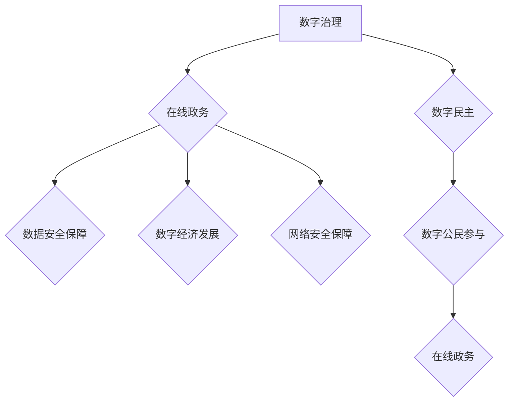

                 

## 2050年的数字治理：从在线政务到数字公民参与的数字民主实践

> 关键词：数字治理、数字民主、在线政务、公民参与、人工智能、区块链、数据安全、隐私保护、去中心化

### 1. 背景介绍

2050年，世界将步入一个高度数字化、智能化的时代。互联网、人工智能、大数据等技术的飞速发展，深刻地改变着人类社会生活的方方面面，也为数字治理带来了前所未有的机遇和挑战。

传统政务模式面临着效率低下、信息不对称、决策透明度不足等问题。而数字技术则为打破这些瓶颈提供了新的可能性。在线政务平台的普及，使得公民可以便捷地获取政府信息、办理行政事务，有效提升了政府服务效率和公众满意度。

然而，数字治理不仅仅是简单的在线化转型，更需要构建一个更加公平、透明、高效的数字民主体系。这意味着需要赋予公民更多的参与权，让他们的声音能够被有效地收集、分析和反映到决策过程中。

### 2. 核心概念与联系

**2.1 数字治理**

数字治理是指在数字时代，利用数字技术手段，对政府、社会和经济等领域进行管理和控制的过程。它涵盖了政府数字化转型、数字经济发展、网络安全保障、数据治理等多个方面。

**2.2 数字民主**

数字民主是指利用数字技术手段，促进公民参与政治、决策和社会治理的过程。它强调公民的权利、自由和参与，通过网络平台、社交媒体等工具，让公民能够更便捷地表达自己的意见、参与公共讨论和投票决策。

**2.3 在线政务**

在线政务是指利用互联网等数字技术手段，提供政府公共服务和行政审批等功能的平台。它可以帮助政府提高服务效率、降低成本、提升透明度，同时也方便了公民获取政府信息和办理行政事务。

**2.4 数字公民参与**

数字公民参与是指公民利用数字技术手段，参与到政府决策、公共事务和社会治理等过程中的行为。它可以包括在线投票、意见反馈、协商决策、公民监督等多种形式。

**2.5 架构图**



### 3. 核心算法原理 & 具体操作步骤

**3.1 算法原理概述**

数字治理中，人工智能算法在多个环节发挥着重要作用，例如：

* **数据分析与预测:** 利用机器学习算法分析海量政府数据，预测未来趋势，为决策提供依据。
* **智能决策支持:** 基于人工智能算法，构建智能决策支持系统，帮助政府官员进行更科学、更精准的决策。
* **个性化服务:** 利用人工智能算法，根据公民的需求和喜好，提供个性化的政府服务。
* **欺诈检测与防范:** 利用机器学习算法，识别和防范网络欺诈和数据泄露等安全威胁。

**3.2 算法步骤详解**

以数据分析与预测为例，其具体操作步骤如下：

1. **数据收集:** 收集政府部门、社会机构等产生的各种数据，包括人口数据、经济数据、社会数据等。
2. **数据清洗:** 对收集到的数据进行清洗和预处理，去除无效数据、缺失值等，确保数据质量。
3. **特征提取:** 从原始数据中提取具有代表性的特征，例如人口密度、经济增长率、社会稳定指数等。
4. **模型训练:** 利用机器学习算法，对提取的特征进行训练，建立预测模型。
5. **模型评估:** 对训练好的模型进行评估，测试其预测精度和可靠性。
6. **模型部署:** 将经过评估的模型部署到生产环境中，用于预测未来趋势。

**3.3 算法优缺点**

**优点:**

* **数据驱动决策:** 基于数据分析，提供更科学、更精准的决策依据。
* **提高效率:** 自动化数据分析和预测过程，提高政府工作效率。
* **个性化服务:** 根据公民需求提供个性化服务，提升公众满意度。

**缺点:**

* **数据安全风险:** 处理大量敏感数据，需要加强数据安全保障措施。
* **算法偏见:** 算法训练数据可能存在偏见，导致预测结果不准确或不公平。
* **透明度问题:** 算法决策过程可能缺乏透明度，难以被公众理解和监督。

**3.4 算法应用领域**

* **公共安全:** 预测犯罪热点、识别潜在安全威胁。
* **城市管理:** 预计交通流量、优化资源配置。
* **医疗卫生:** 预测疾病流行趋势、辅助医疗诊断。
* **教育:** 个性化学习推荐、评估学生学习效果。

### 4. 数学模型和公式 & 详细讲解 & 举例说明

**4.1 数学模型构建**

数字治理中，可以使用各种数学模型来描述和分析复杂系统。例如，可以使用图论模型来表示政府机构之间的关系，可以使用博弈论模型来分析政府与公民之间的互动，可以使用系统动力学模型来模拟政府政策的影响。

**4.2 公式推导过程**

以预测犯罪热点为例，可以使用空间自回归模型来描述犯罪事件的空间分布规律。该模型的公式如下：

$$
Y_{i,t} = \beta_0 + \beta_1 Y_{i,t-1} + \beta_2 Y_{i-1,t} + \beta_3 Y_{i+1,t} + \epsilon_{i,t}
$$

其中：

* $Y_{i,t}$ 表示时间 $t$ 时刻地点 $i$ 的犯罪事件数。
* $\beta_0$ 为截距项。
* $\beta_1$, $\beta_2$, $\beta_3$ 为自回归系数，分别表示时间滞后、空间上邻居的犯罪事件数对当前犯罪事件数的影响。
* $\epsilon_{i,t}$ 为随机误差项。

通过对该公式进行估计，可以得到各个系数的值，从而预测未来某个地点的犯罪事件数。

**4.3 案例分析与讲解**

利用空间自回归模型预测犯罪热点，可以帮助警方优化警力配置，提高犯罪预防和打击效率。例如，如果模型预测某个区域的犯罪事件数将会增加，警方可以提前加强巡逻，预防犯罪发生。

### 5. 项目实践：代码实例和详细解释说明

**5.1 开发环境搭建**

数字治理项目开发环境通常包括以下组件：

* **操作系统:** Linux、Windows Server 等。
* **编程语言:** Python、Java、C++ 等。
* **数据库:** MySQL、PostgreSQL、MongoDB 等。
* **云计算平台:** AWS、Azure、GCP 等。

**5.2 源代码详细实现**

以使用 Python 语言开发一个简单的在线政务平台为例，其源代码实现如下：

```python
from flask import Flask, render_template

app = Flask(__name__)

@app.route('/')
def index():
    return render_template('index.html')

if __name__ == '__main__':
    app.run(debug=True)
```

**5.3 代码解读与分析**

这段代码使用 Flask 框架构建了一个简单的在线政务平台。

* `app = Flask(__name__)` 创建一个 Flask 应用实例。
* `@app.route('/')` 定义一个路由规则，当访问根路径 "/" 时，执行 `index()` 函数。
* `def index():` 定义 `index()` 函数，返回 `index.html` 模板文件。

**5.4 运行结果展示**

运行这段代码后，访问 http://127.0.0.1:5000/，将会显示一个简单的网页，这是在线政务平台的首页。

### 6. 实际应用场景

**6.1 在线政务服务**

在线政务平台可以提供各种政府公共服务，例如：

* 办理营业执照、税务申报等行政审批事项。
* 查询个人信息、缴纳水电费等生活服务。
* 参与公民投票、意见反馈等民主参与活动。

**6.2 数字公民参与**

数字技术可以赋予公民更多的参与权，例如：

* 在线投票: 通过网络平台进行选举投票，提高投票率和参与度。
* 意见反馈: 通过在线问卷调查、论坛讨论等方式，收集公民意见和建议。
* 公共预算参与: 公民可以参与到政府预算的制定和监督过程中。

**6.3 数据驱动决策**

政府可以利用数据分析技术，对社会问题进行深入研究，制定更科学、更有效的政策。例如：

* 预测人口增长趋势，优化城市规划。
* 分析交通流量数据，优化交通管理。
* 监测环境污染情况，制定环保政策。

**6.4 未来应用展望**

未来，数字治理将更加智能化、个性化、透明化。例如：

* 人工智能将被更广泛地应用于政府决策、服务提供和风险管理等领域。
* 区块链技术将被用于保障数据安全、提升决策透明度和促进数字资产交易。
* 元宇宙技术将为公民提供更加沉浸式的数字参与体验。

### 7. 工具和资源推荐

**7.1 学习资源推荐**

* **书籍:**

    * 《数字治理：理论、实践与未来》
    * 《数字民主：公民参与的未来》
    * 《人工智能与社会》

* **在线课程:**

    * Coursera: 数字治理
    * edX: 数据科学与人工智能
    * Udemy: 区块链技术

**7.2 开发工具推荐**

* **编程语言:** Python、Java、C++
* **框架:** Flask、Django、Spring Boot
* **数据库:** MySQL、PostgreSQL、MongoDB
* **云计算平台:** AWS、Azure、GCP

**7.3 相关论文推荐**

* 《数字治理：概念、挑战和机遇》
* 《数字民主：理论、实践和未来》
* 《人工智能与数字治理》

### 8. 总结：未来发展趋势与挑战

**8.1 研究成果总结**

数字治理在2050年将成为一个重要的发展方向，它将推动政府更加高效、透明、便捷地服务于公民，同时赋予公民更多的参与权，促进数字民主的建设。

**8.2 未来发展趋势**

* **智能化:** 人工智能将被更广泛地应用于数字治理各个环节，提高效率和精准度。
* **个性化:** 数字治理将更加注重个性化服务，根据公民需求提供定制化的服务。
* **透明化:** 区块链技术将被用于保障数据安全、提升决策透明度。
* **去中心化:** 数字治理将更加注重公民参与，构建更加去中心化的治理模式。

**8.3 面临的挑战**

* **数据安全:** 处理大量敏感数据，需要加强数据安全保障措施。
* **算法偏见:** 算法训练数据可能存在偏见，导致预测结果不准确或不公平。
* **技术可访问性:** 确保所有公民都能平等地享受数字治理带来的便利。
* **伦理问题:** 数字治理需要遵循伦理原则，避免算法决策带来的负面影响。

**8.4 研究展望**

未来，需要进一步研究数字治理的理论框架、技术架构、伦理规范等方面，为构建更加公平、透明、高效的数字民主体系提供理论支撑和技术保障。

### 9. 附录：常见问题与解答

**9.1 如何保障数据安全？**

数字治理中，需要采取多种措施保障数据安全，例如：

* 加密技术: 对敏感数据进行加密，防止未经授权的访问。
* 身份认证: 实施多因素身份认证，确保只有授权用户才能访问数据。
* 数据访问控制: 设置数据访问权限，限制不同用户对数据的访问范围。
* 安全审计: 定期进行安全审计，发现和修复安全漏洞。

**9.2 如何避免算法偏见？**

算法偏见是数字治理面临的一个重要挑战。为了避免算法偏见，需要采取以下措施：

* 使用多元化数据: 训练算法的数据要尽可能多元化，避免数据偏差。
* 算法透明化: 提高算法决策的透明度，方便公众监督和评估。
* 算法审计: 定期对算法进行审计，发现和修正潜在的偏见。
* 算法伦理: 制定算法伦理规范，引导算法开发和应用朝着公平、公正的方向发展。


作者：禅与计算机程序设计艺术 / Zen and the Art of Computer Programming 
<end_of_turn>

