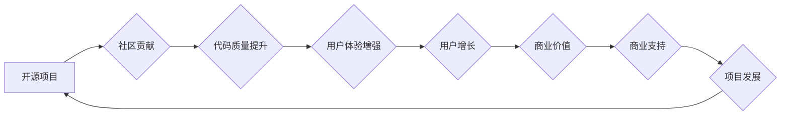

                 

## 建立开源项目的商业生态系统

> 关键词：开源项目、商业生态系统、社区建设、贡献激励、商业模式、价值共创、可持续发展

### 1. 背景介绍

开源软件已经成为现代软件开发的基石，其灵活、可定制和协作性的优势推动着科技的快速发展。然而，开源项目要想真正实现可持续发展，需要建立一个健康的商业生态系统，为开发者提供激励，为企业提供价值。

传统商业软件模式以封闭和收费为核心，而开源软件则以开放和共享为核心。这两种模式在商业模式和价值创造方式上存在显著差异。开源项目需要探索新的商业模式，以平衡社区贡献和商业利益，实现可持续发展。

### 2. 核心概念与联系

#### 2.1 开源项目

开源项目是指源代码公开可供任何人免费使用、修改和分发软件项目。开源软件的开发通常由社区开发者共同参与，遵循开放的许可协议。

#### 2.2 商业生态系统

商业生态系统是指围绕一个核心产品或服务构建的，由企业、开发者、用户和合作伙伴组成的复杂网络。在这个网络中，各方相互依赖，共同创造价值。

#### 2.3 价值共创

价值共创是指开源项目和商业企业共同参与，通过合作和创新，创造新的价值，实现双赢。

**核心概念与联系流程图**

### 3. 核心算法原理 & 具体操作步骤

#### 3.1 算法原理概述

开源项目的商业生态系统建设需要遵循一定的算法原理，以确保其可持续发展。这些原理包括：

* **开放性原则:** 源代码公开，许可协议灵活，鼓励社区参与。
* **协作性原则:** 鼓励开发者共同参与，分享知识和经验。
* **价值导向原则:** 以用户价值为核心，不断提升软件质量和用户体验。
* **激励机制:** 为开发者提供贡献激励，鼓励持续参与。

#### 3.2 算法步骤详解

1. **社区建设:** 构建一个活跃的社区，吸引开发者、用户和合作伙伴参与。
2. **贡献激励:** 设计合理的贡献激励机制，例如贡献积分、荣誉称号、技术支持等。
3. **商业模式探索:** 探索适合开源项目的商业模式，例如商业支持、服务收费、定制开发等。
4. **价值共创:** 鼓励企业和开发者共同参与，开发新的功能和应用，创造新的价值。
5. **可持续发展:** 建立完善的治理机制，确保项目的长期发展和维护。

#### 3.3 算法优缺点

**优点:**

* **开源软件的优势:** 灵活、可定制、易于维护。
* **社区协作的优势:** 提高开发效率、降低开发成本、提升软件质量。
* **商业价值的创造:** 为企业提供新的商业机会，促进经济发展。

**缺点:**

* **社区建设的难度:** 需要投入大量时间和精力，建立一个活跃的社区。
* **贡献激励机制的设计:** 需要平衡社区贡献和商业利益，设计合理的激励机制。
* **商业模式的探索:** 需要不断尝试和调整，找到适合开源项目的商业模式。

#### 3.4 算法应用领域

开源项目的商业生态系统建设适用于各种领域，例如：

* **软件开发:** 构建开源软件平台，提供开发工具和服务。
* **硬件开发:** 构建开源硬件平台，提供硬件设计和制造服务。
* **数据科学:** 构建开源数据分析平台，提供数据处理和分析服务。
* **人工智能:** 构建开源人工智能平台，提供机器学习和深度学习服务。

### 4. 数学模型和公式 & 详细讲解 & 举例说明

#### 4.1 数学模型构建

开源项目的商业生态系统可以抽象为一个网络模型，其中节点代表不同的参与者，例如开发者、企业、用户，边代表不同的关系，例如贡献、合作、使用。

我们可以使用图论中的概念来描述这个网络模型，例如节点度、聚类系数、路径长度等。这些指标可以用来衡量社区的活跃度、连接性、效率等。

#### 4.2 公式推导过程

我们可以使用一些数学公式来量化开源项目的商业价值。例如：

* **贡献价值:** 贡献价值可以根据贡献者的贡献量、贡献质量和贡献影响力来计算。

$$
贡献价值 = 贡献量 * 贡献质量 * 贡献影响力
$$

* **商业价值:** 商业价值可以根据开源项目的用户数量、用户活跃度、商业收入等指标来计算。

$$
商业价值 = 用户数量 * 用户活跃度 * 商业收入
$$

#### 4.3 案例分析与讲解

我们可以通过分析一些成功的开源项目，例如 Linux、Apache、MySQL 等，来了解开源项目的商业生态系统是如何构建和运作的。

例如，Linux 操作系统是一个典型的开源项目，它拥有庞大的开发者社区和用户群体，并形成了一个完善的商业生态系统。Linux 的商业模式主要包括：

* **商业支持:** 企业可以为 Linux 提供商业支持服务，例如技术咨询、培训、维护等。
* **服务收费:** 企业可以为 Linux 开发和提供各种服务，例如云计算、数据库管理、安全服务等。
* **定制开发:** 企业可以根据自己的需求，定制开发基于 Linux 的软件产品。

### 5. 项目实践：代码实例和详细解释说明

#### 5.1 开发环境搭建

开源项目的开发环境搭建需要根据项目的具体需求来确定。一般来说，需要准备以下环境：

* **代码仓库:** 使用 Git 作为代码版本控制系统，例如 GitHub、GitLab 等。
* **构建工具:** 使用 Maven、Gradle 等构建工具来管理项目依赖和构建过程。
* **测试工具:** 使用 JUnit、TestNG 等测试工具来编写和执行测试用例。
* **部署工具:** 使用 Docker、Kubernetes 等部署工具来部署和管理项目。

#### 5.2 源代码详细实现

开源项目的源代码实现需要根据项目的具体功能和需求来设计。一般来说，需要考虑以下方面：

* **模块化设计:** 将项目拆分成多个模块，每个模块负责特定的功能，提高代码的可维护性和可扩展性。
* **代码规范:** 遵循一定的代码规范，例如代码风格、命名规则、注释规范等，提高代码的可读性和可理解性。
* **测试覆盖率:** 编写全面的测试用例，确保代码的正确性和稳定性。

#### 5.3 代码解读与分析

开源项目的代码解读和分析需要具备一定的编程基础和软件工程知识。可以通过阅读代码注释、查看代码结构、分析代码逻辑等方式来理解代码的功能和实现原理。

#### 5.4 运行结果展示

开源项目的运行结果展示需要根据项目的具体功能和需求来设计。一般来说，可以采用以下方式来展示运行结果：

* **命令行输出:** 使用命令行工具来输出运行结果。
* **图形界面:** 使用图形界面工具来展示运行结果。
* **数据报表:** 使用数据报表工具来展示运行结果。

### 6. 实际应用场景

#### 6.1 开源项目在企业应用场景

开源项目在企业应用场景中越来越广泛，例如：

* **基础设施建设:** 企业可以使用开源的云计算平台、数据库管理系统、网络安全系统等，降低基础设施成本。
* **软件开发:** 企业可以使用开源的开发框架、工具库、编程语言等，提高开发效率和软件质量。
* **数据分析:** 企业可以使用开源的数据分析平台、机器学习库、深度学习框架等，进行数据挖掘和分析。

#### 6.2 开源项目在个人应用场景

开源项目在个人应用场景中也越来越受欢迎，例如：

* **学习编程:** 个人可以使用开源的编程教材、在线学习平台、代码示例等，学习编程知识和技能。
* **个人项目开发:** 个人可以使用开源的软件框架、工具库、编程语言等，开发自己的个人项目。
* **开源贡献:** 个人可以参与开源项目的开发和维护，贡献自己的力量。

#### 6.4 未来应用展望

开源项目在未来将继续发挥重要作用，并将在以下领域得到更广泛的应用：

* **人工智能:** 开源人工智能平台和工具将推动人工智能技术的普及和发展。
* **物联网:** 开源物联网平台和协议将促进物联网设备的互联互通。
* **区块链:** 开源区块链平台和工具将推动区块链技术的创新和应用。

### 7. 工具和资源推荐

#### 7.1 学习资源推荐

* **在线学习平台:** Coursera、edX、Udemy 等
* **开源社区:** GitHub、GitLab、Stack Overflow 等
* **技术博客:** Hacker News、Medium、Dev.to 等

#### 7.2 开发工具推荐

* **代码编辑器:** Visual Studio Code、Sublime Text、Atom 等
* **版本控制系统:** Git、GitHub、GitLab 等
* **构建工具:** Maven、Gradle、Webpack 等

#### 7.3 相关论文推荐

* **The Cathedral and the Bazaar** by Eric S. Raymond
* **Open Source Software Development** by Karl Fogel
* **The Linux Kernel Development** by Robert Love

### 8. 总结：未来发展趋势与挑战

#### 8.1 研究成果总结

开源项目的商业生态系统建设是一个复杂的系统工程，需要多方共同努力。通过社区建设、贡献激励、商业模式探索、价值共创等方式，可以构建一个健康的商业生态系统，推动开源软件的可持续发展。

#### 8.2 未来发展趋势

开源项目的商业生态系统将朝着以下方向发展：

* **更加专业化:** 出现更多专门为开源项目提供服务的企业和组织。
* **更加多样化:** 出现更多不同的商业模式，满足不同开源项目的需要。
* **更加国际化:** 开源项目将更加全球化，跨越地域和文化障碍。

#### 8.3 面临的挑战

开源项目的商业生态系统建设也面临一些挑战：

* **社区治理:** 如何建立一个高效、透明、可持续的社区治理机制。
* **贡献激励:** 如何设计合理的贡献激励机制，吸引更多开发者参与。
* **商业模式创新:** 如何探索新的商业模式，实现开源项目的可持续发展。

#### 8.4 研究展望

未来研究方向包括：

* **开源项目商业生态系统建模:** 建立更完善的数学模型和算法，对开源项目的商业生态系统进行更深入的分析和预测。
* **贡献激励机制设计:** 研究更有效的贡献激励机制，提高开发者参与度和贡献质量。
* **开源项目商业模式创新:** 探索新的商业模式，为开源项目提供更多可持续发展路径。

### 9. 附录：常见问题与解答

#### 9.1 如何参与开源项目？

参与开源项目有很多方式，例如：

* **贡献代码:** 编写新的代码、修复bug、改进现有功能。
* **撰写文档:** 编写用户手册、API文档、技术文档等。
* **提供测试:** 测试开源软件的功能和稳定性。
* **参与社区讨论:** 在论坛、邮件列表、社交媒体等平台上参与开源项目的讨论。

#### 9.2 如何选择合适的开源项目？

选择合适的开源项目需要考虑以下因素：

* **项目目标:** 项目的目标是否与你的兴趣和技能相符。
* **项目活跃度:** 项目的社区活跃度是否高，是否有足够的开发者参与。
* **项目技术栈:** 项目使用的技术栈是否是你熟悉的。
* **项目贡献指南:** 项目是否有完善的贡献指南，方便你参与贡献。

作者：禅与计算机程序设计艺术 / Zen and the Art of Computer Programming 
<end_of_turn>

